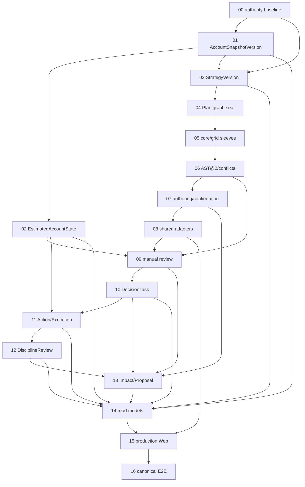

# Trading discipline kernel

**Status:** open  
**Mode:** execution-carrying  
**Authoritative spec:** [trading-discipline-kernel-spec.md](trading-discipline-kernel-spec.md)

## Destination

Deliver the local-first, A-share, single-user trading-discipline kernel defined by the authoritative spec through the canonical application task interfaces. The completed route must support confirmed account truth, estimated state, the two built-in strategies, one active Model B master plan per account/security, explicit Skill-mediated user confirmation, manual portfolio review, durable decision/execution/review history, versioned read models, and the lightweight production Web without automation or order placement.

## Route

## Decisions so far

- Product decisions and canonical contracts are locked in [trading-discipline-kernel-spec.md](trading-discipline-kernel-spec.md); implementation tickets must not reopen them.
- The one-way database route and immutable migration cohorts are locked in [migration-plan.md](migration-plan.md).
- Completion evidence is governed by [acceptance-matrix.md](acceptance-matrix.md).
- Known implementation and external-data risks are governed by [open-risk-register.md](open-risk-register.md).
- Existing A/B/C prototype business code and build assets are explicitly excluded from the production cutover.

## Implementation tickets

Tickets are discovered under `issues/` and executed in dependency order. Each ticket names its own exact paths, symbols, migrations, tests, gate, exclusions, and deletion/cutover obligations.

## Not yet specified

None. Missing implementation facts must be resolved inside the owning ticket without changing a locked product decision. A genuinely new product decision requires product-owner approval and a versioned spec change before implementation.

## Out of scope

- automatic scheduling or order placement;
- broker trading integration and real-time intraday monitoring;
- non-A-share markets;
- free-form strategy DSL or tactical sleeves;
- multi-user authorization;
- automatic research-to-plan mutation;
- broker history as current truth;
- a full industry/concept market platform;
- an independent monthly workflow;
- merging the A/B/C prototype branch.
