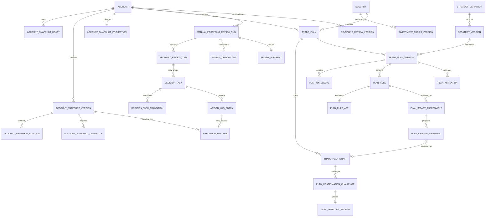
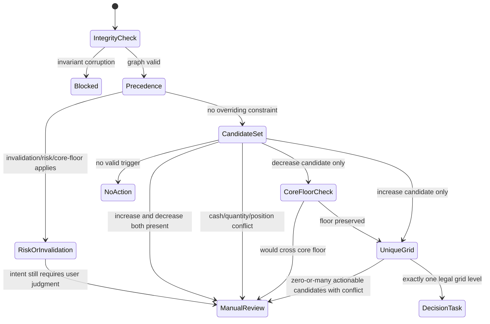
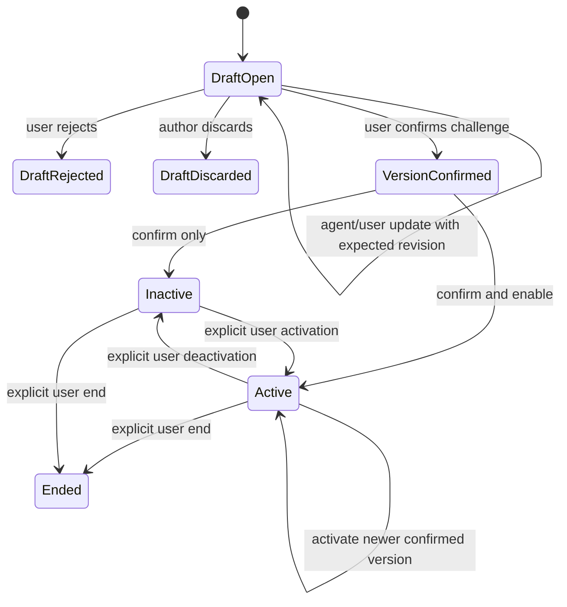
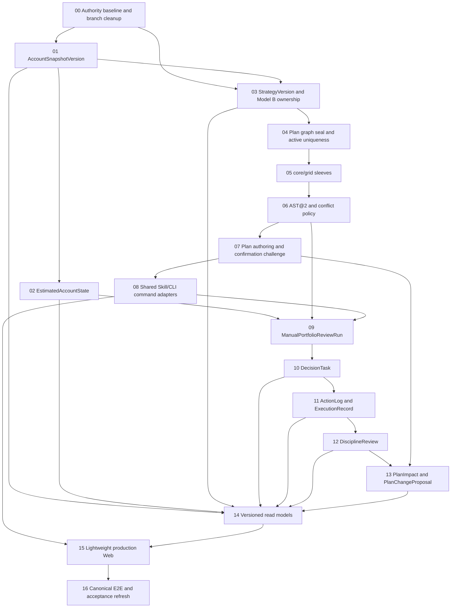

# TradingSystem：交易纪律内核实现级 Spec

Status: `implementation-ready`
Spec-Version: `1.0.0`
Target-Market: `CN_A_SHARE`
Timezone: `Asia/Shanghai`
Workflow: `manual_portfolio_review@1`

> 本文件定义目标实现，不声明这些能力已经存在。当前生产基线仍为
> `IMPLEMENTED_PARTIAL`：账户 opening/import、单计划版本与评估、研究、
> WorkflowLedger 和单证券 Web 可复用；StrategyDefinition、通用账户快照、
> EstimatedAccountState、组合复核、DecisionTask、ExecutionRecord、
> DisciplineReview 与 versioned portfolio read models 尚未形成生产闭环。

长期约束以
[总任务 Prompt](../../docs/prompts/trading_platform_codex_prompt_optimized.md)
与根目录 `AGENTS.md` 为最高边界；当前事实以
[产品状态审计](../../current-product-state-audit.md)和
[实现 seam 审计](../../trading-discipline-kernel-seam-audit.md)为基线；领域名词
以 [CONTEXT.md](../../CONTEXT.md) 为准。本 Spec 的迁移细节、验收映射与风险
分别由 [migration-plan.md](migration-plan.md)、
[acceptance-matrix.md](acceptance-matrix.md) 和
[open-risk-register.md](open-risk-register.md) 管理。

## 1. 产品目标

为本地单用户提供一个 Skills-first、交易计划驱动的 A 股纪律内核，使用户能够：

1. 以手工、截图、自然语言或合格券商 current export 创建账户快照草稿；
2. 明确确认账户真值，并在两次确认之间查看由已确认执行记录推导的估算状态；
3. 基于版本化 InvestmentThesis 与内置 StrategyDefinition 创建具体 TradePlan；
4. 由 Agent 编制草稿，但只由用户确认并启用计划；
5. 手动触发跨多个交易日的组合复核，获得可解释的规则结果、计划影响与待处理任务；
6. 记录 executed/deferred/skipped/overridden/not_applicable，并把用户声明执行纳入估算账户状态；
7. 形成 weekly/custom DisciplineReviewVersion，保留当时计划、证据、行为与未知项；
8. 在 Web 和 Skill 中读取同一组 versioned application read models。

系统不预测收益，不提供个性化投资建议，不自动产生交易，不调用券商下单接口，
不实现 scheduler。所有计划变更都经过 Draft、canonical diff、challenge 和用户确认。

## 2. 用户故事

### US-01 账户真值

Agent 从用户输入提取 `AccountSnapshotDraft`。用户查看 validation、capability 与
canonical diff 后确认。只有确认成功才形成 `AccountSnapshotVersion` 并移动
`AccountSnapshotProjection`。

### US-02 计划编制与确认

Agent 选择一个内置 `StrategyVersion`，为一个 account + security 创建
`TradePlanDraft`，填写 core 与可选 grid sleeve、AST@2 规则和冻结证据。Agent
可继续修改、校验和生成 diff，但不能确认或启用。用户通过
`PlanConfirmationChallenge` 明确确认后，Application 在一个事务内写入
`PlanVersionConfirmed`；默认“确认并启用”还写入 `PlanActivated`。

### US-03 手动组合复核

用户手动选择一个已完整结束的 A 股 session。系统从上一次成功复核 cutoff 到当前
session 冻结同一账户、计划、数据、研究和证据，逐持仓输出 `NO_CHANGE`、
`MONITOR`、`REVIEW_REQUIRED` 或 `DRAFT_UPDATE_PROPOSED`。复核可跨多个交易日，
不要求每日或固定周五执行。

### US-04 处理任务与执行声明

需要用户判断的复核项形成持久 `DecisionTask`。用户可执行、延后、跳过、覆盖或
标记不适用。`executed` 必须同时产生 user-declared `ExecutionRecord`；在缺少
broker match 时显示 `unverified`，不能显示“未执行”或“已对账”。

### US-05 纪律复盘

用户以 weekly 或 custom 窗口创建 `DisciplineReviewVersion`，查看任务处理、
overridden、未记录、未核验执行、计划替代和 evidence gap。月度视图只聚合这些
版本，不建立独立月度 workflow。

### US-06 研究影响但不改计划

系统或 Agent 可基于冻结 market/industry/sector/company evidence 生成
`PlanImpactAssessment` 与 `PlanChangeProposal`。接受 proposal 只创建或更新
`TradePlanDraft`；必须再次展示 diff 和 challenge。

## 3. 明确非目标

- 自动调度、自动下单、委托导出、券商交易接口；
- 实时盘中监控、分钟级触发、盘中做 T；
- 港股、美股或多市场运行时；
- 自由 Strategy authoring、无限通用 DSL、动态执行公式；
- tactical sleeve；
- 多用户权限、远程协作或云端账户；
- Research、market、industry 或 sector evidence 自动修改 Active Plan；
- 由 broker history 或快照差额自动推导 current truth；
- 完整行业概念行情平台、资金流/情绪黑箱热度；
- 独立月度 workflow；
- A/B/C prototype 的业务、源文件或 build 资产合并。

## 4. Authority hierarchy

| 层级 | 权威对象 | 可以影响什么 | 明确不能做什么 |
|---|---|---|---|
| 1 | Latest Confirmed `AccountSnapshotVersion` | 账户在指定截至时点的权威观察真值 | 不能由 estimated/broker history/Agent 推断替换 |
| 2 | `EstimatedAccountState` | 两次确认快照间的工作状态与 capability | 不是新快照，不自动升级为 broker truth |
| 3 | Frozen `Evidence` | 支撑 HardRule operand、ReviewRule assessment 与复核解释 | 不能直接改账户、计划、任务 disposition 或执行 |
| 4 | Active `TradePlanVersion` | 当前 account + security 的用户确认决策框架 | 评估触发、Research、Proposal 均不能改写它 |
| 5 | `ActionLogEntry` / `ExecutionRecord` | 用户行为与用户声明实际执行 | 未核验执行不能冒充 broker transaction；不回写旧快照 |
| 6 | `DisciplineReviewVersion` | 对历史行为、任务与证据缺口的冻结复盘 | 不能用后见之明改写以上任何对象 |

冲突时遵循“具体不可变引用优先于 current projection”。历史 run、task、action、
execution 和 review 必须引用当时 exact IDs；不得在读取时改用“最新”对象。

## 5. 领域模型总览



## 6. InvestmentThesisVersion 最小合同

`InvestmentThesisVersion@1` 是分析对象，不是 decision authority。

| 字段 | 合同 |
|---|---|
| `thesis_id`, `thesis_version_id`, `version_no` | 稳定 identity 与单调版本 |
| `security_id`, `as_of_at`, `timezone` | A 股证券与冻结时点 |
| `status` | `draft | published | superseded` |
| `horizon` | typed start/end/review window |
| `claims[]` | claim id、陈述、类型、可证伪结果 |
| `drivers[]` | driver id、方向无关的因果说明、observable refs |
| `risks[]` | 风险、反例与不确定性 |
| `invalidation_tests[]` | typed observation/evidence gate；不含交易动作 |
| `evidence_manifest_id` | exact frozen Evidence 集合 |
| `research_run_ids[]` | exact persisted ResearchRun |
| `authoring_actor`, `model_identity`, `policy_identity` | 生成主体与受控身份 |
| `content_hash`, `created_at` | canonical identity |

Agent/系统可以发布新的分析版本；`published` 只表示内容已冻结，不表示用户批准任何
交易动作。TradePlan 可引用 thesis version，但用户确认计划才赋予决策效力。

## 7. 内置 StrategyVersion

### 7.1 公共 schema

`StrategyVersion@1`：

```text
strategy_id
strategy_version_id
strategy_key
version_no
market_scope = CN_A_SHARE
authoring_mode = built_in
status = active | retired
sleeve_contract
parameter_schema
rule_templates
conflict_policy_version = trade-plan-conflict@1
ast_version = plan-rule-ast@2
content_hash
created_at
```

首版 registry 只能含以下两个 active identity。不得提供创建、编辑或上传任意策略的
public command。

### 7.2 `trend_hold_break_exit@1`

用途：以一个 `core` sleeve 表达持有逻辑、趋势破坏与失效复核。

| 参数 | 类型与约束 |
|---|---|
| `price_basis` | `unadjusted` 或有 factor evidence 的 `adjusted` |
| `trend_metric_ref` | 白名单 market/security trend operand |
| `break_condition` | AST@2 typed condition；必须绑定 complete session |
| `break_confirmation_sessions` | 正整数，按 A 股完整 session 计数 |
| `core_floor_quantity` | 非负 share exact decimal；普通 grid decrease 不得突破 |
| `invalidation_review_rule_ids[]` | 至少一个 ReviewRule 或显式 `not_configured` reason |
| `candidate_decrease_quantity` | known/unknown typed quantity；unknown 导向 manual review |
| `review_by` | 明确 session/date |

该模板不会自动退出。确定性 break 只生成 candidate intent；thesis invalidation 属于
ReviewRule。若风险/失效规则明确允许突破 core floor，也仍必须形成用户
DecisionTask，不生成 execution。

### 7.3 `core_plus_grid@1`

用途：一个 Master Plan 下同时拥有 `core` 与 `grid` sleeves。

| 参数 | 类型与约束 |
|---|---|
| `core_floor_quantity` | required、非负、A 股 share 精度 |
| `grid_lower_price`, `grid_upper_price` | 同一 price basis/CNY，upper > lower |
| `grid_level_count` | `2..100` 的整数；不建设动态表达式 |
| `grid_quantity_per_level` | 正数、符合证券 lot 约束 |
| `grid_total_quantity_budget` | 非负，且不得令 remaining quantity 低于 core floor |
| `grid_price_basis` | `unadjusted` 或有 factor evidence 的 `adjusted` |
| `grid_trigger_mode` | `crosses_level | closes_at_or_beyond_level` |
| `cooldown_trading_sessions` | 非负整数 |
| `cash_operand_policy` | required known cash 或明确 `unknown -> manual_review_required` |
| `quantity_operand_policy` | required remaining/available quantity 或明确 manual review |

Grid levels 由 typed `GridConstraint` 确定性生成并排序；一个 session 只有唯一合法 level
时才可形成 DecisionTask。多个 level、双向候选、现金/数量冲突均要求 manual review。

## 8. TradePlan Master 与 sleeve schema

### 8.1 Model B ownership

- `TradePlan` 的 immutable ownership 是 `(account_id, security_id)`；
- 同一 ownership 最多一个未结束 Active Master Plan；
- Master Plan 引用一个 exact `StrategyVersion`；
- 版本内 sleeve 只允许 `core | grid`；
- `trend_hold_break_exit@1` 只允许 core；
- `core_plus_grid@1` 必须有 core，可选 grid；
- `legacy_unsleeved` 只允许迁移后的只读历史版本，不能被新 draft 使用或启用。

### 8.2 Master/version/sleeve

```text
TradePlan:
  plan_id, account_id, security_id, lifecycle_status, transition_seq, created_at

TradePlanVersion:
  plan_version_id, plan_id, version_no, supersedes_version_id
  strategy_version_id, investment_thesis_version_id?
  account_snapshot_version_id, risk_policy_version_id?
  data/research/evidence refs, horizon, review_by
  ast_version, metric_catalog_version, evaluator_policy_version
  conflict_policy_version, content_hash, graph_seal_hash
  confirmed_at, user_approval_receipt_id

PositionSleeve:
  plan_version_id, sleeve_id, sleeve_kind(core|grid|legacy_unsleeved)
  quantity_budget_state/value, core_floor_state/value
  max_notional_state/value, max_loss_state/value
  grid_constraint_id?, content_hash

PlanActivation:
  activation_id, plan_id, plan_version_id
  activated_event_id, activated_at
  ended_event_id?, ended_at?, end_reason?
  user_approval_receipt_id, command_invocation_id
```

Sleeve quantity 合计不得超过 AccountSnapshot/EstimatedState 可证明的 total quantity；
无法证明时相关规则输出 unable/manual review，不阻断与数量无关的规则。

`PlanActivation` 的 open interval 代表 active slot。数据库同时约束一个 plan 只能有一个
open activation，以及同一 `(account_id, security_id)` 只能有一个 open Master Plan。

## 9. HardRule、ReviewRule 与 AST@2

### 9.1 Rule schema

```text
PlanRule@2:
  rule_id
  rule_class = hard | review
  rule_kind
  priority
  scope = plan | sleeve
  sleeve_id?
  effect
  applies_to = entry | increase | decrease | exit | plan
  candidate_intent?
  input_applicability
  condition_ast
```

HardRule 由 deterministic evaluator 执行。ReviewRule 只路由冻结 Evidence，由 Agent
生成 `PlanImpactAssessment`；ReviewRule 不得确认、启用、停用、结束或修改计划。

### 9.2 有限 AST@2

允许的 node：

- `all | any | not | comparison`；
- `elapsed_trading_sessions`；
- `event_window`，事件类型来自 versioned closed taxonomy；
- `grid_constraint`。

允许的 operand family：

- security price/status、MarketSnapshot components；
- AccountSnapshot/EstimatedState quantity、remaining quantity、cash、NAV；
- candidate intent 的 `quantity`, `remaining_quantity`, `notional`；
- typed event identity/window；
- complete-session calendar facts。

每个 operand 固定：

```text
value_state = known | unknown | not_applicable
value
unit
currency?
as_of_identity
evidence_refs[]
reason_code?
```

`unknown` 不得等同 false 或零；`not_applicable` 必须有确定性适用性理由。AST 不接受
任意公式、代码、SQL、prompt、字段路径或运行时插件。

### 9.3 GridConstraint

```text
GridConstraint@1:
  lower_price, upper_price, price_basis
  level_count
  quantity_per_level
  lot_size
  generated_levels_hash
  cooldown_trading_sessions
```

Application 保存参数与确定性生成结果 hash；不得持久化 UI 临时 level 列表作为第二
权威。

## 10. Conflict resolver 状态机

输入是一个 exact PlanVersion、同一 review item 的 HardRule results、candidate intents、
账户 operands 与 `trade-plan-conflict@1`。



固定顺序：

1. invariant corruption → `blocked`；
2. invalidation/risk/core-floor 优先于 increase；
3. grid decrease 后 remaining quantity 不得低于 core floor；
4. 同时出现 increase/decrease → `manual_review_required`；
5. 数量、现金或仓位冲突 → `manual_review_required`；
6. 唯一合法 grid level → `decision_task`；
7. 无有效触发 → `no_action`。

HardRule 永不产生 ExecutionRecord。`blocked` 是 run/item 事实；`manual_review_required`
和 `decision_task` 都可形成 DecisionTask，但 kind/reason 不同。

## 11. AccountSnapshot graph

### 11.0 New local account registration

`RegisterAccountForSnapshots@2` is the only low-friction identity prerequisite
when the first account evidence is a user-declared broker screenshot. It
requires a user decision actor and supplies:

```text
account_id, alias, base_currency
source_kind = user_declared_from_broker_screenshot
redacted_source_ref, registered_at
securities[]:
  market, code, currency, observed_on
```

`observed_on` is only the lower bound at which the user confirmed the current
code mapping. It is not a listing date and does not assert pre-observation
validity. The application derives stable internal security IDs, fails closed
on conflicting security-master identity, and writes one immutable idempotent
receipt. Registration does not create or confirm a snapshot and does not
upgrade screenshot evidence to broker reconciliation.

### 11.1 Draft

`AccountSnapshotDraft@1`：

```text
draft_id, account_id, revision
status = open | rejected | discarded | confirmed
source_kind, source_ref
as_of_at, as_of_precision, timezone, session_semantics, currency
cash_state/value
positions[]:
  security_id
  total_quantity
  available_quantity_state/value
  cost_state/value
  market_value_state/value
nav_state/value, fees_state/value
previous_snapshot_id?, revises_snapshot_id?, corrects_snapshot_id?
validation_state, validation_errors[], capability_impacts[]
canonical_diff, canonical_diff_hash
content_json, content_hash
created_by, created_at, updated_at
```

### 11.2 Version

确认 required capability：

- account identity；
- `as_of_at`、timezone、session semantics；
- currency；
- 每个 position 的 stable security identity；
- 每个 position 的 total quantity。

允许 unknown：available quantity、cash、cost、market value、NAV、fees。Version graph：

```text
AccountSnapshotVersion@1:
  account_snapshot_version_id, account_id, version_no, source_draft_id
  as_of_at, as_of_precision, timezone, session_semantics, currency
  source_kind, redacted_source_ref
  previous_snapshot_version_id?
  revises_snapshot_version_id?
  corrects_snapshot_version_id?, correction_reason?
  confirmed_by=user, confirmed_at
  content_hash, graph_seal_hash

AccountSnapshotCash@1:
  account_snapshot_version_id, cash_state, cash_value, currency
  nav_state/value, fees_state/value

AccountSnapshotPosition@1:
  account_snapshot_version_id, security_id
  total_quantity
  available_quantity_state/value
  cost_state/value, market_value_state/value
  content_hash

AccountSnapshotCapability@1:
  account_snapshot_version_id, capability_key
  state = available | unable
  reason_code, required_field_refs[]
```

所有 nullable financial value 使用 `known|unknown|not_applicable` + paired CHECK。缺值
不能省略、填零或由 UI 猜测。

### 11.3 Projection

`AccountSnapshotProjection@1(account_id PRIMARY KEY, account_snapshot_version_id,
projection_revision, projection_hash, advanced_at)` 只指向 latest confirmed version。确认事务原子写 Version、
Position、Capability、Transition、`AccountSnapshotConfirmed` event、
`ApplicationCommandReceipt` 与 projection pointer。`UserApprovalReceipt` 和
`PlanConfirmationChallenge` 专用于计划确认，不把计划 challenge 泛化到账户命令。

### 11.4 Transition

Transition reason 只允许：

- `initial_confirmation`；
- `new_observation`；
- `revision`；
- `correction`。

```text
AccountSnapshotTransition@1:
  transition_id, account_id
  from_snapshot_version_id?, to_snapshot_version_id
  reason
  decision_actor=user, interaction_channel, transport_actor
  command_invocation_id, occurred_at, content_hash
```

Revision 的 as-of 必须相同；Correction 必须含用户原因。历史引用永不随 projection
移动。

## 12. EstimatedAccountState

定义：

```text
EstimatedAccountState
  = latest confirmed AccountSnapshotVersion
  + confirmed user-declared ExecutionRecords
    whose effective_at is after snapshot cutoff
    and which are not superseded by correction
```

推导规则：

1. 以 snapshot position total quantity 为基线；
2. increase/decrease execution 以 signed exact quantity 依 event/session 顺序折叠；
3. 数量不能小于零；冲突使 projection `blocked`，不改写来源记录；
4. cash 只有在 baseline cash、execution price、fees 全 known 且币种一致时才推导；
5. cost、NAV、available quantity 等按依赖单独传播 unknown；
6. projection 保存 `derived_from_snapshot_id` 与 `execution_record_ids`，可完全重算；
7. 新 Confirmed AccountSnapshot 到来后成为新 baseline，只折叠其 cutoff 之后的执行。

新 snapshot 的 reconciliation 比较：

```text
DriftAssessment@1:
  expected_state_hash
  confirmed_snapshot_id
  position_differences[]
  cash_difference_state/value
  explained_by_execution_ids[]
  unexplained_drift[]
  status = reconciled | drift_detected | unable
```

Drift correction 不生成交易、不覆盖 ExecutionRecord，也不阻断 snapshot 最小 required
capability；它是 Evidence 与后续 DisciplineReview 输入。

Broker history import 只生成 evidence/reconciliation。只有合格的 broker current export
可生成 AccountSnapshotDraft，仍需用户确认。

## 13. TradePlan Draft/Version/Activation state machine

```text
TradePlanDraft@1:
  draft_id, plan_id, account_id, security_id, revision
  status = open | rejected | discarded | confirmed
  based_on_plan_version_id?
  strategy_version_id, investment_thesis_version_id?
  account_snapshot_version_id
  sleeves[], rules[]
  evidence_manifest_id, horizon, review_by
  validation_state, validation_errors[], capability_impacts[]
  canonical_diff, canonical_diff_hash, content_hash
  created_by, created_at, updated_at
```

Draft 不进入 active evaluation。每次修改递增 revision、重算 validation/diff/hash，并
supersede 所有未消费的旧 challenge。



默认操作“确认并启用”在一个事务中产生两个显式 event：

1. `PlanVersionConfirmed`；
2. `PlanActivated`。

次级操作“仅确认、不启用”只产生第一个 event。两个 event 共享一个
`UserApprovalReceipt`，各自另有 stable event identity；Application command receipt
记录整个命令重放结果。启用新版本关闭旧 activation，但不改写旧 version 或 activation
历史。

## 14. PlanConfirmationChallenge 与 UserApprovalReceipt

### 14.1 Challenge

```text
PlanConfirmationChallenge@1:
  challenge_id
  draft_id
  revision
  content_hash
  canonical_diff
  canonical_diff_hash
  activation_intent = confirm_only | confirm_and_activate
  issued_for_decision_actor = user
  interaction_channel
  status = issued | consumed | superseded | cancelled | expired
  issued_at, expires_at?
```

任一 draft revision、content hash、canonical diff 或 activation intent 改变都会使旧
challenge superseded。Challenge 不替代 validation。

### 14.2 Approval receipt

```text
UserApprovalReceipt@1:
  approval_receipt_id
  challenge_id
  decision_actor = user
  interaction_channel
  transport_actor
  approved_content_hash
  approved_diff_hash
  activation_intent
  approved_at
  command_invocation_id
```

Skill 流程必须保存：

```text
decision_actor = user
interaction_channel = skill
transport_actor = agent
```

Agent 没有获得明确用户 confirmation 时不得调用 confirm/activate command。
Application 拒绝 challenge 不存在、非 issued、draft/revision/hash/diff/intent 不匹配、
decision actor 非 user 或已消费的请求。相同 invocation/hash 重放返回同一 receipt；
相同 invocation 不同内容返回 `INVOCATION_CONFLICT`。

## 15. ManualPortfolioReviewRun

### 15.1 Run 与窗口

```text
ManualPortfolioReviewRun@1:
  review_run_id, workflow_run_id, account_id
  requested_at, selected_complete_session, timezone
  window_start_exclusive
  window_end_inclusive
  prior_successful_review_run_id?
  status = queued|running|succeeded|succeeded_with_limits|failed
  input_fingerprint, created_at, completed_at?
```

窗口固定为“last successful review cutoff → current selected complete session”。第一次
复核以所选 AccountSnapshot cutoff 或首个可证明 session 为起点。失败 run 不推进
successful cutoff。

### 15.2 Item

`SecurityReviewItem@1` 至少保存：

- account/security/position identity；
- AccountSnapshot/EstimatedState hash；
- active plan/version/strategy/sleeves；
- compatible DataSnapshot、ResearchRun、Evidence、MarketSnapshot；
- HardRule evaluations、ReviewRule routing、conflict resolution；
- `NO_CHANGE | MONITOR | REVIEW_REQUIRED | DRAFT_UPDATE_PROPOSED`；
- material changes、unable/blocked reasons；
- created DecisionTask/PlanImpact/Proposal refs。

`NO_CHANGE` 不创建 task。`MONITOR` 默认不创建 task；只有 ReviewRule 明确要求用户
disposition 时升级为 `REVIEW_REQUIRED`。Proposal 存在时为
`DRAFT_UPDATE_PROPOSED`，但 Active Plan 不变。

### 15.3 Checkpoint

每个 `review_run_id + security_id + stage` 唯一：

```text
ReviewCheckpoint@1:
  checkpoint_id, review_run_id, security_id, stage
  input_fingerprint, status
  manifest_id, attempt_no, committed_at
```

允许 item-level unable/blocked 后继续其他证券；graph corruption、active uniqueness
破坏、manifest mismatch 或 ledger corruption 使整次 run fail closed。

### 15.4 Manifest

`ManualPortfolioReviewManifest@1` 冻结：

- cutoff/calendar/policy identities；
- confirmed snapshot 与 EstimatedState inputs；
- active plan/strategy/thesis/sleeve graph；
- data/research/market/evidence ids；
- rule/evaluator/conflict versions；
- item/checkpoint/task/assessment/proposal ids；
- code/config identity 与 content hash。

Manifest 使用既有 WorkflowLedger/ArtifactManifest，不复制第二套运行账本。

## 16. DecisionTask

```text
DecisionTask@1:
  decision_task_id
  account_id, security_id
  review_run_id, review_item_id
  plan_version_id?, plan_evaluation_id?
  task_kind, reason_code, priority
  status = open | deferred | resolved | superseded
  condition_identity
  evidence_manifest_id
  created_at
```

Task 默认持续存在，直到用户处理、计划替代或条件失效。状态通过 append-only
`DecisionTaskTransition` 推导。

```text
DecisionTaskTransition@1:
  transition_id, decision_task_id, transition_seq
  from_status, to_status
  trigger_kind = user_disposition | date_or_session | next_review
               | evidence_trigger | plan_superseded | condition_invalidated
  disposition?
  defer_target_type?, defer_target_value?
  evidence_ref?, action_log_entry_id?
  decision_actor, interaction_channel, transport_actor
  occurred_at, content_hash
```

Deferred target：

- `specific_date_or_session`；
- `next_manual_review`；
- `evidence_trigger`。

到期后同一 task 从 deferred 重新 open，不创建重复 identity。计划替代或条件失效时
写 superseded。相同 condition identity 的 replay 不重复 task。

用户 disposition：

```text
executed | deferred | skipped | overridden | not_applicable
```

## 17. ActionLogEntry 与 ExecutionRecord

`ActionLogEntry@1` 是 immutable user disposition：

```text
action_log_entry_id, decision_task_id
decision_actor=user, interaction_channel, transport_actor
disposition, reason, occurred_at, recorded_at
corrects_entry_id?, content_hash
```

`ExecutionRecord@1` 第一版只要求 user-declared：

```text
execution_record_id, action_log_entry_id
account_id, security_id
plan_version_id?, decision_task_id?
effective_at, effective_session
intent_type = increase | decrease
quantity
price_state/value, fee_state/value, currency
verification_status = user_declared_unverified | broker_matched | conflicted
corrects_execution_record_id?
content_hash, confirmed_at
```

记录 executed 后，Application 重新推导 EstimatedAccountState，不覆盖 Confirmed
AccountSnapshot。Broker transaction reconciliation 可预留
`execution_transaction_reconciliation` schema，但不是首版上线门。
`executed` disposition、ActionLogEntry、ExecutionRecord 与 task transition 必须在同一
事务提交；缺少有效 ExecutionRecord 时不得把 task 解析为 executed。

## 18. DisciplineReviewVersion

```text
DisciplineReviewVersion@1:
  discipline_review_id, version_no, account_id
  period_kind = weekly | custom
  period_start_session, period_end_session
  status = draft | confirmed | superseded
  review_run_ids[], decision_task_ids[]
  action_log_entry_ids[], execution_record_ids[]
  plan_version_ids[], account_snapshot_version_ids[]
  overridden_items[], unrecorded_items[], unverified_items[]
  drift_assessment_ids[], evidence_gap_summary
  content_hash, confirmed_at, confirmation_command_receipt_id
```

首版 UI 默认 weekly。期间按 `Asia/Shanghai` A 股完整 session 定义，不按固定周五。
月复盘只聚合 confirmed DisciplineReviewVersion。Review 不计算惩罚分，不把 broker
evidence 缺失解释为未执行。

## 19. PlanImpactAssessment 与 PlanChangeProposal

`PlanImpactAssessment@1`：

```text
assessment_id, review_run/item
plan_version_id, review_rule_id
evidence_manifest_id, research/market/industry/sector refs
impact_kind, materiality, uncertainties[]
what_changed, what_would_change_the_view
model/policy/prompt identity
content_hash, created_by=agent|system
```

`PlanChangeProposal@1`：

```text
proposal_id, revision, status=open|accepted|rejected|superseded
assessment_id, base_plan_version_id
proposed_canonical_patch, proposed_diff_hash
created_by, created_at, updated_at
accepted_draft_id?
```

接受 proposal 只调用同一 TradePlanAuthoring task 创建或更新 Draft。Draft 仍需完整
validation、canonical diff、PlanConfirmationChallenge 和用户 confirmation。

## 20. ApplicationCommandEnvelope@1

所有 Web/CLI/Skill mutation 使用同一 envelope：

```json
{
  "schema_version": "ApplicationCommandEnvelope@1",
  "command_name": "trade_plan.confirm@1",
  "invocation_id": "stable-id",
  "payload_schema_version": "ConfirmTradePlanDraft@1",
  "expected_revision": 3,
  "decision_actor": {"actor_type": "user", "actor_id": "local-user"},
  "interaction_channel": "skill",
  "transport_actor": {"actor_type": "agent", "actor_id": "codex"},
  "approval": {"challenge_id": "challenge-id"},
  "payload": {}
}
```

Application 计算 canonical request hash，adapter 不得提交自算 truth hash。Receipt：

```text
ApplicationCommandReceipt@1:
  invocation_id, command_name, request_hash
  result_type, aggregate_id, revision_or_version_id
  status, decision_actor, interaction_channel, transport_actor, created_at
```

首版 mutation registry 是闭集：

```text
account_snapshot.register_account@2
account_snapshot.create_draft@1
account_snapshot.update_draft@1
account_snapshot.confirm@1
trade_plan.create_draft@1
trade_plan.revise_draft@1
trade_plan.reject_draft@1
trade_plan.issue_confirmation_challenge@1
trade_plan.confirm@1
manual_portfolio_review.run@1
decision_task.defer@1
decision_task.resolve@1
execution_record.declare@1
execution_record.correct@1
discipline_review.confirm@1
plan_change_proposal.accept@1
plan_change_proposal.reject@1
```

新增 mutation 必须先增加 versioned payload、capability、idempotency 和 receipt 合同；
Web/CLI/Skill 不得各自发明 command name 或直接调用 repository。

### 20.1 actor 与 approval capability matrix

| Decision actor / channel | 草稿 create/update | validate/diff | confirm account | confirm/activate plan | task disposition | execution truth | review confirm |
|---|---:|---:|---:|---:|---:|---:|---:|
| agent / skill | 允许 | 允许 | 禁止 | 禁止 | 禁止 | 禁止 | 禁止 |
| user / skill，transport=agent，explicit command confirmation；plan confirm 另需 valid challenge | 允许 | 允许 | 允许 | 允许 | 允许 | 允许 | 允许 |
| user / Web local session，explicit account confirmation | 允许账户草稿；计划首版只读 | 允许 | 允许 | 产品首版不暴露 plan mutation | 产品首版只读 | 产品首版只读 | 产品首版只读 |
| system / workflow | 禁止用户真值 | 允许 deterministic validation | 禁止 | 禁止 | 仅 supersede/ reopen typed transition | 禁止 | 仅生成 draft |

CLI 是 adapter，不是 actor。Agent 经 CLI 调用时仍为 agent；不得因本地 shell 权限伪装
成 user。所有 Web 能力必须有对应 Skill/application command；Skill 可以覆盖更多正式
业务操作。

## 21. Versioned Web read models

所有 read model 均为 immutable response DTO，包含 `schema_version`、exact source IDs
和 `generated_at`，但默认页面只投影决策相关字段。

### 21.1 PortfolioWorkspaceView@1

首页只允许：

```text
account_state_summary
unresolved_decision_tasks
material_changes_since_last_review
holding_active_plan_summaries
discipline_exception_summary
```

其中 account summary 必须区分 confirmed 与 estimated。不得加入 raw provenance wall、
38 项参数、大量 readiness、普通成功日志、policy/hash/model identity 或不影响当前任务
的 warning。

### 21.2 HoldingWorkspaceView@1

- security identity 与 confirmed/estimated position summary；
- active Master Plan + core/grid summary；
- 当前 review outcome 与 unresolved tasks；
- material evidence changes、key uncertainties 与 ability-changing warnings；
- drill-down links，不铺满 provenance。

### 21.3 TradePlanDetailView@1

- plan/version/lifecycle、strategy/thesis refs；
- master/core/grid content；
- HardRule/ReviewRule 与 latest frozen evaluation；
- canonical diff、challenge status、历史版本；
- diagnostics/provenance 仅详情展开。

### 21.4 ReviewWorkspaceView@1

- selected session、comparison window 与 run status；
- per-holding NO_CHANGE/MONITOR/REVIEW_REQUIRED/DRAFT_UPDATE_PROPOSED；
- unresolved/deferred tasks；
- PlanImpact/Proposal summary；
- checkpoint/manifest 只在诊断详情。

### 21.5 ResearchIndexView@1

- per-security latest persisted ResearchDecisionView identity；
- company/forecast/valuation/technical/events dimension；
- material change、key uncertainty、what would change the view；
- blocked/unknown 对计划能力的实际影响；
- 不产生计划动作语言。

### 21.6 AccountSnapshotEditorView@1

- latest confirmed snapshot summary；
- current draft、field lineage 与 known/unknown；
- deterministic validation、capability impact 与 canonical diff；
- expected revision、canonical diff 与 confirmation receipt status；
- private source refs 只显示脱敏摘要。

另可提供 `WorkspaceDiagnosticsView@1` 承载完整 provenance、hash、policy、model、
manifest 与日志；它不是一级导航。

## 22. Web 信息架构

一级导航固定：

```text
总览
组合
复核
研究
```

| 页面 | 主要 read model | 首屏字段/任务 |
|---|---|---|
| 总览 | PortfolioWorkspaceView@1 | 账户状态、未决任务、重要变化、持仓计划摘要、纪律例外 |
| 组合 | HoldingWorkspaceView@1 列表/详情 | confirmed vs estimated、active master/core/grid、相关任务 |
| 复核 | ReviewWorkspaceView@1 | 手动选择完整 session、查看 run/item、跳转 Skill 处理 |
| 研究 | ResearchIndexView@1 | 研究状态、变化、不确定性和影响 |
| 账户编辑 | AccountSnapshotEditorView@1 | 草稿编辑、校验、diff、用户确认 |
| 计划详情 | TradePlanDetailView@1 | 只读计划、规则、版本、challenge/历史 |

production Web 仍是轻量 read model 和账户编辑面。计划确认、任务处理、执行记录与
复盘主要通过 Skills。`/api/workspace` 一次性删除并替换为 versioned routes；不得
双读、alias 或 fallback。Web source 只从 `web/src` 构建并重新生成 `web/dist`。

## 23. Migration 0015–0017 one-way cutover

### 23.1 `0015_account_snapshot_version.sql`

- 建立 AccountSnapshot Draft/Version/Position/Capability/Projection/Transition；
- 将 legacy opening graph 无损转为 confirmed version；
- unknown 不可从旧缺失字段猜零；
- 重写 plan account refs 到新 snapshot identity；
- production reads 切到新 repository；
- 删除旧 opening-as-current runtime path，不保留 fallback。

### 23.2 `0016_strategy_plan_model_b.sql`

- 建立 InvestmentThesis/StrategyVersion registry；
- 重建 plan ownership 为 account + security；
- 增加 sleeve、AST@2、GridConstraint、graph seal、challenge、approval events；
- enforcement：每 account + security 最多一个 active master；
- 修复 inactive + open activation、late child insert/update/delete；
- 把可证明 fixture source 迁为 `acceptance_fixture`；
- legacy versions 保存为 `legacy_unsleeved` read-only；
- active legacy 必须有显式 user-approved sleeve mapping，否则 preflight 失败。

### 23.3 `0017_manual_review_journal.sql`

- 建立 ManualPortfolioReview run/item/checkpoint/manifest refs；
- DecisionTask/transition、ActionLog、ExecutionRecord/reconciliation；
- DisciplineReviewVersion、PlanImpactAssessment、PlanChangeProposal；
- 增加 required append-only/seal/idempotency constraints；
- 不建立 scheduler、order 或 broker execution tables。

迁移不提供 down migration。失败在 transaction 内 rollback；成功后回退只能从 migration
前 verified backup restore 到新 data root，再显式切换。详见 migration plan。

## 24. Legacy preflight 与 rollback

Preflight 必须验证：

1. 所有 legacy account/opening graphs 可唯一归属 account；
2. 所有 plan account refs 一致且可重写；
3. legacy plan graph hash、activation 与 lifecycle 无 corruption；
4. 可证明 fixture 来源才能迁为 `acceptance_fixture`；
5. 每个 active legacy plan 都有 user-approved `LegacySleeveMapping@1`；
6. mapping 明确 core/grid、core floor 与规则 scope，不从 rationale 猜测；
7. 同 account + security 不存在多个无法消解的 active master；
8. WorkflowRun、PlanEvaluation 与历史 refs 可保持 exact identity。

任何一项失败：migration ledger 不前进、旧 schema/data 不变、输出 typed blocker 与
脱敏 evidence。不得静默停用 active plan。Rollback/restore 以新 root 完成，禁止原地
覆盖 live root。

## 25. Implementation dependency graph



Implementation issues 位于 [issues/](issues/)。0016 由 03–07 作为一个不可拆的
migration release cohort 交付，0017 由 09–13 作为一个 cohort 交付；迁移文件一旦
被任何持久 data root 应用，后续 ticket 不得修改其 bytes。

## 26. Canonical acceptance criteria

- **TDK-AC-001**：fresh root 与 0014 populated root 均可升级；重复 migration 幂等。
- **TDK-AC-002**：legacy account 值、unknown、as-of precision 与 refs 无损迁移。
- **TDK-AC-003**：active legacy 无显式 sleeve mapping 时 preflight fail closed。
- **TDK-AC-004**：Agent 创建/修改账户草稿，但不能确认；用户确认移动 projection。
- **TDK-AC-005**：cash/cost/available/NAV unknown 不阻断 snapshot，只使依赖能力 unable。
- **TDK-AC-006**：EstimatedState 只由 latest confirmed snapshot + confirmed execution 推导。
- **TDK-AC-007**：新 confirmed snapshot 完成 drift assessment，不改写旧 estimate/history。
- **TDK-AC-008**：registry 只暴露两个内置 StrategyVersion，无自由 authoring。
- **TDK-AC-009**：每 account + security 最多一个 Active Master Plan。
- **TDK-AC-010**：confirmed PlanVersion graph sealed，late insert/update/delete 被拒绝。
- **TDK-AC-011**：core/grid taxonomy 和策略兼容性被确定性校验；无 tactical。
- **TDK-AC-012**：grid decrease 永不突破 core floor。
- **TDK-AC-013**：AST@2 known/unknown/not_applicable、session/event/grid nodes 可重放。
- **TDK-AC-014**：冲突 resolver 严格遵守七条固定优先级。
- **TDK-AC-015**：Agent 无法 confirm/activate；用户 challenge stale/hash mismatch 被拒绝。
- **TDK-AC-016**：确认并启用原子写 PlanVersionConfirmed、PlanActivated 与 receipt。
- **TDK-AC-017**：仅确认不移动 active slot；rejected draft 不污染 Active Plan。
- **TDK-AC-018**：Web/CLI/Skill codec 对同一 envelope 产生同一 request hash/result schema。
- **TDK-AC-019**：manual review 窗口从 last successful cutoff 到 selected complete session。
- **TDK-AC-020**：NO_CHANGE 不创建 DecisionTask。
- **TDK-AC-021**：唯一 grid trigger 创建一个持久、幂等 DecisionTask。
- **TDK-AC-022**：deferred task 在指定 date/session、next review 或 evidence trigger 重开同一 task。
- **TDK-AC-023**：executed 创建 user-declared ExecutionRecord 并更新 EstimatedState。
- **TDK-AC-024**：overridden 被 DisciplineReview 明确识别；unrecorded 不等于 skipped。
- **TDK-AC-025**：Proposal accepted 只创建/更新 Draft；rejected proposal 无 plan 副作用。
- **TDK-AC-026**：新 PlanVersion 启用后旧 version/activation/evaluation 历史不变。
- **TDK-AC-027**：六个 Web read models 与 Skill queries 序列化同一 application DTO。
- **TDK-AC-028**：restart/replay 不重复 Task、Version、Execution、Review 或 Proposal。
- **TDK-AC-029**：backup/restore 后可由 exact refs 重建账户→计划→复核→任务→执行→复盘链。
- **TDK-AC-030**：broker evidence 缺失显示 `unverified`，绝不显示“未执行”。
- **TDK-AC-031**：production Web 一级导航、首页字段白名单、渐进披露和可访问性通过真实浏览器。
- **TDK-AC-032**：`/api/workspace` 与 public `daily` retired path 完全删除，无 alias/fallback。
- **TDK-AC-033**：业务 import graph 无 LLM SDK/prompt/order/scheduler surface。
- **TDK-AC-034**：所有 mutation 经 named application task 与 ApplicationCommandEnvelope@1。
- **TDK-AC-035**：canonical acceptance 记录 exact pass/fail/timeout/external status，不能以局部 pytest 冒充通过。

## 27. 首个 E2E fixture

只使用合成账户：

```text
002897.SZ
Strategy = trend_hold_break_exit@1
Sleeve = core

600183.SH
Strategy = core_plus_grid@1
Sleeves = core + grid
```

固定验证链：

1. Agent 创建 AccountSnapshotDraft；
2. 用户确认账户；
3. Agent 创建两个计划草稿；
4. Agent confirm/activate 被拒绝；
5. 用户经 Skill challenge 确认并启用；
6. active master uniqueness；
7. core floor；
8. 跨多个交易日 manual review；
9. NO_CHANGE 无 task；
10. grid trigger 有 task；
11. executed 更新 EstimatedState；
12. deferred 重新出现；
13. overridden 进入 DisciplineReview；
14. Proposal 只创建 Draft；
15. rejected Draft 不污染 Active Plan；
16. 新版本启用后旧历史不变；
17. Web/Skill 同一 read model；
18. restart/replay 无重复；
19. backup/restore 可重建；
20. broker evidence 缺失为 unverified。

Fixture 的价格、数量、cash、规则阈值都是合成测试值并带
`acceptance_fixture` provenance，不得进入产品默认值或用户数据。

## 28. Backup、restore、restart、idempotency 与 correction tests

最低必须覆盖：

- 0015/0016/0017 fresh、0014 populated、preflight blocked、failure injection、retry；
- migration backup hash、restore 到新 root、doctor、explicit root switch；
- account/plan/task/execution/review/proposal 在 server/process restart 后 exact replay；
- same invocation + same request 返回同一 receipt；
- same invocation + different request 返回 conflict；
- snapshot revision/correction 保留旧 plan/review refs；
- ActionLog/Execution correction 追加新记录，不 UPDATE/DELETE；
- active plan graph、review manifest 与 discipline review graph 的 object/hash corruption fail closed；
- Windows subprocess 的 backup→restore→doctor→serve/read models；
- 浏览器 reload/server restart 与 Skill query 的 schema/hash 一致。

## 29. Open risks

本 Spec 没有剩余产品选择；实施风险以
[open-risk-register.md](open-risk-register.md) 的 R-01–R-12 为准。未资格化的
MarketRegime cross-section、official evidence coverage 与 broker reconciliation 可使
单项能力 blocked/unverified，但不得改变账户确认、计划 confirmation boundary 或
本地历史完整性门。
