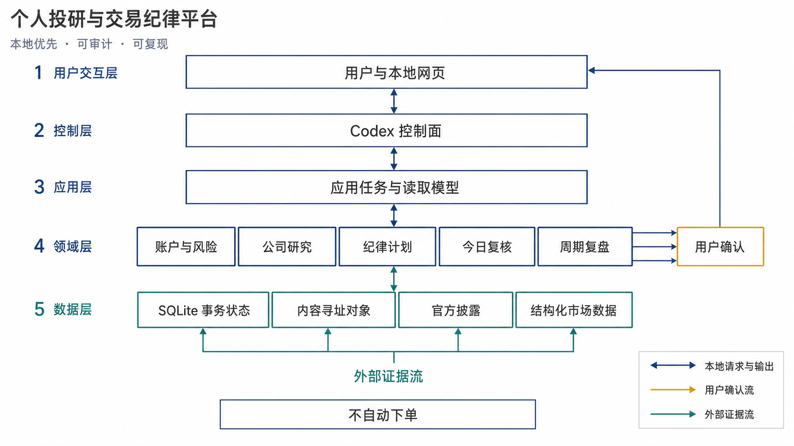
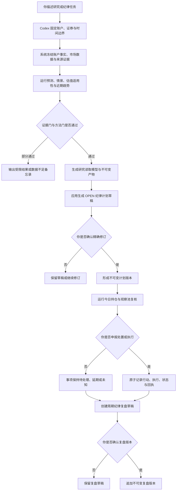
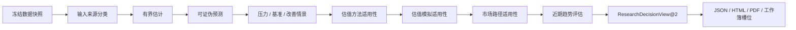
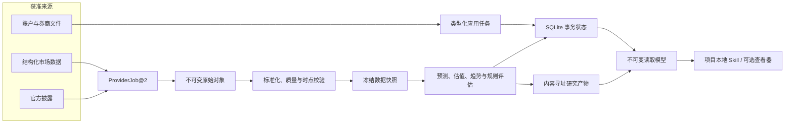

# 个人投研与交易纪律平台

本项目是一个面向个人股票研究与交易纪律管理的本地优先研究软件。它以可追溯证据、时点一致数据和确定性计算为基础，将账户事实、公司研究、情景估值、纪律计划、人工复核与周期复盘组织为可审计、可复现的连续工作流。

项目不自动下单，不接入实盘交易，也不提供个性化投资建议。缺少关键证据时，系统保留未知状态并明确降级或阻断，不以估计值、聚合数据或语言模型输出替代官方事实。

## 研究定位

本项目关注以下问题：

1. 如何在单机环境中保存具有明确来源、时间边界和版本身份的投研证据；
2. 如何把事实、派生计算、显式假设、估计值和缺失值分别建模；
3. 如何从冻结数据构建可证伪预测、条件情景和适用的估值方法；
4. 如何把研究结果转化为由用户确认的版本化纪律规则；
5. 如何记录每日复核、用户申报的执行事实和周期复盘，同时避免事后改写；
6. 如何让同一研究运行能够被检查、归档、备份、恢复和独立复现。

当前范围不包括真实自动下单、券商订单生命周期、收益承诺和业务运行时大语言模型调用。

## 系统框架



**图 1：系统概念架构。** 普通用户只通过项目本地 `skills/SKILL.md` 的自然语言任务进入统一应用边界；本地网页仅是可选查看器。研究、计划、复核和复盘共享同一事务状态与内容寻址对象存储；外部证据写入本地后才参与计算。计划、执行记录和复盘版本均保留用户确认边界。

### 分层职责

| 层级 | 主要职责 | 边界 |
| --- | --- | --- |
| 用户交互层 | 接收自然语言任务，展示读取模型和待确认内容 | 不直接写数据库或构造领域对象 |
| Codex 控制面 | 解析账户、证券、时间边界和任务类型，构造类型化请求 | 不在业务运行时调用大语言模型 |
| 应用层 | 执行完整用户任务，管理事务、权限、幂等和失败语义 | 所有正式变更经过统一分派器 |
| 领域层 | 账户与风险、公司研究、纪律计划、今日复核、周期复盘 | 未知值不得静默转为零或确定事实 |
| 数据层 | SQLite 事务状态、内容寻址对象、官方披露和结构化市场数据 | 原始证据和历史版本不可原地改写 |

## 设计原则

- **本地优先**：账户、现金、持仓、交易、计划和注释默认只保存在本机。
- **证据优先**：每个关键数字必须解析到来源身份，或显式标记为缺失。
- **时点一致**：数据必须记录 `as_of_at`、`published_at`、`available_at` 和 `retrieved_at` 等时间语义。
- **确定性计算**：财务计算、估值、规则评估和模拟由普通代码执行并接受测试。
- **用户确认**：账户、风险政策、计划、执行记录和复盘确认不能由代理或系统替代。
- **不可变历史**：修订通过新版本表达，不覆盖旧计划、旧研究或旧执行事实。
- **失败关闭**：来源、权利、身份、完整性或可复现性门失败时，系统停止依赖该证据的结论。
- **单一用户入口**：`skills/SKILL.md` 是唯一产品入口；命令行只供内部维护适配，本地网页只作可选查看，不增加直接 SQL、文件旁路或第二套业务流程。

## 证据与输出语义

| 类型 | 含义 |
| --- | --- |
| `observed_official` | 来自交易所、监管机构或公司正式披露的观察事实 |
| `observed_structured` | 来自合格结构化数据源的时点一致观察 |
| `derived` | 由具名输入和确定性公式计算得到的结果 |
| `estimated` | 具有方法、边界、校准窗口和失效条件的有界估计 |
| `missing` | 没有可辩护的观察、计算或估计值 |
| `limited` / `blocked` / `not_run` | 方法受限、被阻断或未运行，并带有原因码 |
| `data_insufficient_memo` | 数据不足备忘录；保留缺口与下一步证据需求，不给出正式估值结论 |

Tushare-compatible 数据在本项目中属于结构化聚合证据，不视为官方披露。巨潮资讯、交易所公告和公司正式报告是 A 股关键财务事实的优先来源。

## 用户角色

### 个人研究者

你是主要决策者。你负责提供研究目标、账户声明、必要的显式假设和最终确认。系统负责收集和冻结证据、执行确定性计算、生成草稿并保存审计记录。

### 平台维护者

你负责初始化数据根、迁移、数据源资格检查、健康诊断、服务启动、测试、备份和恢复。维护命令是稳定适配器，不是另一套业务流程。

### 复现与审阅者

你根据运行编号、清单、内容哈希、模型身份和代码版本检查研究结果。你不需要依赖聊天历史，也不应直接修改产物文件。

## 总体工作流



这条工作流中的“研究完成”“草稿生成”和“用户确认”是三个不同事件。研究结果不会自动激活计划，计划评估也不会自动创造执行事实。

## 首次使用

### 1. 准备环境

当前主要验证环境为 Windows PowerShell。项目要求 Python `>= 3.10`，锁文件当前按 Windows CPython 3.14 资格化。Node.js 与 npm 只在重建或完整验证本地网页时需要。

```powershell
py -3.14 -m venv .venv
.\.venv\Scripts\python.exe -m pip install --require-hashes -r requirements-build.lock
.\.venv\Scripts\python.exe -m pip install --require-hashes -r requirements.lock
.\.venv\Scripts\python.exe -m pip install --no-build-isolation --no-deps -e .
```

修改网页源码时再执行：

```powershell
Set-Location web
npm ci
npm run build
Set-Location ..
```

仓库已提交生产构建到 `web/dist`，日常启动不需要重复构建。个人数据目录应放在 Git 仓库之外，或使用已忽略的 `.research/`。

### 2. 初始化数据根

作为个人研究者，你可以直接告诉 Codex：

```text
请把本项目初始化到 E:\trading-data\personal，并运行健康检查和环境诊断。
只报告脱敏结果，不要显示任何凭据。
```

维护者对应命令：

```powershell
.\.venv\Scripts\python.exe -m trading_platform.cli bootstrap --data-root E:\trading-data\personal
.\.venv\Scripts\python.exe -m trading_platform.cli health --data-root E:\trading-data\personal
.\.venv\Scripts\python.exe -m trading_platform.cli doctor --data-root E:\trading-data\personal
```

初始化会创建 `platform.sqlite3` 和内容寻址对象目录。每条命令只输出一个 JSON 信封；失败时保留类型化错误码和脱敏诊断。

### 3. 配置数据来源

生产组合有三个固定数据源角色：

- `tushare-compatible`：非官方结构化市场数据，凭据作用域为 `TUSHARE_TOKEN`；
- `cninfo-official`：巨潮资讯官方披露，不读取令牌；
- `szse-official`：深交所官方披露，不读取令牌。

版本化作业示例位于 [`examples/platform/`](examples/platform/)。Codex 会复制适用示例并填写新的 `invocation_id`、证券身份、日期和 `as_of_at`。

凭据只允许来自当前进程环境，或 Windows 凭据管理器中的 `tradingSystem/<scope>` 项。不要把令牌写进聊天、命令行参数、源码、`.env`、作业 JSON、日志、产物或 Git。详细来源边界见 [`TUSHARE_USAGE.md`](TUSHARE_USAGE.md)。

### 4. 建立账户事实

```text
请为本地账户 kong 建立人民币账户快照。先预览我提供的券商文件，列出现金、持仓、
未知项和来源边界；在我明确确认前不要提交，也不要推断缺失交易历史。
```

账户快照确认后，再确认组合风险政策。缺少这两项确认事实时，计划生成会失败关闭，而不是采用隐含默认值。

### 5. 使用六类自然语言任务

普通用户无需启动网页或手写命令。直接按 [`skills/SKILL.md`](skills/SKILL.md) 提出以下任一任务：查看当前账户、更新今天状态、本周或指定周期复盘、研究一只股票并生成图表报告、创建交易计划、更新交易计划。

默认结果先回答问题，再给少量关键指标、变化或限制；只有最终账户事实、计划修订或实际成交声明需要用户明确决定。内部命令、迁移、版本、ID、DTO、hash、manifest 和诊断默认不展示。本地网页保留为按需打开的只读工作台，不是任何任务的完成条件。
## 按用户角色执行工作流

### 阶段一：定义任务与时间边界

| 你的操作 | 系统操作 | 产生的记录 |
| --- | --- | --- |
| 给出账户、证券、截止日期和研究目的 | 解析证券身份、市场时区和请求类型 | 类型化请求与规范请求哈希 |
| 明确哪些输入是你的假设 | 区分用户假设与来源观察 | 假设来源、范围和失效条件 |
| 不确定时保持未知 | 拒绝把未知值补成零 | 缺失项和受影响方法 |

### 阶段二：冻结数据与证据

| 你的操作 | 系统操作 | 产生的记录 |
| --- | --- | --- |
| 授权适用的数据同步 | 获取结构化数据和官方披露 | 不可变原始对象与抓取身份 |
| 指定截止时间 | 应用时点可见性与交易日历约束 | 冻结数据快照 |
| 查看来源边界 | 验证权利、完整性、新鲜度和来源权威 | 来源清单与质量状态 |

### 阶段三：运行公司研究



`ResearchWorkflow.handle` 拥有运行、恢复和持久化策略。展示层只读取已持久化的 `ResearchDecisionView@2`，不会重新计算研究或估值语义。

### 阶段四：形成并确认纪律计划

1. `trade_plan.prepare_draft@1` 只接收用户可读的账户别名、证券代码、计划类型和请求时点；
2. 应用自动选择最新完整研究及其趋势证据，并解析已确认账户快照、风险政策和活动内置策略；
3. 应用编译完整 `TradePlanGraph` 并生成 `OPEN` 草稿；
4. Codex 默认只展示期限、边界、限制和可读差异；精确修订绑定留在内部；
5. 你确认该修订后，系统才签发并消费一次性确认挑战；
6. 任何进一步修订都使旧确认挑战失效。

`TradePlanDetailView@1` 默认先展示生命周期、期限和复核日、数量、触发行为、风险限制、证据新鲜度、当前评估原因与下一步。完整来源、内部标识和版本历史按需展开。

### 阶段五：运行今日复核并记录行为

```text
请复核 kong 账户今天的持仓和默认观察池。若今天不是交易日，使用最近一个已证明完整的
A 股交易日，并明确告诉我实际使用的日期。先列未解决事项和重要变化。
```

Codex 调用 `manual_portfolio_review.run@2`。请求只能包含 `account_id`、`requested_at`，以及固定为 `latest_proven_complete_session` 的 `session_selection`。应用负责选择交易日、上次成功截止点、代码/配置身份、持仓和默认观察池。

任务延期、任务处置和执行申报是彼此独立的用户命令。未知价格或费用保持未知；用户申报默认是 `user_declared_unverified`，直到类型化券商对账提供更强证据。

### 阶段六：创建周期纪律复盘

```text
请为 kong 创建覆盖 2026-07-20 至 2026-07-24 完整交易日的周度纪律复盘草稿。
列出计划内外行为、延期、未记录或未核验事项和证据缺口，不要替我确认。
```

应用根据任务、行动、执行、计划、快照、例外和证据缺口分类，但不接受调用者提供分数。复盘不限于周五，也没有后台调度器自动触发。你确认精确修订后才追加不可变版本。

## 分场景使用方法

### 场景一：首次研究一家公司

**你的目标**

建立一份具有明确截止日期、来源分类和方法边界的公司研究。

**你可以这样提出任务**

```text
研究 kong 账户中的 002407.SZ，口径截至 2026-07-30。使用冻结数据和官方披露，
生成三种情景、估值适用性、关键不确定性和近期趋势。先完成研究，不要替我确认计划。
```

**系统将执行**

1. 冻结证券身份、账户上下文、交易日历和数据版本；
2. 分类官方观察、结构化观察、派生值、估计值和缺失值；
3. 构建预测、三种条件情景和估值适用性；
4. 生成同一读取模型的 JSON、HTML、PDF 和工作簿槽位；
5. 条件满足时生成 `OPEN` 计划草稿。

**你需要检查**

来源质量、假设、缺口、受限方法、近期趋势以及计划草稿引用的精确研究版本。

### 场景二：官方证据不完整

**你的目标**

在不编造关键数据的前提下获得结构完整的受限研究。

```text
研究 002897.SZ。如果官方披露或估值输入不完整，继续完成能完成的研究结构，
列出缺口和下一步证据需求，不要生成目标价、评级或行动建议。
```

**预期行为**

- 相关方法返回 `limited`、`blocked` 或 `not_run` 及原因码；
- 估值部分使用 `data_insufficient_memo`；
- 聚合数据不会被描述为官方数据；
- 未知值不会被零或任意分布替代；
- 全局身份、时点、完整性、权利或可复现性失败时，整个运行失败关闭。

### 场景三：非交易日发起今日复核

**你的目标**

使用最近一个已证明完整的交易日复核账户，而不是假造当日行情。

```text
今天复核 kong 的持仓和观察池。如果今天休市，使用最近完整交易日，
明确报告实际日期和数据截止点。
```

**预期行为**

- 系统选择最近已证明完整的 A 股交易日；
- 优先展示未解决事项、重要变化和无法判断/未知状态；
- 不自动确认计划；
- 不根据“没有申报”推断“没有执行”。

### 场景四：确认或拒绝计划草稿

**你的目标**

只对已经检查过的精确修订作出决定。

```text
请展示当前未确认计划草稿的期限、数量边界、证据新鲜度、限制和相对上一版本的可读差异；技术标识只在我明确要求时展开。
在我明确回复前不要确认。
```

**确认前检查**

- 账户快照和风险政策是否为最新已确认版本；
- 研究证据是否仍在新鲜度窗口内；
- 条件、数量、风险上限、退出规则和复核日期是否可理解；
- 当前确认挑战是否对应正在显示的修订。

拒绝草稿不会污染已确认计划；修订会产生新版本并使旧挑战失效。

### 场景五：申报执行或修正执行记录

**你的目标**

记录你实际声明的行为，同时保留价格、费用和券商核验状态的不确定性。

```text
我要处理某个决策事项。先展示它引用的计划版本和规则；我确认后，
按我提供的数量、生效时间以及价格和费用的已知/未知状态申报执行。
```

**预期行为**

- 只有 `execution_record.declare@1` 能把事项处置为 `executed`；
- 行动日志、执行记录、事项状态和回执原子提交；
- 未知价格或费用保持未知；
- `execution_record.correct@1` 追加关联修正事实，不覆盖原记录；
- 用户声明保持 `user_declared_unverified`，除非后续券商对账提供更强证据。

### 场景六：进行周度或自定义周期复盘

**你的目标**

基于已有任务、计划、行动和证据缺口检查纪律执行情况，而不是让系统主观打分。

```text
创建 kong 账户的周度纪律复盘草稿，覆盖最近五个已证明完整交易日。
先列计划内外行为、延期、未记录、未核验和证据缺口，不要替我确认。
```

**预期行为**

- 周期边界必须是已证明完整的交易日；
- 系统从已有事实派生分类，不接受调用者提交评分；
- 复盘草稿与确认版本分离；
- 月度视图聚合已确认版本，不创建另一套工作流。

### 场景七：备份与恢复演练

**你的目标**

验证本地研究资产可以完整迁移，而不覆盖当前数据根。

```text
把 E:\trading-data\personal 备份到 E:\trading-backups\personal-20260731.zip，
恢复到新的 E:\trading-data\restore-check，运行诊断，但不要切换当前数据根。
```

**预期行为**

- 备份包含 SQLite、内容寻址对象和哈希清单；
- 恢复过程校验路径、大小、哈希、结构版本、外键和对象图；
- 恢复目标必须是新目录；
- 只有你另行要求时才执行数据根切换。

## 数据、产物与复现



数据根是唯一持久化边界：

```text
<data-root>/
  platform.sqlite3               事务、身份、版本、状态和审计索引
  objects/sha256/<前两位>/<hash>  不可变源数据与研究产物
```

复现一次研究时，应固定并检查：

- 运行编号、证券身份和截止日期；
- 数据快照、来源清单和内容哈希；
- 预测、估值、策略和政策版本；
- 代码版本、配置身份和随机种子；
- JSON、HTML、PDF、工作簿槽位及其清单；
- 运行状态、受限原因、失败诊断和恢复记录。

不要直接修改产物文件；使用 `history`、`archive`、本地网页读取模型或正式应用任务读取。

## 维护者命令

以下是唯一稳定维护入口；普通用户应让 Codex 调用：

```powershell
python -m trading_platform.cli bootstrap --data-root <root>
python -m trading_platform.cli health --data-root <root>
python -m trading_platform.cli doctor --data-root <root>
python -m trading_platform.cli migrate --data-root <root>
python -m trading_platform.cli sync --data-root <root> --job-file <job.json>
python -m trading_platform.cli research --data-root <root> --request-file <request.json>
python -m trading_platform.cli provider-qualify --data-root <root> --job-file <job.json>
python -m trading_platform.cli resume --data-root <root> --workflow-run-id <id> --owner-token <token>
python -m trading_platform.cli history --data-root <root> --workflow-run-id <id>
python -m trading_platform.cli archive --data-root <root> --kind manifest --id <id>
python -m trading_platform.cli serve --data-root <root> --web-root web/dist --account-id <id> --security-id <id>
python -m trading_platform.cli backup --data-root <root> --archive <outside-root.zip>
python -m trading_platform.cli restore --archive <backup.zip> --target-root <new-root>
python -m trading_platform.cli switch-restored-root --restored-root <new-root> --pointer-file <active-root.json>
python -m trading_platform.cli test --repo-root .
python -m trading_platform.cli inventory --repo-root .
```

正式业务变更只经过共享分派器：

```powershell
python -m trading_platform.cli application-command --data-root <root> --envelope-file <command.json>
```

该命令仅供 Codex 与维护集成。临时文件必须严格符合 `ApplicationCommandEnvelope@1`；用户不手写 `command.json`。应用校验结构版本、能力、执行主体、批准信息、规范请求哈希和幂等回执。禁止用直接 SQL、文件写入或私有调用绕过它。

## 验证

```powershell
# 完整验证
.\.venv\Scripts\python.exe -m trading_platform.cli test --repo-root .

# README 与 Skill 入口契约定向验证
python -X utf8 -m pytest -q tests/test_skill_entrypoint.py tests/platform/test_skill_contract.py tests/platform/test_web_application_tasks.py
```

超时、跳过、外部检查未运行或环境准备失败都不算通过。每次变更结束前应检查 `git status` 和最终差异，并保留与当前任务无关的用户改动。

### 常见失败

| 现象 | 处理方式 |
| --- | --- |
| `PLATFORM_NOT_BOOTSTRAPPED` / `DATA_ROOT_NOT_INITIALIZED` | 先执行 `bootstrap`，再运行 `health` 和 `doctor` |
| `provider_readiness=not_configured` | 检查固定数据源角色和本机凭据作用域，不要在聊天中发送令牌 |
| `completed_with_limits` | 查看来源清单、方法状态和下一步证据需求；该状态不授权确认计划 |
| 本地网页没有内容 | 确认账户、证券标识和读取模型已持久化，以 `serve` 返回的动态地址为准 |
| 命令返回 `ok=false` | 保留操作名、类型化错误码和脱敏诊断，不要绕过失败步骤直接写库 |

## 项目结构

```text
src/equity_research/       证据、预测、情景估值和确定性计算
src/trading_platform/      领域、应用任务、持久化、命令行与本地网页
migrations/                只向前的一次性 SQLite 迁移
skills/SKILL.md            唯一 Codex/Skill 控制面入口
examples/platform/         版本化数据源作业示例
tests/                     领域、应用、适配器、网页与验收测试
web/                       本地决策工作台及 web/dist
```

长期目标和不可违反约束以 [`docs/prompts/trading_platform_codex_prompt_optimized.md`](docs/prompts/trading_platform_codex_prompt_optimized.md) 与 [`AGENTS.md`](AGENTS.md) 为准。进一步阅读：

- [`docs/architecture/target-architecture.md`](docs/architecture/target-architecture.md)
- [`docs/open-source-research.md`](docs/open-source-research.md)
- [`skills/references/source-manifest.md`](skills/references/source-manifest.md)
- [`skills/valuation/valuation-method-router.md`](skills/valuation/valuation-method-router.md)
- [`skills/valuation/dcf-and-sensitivity.md`](skills/valuation/dcf-and-sensitivity.md)

## 开源协作与引用边界

- 研究结论应由代码、测试、清单或运行记录支撑，不把规划文档当作实现证据。
- 修改接口时，应同步更新 README、Skill、示例、测试和迁移说明，避免出现并行入口。
- 外部数据、图表库和其他依赖的许可与归属要求应以 `THIRD_PARTY_NOTICES.md` 及 `web/THIRD_PARTY_NOTICES.md` 为准。
- 仓库的分发许可应以实际许可文件为准，不从依赖许可或第三方声明推断本项目许可。
- 报告研究结果时，应给出截止日期、来源边界、缺失项、方法限制和复现条件。

## 伦理与金融边界

- 默认不输出买入、卖出、持有、目标价、评级或个性化仓位建议。
- 缺少官方关键来源、方法输入或可复现证据时，只输出限制和下一步数据需求。
- 计划是用户确认的版本化纪律规则，不是订单；平台不会自动执行交易。
- 用户申报的行为不自动升级为券商核验事实。
- 账户与凭据不得进入源码、明文日志、研究产物、备份清单或 Git。
