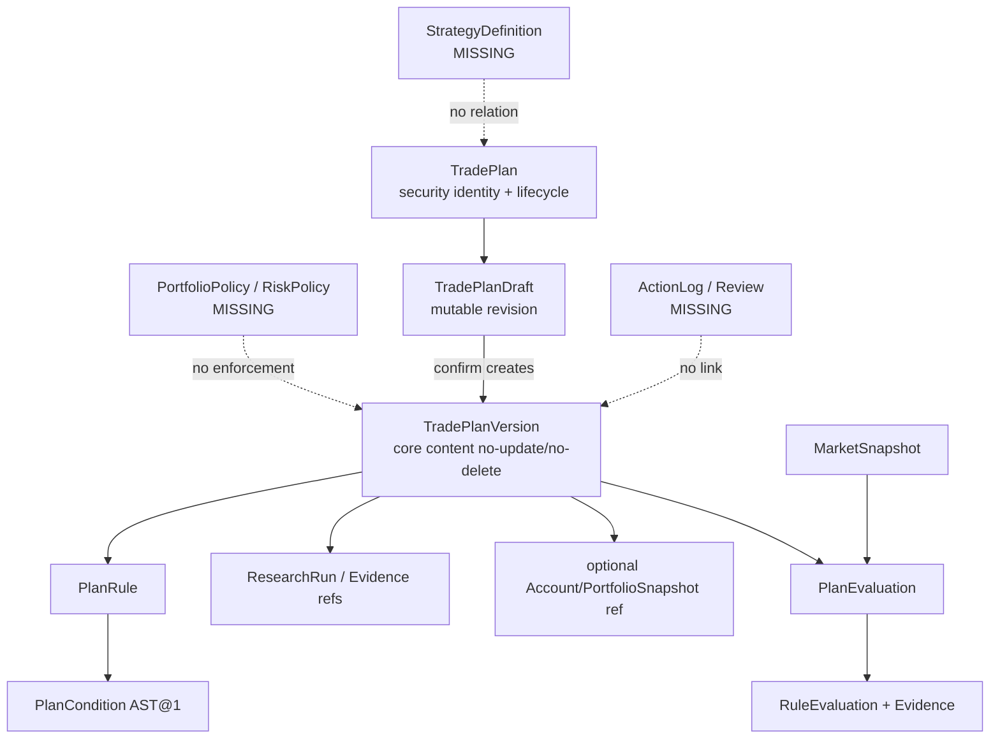

# TradingSystem 当前产品与实现事实审计

审计日期：`2026-07-26 Asia/Shanghai`

> 本文件先记录“文档基线、时态边界与冲突”的证据化审计结果。文档、Prompt、Spec、Issue、领域词汇和原型均不能单独证明产品能力；后续章节只有在生产代码、公开 application task、migration、测试或实际运行结果支持时，才可把能力提升为 `WORKING_E2E` 或 `IMPLEMENTED_PARTIAL`。
>
> `2026-07-27` 基线清理说明：下文关于文件为 `untracked`、旧
> `docs/current-state-audit.md` 仍存在以及根目录临时 Tushare 说明的描述，是本次审计
> 采集时的历史 Git 事实。实施前清理已删除冲突的旧审计与不可提交的本地连接/raw
> 材料，并把本文件及其引用的权威规划材料纳入新的文档基线；这些清理不改变下文对
> runtime 能力的判定。

## 1. 一页执行摘要

状态词在全文中只有以下七种含义：`WORKING_E2E` 表示真实用户入口、正式 application path 与持久化已经贯通；`IMPLEMENTED_PARTIAL` 表示组件可运行但闭环中断；`DOMAIN_ONLY` 表示只有领域/service/repository seam；`PROTOTYPE_ONLY` 表示隔离原型；`MOCKED` 表示运行依赖 fixture/mock/example；`SPEC_ONLY` 表示只有 Prompt/Spec/Issue/TODO；`MISSING` 表示所审计的生产对象、schema 与入口均不存在。

为避免把“文档中出现一个名词”和“生产实现存在”混成同一项，全文把两者显式视为不同审计对象：例如“文档中的 Inbox 合同”为 `SPEC_ONLY`，而“生产 Inbox 对象/orchestrator”为 `MISSING`。每一行的状态只约束该行命名的对象，不把 Prompt 中的名词当成生产实现证据。

**总判定：当前产品为 `IMPLEMENTED_PARTIAL`，没有形成“策略—计划—执行—复盘”闭环。** 当前 fresh data root 真正可直接跑通的是平台 bootstrap/health/doctor、空 watchlist 查询等运维路径；受支持的同花顺文件可以经 CLI 建立并冻结账户初始状态，单证券 DataSnapshot、ResearchWorkflow、MarketSnapshot、PlanEvaluation、Web 历史投影和图表标注也各有正式组件与持久化。但 fresh root 的 Provider 实测为 `not_configured`，正式 Research adapter 固定把五项关键语义事实标为 missing，正式用户没有 TradePlanDraft 的 create/update/diff 入口，`DailyResearchCycle` 一次只处理一个 job/一个计划。组合级日终评估、下一交易日 Inbox、实际行为 ActionLog、周末/月度 Review、StrategyDefinition 与 PortfolioPolicy/RiskPolicy 均不存在。

仓库命名的 fixture connected journey 是 `MOCKED`，且只止于 `PlanEvaluation`：`BrowserAcceptanceFixture.prepare()` 用 `tests/fixtures/platform_data/manifest.json` 写入临时 SQLite，并创建 `user_fixture_input` 的计划草稿。生产 Web 可确认这个预先存在的草稿并生成 version core 不可修改的新版本，却不能让 fresh user 创建该草稿；该 journey 没有账户起点、Inbox、ActionLog 或 Review，不能称为完整用户闭环。A/B/C 原型又在此基础上把账户、三项持仓、市场状态、规则结果和周复盘写死为 `discussionScenario`；唯一正式读取是 `GET /api/workspace`，所有账户/计划“保存”都只改浏览器变量。

当前 Web 更接近**单证券系统状态面板**：启动时绑定一个 `security_id + snapshot_id`，主信息是 ResearchDecisionView、数据质量、图表、标注、授权记录、计划/评估历史和 provenance；它没有组合持仓首页、正式计划编辑器、DecisionTask/Inbox、ActionLog 或 Review。当前 Web controller 没有直接访问 SQLite，但其 application task 实现中的 `WorkspaceService`/`ChartService` 自己拥有 SQL；原型另有一条明确绕行路径“UI → 浏览器内存”，不进入 application/persistence。

CLI、Web 与 active Skill 共享 composition root、named application boundary、SQLite schema 和 data root，但答案不是“同一 command / 同一 persistence contract”：Skill 只编排 CLI 子集，Web/CLI mutation surface 分离，且 Web direct-SQL task、plan/market repository、account-owned `PlatformStore` 并不存在一个统一 persistence abstraction。

实际验收没有通过：canonical acceptance 的 9 个本地 suite 共收集 308 项且 suite 均为 `passed`，但 51 个 AC 仅 43 个通过，最终 `slice_acceptance=failed`，失败码为 `EXECUTION_EVIDENCE_MISSING`、`LIVE_QUALIFICATION_EVIDENCE_INCOMPLETE`、`LOCAL_CRITERION_NOT_PASSED`；`long_term_platform_complete=false`。因此既不能把 308 项测试理解为产品闭环，也不能把 prototype/fixture 结果提升为 production E2E。

1. [`docs/prompts/trading_platform_codex_prompt_optimized.md`](docs/prompts/trading_platform_codex_prompt_optimized.md) 是 `AGENTS.md` 指定的长期目标、范围和完成门，不是已实现能力清单。其“Target system capabilities”“Required deliverables”“Mandatory implementation tests”全部使用目标时态；Prompt 自身还明确禁止把规划、静态 UI、自然语言报告或 fixture 结果当成完成。
2. 第一纵向切片的权威设计文件是 [`.scratch/trading-platform-first-vertical-slice-spec/spec.md`](.scratch/trading-platform-first-vertical-slice-spec/spec.md)，版本 `0.2.0`、状态 `implementation-ready`。但该文件第 7–11 行、第 760 行明确写明“设计已就绪、平台尚未实现”；`AC-001`—`AC-051` 是验收合同，不是通过记录。因此该 Spec 文档本身的状态只能是 `SPEC_ONLY`。
3. 第一纵向切片 Spec、其 map、`CONTEXT.md`、`docs/current-state-audit.md` 和 `docs/open-source-research.md` 当前都只是工作树中的未跟踪文件；它们不在 `master`、`codex/research-system-refactor` 或 `codex/prototype-weekly-discipline-workspace` 三个 branch tip 中。它们可以作为本次 live workspace 的设计事实源，但不能作为任何分支可复现的已提交产品证据。
4. [`.scratch/portfolio-aware-weekly-discipline/map.md`](.scratch/portfolio-aware-weekly-discipline/map.md) 仍为 `Status: open`。其中 01–06 已有决策答案，07 在当前工作树只是 `claimed`，08–13 仍为 `open`。该 tracker 自己明确说“本 map 只消除 fog，不实施平台”；所以用户声明账户、组合风险政策、组合级日终编排、下一交易日 Inbox、行动日志与周末复盘均不能从 tracker 状态升级为实现能力。
5. 当前代码确有账户导入、版本化计划、单计划市场评估、研究 View、Web 工作区和 `open_*` 任务接口，但这些是可复用组件，不等于“账户 → 全持仓日终评估 → 下一交易日事项 → 实际行为 → 周末复盘”闭环。定向测试证明这些组件的公开 seam 可运行；没有文档或测试证据证明完整周纪律闭环。
6. `codex/prototype-weekly-discipline-workspace` 只在 Web 资产和一个 throwaway runner 上增加 A/B/C 布局。它明确把未来账户、计划和复盘交互保存在浏览器内存，且显示硬编码 `discussionScenario`；唯一读取生产数据的调用是 `GET /api/workspace`。因此布局是 `PROTOTYPE_ONLY`，其中展示的账户、持仓、市场状态、规则和周复盘数字是 `MOCKED`。

## 2. 审计分支与工作树身份

没有名为 `production` 的 ref，也没有 remote 可用来证明部署分支。以下是能够由 Git 直接证明的分支事实；不得仅凭分支名把某个 ref 称为生产：

| 事实源 | Commit / 状态 | 与本审计有关的事实 |
|---|---|---|
| `master` | `71403d96d0c086a3748e2934c572eeb783ba68f9` (`Wire source manifest validation into equity workflow`) | 只有 46 个 tracked 文件；没有 `src/trading_platform/`、`migrations/`、`web/`、总 Prompt、`docs/agents/` 或第一纵向切片 Spec。若“生产分支”严格指唯一非 `codex/*` 分支，则当前平台代码不在该分支上。 |
| 当前 checkout `codex/research-system-refactor` | `68f23c4785237d349975da5f3bb7a8f8273b565c` | 包含当前 `trading_platform`、migration 0001–0014、CLI、Web、Skills 和测试。工作树另有用户未提交/未跟踪资产，不能与 branch tip 混为一谈。 |
| `codex/prototype-weekly-discipline-workspace` | `fdf8fa1cf76cb5d8715188baec8812c075ab558f` | 相对 `68f23c4` 只改变 9 个 Web/prototype/build 文件；没有新增 domain、application、migration 或测试。两次提交是 `prototype: explore weekly discipline workspace` 与 `prototype: initialize weekly discipline parameters`。 |
| 当前 live 工作树 | dirty | `docs/prompts/trading_platform_codex_prompt_optimized.md` 有未提交设计原则；第一切片 Spec 整目录、`CONTEXT.md`、旧 `docs/current-state-audit.md`、多个周纪律 ticket 等为 `??`。这些变更属于用户，审计只读取并保留。 |

复核命令：

```text
git status --short --branch
git branch --all --no-color
git worktree list --porcelain
git cat-file -e <ref>:<path>
git ls-tree -r --name-only <ref>
git diff --name-status 68f23c4..fdf8fa1
```

## 3. 文档权威链与时态

| 文档 | 权威含义 | 文档自身状态 | 本轮使用规则 |
|---|---|---|---|
| [`AGENTS.md`](AGENTS.md), `Long-Term Project Baseline` | 指定总 Prompt、唯一 Skill、application 依赖方向和安全边界 | 规则 | 约束审计方法；不能证明产品能力 |
| [`docs/prompts/trading_platform_codex_prompt_optimized.md`](docs/prompts/trading_platform_codex_prompt_optimized.md), `Current task statement` / `Target system capabilities` / `Completion and return conditions` | 长期目标、非目标、完成门与强制测试 | `SPEC_ONLY` | 所有“平台至少支持/必须”都要反查代码、migration、测试和运行 |
| [`docs/agents/issue-tracker.md`](docs/agents/issue-tracker.md), `Conventions` / `Wayfinding operations` | 定义 `.scratch/<feature>/spec.md` 和 ticket 的 `resolved` 语义 | 规则 | `resolved` 只表示 Answer 已写入和 map 已回链，不表示实现 |
| [`docs/agents/domain.md`](docs/agents/domain.md), `Use the glossary's vocabulary` | 要求使用 `CONTEXT.md` 术语并检查 ADR | 规则 | `CONTEXT.md` 只定义语言，不证明 class/table/task 存在；当前无 `docs/adr/` |
| [`CONTEXT.md`](CONTEXT.md) | 单上下文领域词汇表 | `SPEC_ONLY` | `Strategy`、`UserDeclaredAccountSnapshot` 等若无生产符号仍不是领域实现 |
| [第一纵向切片 `spec.md`](.scratch/trading-platform-first-vertical-slice-spec/spec.md), `当前事实与目标设计的严格分界` | 0.2.0 实现级设计和 AC | `SPEC_ONLY` | “implementation-ready”不得提升为已实现；其“当前”列是 2026-07-12 前后的历史快照 |
| [第一纵向切片 `map.md`](.scratch/trading-platform-first-vertical-slice-spec/map.md), `Status: resolved` | Wayfinder 设计决策已收敛 | `SPEC_ONLY` | 不把 13/13 resolved ticket 当实现证据 |
| [周纪律 `map.md`](.scratch/portfolio-aware-weekly-discipline/map.md), `Status: open` | 下一条组合感知切片仍在决策阶段 | `SPEC_ONLY` | 只采用已关闭票的合同结论；开放票均不得描述为产品能力 |
| [周纪律 Issue 07](.scratch/portfolio-aware-weekly-discipline/issues/07-prototype-weekly-discipline-workspace.md) | A/B/C HITL 原型票 | `PROTOTYPE_ONLY` | branch tip 仍为 `Status: open`；当前工作树只改成 `claimed` |

## 4. 文档能力与最小代码反证矩阵

本表的状态只回答“文档所描述的能力在当前代码中落到了什么程度”，不替代后续完整用户旅程验收。

| 文档中的能力/对象 | 当前状态 | 文档证据 | 最小代码、schema 或测试证据 | 不能提升状态的原因 |
|---|---|---|---|---|
| 长期 Prompt 中的完整个人投研交易策略平台 | `SPEC_ONLY` | 总 Prompt `Target system capabilities`、`Required deliverables` | 当前仓库只落地其中若干模块 | Prompt 本身是目标；完成门要求完整 E2E、持久化、回看和强制测试 |
| 第一纵向切片 0.2.0 设计 | `SPEC_ONLY` | `spec.md` 第 7–11、27、653、760 行 | 当前已有与其重叠的 migration/task/test，但 Spec 没有 acceptance result | AC 是合同，不是执行证据；文档未提交到任何 audited branch tip |
| `ResearchWorkflowRequest@2 -> ResearchDecisionView@2` | `IMPLEMENTED_PARTIAL` | 周纪律 map、Issue 05/06 | `src/trading_platform/domain/research_evaluation.py::ResearchDecisionViewFactory`；`src/trading_platform/workflows/research.py::ResearchWorkflow`；migration `0014_research_evaluation.sql`；`tests/platform/test_company_outlook_journeys.py` | 支持单研究旅程和持久化 View，不是全持仓 readiness/周纪律闭环 |
| 同花顺账户 preview / initialize / show / history import / acceptance | `IMPLEMENTED_PARTIAL` | 周纪律 Issue 01 `账户形成` | CLI commands `import-preview`, `account-initialize`, `account-show`, `account-history-import`, `account-acceptance`；migration 0009–0011；账户定向测试 18 项通过 | 入口依赖券商文件；没有手工/截图/自然语言草稿与确认合同 |
| `UserDeclaredAccountSnapshot`、`AccountSnapshotDraft`、Revision、Correction | `SPEC_ONLY` | `CONTEXT.md`；周纪律 Issue 02 | `rg` 在 `src/`, `migrations/`, `tests/` 中无这些生产符号 | 只有词汇和合同；无 task、command、table、repository 或 UI |
| `TradePlanDraft -> TradePlanVersion` 与 typed rule AST | `IMPLEMENTED_PARTIAL` | 第一切片 Spec §12；周纪律 Issue 01/04/08 | `src/trading_platform/domain/plans.py::{PlanDraftContent, PlanCondition, PlanRule, TradePlanVersionView}`；migration `0005_market_trade_plan.sql`; `open_trade_plan`; `tests/platform/test_trade_plans.py` | Web 只有确认已有草稿的 route；CLI/Skill 没有正式 create/update/discard plan authoring 入口；不是组合计划工作台 |
| 单计划 `MarketSnapshot -> PlanEvaluation` | `IMPLEMENTED_PARTIAL` | 第一切片 Spec §13；周纪律 Issue 01/05 | `open_market`; `src/trading_platform/market.py::MarketEvaluationService`; migration `0006_market_snapshot_evaluation.sql`; `tests/platform/test_market_evaluation.py` | 当前 `DailyResearchCycle` 只消费 job 中的一个 `market_command` 和一个 `evaluation_template`，不遍历账户全部持仓/active plans |
| 组合级 `PortfolioRiskPolicy` / `RiskPolicyException` | `SPEC_ONLY` | 周纪律 Issue 04 `Answer` | `rg` 在生产代码、migration、测试中无相应符号；当前 `PlanDraftContent` 只有绝对 `max_planned_notional/max_planned_loss` | 15%/30%/90%/10%/0.5%/2% 等是已决策参数，不是已编码政策 |
| MarketRegime v2 四组件 production package | `IMPLEMENTED_PARTIAL` | 周纪律 Issue 05；研究资产标题下 `production 数据资格尚未完成` | `src/trading_platform/domain/market.py` 有确定性四组件算法；当前 typed query/SourcePolicy 没有 `930903.CSI` 指数、逐 session 成分和全市场横截面 | 单证券 receipt 和 fixture 只能证明算法/fail-closed，不能证明 production 数据资格 |
| `HoldingResearchReadiness@1` 五维门控 | `SPEC_ONLY` | 周纪律 Issue 06 及 research 文档 `推荐的最小 View@2 readiness 投影` | 当前 `ResearchDecisionView@2.audit` 没有该 typed payload；生产代码无 `HoldingResearchReadiness` | 文档第 208 行明确说是目标合同建议 |
| 扩展 metric catalog（权重、现金比例、集中度、回撤、事件、研究状态） | `SPEC_ONLY` | 周纪律 Issue 08（`Status: open`） | 当前 `src/trading_platform/domain/plans.py::_METRICS` 只有两项账户 metric：`position.quantity`, `portfolio.net_asset_value` | 尚未经过票据决策和实现 |
| `DailyResearchCycle` | `IMPLEMENTED_PARTIAL` | 周纪律 Issue 01 `DailyResearchCycle 仍是配置 job 驱动` | `src/trading_platform/application/cli_tasks.py::DailyResearchCycle.run` 顺序执行一次 sync、可选 research、一个 market snapshot、一个 evaluation 和 doctor | 不是组合账户冻结、全持仓循环、Inbox 或 weekly orchestrator |
| 下一交易日 `Inbox` / `DecisionTask` | `SPEC_ONLY` | 周纪律 map Destination、Issue 09 | 生产代码、migration、测试无 Inbox/DecisionTask 符号 | Issue 09 仍 open；Web workspace 是指定 `security_id + snapshot_id` 查询 |
| `ActionLogEntry`、计划内/计划外行动、周末纪律复盘 | `SPEC_ONLY` | 周纪律 Issue 04、09 | 生产代码、migration、测试无 ActionLog/WeeklyReview；prototype 只把字符串写进 mock 场景 | 无正式 command/table/workflow/artifact |
| 文档中的一等公民 `StrategyDefinition` / `Strategy` 能力 | `SPEC_ONLY` | 总 Prompt 与 `CONTEXT.md` 只有 `Strategy` 定义 | 生产范围只命中 `StrategyValidationSelection`；生产对象、table、task、repository、backtest result 均为 `MISSING` | 定义不是对象；也没有策略候选与计划的正式关系 |
| A/B/C 周纪律布局 | `PROTOTYPE_ONLY` | prototype branch 两个 prototype commits；Issue 07 | `web/src/weekly-discipline-prototype.js`, `web/prototypes/weekly_discipline/run.py` | 没有 domain/application/migration/test 变更；runner 使用 temp data root 与 browser fixture |
| A/B/C 页面中的账户、持仓、市场、规则和周复盘内容 | `MOCKED` | `discussionScenario`, `parameterGroups` | 唯一 production read 是 `fetch("/api/workspace")`; 未来交互只修改模块变量 `snapshotDraft`, `draftState`, `parameterReview` | 不写库；reload/restart 丢失；页面已明确标为 `THROWAWAY PROTOTYPE` |

## 5. 当前文档与代码/分支冲突

### C-01：旧 current-state audit 已失效，且不在任何分支中

- 历史文档证据：清理前未跟踪的 `docs/current-state-audit.md` 第 19、178–185、385 行仍称“没有 Provider、数据库、migration、Web、TradePlan、MarketSnapshot、Workflow journal 和统一维护入口”；该冲突文件已在实施前基线清理中移除。
- 当前代码反证：`src/trading_platform/`、migration 0001–0014、`src/trading_platform/application/bootstrap.py::open_*`、`src/trading_platform/cli.py`、`src/trading_platform/web_server.py` 均存在；相应定向测试可运行。
- 结论：该文件是第一切片设计前的历史审计快照，不能用作当前产品状态；其标题没有显式标出已过期。

### C-02：第一切片 Spec 的 `ApplicationFacade` 架构已被后续 one-way cutover 取代

- 旧设计：第一切片 `spec.md` §6.1/§9 把 `ApplicationFacade` 写成唯一应用边界，并以 `scripts/platform.py`、`watchlist_update@1` 作为目标入口/工作流。
- 当前规则与代码：`AGENTS.md` 的 `One Canonical Path` 指定 `python -m trading_platform.cli` 和 `trading_platform.application` 的 named task interfaces；`src/trading_platform/application/__init__.py` 导出 `open_*` tasks；`tests/test_skill_entrypoint.py::test_entrypoint_contains_no_retired_routes` 明确断言 active Skill 不得含 `ApplicationFacade`。
- 结论：第一切片 Spec 仍可解释历史设计目标，但其 facade/入口章节不能当作当前调用图；周纪律 map 的“不得恢复已删除 Facade”是更新后的当前边界。

### C-03：权威 Spec 链只在 live working tree 成立，branch tip 无法复现

- `AGENTS.md` 和 `docs/agents/issue-tracker.md` 把 `.scratch/trading-platform-first-vertical-slice-spec/spec.md` 定位为权威设计。
- `git cat-file -e` 证明该目录不在 `master`、`codex/research-system-refactor` 或 prototype branch tip；当前状态是 `?? .scratch/trading-platform-first-vertical-slice-spec/`。
- 同一 Spec 引用的 `CONTEXT.md`、`docs/current-state-audit.md`、`docs/open-source-research.md` 也都是工作树未跟踪文件。
- 结论：设计权威与版本控制事实不一致；不能从任一 audited branch checkout 重建该证据链。

### C-04：committed `AGENTS.md` 引用了 committed Prompt 中不存在的设计章节

- `AGENTS.md` 的 `Long-Term Project Baseline` 要求遵循 Prompt 的 product/interaction principles。
- 当前工作树 Prompt 第 362–402 行确有该节，但它是未提交 diff；`master`、current branch tip 和 prototype branch tip 均找不到 `Product and interaction design principles`。
- 结论：prototype 的设计原则只能由当前 dirty working tree 解释，不能由 prototype branch 自身完整复现。

### C-05：周纪律 map 在分支中存在断链 ticket

- current/prototype branch tip 的周纪律目录只跟踪 Issues 04–08、11–12、map 和两份 research。
- map 的 Decisions/Not-yet-specified 还引用 Issues 01、02、03、09、10、13；这些文件当前只是根工作树 `??`，不在两个 branch tip。
- 结论：branch 中 map 的 blocker/decision graph 不完整；不能仅依据 map 上的 closed-decision 摘要复核详细答案。

### C-06：prototype 已有代码提交，但 tracker 仍未发布为 resolved

- prototype branch 有 `fc3a806`、`fdf8fa1` 两个提交。
- 该 branch 中 Issue 07 仍为 `Status: open`；根工作树只把它未提交地改成 `claimed`。
- 结论：代码存在只证明 `PROTOTYPE_ONLY`；ticket 状态既没有宣称完成，也没有提供 resolved HITL 验收。

### C-07：A/B/C 的按钮语义大于 persistence 能力

- `weekly-discipline-prototype.js` 显示“填写/修订草稿”“确认讨论版本”“周末复盘”等操作。
- 文件头明确说明未来 account/plan interactions 是 in-memory discussion state；`saveAccountDraft()` 和 `confirm-draft` 只改 JS 变量；唯一 fetch 是 `GET /api/workspace`。
- `run.py` 每次创建 `TemporaryDirectory` 并调用 `open_browser_acceptance_fixture`。
- 结论：这些按钮不是账户或计划正式 command；不能因交互可点击而升级为 `IMPLEMENTED_PARTIAL`。

### C-08：active Skill 没有覆盖现有账户/计划用户旅程

- [`skills/SKILL.md`](skills/SKILL.md) 的 `Platform operations route` 列出 bootstrap/health/doctor/migrate/sync/daily/research/provider-qualify/acceptance/serve/test/inventory/backup/restore/resume/history/archive。
- `src/trading_platform/cli.py::_parser` 另外存在 watchlist、market、账户 preview/initialize/show/history/acceptance 命令；Skill 未列这些入口，也没有 plan draft create/update/discard/confirm 的结构化自然语言/截图转换合同。
- 结论：Skill 与 CLI 共享同一 CLI 模块，但 Skill 不是当前账户—计划产品入口；它不能把截图或自然语言提交为正式 Draft。

### C-09：Tushare 操作说明的规则路径不存在于当前 checkout

- `AGENTS.md` 的 `Data Rules` 要求先读 `.scratch/trading-platform-first-vertical-slice-spec/research/kimi-experiments/tushare_usage.md`。
- 该精确路径不存在。当前只有根目录未跟踪的 `tushare_usage.md`，以及未跟踪的 companion `tushare-vs-kimi-datasource.md`。
- 结论：规则引用与实际文件位置漂移；该问题不证明 Provider 不可用，但使文档规定的可复现操作链断裂。

### C-10：长期 Prompt 的计划状态机示例不是当前真实状态机

- 总 Prompt §6 示例为 `draft -> approved -> active -> triggered -> partially_executed -> completed / invalidated / cancelled`。
- 第一切片 Spec §12 后来明确 `inactive <-> active -> ended`，并规定 `triggered` 是评估结果，不是计划状态。
- 当前生产 `TradePlanVersionView.lifecycle_status`、`plan_activation`、`trade_plan_transition` 沿用后者；没有 `partially_executed`，因为当前无执行。
- 结论：总 Prompt 的状态机只能作为长期示例，当前真实领域关系必须以生产类型/migration 为准。

## 6. 文档基线对应的真实调用边界

当前代码中可由一手符号证明的边界是：

```text
CLI
  -> trading_platform.application.bootstrap.open_* task
  -> domain/application service
  -> repository
  -> SQLite / immutable artifact

Web LocalChartWorkspaceServer
  -> DecisionWorkspace / ChartWorkspace / ChartAnnotations
  -> PlanConfirmation / UpdateAuthorizations
  -> production application tasks

Skill
  -> python -m trading_platform.cli（维护与研究命令）

Prototype A/B/C
  -> GET /api/workspace（只读 production projection）
  -> browser module variables（账户草稿、计划讨论、参数审核、周复盘）
```

没有在 `src/trading_platform/web_server.py` 发现 Web 直接导入 SQLite repository；其构造函数依赖 application contracts。已识别的绕行不是 Web→SQLite，而是 prototype 的“浏览器内存讨论状态”，它不进入正式 persistence path。

## 7. 定向运行证据

| 命令 | 退出结果 | 可证明范围 | 不能证明范围 |
|---|---|---|---|
| `python -m pytest -q tests/platform/test_trade_plans.py tests/platform/test_market_evaluation.py tests/platform/test_web_application_tasks.py` | exit `0`; `15 passed in 35.46s` | 计划、单计划评估、Web application task 的既有测试通过 | 不证明计划 authoring UI、组合循环、行为记录或周复盘 |
| `python -m pytest -q tests/platform/test_account_opening.py tests/platform/test_account_history_import.py tests/platform/test_account_workspace_plans.py` | exit `0`; `18 passed in 22.97s` | 券商文件账户初始化、历史导入和账户上下文测试通过 | 不证明手工/截图账户草稿或用户声明快照 |
| 上述六个文件一次合并运行 | 外层 exit `124`; 60.5 秒超时，虽已打印 `33 passed in 56.72s` | 不计为有效通过；随后拆分重跑取得上述两个 exit `0` | 不得把打印的 passed 行覆盖超时事实 |

另直接用全新 temp root 与明确标记的**合成同花顺文件**运行了真实 CLI，而非只调用 service/test：

```text
python -m trading_platform.cli bootstrap --data-root <account-audit-root>/data
python -m trading_platform.cli import-preview --source positions.xls --source cash.xls --source history.xls --account-alias <synthetic> --base-currency CNY --private-root <account-audit-root>/private --trading-session 2026-07-10 --repo-root .
python -m trading_platform.cli account-initialize --data-root <account-audit-root>/data --source positions.xls --source cash.xls --source history.xls --account-alias <synthetic> --base-currency CNY --confirmed-as-of 2026-07-10 --private-root <account-audit-root>/private --trading-session 2026-07-10 --invocation-id audit-account-init-1 --repo-root .
python -m trading_platform.cli account-show --data-root <account-audit-root>/data --account-id account_1a880dab219857e085c39014 --repo-root .
python -m trading_platform.cli account-history-import --data-root <account-audit-root>/data --account-id account_1a880dab219857e085c39014 --source history-inputs/positions.xls --source history-inputs/cash.xls --source history-inputs/history.xls --private-root <account-audit-root>/private-history-ok --trading-session 2026-07-08 --trading-session 2026-07-09 --trading-session 2026-07-10 --invocation-id audit-history-import-ok-1 --repo-root .
```

实际 temp root：

```text
C:/Users/72449/AppData/Local/Temp/
tradingSystem-current-product-audit-account-643d305381044440bbd56c69e5dec087
```

结果：五个命令均 exit `0`。preview 为 `TonghuashunImportPreview@1`，三类文件行数 `2/6/1`，`initialize_current_state=true`、`reconstruct_complete_ledger=false`、as-of 状态 `confirmation_required`；initialize 写入 1 个 account、2 个 positions、cash `1100`、1 个 portfolio snapshot、4 个 quality issues；show 可重读同一 opening state；history import 写入 5 events、2 transactions、4 cash entries、4 holding summaries，最终 `reconciliation_status=limited_opening_history`、`opening_history_gap_count=1`。把 opening cash 文件误当 history 输入的另一次实跑 exit `2 / EVENT_TYPE_UNKNOWN`，未当通过。上述只证明合成文件路径机械贯通，数据状态仍是 `MOCKED`，不证明真实券商账户或完整历史。

本节没有运行外部 Provider，没有触碰用户现有账户/计划真值，没有创建 Spec，也没有修改运行代码。

## 8. 从 fresh local user 出发的真实用户旅程

本矩阵以新建临时 data root 为起点。实际命令为：

```text
python -m trading_platform.cli bootstrap --data-root <audit-temp-root>
python -m trading_platform.cli health --data-root <audit-temp-root>
python -m trading_platform.cli doctor --data-root <audit-temp-root>
python -m trading_platform.cli watchlist-list --data-root <audit-temp-root>
```

结果分别为：bootstrap `ok=true/status=passed`；health `available_with_limits`，其中 `sync/daily/serve=unavailable`；doctor `status=passed` 但 `provider_readiness=not_configured`、两个 credential scope 为 `missing`；watchlist 为 `[]`。账户 CLI 另以全新 temp root 直接跑通合成文件 preview/initialize/show/history-import，并以 integration tests 交叉验证；合成数据明确标为 `MOCKED`，没有冒充用户真实账户。

| 步骤 | 用户入口 | 页面或命令 | Application task / service | 数据输入 | 数据写入 | 用户输出 | 当前状态 | 阻断原因 |
|---:|---|---|---|---|---|---|---|---|
| 1 | CLI | `bootstrap --data-root` | `open_platform_operations() -> PlatformOperations.bootstrap` | 真实空目录 | `platform.sqlite3`、`schema_migration`、`objects/` | typed JSON | `WORKING_E2E` | 无；重复运行仍通过并执行受控 migration/backup 语义 |
| 2 | CLI；Web/Skill 无 | `import-preview`、`account-initialize` | `open_import_preview()`、`open_account()->AccountOpeningService.initialize` | 真实本地文件协议，但只接受固定同花顺 GB18030/TSV `.xls` roles；本轮直跑数据为合成 fixture (`MOCKED`) | 私有 content-addressed source；`account*`、`account_position*`、`portfolio_snapshot`、`object_blob` | preview JSON、account detail JSON | `IMPLEMENTED_PARTIAL` | 无手工表单、截图/OCR、自然语言或 Web 入口；本轮没有真实券商文件 |
| 3 | CLI | `account-initialize --confirmed-as-of ... --invocation-id ...` | `AccountOpeningService.initialize` | preview 结果与用户在参数中给出的 cutoff | 与步骤 2 同一事务写正式 opening state；repository 仅插入，部分表有 DB trigger、并非整族绝对不可变 | account JSON | `IMPLEMENTED_PARTIAL` | 没有 `AccountSnapshotDraft -> Validate -> Confirm`；参数确认与正式 commit 是同一步 |
| 4 | CLI / 单证券 Web | `account-show`、`watchlist-list`、`GET /api/workspace` | `open_account()`、`open_watchlist()`、`DecisionWorkspace.build` | 已导入账户或独立 watchlist | 读取；watchlist 另由 `watchlist-add` 写入 | JSON / Web positions 卡片 | `IMPLEMENTED_PARTIAL` | 持仓不会自动变成 watchlist；不存在统一的“全部持仓 + 观察项”工作集 |
| 5 | CLI | `sync --job-file ProviderJob@2` | `open_data_synchronization()->DataSynchronization.run` | 一次一个 `SecurityIdentity`/typed query；fixture 或 Tushare-compatible | provider attempt、raw object、normalized version、DataSnapshot、quality、cursor | typed JSON | `IMPLEMENTED_PARTIAL` | fresh root Provider 未配置；无 Web/Skill 组合批量入口；production query 仍是单证券 |
| 6 | CLI；Web 只看结果 | `research --request-file`，然后 `serve` | `open_research_workflow()->ResearchWorkflow.handle` | frozen DataSnapshot；fixture 可提供演示证据 | workflow/research/artifact/manifest 表与 JSON/HTML/PDF 等 artifact | `ResearchDecisionView@2` / Web / artifact | `IMPLEMENTED_PARTIAL` | `ResearchEvaluation._manifest()` 固定将 revenue、net income、cash、debt、diluted shares 标为 missing；production path 未闭合 Forecast/Valuation artifact |
| 7 | 不存在；fixture 内部调用 | 无 CLI/Web/Skill create route；`BrowserAcceptanceFixture.prepare()` 调 `PlanService.create_draft` | `open_trade_plan()->PlanService.create_draft` | `FixtureProvider`、fixture ResearchRun/Evidence、`user_fixture_input` | `trade_plan_draft` | 只有 fixture 后的 Web 卡片 | `MOCKED` | 正式用户入口不存在；validator 与 migration 只接受 `user_fixture_input` |
| 8 | 不存在 | 无 edit/diff 页面或命令 | `PlanService.update_draft()`、`PlanService.confirmation()` | 只能由 Python/tests 构造 command | draft revision 可覆盖更新；diff 只返回内存 view | 无用户输出 | `DOMAIN_ONLY` | service/repository 有能力，Web/API/CLI/Skill 均无 consumer |
| 9 | Web（前提：草稿已存在） | `POST /api/plan-confirmations` | `PlanConfirmation.confirm_draft -> PlanService.confirm_draft` | draft id、expected revision、activation mode、invocation id | plan/version/rule/condition/reference/risk/account context/transition/activation/receipt | JSON + Web 状态 | `IMPLEMENTED_PARTIAL` | fresh user 无法先创建/修改草稿；只能确认 fixture 或内部代码产生的 draft |
| 10 | CLI 多条独立命令 | `sync`、`research`、`market-build`、计划确认 | 多个独立 `open_*` task | 各自 cutoff/identity | 分散的 DataSnapshot、ResearchRun、MarketSnapshot、PlanVersion；各自有不同程度的 DB/repository 历史保护 | 分散 JSON/artifact/history | `IMPLEMENTED_PARTIAL` | 没有一次冻结 account + market + research + policy 的统一 post-close command/identity |
| 11 | 不存在；只有单计划 CLI | `market-evaluate` 或 `daily` 内一个 template | `open_market()->MarketEvaluationService.evaluate` | 一个 active PlanVersion + 一个 MarketSnapshot | `plan_evaluation*` | JSON / history | `MISSING` | evaluator 可用，但不存在遍历账户全部持仓/active plan 的组合 orchestrator |
| 12 | 不存在 | 无 route/command | 无 | 无 | 无 `DecisionTask`/`Inbox` 表 | 无 | `MISSING` | 对象、task、repository、页面、测试均不存在 |
| 13 | 不存在；另有 broker history import | `account-history-import` 只能导入历史交易 | `open_account_history()->AccountHistoryImportService.import_history` | 券商历史文件 | `account_event`、`account_transaction`、`cash_ledger_entry` 等 | history JSON | `MISSING` | 没有用户记录“执行/未执行/偏离”的 ActionLog；交易不关联 PlanVersion/Evaluation |
| 14 | Prototype 有假页面；production 无 | C 版步骤 6 | 浏览器内存函数 | hardcoded `discussionScenario` | 无；刷新丢失 | mock 周末摘要 | `PROTOTYPE_ONLY` | production 无 Review service/table/artifact/入口 |
| 15 | CLI/Web 可看局部历史 | `history`、`archive`、`evaluation-show`、`GET /api/workspace` timeline | `open_workflow_inspection`、`open_research_archive`、workspace projection | 已存在的局部历史记录 | 读取 | JSON/artifact/timeline | `IMPLEMENTED_PARTIAL` | 可按 id 重读 workflow/research/plan/market/evaluation 局部历史；不同表的 DB 不可变强度不一致，且没有 trade→plan/evaluation、Inbox、ActionLog、Review 链，无法重建完整当时行为上下文 |

### 当前真正存在的用户闭环

| 闭环 | 状态 | 证据化边界 |
|---|---|---|
| 初始化 → health/doctor → 重启后仍可读 | `WORKING_E2E` | `open_platform_operations`、`open_platform_health`、migration 0001–0014；实际 fresh-root 命令通过 |
| 同花顺 opening files → 原子账户初始化 → show/history import | `IMPLEMENTED_PARTIAL` | `account.py`、`account_history.py`、migration 0009–0011、18 项账户测试；没有手工/截图/独立确认 |
| 单证券冻结数据 → research → persisted view/artifacts → Web/history | `IMPLEMENTED_PARTIAL` | `DataSynchronization`、`ResearchWorkflow`、`WorkspaceService`；fresh root Provider 未配置且正式语义事实缺失 |
| Web 图表标注 → append-only version → reload/restart 恢复 | `IMPLEMENTED_PARTIAL` | annotation mutation/persistence 本身贯通；`test_chart_annotations.py` 的前置 workspace/DataSnapshot 由 fixture 直接写入，不能提升为真实数据 E2E |
| fixture watchlist → fixture sync/research → fixture plan → evaluation → history | `MOCKED` | `BrowserAcceptanceFixture`、fixture manifest、golden-journey acceptance artifact |
| 策略 → 正式计划 authoring → 全持仓日评 → 实际行为 → 周复盘 | `MISSING` | 缺 Strategy、计划用户 authoring、组合 orchestrator、Inbox、ActionLog、Review |

## 9. 策略与交易计划领域事实

### 9.1 当前生产一等对象与关系

1. 生产 `StrategyDefinition` 或同等一等公民对象：`MISSING`。文档里的 Strategy 概念另为 `SPEC_ONLY`；生产范围唯一命中的是 `StrategyValidationSelection::{NOT_REQUESTED, REQUESTED_UNAVAILABLE}`，它只是研究请求的能力选择，不是策略、候选策略或回测结果。
2. 生产 `PortfolioPolicy` / `RiskPolicy`：`MISSING`。文档合同另为 `SPEC_ONLY`；`source_policy_record`、`query_policy_record` 是数据治理政策，不是组合风险政策。计划版本只有 `max_planned_notional`、`max_planned_loss` 和 policy version 字符串。
3. `TradePlan`：证券级 identity 与 lifecycle 容器；`TradePlanDraft` 是可变 revision；`TradePlanVersion` 是确认后不可变内容；`PlanRule/PlanCondition` 是版本内 AST；`PlanEvaluation` 对指定 active version 和 MarketSnapshot 做确定性求值。
4. 组合政策不能覆盖或约束个股计划：`MISSING`。确认时只验证版本自身绝对金额/损失和可选账户 snapshot context，没有 PortfolioPolicy evaluation/exception。



### 9.2 Draft、Version 与 command 的完整字段

`src/trading_platform/domain/plans.py::PlanDraftContent` 的完整字段为：

```text
security_id
based_on_version_id
references: tuple[PlanReference]
data_snapshot_id
horizon_start
horizon_end
review_by
rules: tuple[PlanRule]
max_planned_notional
max_planned_loss
currency
market_gate_policy_version
metric_catalog_version
evaluator_policy_version
user_input_source
rationale
adjusted_price_evidence
account_snapshot_id
```

Draft view 另含 `draft_id, plan_id, revision, status, content_hash, created_at, updated_at`。Version view 另含 `plan_id, plan_version_id, version_no, supersedes_version_id, lifecycle_status, content_hash, confirmed_at, confirmation_invocation_id`。正式 mutation commands 为 `CreatePlanDraftCommand`、`UpdatePlanDraftCommand`、`DiscardPlanDraftCommand`、`ConfirmPlanDraftCommand`、`ActivatePlanVersionCommand`、`ChangePlanLifecycleCommand`；只有 confirm 暴露到 Web。

### 9.3 计划表达能力逐项判定

| 需求 | 当前状态 | 真实表达 |
|---|---|---|
| 投资逻辑和时间周期 | `IMPLEMENTED_PARTIAL` | `rationale`、`horizon_start/end`、`review_by`；逻辑是文本，不进入确定性求值 |
| 建仓区间 | `IMPLEMENTED_PARTIAL` | `entry_review` + price metric + `between` AST；没有专用 entry range 字段 |
| 加仓条件 | `IMPLEMENTED_PARTIAL` | `adjustment_review` + `applies_to=increase` |
| 减仓和止盈条件 | `IMPLEMENTED_PARTIAL` | `adjustment_review/exit_review` + `applies_to=decrease/exit`；无专用 take-profit 对象 |
| 失效条件 | `IMPLEMENTED_PARTIAL` | `rule_kind=invalidation` + `mark_invalidation_candidate` |
| 网格区间和网格数量 | `MISSING` | 无 grid 对象、grid count 或 per-grid quantity |
| 最大仓位 | `IMPLEMENTED_PARTIAL` | 只有最大名义金额/损失；没有 position weight/value metric，因此不能表达百分比最大仓位 |
| 单次交易数量 | `MISSING` | 无 order/trade quantity rule model |
| 现金约束 | `MISSING` | metric catalog 无 cash/available cash |
| 禁止追涨区 | `IMPLEMENTED_PARTIAL` | 可用 price condition + `block_user_intent` 间接表达；无 named chase zone |
| 冷静期 | `MISSING` | 无 clock/last-action/history metric |
| 事件条件 | `MISSING` | 无 announcement/event metric |
| 市场状态条件 | `IMPLEMENTED_PARTIAL` | trend/breadth/liquidity/volatility metrics；production 数据资格未闭合 |
| 数据过期处理 | `IMPLEMENTED_PARTIAL` | DataSnapshot/MarketSnapshot 全局 fail-closed；无逐规则/逐计划 stale policy |
| 多规则优先级 | `MISSING` | `rule_no` 只是存储/求值顺序，无 priority 语义 |
| 规则冲突 | `MISSING` | 无 conflict type/resolver；任一 triggered 使 aggregate triggered |
| `no_action` | `MISSING` | 只有 `not_triggered` / `unable_to_determine`，不是正式 no-action decision |

正式 AST 为 `PlanCondition(node_kind, metric_ref, operator, constant, observation, children, ast_version="plan-condition-ast@1")`。允许的 rule kinds、effects、applies-to、operators 与 metrics 是：

```text
rule_kind: entry_review, adjustment_review, exit_review, invalidation,
           risk_limit, market_gate, observation
effect: prompt_review, mark_invalidation_candidate, mark_risk_limit_breach,
        block_user_intent, observe
applies_to: entry, increase, decrease, exit, plan
operator: eq, ne, lt, lte, gt, gte, between, crosses_above,
          crosses_below, changed_to
metric: security.close_unadjusted, security.close_adjusted,
        security.suspended, security.limit_state,
        market.trend, market.breadth, market.liquidity, market.volatility,
        position.quantity, portfolio.net_asset_value
observation: current_complete_session, previous_complete_session
```

规则由 `domain/market.py::evaluate_rules` 确定性执行，不调用 LLM，也不解释 `rationale` 自然语言。计划 authoring 当前反而被 `validate_plan_content()` 限定为 `user_input_source == "user_fixture_input"`；migration `0005_market_trade_plan.sql` 也有同一 CHECK。

### 9.4 状态、版本、多重性与影响

| 问题 | 当前事实 |
|---|---|
| Draft 状态 | `open -> confirmed` 或 `open -> discarded`；confirmed/discarded 不能再更新 |
| Plan lifecycle | 实际值只有 `inactive / active / ended`；任何非 ended 计划可 activate、deactivate 或 end；`ended` 终态。实现允许 inactive→inactive transition；更严重的是，已有 activation 时用 `confirm_draft(..., activation_mode="inactive")` 会把 plan lifecycle 改为 inactive 却不结束旧 activation，可形成 `lifecycle_status=inactive` + `active_version!=null` |
| `triggered` | 是 `PlanEvaluation.outcome`，不是 lifecycle |
| 同证券多个历史计划 | 支持；`trade_plan.security_id` 无唯一约束 |
| 一个当前 Active 计划 | 不保证。只保证“每个 plan 至多一个未结束 activation”；不保证“每个 security 只有一个 active plan”。`SQLitePlanRepository.get_active_for_security()` 实际取该证券最新 created、non-ended plan，再读取它的 activation；它不要求该 plan 为 active，因而还可能遮住较早创建但仍 active 的另一 plan |
| 多策略候选 | `MISSING`；无 Strategy |
| 不同账户下不同计划 | `IMPLEMENTED_PARTIAL`；version 可选引用 account/portfolio snapshot，但 `trade_plan` 无 `account_id`，无账户隔离唯一约束 |
| Research/Forecast/Valuation/Market 更新后的 `PlanImpact` / `PlanChangeProposal` | `MISSING`；新 snapshot/evaluation 不改计划，也不生成正式 change proposal |
| 会直接修改计划的过程 | `update_draft` 只改 open draft；lifecycle commands 只改 `trade_plan` 当前指针/activation；research/market/evaluation 不修改内容 |
| 只产生草稿的过程 | 只有内部/fixture 调 `create_draft`；Skill、research 与 market 不产生正式 draft |
| 确认是否总产生新版本 | 是；`confirm_draft` 每次确认一个 open revision，原子写一个新 `trade_plan_version` |
| 旧版本是否绝对不可修改 | `NO`，若“版本”包含完整关联上下文。`trade_plan_version.content_json`、rule/condition/ref/risk/evidence/transition 有 no-update/no-delete trigger，公开 repository 与测试也不会重写核心内容；但 `plan_account_snapshot_reference` 无 UPDATE/DELETE trigger，部分子表没有统一 late-insert 封口，旧 activation 的 `ended_at` 还会合法更新。只能证明 core version content 在正式 path 不被重写，不能证明整个版本 graph 对任意 SQL 绝对不可修改 |

## 10. Web、Application、CLI 与 Skill 接口审计

### 10.1 当前真实调用图与绕行

```text
Production CLI
  -> trading_platform.application.open_* named task
  -> domain/application service
  -> SQLite repository / object & artifact store
  -> platform.sqlite3 / content-addressed files

Production Web
  -> LocalChartWorkspaceServer
  -> DecisionWorkspace / ChartWorkspace / ChartAnnotations /
     PlanConfirmation / UpdateAuthorizations application protocols
  -> WorkspaceService / ChartService / PlanService
  -> SQLite

Active Skill
  -> python -m trading_platform.cli
  -> 与 CLI 相同的 open_* task（只覆盖 Skill 文档列出的维护/研究子集）

Prototype A/B/C
  -> GET /api/workspace -> production read projection
  -> [绕行] discussionScenario + JS module variables
              snapshotDraft / draftState / parameterReview
  -X-> application mutation task
  -X-> SQLite
```

`src/trading_platform/web_server.py::LocalChartWorkspaceServer` 不 import repository/SQLite，Web controller 没有直接绕过 application protocol。需要精确表述的实现事实是：

- `persistence/workspace.py::WorkspaceService` 是 `DecisionWorkspace` 的 task implementation，但内部直接执行聚合 SQL；不是 Web controller 绕行，却也没有单独 domain repository。
- `ChartService` 同时承担 application task 与 SQL-backed chart/annotation behavior。它是当前 canonical path，不存在第二套 Web persistence。
- prototype 的浏览器内存是明确的旁路状态；它不与 production persistence 双写，也不能被称为兼容路径。
- “CLI 是否与 Web 使用相同 command”的答案是 `NO`：二者共享 composition root、named application boundary、SQLite schema 和 data root，但没有统一 persistence abstraction，mutation surface 也基本分离。Web 只有 annotation、update authorization、plan confirm；CLI 有 sync/research/market/account/watchlist 等，且没有 plan-confirm command。

### 10.2 全部 Web/HTTP route

| 入口 | 输入 schema | 输出 schema | 是否写库 / 表 | 是否需要确认 | 幂等方式 | 调用的 application task |
|---|---|---|---|---|---|---|
| `GET /` 与静态 catch-all | path | HTML/JS/CSS/media | 否 | 否 | HTTP read | static web root |
| `GET /api/workspace` | server 启动时固定的 `security_id, snapshot_id` | 无命名/无版本的 `Mapping[str, Any]` / ad-hoc dict JSON projection | 否 | 否 | read | `DecisionWorkspace.build` |
| `GET /api/chart-series` | 同上 | chart series JSON | 否 | 否 | read | `ChartWorkspace.get_series` |
| `GET /api/annotations` | 同上 | annotation history JSON | 否 | 否 | read | `ChartAnnotations.list_history` |
| `POST /api/annotations` | header `X-Invocation-Id` + JSON annotation create/edit/delete/restore command；CSRF/Origin/Content-Type | annotation version JSON | 是：`chart_annotation*`, `command_receipt` | 前端显式 mutation；无金融计划确认 | invocation receipt + expected version | `ChartAnnotations.apply` |
| `POST /api/update-authorizations` | header `X-Invocation-Id`；body 只有 `requested_date,effective_session_date`；`security_id` 由 server 启动参数注入 | authorization dict JSON | 是：只写 `update_authorization` | 是，用户点击授权 | unique `invocation_id` + 逐字段比较 security/requested/effective；无 request hash/receipt | `UpdateAuthorizations.authorize` |
| `POST /api/plan-confirmations` | header `X-Invocation-Id`；body `draft_id, expected_revision, activation_intent` | `TradePlanVersionView` JSON | 是：全部 plan/version/rule/condition/ref/risk/context/transition/activation/receipt 表 | 是，确认草稿；但不能创建草稿 | invocation receipt + expected revision | `PlanConfirmation.confirm_draft` |

三个 POST 的 invocation id 都来自 `X-Invocation-Id` header，不在 JSON body。没有 HTTP route 用于 account preview/initialize/history、watchlist、sync/research、market build、plan create/update/diff/discard/lifecycle、Inbox、ActionLog、Review。`activation_intent` 由 Web 位置参数传给 domain 的 `activation_mode`；前端发送 `activate`。若请求省略该字段，server 默认 `"keep_inactive"`，而 repository 只接受 `"activate"|"inactive"`，因此会返回 validation error。`GET /api/workspace` 没有命名或 versioned output schema，这是 Web/Application contract 的实际限制。

### 10.3 全部 `open_*` composition-root task

以下 24 项均定义于 `src/trading_platform/application/bootstrap.py`：

| `open_*` task | 主要 service/result | 当前 consumer | Web 或 Skill 使用情况 |
|---|---|---|---|
| `open_platform_health` | `application.health.Health` → `HealthResult` | CLI `health` | Skill 有；Web 无 |
| `open_workflow_runtime` | workflow presence/lease guard | CLI `resume` only | Skill 的 resume 间接使用；普通 `research` 不调用 |
| `open_server_runtime` | server presence guard | CLI `serve` | Skill 有 |
| `open_watchlist` | application `Watchlist` protocol / persistence `SQLiteWatchlist` | CLI add/list | active Skill 未列；Web 无 |
| `open_data_synchronization` | `DataSynchronization` | CLI `sync` | Skill 有；Web 无 |
| `open_provider_qualification` | qualification task | CLI `provider-qualify` | Skill 有 |
| `open_daily_research_cycle` | `DailyResearchCycle` | CLI `daily` | Skill 有；Web 无 |
| `open_research_workflow` | `ResearchWorkflow` | CLI research/resume | Skill 有；Web 只读结果 |
| `open_workflow_inspection` | workflow history | CLI `history` | Skill 有 |
| `open_research_archive` | artifact/source retrieval | CLI `archive` | Skill 有 |
| `open_decision_workspace` | `WorkspaceService` | CLI serve / prototype runner | Web 直接 consumer |
| `open_chart_workspace` | `ChartService` query | CLI serve / prototype runner | Web 直接 consumer |
| `open_chart_annotations` | `ChartService` mutation/history | CLI serve / prototype runner | Web 直接 consumer |
| `open_trade_plan` | `PlanService` | CLI serve / fixture/tests | Web 只用 confirm；Skill 无 |
| `open_update_authorizations` | `WorkspaceService.authorize` | CLI serve / prototype runner | Web 使用 |
| `open_browser_acceptance_fixture` | `BrowserAcceptanceFixture` | tests / prototype runner | production user 无；`MOCKED` |
| `open_market` | `MarketEvaluationService` | CLI `market-*` only | `daily` opener 内另构造同类 service，并不调用 `open_market`；active Skill 未列；Web 只读历史 |
| `open_account` | `AccountOpeningService` | CLI initialize/show | active Skill/Web 无 |
| `open_platform_operations` | bootstrap/doctor/migrate/backup/restore/switch/inventory | CLI | Skill 覆盖除 switch-restored-root 外的已列维护命令 |
| `open_project_verification` | test runner | CLI `test` | Skill 有 |
| `open_acceptance_evidence` | acceptance runner/freeze | CLI `acceptance` | Skill 有 |
| `open_import_preview` | `TonghuashunImportPreviewer` | CLI | Skill/Web 无 |
| `open_account_history` | `AccountHistoryImportService` | CLI | Skill/Web 无 |
| `open_account_acceptance` | account acceptance manifest | CLI | Skill/Web 无 |

`application/research_tasks.py::ForecastReview`、repository commit path 和前端 renderer 都存在，但没有 `open_forecast_review`，CLI/Web/Skill 都不能创建 review；该局部能力为 `IMPLEMENTED_PARTIAL`，正式创建入口为 `MISSING`。

### 10.4 全部 CLI command

所有 command 由 `src/trading_platform/cli.py::_parser` 定义，并从 `trading_platform.application` import opener。`tests/platform/test_cli_application_tasks.py` 防止 CLI 直接 import persistence。

| CLI 入口 | 输入 schema | 输出 schema | 是否写库 / 写哪些表或文件 | 确认 | 幂等方式 | Application task |
|---|---|---|---|---|---|---|
| `bootstrap` | `--data-root` | operation JSON | 建库/migration/object dirs；`schema_migration` | 否 | migration ledger | `open_platform_operations` |
| `doctor` | data root，可选 job | `DoctorReport` JSON | 否 | 否 | read | `open_platform_operations` |
| `migrate` | data root | migration result JSON | migration ledger + backup file | 否 | migration version/checksum | `open_platform_operations` |
| `health` | data root | `HealthResult` JSON | 否 | 否 | read | `open_platform_health` |
| `backup` | data root、archive path | backup result JSON | immutable ZIP/manifest | 路径由用户显式给定 | content/hash checks | `open_platform_operations` |
| `restore` | archive、target root | restore result JSON | 新 data root | 用户显式 target | archive manifest/hash | `open_platform_operations` |
| `switch-restored-root` | restored root、pointer file | switch result JSON | pointer file | 用户显式 pointer | validated target | `open_platform_operations` |
| `resume` | data root、workflow run id、owner token | workflow result JSON | workflow node/attempt/transition/recovery/artifact-use | owner token，不是产品确认 | workflow ledger checkpoint | `open_research_workflow` + runtime |
| `history` | data root、workflow run id | workflow history JSON | 否 | 否 | read | `open_workflow_inspection` |
| `research` | data root、`ResearchWorkflowRequest@2` JSON file | workflow/view/artifact refs JSON | `workflow_*`, `research_*`, `artifact*`, `object_blob` | 无产品确认 | invocation/request/evaluation fingerprint | `open_research_workflow` |
| `archive` | kind=`manifest|artifact|source`、id | bytes/descriptor | 否 | 否 | read by immutable id | `open_research_archive` |
| `watchlist-add` | invocation id、`SecurityIdentity` JSON | watchlist item JSON | `security*`, `watchlist*`, receipt | 显式命令即提交 | invocation receipt | `open_watchlist` |
| `watchlist-list` | data root | items JSON | 否 | 否 | read | `open_watchlist` |
| `market-build` | `BuildMarketSnapshotCommand` JSON file | `MarketSnapshotView` | `market_snapshot`, component | 无 | input fingerprint/content identity | `open_market` |
| `market-evaluate` | `EvaluatePlanCommand` JSON file | `PlanEvaluationView` | `plan_evaluation*` | 无 | deterministic identity/fingerprint | `open_market` |
| `market-show` | market snapshot id | snapshot JSON | 否 | 否 | read | `open_market` |
| `evaluation-show` | evaluation id | evaluation JSON | 否 | 否 | read | `open_market` |
| `sync` | `ProviderJob@2` JSON file | sync result JSON | provider/raw/normalized/data snapshot/quality/cursor；若含 `security_identity` 还写 `security`, `security_identifier`, `watchlist_item`, `command_receipt` | job 内 `network_authorized` | invocation/cursor/content hash | `open_data_synchronization` |
| `daily` | `ProviderJob@2` JSON file | cycle result JSON | sync 同上 + 可选 research/market/evaluation 表 | 无组合确认 | 各子 task identity；无组合级统一 WorkflowRun | `open_daily_research_cycle` |
| `serve` | data root、web root、security id、snapshot id | 本地 HTTP server | 运行时仅 API mutations 写库 | mutation 各自确认 | API invocation receipts | 5 个 Web `open_*` task |
| `test` | repo root | suite progress/result JSON | test temp/artifacts | 否 | command run | `open_project_verification` |
| `inventory` | repo root | dependency inventory JSON | 否；只读 manifests/locks/notices 并返回 hashes，不生成 inventory 文件 | 否 | hashes | `open_platform_operations` |
| `acceptance` | data root、fixture manifest、可选 live qualification artifact | `AcceptanceEvidenceResult` | `data-root/acceptance/acceptance-<sha>.json`；suite temp files | 否；这是验收，不是金融确认 | content hash/read-only evidence | `open_acceptance_evidence` |
| `provider-qualify` | data root、ProviderJob file | qualification artifact/result | provider attempts/raw/normalized/snapshot 与 qualification artifact | 网络授权在 job | invocation/content identities | `open_provider_qualification` |
| `import-preview` | repeated source、alias、currency、private root、sessions | `ImportPreview` | 不写 DB；会把原文件复制为 private content-addressed object | 否 | source hash | `open_import_preview` |
| `account-initialize` | preview inputs + `confirmed-as-of`, private root, sessions, invocation id | account detail/result JSON | `account*`, `portfolio_snapshot`, `object_blob`, receipt | 参数即最终确认 | invocation + source snapshot hash | `open_account` |
| `account-show` | account id | account detail JSON | 否 | 否 | read | `open_account` |
| `account-history-import` | account id、sources、private root、sessions、invocation | history result JSON | `history_import*`, `account_event/transaction`, cash/holding/history snapshot、`object_blob`，必要时 security identity 表 | 显式命令即提交 | invocation + source revisions | `open_account_history` |
| `account-acceptance` | account id、suite artifact paths | acceptance manifest path/JSON envelope | 原子覆盖固定文件 `acceptance/account-initialization.json` | 否；不是账户快照确认 | 输入 artifact hashes；不是 append-only/content-addressed output | `open_account_acceptance` |

CLI 不存在 `plan-create/update/diff/discard/confirm/activate/deactivate/end`、`inbox`、`action-log`、weekly/monthly review 或 scheduler command。

### 10.5 Active Skill、输入输出与确认语义

仓库唯一 active entry 是 `skills/SKILL.md`（`equity-researcher`）。它通过 `python -m trading_platform.cli` 覆盖 bootstrap/health/doctor/migrate/sync/daily/research/provider qualification/acceptance/serve/test/inventory/backup/restore/resume/history/archive；`skills/references/output-schema.md` 等是 report/manifest 约束，不是第二个 application。

| Skill 能力 | 输入 schema | 输出 schema | 是否写库 / 表 | 是否需要确认 | 幂等方式 | Application task | 状态 |
|---|---|---|---|---|---|---|---|
| active `equity-researcher` 平台维护/研究 | 自然语言由 Codex 编排为 CLI flags、`ProviderJob@2`、`ResearchWorkflowRequest@2` 文件 | CLI typed JSON + `ResearchWorkflowResult` 的 JSON/HTML/PDF artifact refs；无 XLSX id | 继承对应 CLI：provider/data/workflow/research/artifact 等表 | network authorization 在 job；没有 account/plan confirmation | 完全继承对应 CLI 的 invocation/fingerprint/content hash | `open_platform_*`, `open_data_synchronization`, `open_daily_research_cycle`, `open_research_workflow`, `open_provider_qualification`, `open_acceptance_evidence` 等 | `IMPLEMENTED_PARTIAL` |
| 账户导入 | 无 Skill command/schema | 无 | 无 | 无 | 无 | 无 | `MISSING` |
| 截图/OCR/自然语言 → Account Draft | 无 | 无 | 无 | 无 | 无 | 无 | `MISSING` |
| 自然语言 → formal TradePlanDraft | 无；输出 schema 只约束研究报告 | 无 formal command | 无 | 无 | 无 | 无 | `MISSING` |
| Plan confirmation | 无 | 无 | 无 | 无 | 无 | 无 | `MISSING` |

因此：

1. Skill 不是直接 SQLite writer；它与 CLI 共享 application path。
2. Skill 可以生成 Markdown/JSON 研究产物，但没有提交正式 TradePlanDraft 的入口。
3. 没有任何 Skill 把自然语言、截图或导入文件转换为统一的结构化 account/plan command。
4. 系统不能区分“用户本人”与“拥有本地 shell/CLI 权限的 Agent”：没有 principal/ACL。此主体可以调用 `account-initialize` 或 `account-history-import` 提交正式 account/event/transaction truth；repository 路径是一次性/仅插入、事务化和幂等的，但相关 DB 表并非全部有 UPDATE/DELETE trigger，且参数提交即 commit，没有独立用户确认 command。持仓 opening rows 随 account initialize 正式写入；导入历史不反向覆盖 opening position。TradePlanVersion core content 有 DB trigger，公开 Web 只能 confirm 已有 draft；完整 version graph 仍有未封口关联表，open draft 也可由内部 `PlanService` command 修改，但 CLI/Web/Skill 没有 create/update 入口。因此答案不是“Agent 绝对不能覆盖真值”，而是“正式 application path 不重写 plan core；账户/交易可由任何获准本地调用者正式提交，且无主体级授权边界”。
5. Web、CLI、Skill 的“确认”不是同一语义：账户 CLI 参数直接 commit；Web plan confirm 生成不可变 version；annotation confirm 写 annotation version；update authorization 只记许可、不执行更新；Skill 无 account/plan confirm。
6. 当前不存在统一 `Draft -> Validate -> Confirm -> Commit` 合同。计划内部有这四段的大部分 service，但用户入口只暴露 Confirm；账户没有 Draft；Skill 没有该合同。

### 10.6 哪些 application task 没有 Web/Skill 用户

- 只有 CLI/测试使用：watchlist、market、account、account history、account acceptance、import preview、provider qualification、acceptance evidence、workflow inspection/archive、platform maintenance。
- Web 使用：decision workspace、chart workspace、chart annotations、trade plan **仅 confirm**、update authorizations。
- `open_browser_acceptance_fixture` 只有 tests/prototype runner，不能算生产用户。
- `ForecastReview` 连 opener 都没有。
- 没有并行 legacy database 或第二套 production CLI/application entry；但也**没有一个统一 repository/persistence contract**。Web `WorkspaceService`/`ChartService` 直接 SQL，plan/market 使用 SQLite repositories，account services 自建 `PlatformStore`。它们共享同一个 composition root、SQLite schema/object-store data root 和 named application boundary；prototype UI state 则明确隔离且不持久化。历史 `ApplicationFacade`/`scripts/platform.py` 已被删除。

### 10.7 数据导入、mutation 与 confirmation 清单

| 类别 | 正式入口/command | 正式持久化 | 用户可达性 |
|---|---|---|---|
| market/provider import | `sync ProviderJob@2`、`provider-qualify` | provider/raw/normalized/DataSnapshot/cursor；可选 security/identifier/watchlist/receipt | CLI/Skill |
| account opening import | `import-preview`、`account-initialize` | private source objects + account/position/portfolio | CLI only |
| account history import | `account-history-import` | private/object blob、security identity、event/transaction/cash/holding/history snapshots | CLI only |
| watchlist mutation | `watchlist-add` | security/watchlist/item/receipt | CLI only |
| research workflow start | `ResearchWorkflow.handle(StartResearchWorkflow(ResearchWorkflowRequest@2))` | workflow/research/artifact graph | CLI `research` / Skill；invocation id + request/evaluation fingerprint 幂等 |
| research workflow resume | `ResearchWorkflow.handle(ResumeWorkflowCommand(workflow_run_id, owner_token, lease_seconds))` | workflow node/attempt/transition/recovery/artifact-use | CLI `resume` / Skill；terminal run 直接重放，否则按 checkpoint/lease 恢复 |
| research workflow cancel | `ResearchWorkflow.handle(CancelWorkflowCommand(workflow_run_id, reason))` | `RequestCancellation` transition，设置 workflow cancellation request | `DOMAIN_ONLY`；command/service/repository 已存在，但 CLI/Web/Skill 无 cancel 入口，且未找到相应测试 |
| market mutation | `BuildMarketSnapshotCommand`, `EvaluatePlanCommand` | MarketSnapshot/PlanEvaluation | CLI only |
| annotation mutation | annotation lifecycle command | annotation/version/anchors/links/receipt | Web |
| update authorization | `WorkspaceUpdateCommand` | 只写 `update_authorization`；无 `command_receipt` | Web；只记录授权 |
| plan draft mutation | `CreatePlanDraftCommand`, `UpdatePlanDraftCommand`, `DiscardPlanDraftCommand` | mutable draft/receipt | `DOMAIN_ONLY`；tests/fixture 可达，用户不可达 |
| plan confirmation | `ConfirmPlanDraftCommand` | new version core + rule/ref/risk/context/transition/activation/receipt；关联 graph 的 DB 封口不完整 | Web only，前提是 draft 已存在 |
| plan lifecycle | `ActivatePlanVersionCommand`, `ChangePlanLifecycleCommand` | current plan pointer + immutable transition + activation end | `DOMAIN_ONLY`；无 Web/CLI/Skill |

当前唯一名为 confirmation 的正式 command 是 `ConfirmPlanDraftCommand`。账户没有独立 confirmation command；`account-initialize --confirmed-as-of` 把“确认日期”和 commit 合在一次命令里。annotation 的 UI 确认也不是金融计划确认。

### 10.8 Renderer 与前端实现清单

| 层 | 文件与代码符号 | 输入 → 输出 | 持久化与状态 | 当前状态 |
|---|---|---|---|---|
| production HTTP/static controller | `src/trading_platform/web_server.py::LocalChartWorkspaceServer` | 五个 named application task + `security_id/snapshot_id` → 三个 GET、三个 POST 与静态资产 | controller 不持有 SQLite；mutation 委托 application task；`index.html` 注入 CSRF token | `IMPLEMENTED_PARTIAL` |
| production 页面入口 | build source `web/index.html` + `web/src/app.js::boot`；runtime `web/dist/index.html` + hashed `web/dist/assets/*` | `GET /api/chart-series`, `/api/annotations`, `/api/workspace` → 单证券 workspace DOM/KLineCharts | 读取正式 projection；POST 只覆盖 annotation、update authorization、已有 draft confirmation | `IMPLEMENTED_PARTIAL` |
| production workspace renderer | `web/src/app.js::{renderWorkspace,renderResearchViews,renderResearchView,renderLedger}` | unversioned `Mapping[str, Any]` / dict projection、研究 views、annotation history → task/position/plan/timeline/research/chart DOM | renderer 本身无本地 truth；每次 reload 从 API 重建 | `IMPLEMENTED_PARTIAL` |
| production forecast review renderer | `web/src/forecast-review-view.js::renderForecastReviewWorkspace` | workspace 中的 review/registry projection → forecast review DOM | renderer 被 `app.js` 直接调用，故为 partial；review creation service/repository 没有 opener 或用户入口 | `IMPLEMENTED_PARTIAL` |
| production research HTML renderer | `web/src/research-view.js::persistedResearchHtml`；`src/trading_platform/research_presentation.py::render_research_decision_html` | typed `ResearchDecisionView@2` → Web `srcdoc` / immutable HTML artifact | 后者由 `ResearchWorkflow` 写 artifact graph；前者只展示已持久化 view | `IMPLEMENTED_PARTIAL` |
| production PDF renderer | `src/trading_platform/research_pdf.py::ResearchDecisionPdf.render` | typed research view → PDF bytes | `ResearchWorkflowResult.pdf_artifact_id` 进入正式 artifact graph；当前 production critical facts 链仍不完整 | `IMPLEMENTED_PARTIAL` |
| XLSX adapter | `src/trading_platform/valuation_workbook.py::ValuationWorkbookAdapter.export` | typed `ResearchDecisionView` → XLSX + preview PNG | 只有模块与测试；无 `open_*`、CLI、Web、Skill 或 `ResearchWorkflowResult` 接线 | `DOMAIN_ONLY` |
| production chart/mutation adapters | `web/src/chart-adapter.js::{toKLineData,toOverlay,fromConfirmedPoints}`；`web/src/mutation-runner.js::createMutationRunner` | typed series/version/command → KLineCharts 数据或幂等 POST | adapter 不写库；server receipt/expected version 决定正式写入 | `IMPLEMENTED_PARTIAL` |
| generated production bundle | `web/dist/index.html`, `web/dist/assets/index-*.js`, `index-*.css` | Vite build of `web/src` → served assets | 是同一 renderer 的 build output，不是第二套 application/persistence path | `IMPLEMENTED_PARTIAL` |
| A/B/C prototype renderer | prototype branch `web/src/weekly-discipline-prototype.js::{todayVariant,portfolioVariant,flowVariant,drawer,draftDialog,render}` | `discussionScenario` + 少量 `GET /api/workspace` → A/B/C DOM | `snapshotDraft`, `draftState`, `parameterReview` 只在 JS 内存；无 POST | `PROTOTYPE_ONLY`；业务数字为 `MOCKED` |
| prototype runner | prototype branch `web/prototypes/weekly_discipline/run.py` | temp data root + `BrowserAcceptanceFixture` → production `LocalChartWorkspaceServer` 服务独立 prototype web root | fixture SQLite 只供读取；prototype 账户/计划操作不写它 | `MOCKED` |

production 确实有多套 presentation renderer（Web DOM、persisted HTML、PDF；另有未接线 XLSX adapter），但它们不构成第二个 business/application entry。`web/dist` 是 `web/src` 的构建产物。production persistence 实现形态并不统一，却共享同一 SQLite/object-store data root；真正脱离正式 persistence 的绕行发生在 A/B/C prototype：其交互状态从 renderer 直接写浏览器变量，绕过 application task 和 SQLite。

## 11. 每日、每周和组合编排

`src/trading_platform/application/cli_tasks.py::ProviderJob` 的真实粒度是一个可选 `SecurityIdentity`、一次 sync、一个可选 `ResearchWorkflowRequest`、一个可选 market command 和一个可选 `PlanEvaluationTemplate`。`DailyResearchCycle.run()` 顺序执行这些单项后运行 doctor；它不读取账户并循环持仓。

“daily 是否强制同一交易日和时区”的答案是 `NO`。sync request、research request、market command 和 evaluation 各自校验自己的引用；`ProviderJob@2` 只额外要求 evaluation 存在时必须有 market command，没有组合级 invariant 校验各子任务的 security、requested date、effective session 与 timezone 完全一致。

| 编排项 | 状态 | 触发方式 | cutoff / 交易日 / 时区 | 是否循环全部持仓 | 失败恢复与幂等 | immutable WorkflowRun | 草稿/确认 | 测试 |
|---|---|---|---|---|---|---|---|---|
| 单标数据冻结 | `IMPLEMENTED_PARTIAL` | CLI `sync`/`daily` | requested/effective session、`as_of_at`、market timezone、calendar/policies 都入 DataSnapshot | 否，一次一个 security/job | provider attempt、cursor、content hash；fail-closed | sync 本身无；若后续 research 才有 | 直接写正式 snapshot；job 有 network authorization | `test_data_sync_pit.py` |
| 组合账户冻结 | `MISSING` | 无 | 无统一 post-close cutoff | 否 | 无 | 无 | 无 | 无 |
| 组合持仓派生 | `IMPLEMENTED_PARTIAL` | `account-initialize` | `confirmed_as_of` + source dates | 初始化时处理导入的全部行；不做每日派生 | 原子事务、invocation/source hash；失败 rollback | 无 | 参数直接确认正式状态 | account opening tests |
| 市场状态更新 | `IMPLEMENTED_PARTIAL` | `market-build` / `daily` | 绑定 DataSnapshot effective session 与 policy version | 单 security + market scope；不是全部持仓 | input fingerprint；immutable snapshot | 无独立 workflow | 直接正式 snapshot | `test_market_evaluation.py` |
| 板块状态更新 | `MISSING` | 无 | 无 | 否 | 无 | 无 | 无 | 仅 unsupported 断言 |
| 全持仓 research readiness | `MISSING` | 无 | 无共同 cutoff | 否 | 无 | 无 | 无 | 无 |
| 全持仓计划评估 | `MISSING` | 只有单 plan `market-evaluate` | 单 version + 单 MarketSnapshot | 否 | 单评估确定性/immutable | 无组合 WorkflowRun | 直接 evaluation，无用户确认 | 单计划 tests |
| 下一交易日 Inbox | `MISSING` | 无 | 无 | 否 | 无 | 无 | 无 | 无 |
| 实际行为记录 | `MISSING` | 无；broker history import 是另一能力 | 历史 event date，不是 next-session action cutoff | 导入文件行，不关联计划 | import revision/rollback | 无 | 无“执行/未执行/偏离”确认 | history import tests 只测券商历史 |
| 周末纪律复盘 | `PROTOTYPE_ONLY` | C 版浏览器步骤 6 | hardcoded 2026-07-25 | 假定三条 mock holding | 浏览器刷新即丢失 | 无 | 内存状态 | 无 production test |
| 月度策略复盘 | `MISSING` | 无 | 无 | 否 | 无 | 无 | 无 | 无 |
| 定时任务 | `MISSING` | 无 scheduler/cron/task table | 无 | 否 | 无 | 无 | 无 | 无 |
| 手动一键巡检 | `IMPLEMENTED_PARTIAL` | CLI `daily --job-file` | job 自带 requested/effective date | 否，只处理 job 内一项 | 子 task 幂等；daily 没有一个统一 run identity | 只有可选 research 子流程 | 不只生成草稿；无组合确认 | CLI/application tests |

失败恢复能力只在 `workflow_run/node/attempt/transition/recovery_event` 覆盖的 research workflow 上完整存在。sync、market build/evaluate、账户 import 各自原子/幂等，但“daily 组合动作”本身没有一个不可变 WorkflowRun 把所有子步骤绑定为同一次组合日终运行。

### 11.1 市场与板块数据能力

真实 production structured market source 是 `TushareCompatibleProvider`，身份为 `preconfigured_tushare_compatible_non_official`，不是官方 `tushare.pro` 披露权威。当前 SourcePolicy 只路由 `trade_cal`、`market_universe`、`daily`，typed query 仍以一个证券代码/venue 为单位。官方公告 adapters 是 SZSE 与 CNINFO；SSE/BSE/公司 IR 的独立 production ingestion/receipt 当前没有闭合。browser acceptance 使用 `FixtureProvider`。

| 数据能力 | 状态 | 当前 Provider / 算法事实 | production 资格 |
|---|---|---|---|
| 上证、深证、创业板及其他指数 | `MISSING` | repository 甚至硬编码查找 `code='000300', market='SZSE'` 的 benchmark；无 index typed query | `930903.CSI` probe 只在 research 文档；runtime 无 identity/point/constituent route |
| 当前可运行的市场成交额/流动性数据能力 | `MOCKED` | liquidity 算法可汇总 universe `amount` 并算 120–252 日 percentile | 单证券 `daily` 无 PIT 全市场横截面；完整输入只由 fixture 提供 |
| 上涨/下跌家数 | `MISSING` | breadth 算 rising ratio/above-SMA ratio，但不输出上涨/下跌绝对家数 | 缺 metric、PIT constituents 与 cross-section receipt |
| 涨停、跌停、炸板 | `MISSING` | 只有单证券 `security.limit_state`/limit price constraint；无全市场计数或炸板事件 | Provider route 未实现 |
| 行业和概念板块 | `MISSING` | `market.industry_rotation` 显式 `unsupported`；无 concept taxonomy | 未资格化 |
| 当前可运行的市场波动率数据能力 | `MOCKED` | domain 有 20 日年化波动率及历史 percentile 算法 | 缺 index typed query 与 141/273 日 production receipt；完整输入只由 fixture 提供 |
| 当前可运行的市场宽度数据能力 | `MOCKED` | domain 有 eligible universe ratio 算法 | 缺 per-session constituents/instrument identity/cross-section；完整输入只由 fixture 提供 |
| 个股相对强弱 | `MISSING` | 只有 security price context，不计算相对 benchmark strength | 无 metric/provider |
| 公司公告和事件 | `IMPLEMENTED_PARTIAL` | SZSE/CNINFO official filing discovery/PDF/PIT 数据层存在 | 不转成 event metric，也不进入 PlanCondition；SSE/BSE/company IR 未闭合 |
| macro / funds / news / sentiment / crowding | `MISSING` | domain 明确输出 `unsupported` | 禁止用成交额或静态榜单替代 |

因此不能把 `domain/market.py` 的算法通过或 fixture MarketSnapshot 称为 production MarketRegime 已资格化；`.scratch/portfolio-aware-weekly-discipline/research/market-regime-v2-data-qualification.md` 自身也将 trend/breadth/liquidity/volatility 标为当前 unavailable/blocked。

## 12. Production Web：为何是状态面板而不是计划工作台

build source 是 `web/index.html` + `web/src/app.js`；`LocalChartWorkspaceServer` 实际服务的是 `web/dist/index.html` + hashed `web/dist/assets/*`。页面围绕启动参数指定的一个 security/snapshot 展开，主要模块为：

- 公司未来推演、drivers/scenarios/simulation/valuation 路径；
- Forecast review registry/history；
- 当前 task requested/effective session、freshness/quality；
- 名为“当前仓位与现金”的只读 account context；实际直接复用 opening `account_position + portfolio_snapshot`；
- 更新授权记录；
- K 线、图表标注及其历史；
- data/provenance/能力限制；
- 已存在计划草稿的确认；
- workflow/snapshot/research/annotation/plan/market/evaluation/manifest 时间线。

其状态面板属性有直接代码证据：

1. `serve` 必须传一个 `--security-id` 和一个 `--snapshot-id`；没有 portfolio/account workspace route。
2. `GET /api/workspace` 返回无命名/无版本的聚合 dict projection，`app.js` 的主任务是 render task/research/history/chart。
3. 页面没有 plan create/edit/diff/discard/lifecycle API；只能确认既有 open draft。
4. 页面没有 account import、实际交易/未执行/偏离记录、Inbox 或 Review route。
5. `update authorization` 只插入 authorization row，不触发 sync/research。
6. build 标题硬编码“意华股份 002897.SZ”，即使 server 可传其他 security。
7. evaluation/plan/provenance 主要位于 history/details，无法构成每持仓的当前有效计划矩阵。
8. `WorkspaceService.current_positions` 实际来自 account opening rows；`account-history-import` 不更新 `account_position`/`portfolio_snapshot`，`freshness="current_snapshot"` 也只由 reconciliation status 得出，不检查 snapshot 日期。因此 UI 的“当前”可能只是初始导入状态。
9. `app.js` 不消费 `model.changes`，也不把 `block_user_intent` 渲染成明确的禁止行为列表；evaluation 只作为默认折叠的 history JSON/说明存在。

| Production 首页问题 | 判定 | 界面/route 证据 |
|---|---|---|
| 我当前每个持仓的有效计划是什么？ | `NO` | 只有单 security workspace；无 portfolio/per-holding active plan view |
| 今天什么变化可能影响计划？ | `NO` | `app.js` 不读取 `model.changes`；只能看当前 snapshot/history，不能回答 previous→current 变化，也无正式 `PlanImpact` |
| 哪个计划已触发、需要复核或无法判断？ | `PARTIAL` | history 可显示单计划 evaluation；首页无全部计划汇总 |
| 今天有什么事项需要我确认？ | `PARTIAL` | 只能看到已有 fixture draft/update authorization；无 DecisionTask/Inbox |
| 今天有哪些行为明确不应该做？ | `NO` | `block_user_intent` 只在 evaluation 数据层；页面没有显式禁止行为列表 |
| 本周我的实际行为是否遵守了计划？ | `NO` | 无 ActionLog/Review，broker transaction 不关联计划 |

正式点击数的字面答案是：

- fresh user 进入正式计划编辑：入口不存在，无法完成；
- fresh user 记录实际交易/未执行/偏离：入口不存在，无法完成；
- fresh user 确认一个新正式版本：因不能先创建 draft，无法完成；
- 仅当 fixture/内部代码已预置 open draft 时：production 顶部“计划确认”导航 → “确认此计划版本”为 2 次点击，并会写正式 version。

## 13. A/B/C throwaway Web 原型实测

### 13.1 运行边界

实际从 prototype worktree 运行：

```text
python web/prototypes/weekly_discipline/run.py
```

Vite build 成功，A/B/C URL 均返回 200。Runner 使用 `TemporaryDirectory`，先 bootstrap，再调用 `open_browser_acceptance_fixture(...tests/fixtures/platform_data/manifest.json).prepare()`，最后通过 production `LocalChartWorkspaceServer` 服务页面；进程结束后临时 DB 删除。

实际 `GET /api/workspace` 返回：

```text
snapshot=snapshot_41c16b5bfa0563ca51cd36a8
quality=pass
requested_date=2026-07-11
effective_session_date=2026-07-10
plan_drafts=1
research_views=1
positions=1
```

页面主体却显示 hardcoded `2026-07-25`、两只证券加现金的三行持仓、五条讨论规则。`weekly-discipline-prototype.js::discussionScenario` 是这些内容的真正来源；canonical payload 只用于顶部 snapshot/quality warning。唯一 fetch 是 `GET /api/workspace`，没有 POST。

### 13.2 截图索引

#### A — 今日任务

- 清理前临时截图：`prototype-variant-A.png`（未纳入 Git）
- SHA-256：`906E9C83D47F62027FDD1B56B823EDD35AB038CDD73CC14635901CBE7B7B0BFF`

#### B — 组合扫描

- 清理前临时截图：`prototype-variant-B.png`（未纳入 Git）
- SHA-256：`2B39C5C0A6062BFEF96F1721667A6986885A5D7E0A1926E3803FEB55DB66BB08`

#### C — 纪律路径

- 清理前临时截图：`prototype-variant-C.png`（未纳入 Git）
- SHA-256：`43BFF30566032F36996EFF3362608227237988D43D6B5D7B46A9C64AB4861E22`

### 13.3 首屏模块、数字、状态和操作

| Variant | 首屏模块 | 数字/状态/warning/readiness | 主要操作 | 持久化 |
|---|---|---|---|---|
| A | topbar、THROWAWAY warning、当前任务 hero、参数状态、能力缺口、账户、市场、三项持仓研究、每日规则、footer、switcher | 约 8 分钟；38 参数；4 项账户事实；3 类缺口；2+现金；blocked/unknown/unable/needs-review/not-requested | 账户草稿、参数审核、holding 选择、缺口详情、周末摘要、创建讨论草稿 | 只有顶部 canonical GET；所有操作浏览器内存 |
| B | topbar/warning、组合标题、参数/缺口、三行持仓表、市场、规则扫描、footer | 38/4/3；3 行 holding；标题“5 条规则·0 触发”，实际只渲染 4 条 | 更新账户草稿、行选择、查看影响、编制草稿 | 无 POST；行选择甚至没有可见详情消费 |
| C | topbar/warning、六步侧栏、参数摘要、当前一个步骤、prev/next、footer | 6 步；38 参数；4 项账户事实；3 个能力缺口；默认步骤 1/6 | 逐步切换、填写账户、创建讨论草稿、看规则/周末 | 全部内存；周末“计划外行动”明确无法核验 |

逐版穷举首页可见的数字、状态、warning 与 readiness：

| Variant | 可见事实全集 |
|---|---|
| A | 全局：`2026-07-25 15:30 · Asia/Shanghai · 收盘后`、`THROWAWAY PROTOTYPE`、canonical snapshot `snapshot_41c16b5bfa0563ca51cd36a8`、quality `pass`。任务：约 `8` 分钟。参数：`38` 项已预填、`4` 项账户事实待填、状态“未知”。能力缺口：`3` 类。账户：状态“未知”、现金“未知”、持仓 `2 + 现金`、来源“用户声明草稿”，限制为现金未知/历史成交不可核验/成本批次不可用。市场：状态“已知阻断”；`4` 个组件默认折叠，trend/volatility=`unknown`，breadth/liquidity=`blocked`。持仓三项：002897.SZ 权重待账户净值与价格/集中度待计算/research 已知阻断；600183.SH 同类权重与集中度/research 未知；CASH.CNY 权重未知/集中度无法计算/research 不适用。默认选中 002897.SZ。规则 `5` 条：账户集中度=无法判断、单证券数量=待人工复核、MarketRegime=无法判断、研究失效=已知阻断、StrategyValidation=未请求。footer 明示不构成投资建议、不产生订单。 |
| B | 同一全局日期、throwaway warning、canonical snapshot/pass。参数 `38`、待填账户事实 `4`、状态“未知”；能力缺口 `3` 类。组合表 `3` 行：002897.SZ 与 600183.SH 的权重均“待账户净值与价格”、数量“待填写”、集中度“待计算”，research 分别“已知阻断/未知”；现金行权重/数量“未知”、集中度“无法计算”、research“不适用”。市场状态“已知阻断”，`4` 组件默认折叠。规则标题写 `5 条规则 · 0 条确定性触发`，实际只显示 `4` 条：无法判断/待人工复核/无法判断/已知阻断，遗漏 StrategyValidation。footer 同样说明不产生订单。 |
| C（默认步骤） | 同一全局日期、throwaway warning、canonical snapshot/pass。侧栏 `6` 步，当前 `步骤 1 / 6`；参数 `38`、账户事实待填 `4`、能力缺口 `3`。账户卡状态“未知”、现金“未知”、持仓 `2 + 现金`、来源“用户声明草稿”，三项 limitation 同 A。其余步骤切换后才出现：市场“已知阻断”与 `4` 组件；三项持仓 readiness；草稿“没有确认中的计划版本”；`5` 条规则状态；周末已确认版本 `0`、计划外行动“无法核验”、下周复核“账户分母 · 数据资格 · Forecast”。 |

实际浏览器交互验证了 C 版：

```text
点击步骤 4
→ 点击“创建讨论草稿”
→ 勾选“unknown 不等于零”
→ 点击“确认讨论版本”
→ 页面显示“讨论草稿已确认”
→ reload
→ 再回步骤 4，恢复“没有确认中的计划版本”
```

这四次点击没有产生 `TradePlanVersion`。点击数的精确含义是：

- A/B 从首页点“创建计划草稿/编制草稿”到打开 dialog：1 次；dialog 不是 editor，没有字段可编辑；
- C 从默认步骤进入 dialog：点步骤 4，再点“创建讨论草稿”，共 2 次；同样没有 editor；
- A/B 确认浏览器内存讨论版本：打开 dialog → 勾选理解 → 确认，共 3 次；
- C 从默认步骤确认浏览器内存讨论版本：步骤 4 → 打开 dialog → 勾选 → 确认，共 4 次；
- 三版记录实际交易：入口不存在，无法完成；
- 三版确认正式 `TradePlanVersion`：入口不存在，无法完成。上述 3/4 次只确认内存 discussion state。

### 13.4 38 项参数与 progressive disclosure

`weekly-discipline-prototype.js::parameterGroups` 共 `6+6+6+10+5+5=38`：

| 分组 | 数量 | 出现位置 | 默认 |
|---|---:|---|---|
| 账户快照 | 6 | 参数 drawer | 展开 |
| 市场变化 | 6 | 参数 drawer | 折叠 |
| 持仓研究 | 6 | 参数 drawer | 折叠 |
| 计划草稿 | 10 | 参数 drawer | 折叠 |
| 每日规则结果 | 5 | 参数 drawer | 折叠 |
| 周末复盘 | 5 | 参数 drawer | 折叠 |

38 项逐项位置与实际呈现分类如下。这里的“用户判断语义”只表示 UI 要用户理解其影响，不表示对应参数已经实现：

| 分组 / 参数 | 原型值 | 位置 | 普通用户每天必须理解？ |
|---|---|---|---|
| 账户 / 基础币种 | CNY | drawer 第 1 组 | 否，账户配置 |
| 账户 / 来源类型 | `user_declared` | drawer 第 1 组 | 否，provenance 配置 |
| 账户 / 时区 | Asia/Shanghai | drawer 第 1 组 | 否，系统时间配置 |
| 账户 / 时间语义 | 收盘后声明 | drawer 第 1 组 | 是，影响“今天”的边界 |
| 账户 / 缺失值 | unknown，不补零 | drawer 第 1 组 | 是，影响所有无法判断状态 |
| 账户 / 修订 | 不可变新版本 | drawer 第 1 组 | 否，版本实现语义 |
| 市场 / A 股基准 | 930903.CSI | drawer 第 2 组 | 否，模型配置 |
| 市场 / 趋势 | SMA20 / SMA60 | drawer 第 2 组 | 否，计算细节 |
| 市场 / 趋势斜率 | 5 个完整 session | drawer 第 2 组 | 否，计算细节 |
| 市场 / 宽度 | 逐 session PIT 成分 | drawer 第 2 组 | 否，数据资格细节 |
| 市场 / 流动性 | 120–252 个完整 session | drawer 第 2 组 | 否，计算/资格细节 |
| 市场 / 波动率 | 20 日 realized-vol percentile | drawer 第 2 组 | 否，计算细节 |
| 研究 / 公司研究 | ready/limited/unknown/blocked | drawer 第 3 组 | 是，用户要理解状态 |
| 研究 / Forecast | 同上 | drawer 第 3 组 | 是 |
| 研究 / Valuation | 同上 | drawer 第 3 组 | 是 |
| 研究 / 技术结构 | 同上 | drawer 第 3 组 | 是 |
| 研究 / 事件 | 同上 | drawer 第 3 组 | 是 |
| 研究 / 降级映射 | limited/unknown→unable；失败→blocked | drawer 第 3 组 | 否，系统映射；用户只需理解结果 |
| 计划 / 单证券敞口 | ≤ NAV 15% | drawer 第 4 组 | 政策确认时需要，不是每日计算细节 |
| 计划 / 单行业敞口 | ≤ NAV 30% | drawer 第 4 组 | 同上 |
| 计划 / 组合总敞口 | ≤ NAV 90% | drawer 第 4 组 | 同上 |
| 计划 / 最低可用现金 | ≥ NAV 10% | drawer 第 4 组 | 同上 |
| 计划 / 单计划最大损失 | ≤ NAV 0.5% | drawer 第 4 组 | 同上 |
| 计划 / 活跃计划合计最大损失 | ≤ NAV 2% | drawer 第 4 组 | 同上 |
| 计划 / 回撤复核 | verified sequence 8% | drawer 第 4 组 | 政策触发时需要 |
| 计划 / 风险增加冻结 | verified sequence 12% | drawer 第 4 组 | 政策触发时需要 |
| 计划 / 单计划流动性容量 | ≤ 20 日成交额中位数 5% | drawer 第 4 组 | 否，政策/计算配置 |
| 计划 / 证券压力敞口 | ≤ 20 日成交额中位数 50% | drawer 第 4 组 | 否，政策/计算配置 |
| 每日 / 决策窗口 | 收盘冻结→下一交易日 | drawer 第 5 组 | 是 |
| 每日 / 数据边界 | 只用 PIT cutoff 前完整数据 | drawer 第 5 组 | 是 |
| 每日 / 规则状态 | triggered/not_triggered/unable/blocked | drawer 第 5 组 | 是 |
| 每日 / 成交假设 | 禁止回填同一收盘价成交 | drawer 第 5 组 | 是，影响复盘真实性 |
| 每日 / StrategyValidation | not_requested | drawer 第 5 组 | 否，能力配置 |
| 周末 / 计划外行动 | 只接受显式 ActionLogEntry | drawer 第 6 组 | 周末复盘时需要；对象当前不存在 |
| 周末 / 计划外冷静期 | ≥1 完整交易日 | drawer 第 6 组 | 触发时需要 |
| 周末 / 放宽政策冷静期 | 1 日后再次确认 | drawer 第 6 组 | 触发时需要 |
| 周末 / 例外最长有效期 | 下一完整交易日收盘 | drawer 第 6 组 | 例外存在时需要 |
| 周末 / 流水能力不足 | 显示无法核验 | drawer 第 6 组 | 是，理解复盘限制 |

首页只显示“38 项”和四项待填账户事实。代码没有把参数正式分类为“普通用户每日必懂”与“系统配置”。按实际显示层级：

- 首页要求用户理解：unknown/blocked/unable/待复核、账户缺失事实、research readiness、规则结果及影响。
- drawer 才出现：SMA/percentile/PIT window、状态枚举、降级映射、复权/时间语义、不可变修订、StrategyValidation、风险阈值、冷静期等。
- 十项风险/计划参数与计算/实现参数混在同一个 drawer，没有类型标识。

能力缺口摘要默认可见；完整影响需打开 drawer。完整 provenance 在 drawer 内 closed `<details>`；市场四组件、周末“为何无法核验”和五个非账户参数组也默认折叠。页面同时显示 canonical `pass` 与 hardcoded `blocked/unknown`，但它们来自不同日期和对象。

### 13.5 六个主页问题

| 问题 | 结论 | 实测界面证据 |
|---|---|---|
| 我当前每个持仓的有效计划是什么？ | `NO` | 三行 holding 没有 active plan/version；canonical draft 不驱动 UI |
| 今天什么变化可能影响计划？ | `PARTIAL` | 有 hardcoded market change/gap，但不是当前事实，无 `PlanImpact` |
| 哪个计划已经触发、需要复核或无法判断？ | `NO` | 规则状态没有绑定 plan/version |
| 今天有什么事项需要我确认？ | `PARTIAL` | 账户/参数提醒可见，但无正式 Inbox/DecisionTask |
| 今天有哪些行为明确不应该做？ | `NO` | 只有“不产生订单”边界，没有有效计划约束下的行为清单 |
| 本周我的实际行为是否遵守了计划？ | `NO` | 周末步骤写“无法核验”；无 ActionLog |

A/B/C 整体状态均为 `PROTOTYPE_ONLY`；其中展示的数据状态是 `MOCKED`。B 版另有明确内部不一致：标题声称 5 条规则，`rulesList(4)` 只渲染 4 条。

## 14. 数据库、历史与版本语义

fresh bootstrap 后实际有 83 个非 SQLite 内建表。下面只排除与本题完全无关的内部细节；字段来自实际 `PRAGMA table_info`，关系来自 `PRAGMA foreign_key_list` 与 migration trigger。

| 表族 | Migration | 当前 owner/repository |
|---|---|---|
| core identity/object/watchlist/receipt | 0001 | `SQLiteWatchlist`, `ObjectStore`, `PlatformStore` |
| provider/normalized/DataSnapshot | 0002 + 0013 | `data/repository.py::DataRepository`, qualification receipt store |
| workflow/research/manifest | 0003 + 0007 + 0012 + 0014 | `WorkflowLedger`, `ResearchArtifactCommit`, `ResearchWorkflow` |
| chart annotation | 0004 | `chart.py::ChartService` |
| TradePlan AST/version | 0005 + 0011 | `SQLitePlanRepository` |
| MarketSnapshot/PlanEvaluation | 0006 | `SQLiteMarketRepository` |
| update authorization/workspace | 0008 | `WorkspaceService` |
| account opening | 0009 | `AccountOpeningService` 直接持有 SQLite connection |
| account history | 0010 | `AccountHistoryImportService` 直接持有 SQLite connection |

### 14.1 概念到正式对象的映射

| 概念 | 当前状态 | 正式表 / 对象 | 语义 |
|---|---|---|---|
| Account | `IMPLEMENTED_PARTIAL` | `account` | 一次 opening import 建立的账户 identity |
| AccountSnapshot | `IMPLEMENTED_PARTIAL` | `portfolio_snapshot`, `account_history_snapshot` | 没有通用 AccountSnapshot/Draft/Revision；两个 snapshot 用途不同 |
| Position | `IMPLEMENTED_PARTIAL` | `account_position`, lot, observation | opening state；history import 不更新它 |
| PositionSnapshot | `IMPLEMENTED_PARTIAL` | `account_position`/lot 是一次 opening snapshot 的 trigger-protected rows；observation/其余 opening graph 不具同等封口；无每日 position snapshot | 不能按交易日重建当前持仓演变 |
| CashFlow | `IMPLEMENTED_PARTIAL` | `account_cash_opening`, `cash_ledger_entry` | opening cash + broker history cash |
| Trade | `IMPLEMENTED_PARTIAL` | `account_transaction` | 只表示导入的 broker buy/sell，不是执行 command |
| Watchlist | `WORKING_E2E` | `watchlist`, `watchlist_item` | 与持仓独立 |
| production Strategy persistent object | `MISSING` | 无 | 文档 Strategy 能力为 `SPEC_ONLY`；`StrategyValidationSelection` 不是 Strategy |
| production PortfolioPolicy / RiskPolicy persistent object | `MISSING` | 无 | 文档政策合同为 `SPEC_ONLY`；data source/query policies 不是组合政策 |
| ResearchRun | `IMPLEMENTED_PARTIAL` | `research_run_record`, evaluation plan, artifacts/reuse | 正式 workflow 可持久化，但语义事实链不完整 |
| Forecast | `DOMAIN_ONLY` | 无专用表；可用 `research_artifact_record.artifact_kind` 承载 | engine/tests 存在，production workflow 不产出完整 artifact |
| Valuation | `DOMAIN_ONLY` | 同上 | deterministic domain/tests 存在，formal user path 未闭合 |
| DataSnapshot | `IMPLEMENTED_PARTIAL` | `data_snapshot*` | PIT/freshness/coverage 正式冻结 |
| MarketSnapshot | `IMPLEMENTED_PARTIAL` | `market_snapshot*` | 算法/持久化可用，production data qualification 不完整 |
| TradePlanDraft | `DOMAIN_ONLY` | `trade_plan_draft` | mutable revision/service/repository 存在；用户 demo 另依赖 fixture，状态为 `MOCKED` |
| TradePlanVersion | `IMPLEMENTED_PARTIAL` | `trade_plan`, `trade_plan_version`, transitions/activation/context | confirm 后 core content no-update/no-delete；完整 graph 非绝对封口；只能确认预置 draft |
| Rule | `IMPLEMENTED_PARTIAL` | `plan_rule`, `plan_rule_condition` | typed AST 可在单计划 evaluation 中确定性执行；用户 authoring 不存在 |
| PlanEvaluation | `IMPLEMENTED_PARTIAL` | `plan_evaluation*` | 单 active plan + single MarketSnapshot |
| production DecisionTask / Inbox persistent object | `MISSING` | 无 | 文档 Inbox 能力为 `SPEC_ONLY`；Web “当前任务”只是 read-model 文案 |
| production ActionLog persistent object | `MISSING` | 无 | 文档 ActionLog 能力为 `SPEC_ONLY`；broker transaction 不具 planned/deviated/not-executed 语义 |
| production Review persistent object | `MISSING` | 无 | 文档周/月复盘能力为 `SPEC_ONLY`；无 weekly/monthly/discipline review |
| WorkflowRun | `IMPLEMENTED_PARTIAL` | `workflow_run*` | research workflow 有；daily composite 没有 |
| ArtifactManifest | `IMPLEMENTED_PARTIAL` | `artifact_manifest*`, `artifact`, `object_blob` | content-addressed immutable机制贯通；当前用户 research 前置数据/live qualification 未闭合 |

### 14.2 全部相关表与字段

#### Account、position、cash、trade、watchlist

```text
account(
  account_id, alias, base_currency, initialized_at, source_snapshot_hash)
account_import_batch(
  import_batch_id, account_id, invocation_id, confirmed_as_of,
  source_snapshot_hash, quality_status, evidence_json)
account_import_source(
  import_batch_id, source_role, source_schema_version, object_sha256, row_count)
account_import_quality_issue(
  quality_issue_id, import_batch_id, code, source_row_identity, details_json)
account_cash_opening(
  account_id, amount_decimal, currency, source_row_identity,
  source_date, confirmed_as_of)
account_position(
  position_id, account_id, security_id, source_display_name,
  quantity_decimal, available_decimal, frozen_decimal, source_type)
account_position_lot(
  position_lot_id, position_id, quantity_decimal, cost_price_decimal,
  currency, source_type, source_row_identity)
account_position_observation(
  position_id, source_price_decimal, source_market_value_decimal,
  source_day_pnl_decimal, source_weight_decimal, source_as_of)
portfolio_snapshot(
  portfolio_snapshot_id, account_id, as_of_date, cash_decimal,
  market_value_decimal, total_equity_decimal, reconciliation_status,
  source_snapshot_hash, limitations_json)

history_import_batch(
  history_import_batch_id, account_id, invocation_id, source_snapshot_hash,
  window_start, window_end, ordering_rule, source_rows_json,
  result_counts_json, quality_issues_json, created_at)
history_import_source(
  history_import_batch_id, source_role, source_schema_version,
  object_sha256, row_count)
history_source_revision(
  history_source_revision_id, account_id, weak_row_identity, prior_event_id,
  candidate_row_hash, source_object_sha256, status, created_by_batch_id)
account_event(
  account_event_id, account_id, event_date, source_order, event_type,
  cash_effect, security_id, quantity_decimal, price_decimal, amount_decimal,
  running_balance_decimal, aggregate_charges_inferred, canonical_row_hash,
  weak_row_identity, occurrence_ordinal, source_object_sha256,
  source_row_identity, created_by_batch_id)
account_transaction(
  account_transaction_id, account_event_id, side, quantity_decimal,
  price_decimal, gross_decimal, aggregate_charges_inferred, charges_status)
cash_ledger_entry(
  cash_ledger_entry_id, account_event_id, account_id, event_date,
  amount_decimal, balance_decimal, source_row_identity)
holding_history_summary(
  holding_history_summary_id, account_id, security_id, opened_on, closed_on,
  holding_days, total_pnl_decimal, pnl_ratio_decimal, buy_average_decimal,
  sell_average_decimal, weak_row_identity, source_row_identity,
  source_object_sha256, created_by_batch_id)
holding_history_revision(
  holding_history_revision_id, account_id, weak_row_identity,
  prior_summary_id, candidate_row_hash, source_object_sha256,
  status, created_by_batch_id)
account_history_snapshot(
  account_history_snapshot_id, account_id, history_import_batch_id,
  as_of_date, event_count, transaction_count, cash_entry_count,
  holding_summary_count, reconciliation_status, limitations_json, created_at)
account_history_quality_issue(
  history_quality_issue_id, history_import_batch_id, code, evidence_json)

watchlist(watchlist_id, name)
watchlist_item(watchlist_item_id, watchlist_id, security_id, created_at)
```

主要 FK：所有 opening/history rows 归属 `account`；position lot/observation 归属 position；transaction/cash ledger 归属 `account_event`；import source/issue 归属 batch；security references 归属 canonical `security`。没有 account transaction 到 PlanVersion/Evaluation 的 FK。

#### PIT data、Research、Forecast/Valuation artifact、Market

```text
normalized_record(normalized_record_id, dataset, natural_key)
normalized_version(
  normalized_version_id, normalized_record_id, revision_no, content_hash,
  source_attempt_id, event_at, published_at, published_precision,
  available_at, availability_basis, retrieved_at, quality_status,
  supersedes_version_id)
data_snapshot(
  data_snapshot_id, scope_id, snapshot_purpose, requested_date,
  effective_session_date, as_of_at, market_timezone, calendar_version,
  query_policy_identity, source_policy_identity, freshness_policy_version,
  membership_hash, freshness_status, quality_status, coverage_expected,
  coverage_eligible, coverage_excluded, coverage_missing, stale_by_days,
  freshness_basis, last_success_at)
data_snapshot_member(
  data_snapshot_id, normalized_version_id, member_role, member_order)
data_snapshot_universe_ref(
  data_snapshot_id, market_universe_version_id, market_scope_id)
data_quality_issue(
  quality_issue_id, attempt_id, normalized_version_id, severity, code, detail)
provider_attempt(
  attempt_id, invocation_id, provider_id, adapter_version, dataset,
  source_identity, source_authority, real_source_url, redacted_params_json,
  response_headers_json, source_time_precision, terms_profile, status,
  cache_disposition, raw_sha256, retrieved_at, error_code, cursor_before,
  cursor_after, cursor_disposition, query_policy_identity,
  source_policy_identity, rights_profile_id)
source_policy_record(
  source_policy_identity, schema_version, content_hash, canonical_json,
  created_at)
query_policy_record(
  query_policy_identity, schema_version, content_hash, canonical_json,
  created_at)
source_rights_profile(
  rights_profile_id, subject_type, subject_id, source_identity, terms_version,
  automation_allowed, local_storage_allowed, derived_use_allowed,
  repository_redistribution_allowed, packaged_distribution_allowed,
  reviewed_on, evidence_sha256)
sync_cursor(
  provider_id, adapter_version, dataset, scope_id, cursor_schema_version,
  cursor_value, advanced_at)
security(security_id, currency)
security_identifier(
  security_identifier_id, security_id, market, code, valid_from,
  valid_from_precision, valid_to, valid_to_precision)
market_session_version(
  market_session_version_id, market, session_date, is_open,
  calendar_version, available_at, source_attempt_id)
market_universe_version(
  market_universe_version_id, market_scope_id, as_of_at,
  source_policy_version, membership_hash)
market_universe_member(
  market_universe_version_id, security_id, listed_from, delisted_after,
  st_from, st_to, source_ref)
ohlcv_version(
  normalized_version_id, security_id, session_date, market_timezone,
  adjustment_mode, open_decimal, high_decimal, low_decimal, close_decimal,
  volume_decimal, volume_unit, amount_decimal, amount_unit, currency)
official_filing_version(
  normalized_version_id, security_id, issuer_identity, authority,
  document_identity, accession_or_document_id, filing_type, report_period_end,
  document_object_sha256, content_type, byte_size, correction_status,
  filing_identity_hash)
financial_fact_version(
  normalized_version_id, filing_normalized_version_id, taxonomy, concept,
  context_identity, period_start, period_end, instant, unit, currency, scale,
  value_decimal, statement_scope, source_fact_identity, fact_identity_hash)

research_evaluation_plan_record(
  evaluation_plan_id, schema_version, content_hash, canonical_json, created_at)
research_run_record(
  research_run_id, evaluation_fingerprint, evaluation_plan_id,
  data_snapshot_id, request_fingerprint, engine_schema_version,
  engine_code_identity, original_cutoff_date, status,
  canonical_json_artifact_id)
research_artifact_record(
  artifact_record_id, artifact_kind, schema_version, artifact_id, content_hash,
  research_run_id, data_snapshot_id, model_data_snapshot_identity,
  platform_security_id, subject_id, as_of_date, source_identity,
  input_fingerprint, model_identity, formula_identities_json, code_identity,
  policy_identity, status, summary_json, created_at)
research_artifact_relation(
  parent_artifact_record_id, child_artifact_record_id, relation_type)
research_reuse_decision(
  workflow_run_id, research_run_id, disposition, policy_version,
  reason_code, original_cutoff_date, stale_by_days)

market_snapshot(
  market_snapshot_id, security_id, market_scope_id, requested_date,
  effective_session_date, data_snapshot_id, market_universe_version_id,
  market_model_version, freshness_policy_version, code_identity_hash,
  input_fingerprint, status, component_count, created_at)
market_snapshot_component(
  market_snapshot_id, component_order, component_id, status, classification,
  values_json, reason_code, coverage_expected, coverage_eligible,
  coverage_excluded, coverage_missing, evidence_refs_json)
security_market_constraint(
  data_snapshot_id, security_id, session_date, suspended,
  limit_up_decimal, limit_down_decimal, corporate_action_conflict,
  evidence_refs_json)
price_factor_set(
  factor_set_id, data_snapshot_id, source_ref, mapping_status,
  algorithm_version)
```

`official_filing_version`/`financial_fact_version` 是 PIT official evidence 表，但当前 ResearchEvaluation adapter 没有把它们转成五项关键语义事实。Forecast/Valuation 没有专用 state table；若产生，只能作为 `research_artifact_record.artifact_kind` 与 artifact graph。

`research_input_projection` 是 0003 的旧表，但 migration 0014 已将数据单向迁移到 `research_run_record/research_artifact_record` 后 `DROP TABLE`；它不在 fresh 0014 schema 的 83 张当前表中，不能列为现行 persistence path。

#### TradePlan、Rule、MarketSnapshot、PlanEvaluation

```text
trade_plan(
  plan_id, security_id, lifecycle_status, transition_seq, created_at)
trade_plan_draft(
  draft_id, plan_id, security_id, based_on_version_id, revision, status,
  content_json, content_hash, created_at, updated_at)
trade_plan_version(
  plan_version_id, plan_id, version_no, supersedes_version_id, security_id,
  based_on_version_id, data_snapshot_id, horizon_start, horizon_end,
  review_by, market_gate_policy_version, metric_catalog_version,
  evaluator_policy_version, user_input_source, content_json, content_hash,
  confirmed_at, confirmation_invocation_id)
trade_plan_transition(
  plan_id, transition_seq, from_status, to_status, plan_version_id,
  reason, invocation_id, occurred_at)
plan_activation(
  activation_id, plan_id, plan_version_id, started_at, ended_at,
  activation_invocation_id)
plan_rule(
  plan_version_id, rule_no, rule_id, rule_kind, effect,
  applies_to, input_applicability)
plan_rule_condition(
  plan_version_id, rule_no, ast_version, condition_json, condition_hash)
plan_version_reference(
  plan_version_id, ref_no, ref_type, ref_id, resolution_status)
plan_risk_constraint(
  plan_version_id, currency, max_planned_notional_decimal,
  max_planned_loss_decimal, portfolio_feasibility)
plan_adjusted_price_evidence(
  plan_version_id, rule_id, condition_path, data_snapshot_id, factor_set_id,
  adjusted_price_decimal, canonical_unadjusted_price_decimal,
  factor_decimal, algorithm_version)
plan_account_snapshot_reference(
  plan_version_id, snapshot_type, snapshot_id, account_id, snapshot_as_of,
  reconciliation_status, context_json, context_hash)
plan_evaluation(
  plan_evaluation_id, plan_version_id, market_snapshot_id, evaluator_version,
  evaluation_policy_version, status, outcome, completeness, rule_count,
  created_at)
plan_rule_evaluation(
  plan_evaluation_id, rule_order, rule_id, result, reason_code,
  operands_json, effect, applies_to, observed_at, evidence_count)
plan_evaluation_evidence(
  plan_evaluation_id, rule_order, evidence_order, evidence_ref)
update_authorization(
  update_authorization_id, invocation_id, security_id, requested_date,
  effective_session_date, scope, created_at)
```

FK 主链为 `trade_plan -> version -> rule/condition/ref/risk/context -> evaluation -> rule evaluation/evidence`，evaluation 同时 FK 到 `market_snapshot`。`plan_account_snapshot_reference` 可指 `PortfolioSnapshot` 或 `AccountHistorySnapshot`，但 `trade_plan` 自身无 account FK。

#### Workflow 与 ArtifactManifest

```text
workflow_run(
  workflow_run_id, invocation_id, workflow_id, workflow_version,
  request_fingerprint, requested_date, effective_session_date, status,
  created_at, completed_at, owner_token, lease_expires_at, heartbeat_at,
  definition_hash, cancellation_requested)
workflow_run_request(
  workflow_run_id, request_artifact_id, request_hash, request_schema_version)
workflow_run_ref(workflow_run_id, ref_role, ref_type, ref_id, disposition)
workflow_node_run(
  workflow_node_run_id, workflow_run_id, node_id, node_version,
  input_fingerprint, status, checkpoint_manifest_id, input_schema,
  output_schema, owner_token, lease_expires_at, heartbeat_at)
workflow_node_attempt(
  workflow_node_attempt_id, workflow_node_run_id, attempt_no, disposition,
  started_at, completed_at, error_code, diagnostic_artifact_id, owner_token,
  lease_expires_at, heartbeat_at, retryable)
workflow_transition(
  workflow_transition_id, workflow_run_id, sequence_no, from_status,
  to_status, reason_code, occurred_at)
workflow_recovery_event(
  workflow_recovery_event_id, workflow_run_id, sequence_no, event_type,
  owner_token, detail_code, occurred_at)
workflow_run_artifact_use(workflow_run_id, artifact_record_id, disposition)

object_blob(sha256, size_bytes, relative_path)
artifact(artifact_id, object_sha256, media_type, schema_version)
artifact_relation(artifact_id, relation_type, target_type, target_id)
artifact_manifest(
  artifact_manifest_id, manifest_role, producer_type, producer_id,
  membership_hash, created_at, member_count)
artifact_manifest_member(
  artifact_manifest_id, member_order, artifact_id, member_role, direction)
command_receipt(
  invocation_id, command_name, request_hash, result_type, result_id)
```

正式 schema 中没有任何 Strategy、PortfolioPolicy/RiskPolicy、DecisionTask/Inbox、ActionLog、WeeklyReview/MonthlyReview、PlanImpact/PlanChangeProposal 或 ScheduledJob 表。

### 14.3 当前表、append-only、覆盖更新与时间语义

| 语义 | 表/字段 |
|---|---|
| 当前 identity/projection 表 | `account`；`account_cash_opening`、`account_position` 及 lot/observation、`portfolio_snapshot` 被 workspace 当作账户 opening 后的当前上下文，但不会按日滚动；`watchlist`/`watchlist_item`；`trade_plan`、open `trade_plan_draft`、未结束 `plan_activation`；`sync_cursor`；`workflow_run/node/attempt` 的当前 status/lease。DataSnapshot、MarketSnapshot、ResearchRun、PlanEvaluation 都按显式 id/history 查询，没有一个全局 “current” 指针 |
| 当前可变状态 | `trade_plan.lifecycle_status/transition_seq`；open `trade_plan_draft` 的 revision/content/status；`plan_activation.ended_at`；`sync_cursor`；workflow/node/attempt 的 status/lease/heartbeat；watchlist membership |
| DB trigger 强制 no-update/no-delete 的核心内容 | `object_blob`；artifact manifest/member；chart annotation identity/version/anchor/link；`update_authorization`；MarketSnapshot/component；PlanEvaluation/rule result/evidence；TradePlanVersion、rule/condition/version reference/adjusted-price evidence/risk/transition；price factor set；account position/lot 与 portfolio snapshot；research artifact record/relation、evaluation plan/run；workflow request/transition/recovery 和 terminal attempt；source/query/rights policy、official filing、financial fact。部分族没有统一 late-insert trigger，因此“行不可改”仍不等于完整 graph 已封口 |
| repository 仅插入/按历史追加，但 DB 未完整强制 | `artifact`/`artifact_relation`；`normalized_version`；DataSnapshot（只有 no-delete 与 policy identity 部分 no-update）及 member；account/import/source/cash opening/history event/transaction/cash/summary/revision/snapshot；`plan_account_snapshot_reference`；`command_receipt`；`research_reuse_decision`、`workflow_run_ref` 等。正式 repository path 不覆盖旧行，但直接 SQL 仍可能更新/删除其中若干表 |
| 覆盖更新 | draft revision、plan current lifecycle pointer、activation end time、sync cursor、workflow lease/status；这些不是历史 content overwrite |
| content hash / fingerprint | account `source_snapshot_hash`；events `canonical_row_hash`；object SHA-256；normalized/artifact/policy `content_hash`；snapshot/manifest `membership_hash`；research request/evaluation/input fingerprint；market input fingerprint/code hash；plan draft/version/condition/context hash；workflow request/input fingerprint |
| 四时间 | `normalized_version.event_at/published_at/available_at/retrieved_at`；official/financial versions也保留 PIT 时间 |
| as-of / session / timezone | DataSnapshot 保存 requested/effective/as_of/market_timezone/calendar；MarketSnapshot 保存 requested/effective 并引用 DataSnapshot；WorkflowRun 保存 requested/effective；account snapshots 保存 confirmed/as_of；PlanVersion 保存 horizon/review/date + DataSnapshot |
| adjustment mode | 当前 typed query/DB OHLCV 只允许 `none`；adjusted condition 必须带 `price_factor_set` 与 `plan_adjusted_price_evidence`，不允许无证据复权值 |

“当前 projection”“repository 写入模式”和“DB 是否强制不可变”是三个正交维度：opening position/portfolio rows 有 trigger 保护，但 opening cash、history 等整族并非全部封口；系统又没有每日账户派生，因此 Web 仍把 opening rows 当作当前账户上下文。这不等于它们会随 broker history import 自动更新，也不能把所有历史表统称为绝对 immutable。

### 14.4 实际 ER 图与可重放结论

```mermaid
erDiagram
    ACCOUNT ||--o{ ACCOUNT_IMPORT_BATCH : has
    ACCOUNT ||--o{ ACCOUNT_POSITION : opening_state
    ACCOUNT ||--o{ PORTFOLIO_SNAPSHOT : freezes
    ACCOUNT ||--o{ HISTORY_IMPORT_BATCH : imports
    HISTORY_IMPORT_BATCH ||--|| ACCOUNT_HISTORY_SNAPSHOT : freezes
    HISTORY_IMPORT_BATCH ||--o{ ACCOUNT_EVENT : creates
    ACCOUNT_EVENT ||--o| ACCOUNT_TRANSACTION : may_be_trade
    ACCOUNT_EVENT ||--o| CASH_LEDGER_ENTRY : may_be_cash

    DATA_SNAPSHOT ||--o{ DATA_SNAPSHOT_MEMBER : freezes
    DATA_SNAPSHOT ||--o{ RESEARCH_RUN : evaluates
    RESEARCH_RUN ||--o{ RESEARCH_ARTIFACT : produces
    RESEARCH_ARTIFACT }o--|| ARTIFACT : materializes
    ARTIFACT_MANIFEST ||--o{ ARTIFACT_MANIFEST_MEMBER : contains

    DATA_SNAPSHOT ||--o{ MARKET_SNAPSHOT : supplies
    MARKET_SNAPSHOT ||--o{ MARKET_SNAPSHOT_COMPONENT : contains

    TRADE_PLAN o|--o{ TRADE_PLAN_DRAFT : may_own
    TRADE_PLAN ||--o{ TRADE_PLAN_VERSION : confirms
    TRADE_PLAN_VERSION ||--o{ PLAN_RULE : owns
    PLAN_RULE ||--|| PLAN_RULE_CONDITION : has_AST
    TRADE_PLAN_VERSION ||--o| PLAN_ACCOUNT_SNAPSHOT_REFERENCE : optional_context
    TRADE_PLAN_VERSION ||--o{ PLAN_EVALUATION : evaluated
    MARKET_SNAPSHOT ||--o{ PLAN_EVALUATION : input
    PLAN_EVALUATION ||--o{ PLAN_RULE_EVALUATION : results

    WORKFLOW_RUN ||--o{ WORKFLOW_NODE_RUN : orchestrates
    WORKFLOW_NODE_RUN ||--o{ WORKFLOW_NODE_ATTEMPT : attempts
    WORKFLOW_RUN ||--o{ WORKFLOW_TRANSITION : history
```



- `AccountTransaction -> TradePlanVersion`：无 FK、无引用字段。
- `AccountTransaction -> PlanEvaluation`：无 FK、无引用字段。
- 某次实际交易反查当时计划：`NO`。
- 某次周复盘重建当时信息：`NO`，因为 Review 不存在。
- 可以按 id 重读：某个 workflow、ResearchRun、DataSnapshot、PlanVersion、MarketSnapshot、PlanEvaluation 及其关联证据；但各表 DB trigger 强度不同，不能把整个历史 graph 都称为绝对不可变。
- 有表但无正式用户入口：plan draft create/update/discard/diff/lifecycle、ForecastReview 相关 domain/repository 能力。
- 有页面概念但无正式 DB 对象：当前任务/Inbox、计划影响、实际行为、周复盘；prototype account/plan state 也无正式写入。

## 15. 测试、重启、HTTP 与验收事实

### 15.1 旅程相关测试分层

| 层级 | 文件与关键测试 | 能证明什么 | 不能证明什么 |
|---|---|---|---|
| unit/domain | `tests/test_financial_quantities.py`, `test_forecast_graph.py`, `test_scenario_valuation.py`, `test_valuation_simulation.py`, `test_market_path_simulation.py`, `test_forecast_review.py`, `test_research_engine.py`, `tests/platform/test_research_evaluation.py` | 金额/单位/PIT/lineage/估值路由/确定性/禁用投资行动语言 | 没有用户入口或 DB 闭环 |
| Web unit | `web/tests/{chart-adapter,mutation-runner,workspace-policy,research-view,forecast-review-view}.test.js`，共 18 | adapter、mutation runner、render/policy/accessibility | 不是 HTTP、浏览器或 persistence E2E |
| import preview | `test_tonghuashun_preview.py` 5 项 | 固定同花顺文件协议与隐私/质量预检 | fixture 文件，不是手工/截图 |
| account integration | `test_account_opening.py`、`test_account_history_import.py`、`test_account_workspace_plans.py` | 原子初始化、exact idempotency、rollback、restart、broker history、account context 固化到 plan | 不存在 user-declared draft；不串 Inbox/ActionLog/Review |
| data/PIT | `test_data_sync_pit.py` 17 项 | fixture sync、Tushare-compatible adapter contract、quality/freshness/rights/fail-closed | 多数使用 `FixtureProvider`；不是 live qualification |
| research application | `test_research_workflow.py`, `test_company_outlook_journeys.py`, `test_decision_research_view.py`, `test_workflow_ledger*.py` | Request@2、reuse、view reload、workflow recovery | 不遍历组合；正式 critical facts 仍 missing |
| plan persistence | `test_trade_plans.py` | draft/version、confirm idempotency/rollback/restart、discard、AST、ended terminal | 无用户 create/edit/diff 入口 |
| market/evaluation | `test_market_evaluation.py` 4 项 | 单 active PlanVersion + fixture-seeded MarketSnapshot 确定性评估 | 无组合循环、production MarketRegime qualification |
| persistence/restart | `test_watchlist_persistence.py`, `test_chart_annotations.py`, `test_workspace_persistence.py`, `test_operations_backup_restore.py` | watchlist/annotation/workspace/history/backup 在 reload/restart 后存在 | 不包含 ActionLog/Review |
| application boundary | `test_cli_application_tasks.py`, `test_web_application_tasks.py` | CLI/Web 通过 named task，typed failures | CLI test 没有覆盖完整 account subprocess 旅程 |
| HTTP/security | `test_secure_workspace.py`, `test_chart_annotations.py::test_local_workspace_http_reload_and_server_restart_restore_sqlite_state` | Host/Origin/CSRF/content-type、三个 mutation、真实本地 HTTP + SQLite | plan draft 仍是 fixture 预置 |
| browser CDP | `scripts/verify_issue05_browser.py` | fixture ResearchDecisionView、plan confirm、annotation、reload/restart、responsive/security | 从 test-only fixture 开始；不创建 draft，不执行 MarketSnapshot/Evaluation/Inbox/行为/复盘 |
| fixture connected integration | `test_secure_workspace.py::test_connected_golden_journey_records_one_graph_on_one_data_root` | 同一 root 上串 watchlist→fixture research→annotation→fixture draft confirm→MarketSnapshot→Evaluation→history | 使用 direct-insert fault fixture 和 `user_fixture_input`；无账户起点、全持仓、Inbox、ActionLog、Review |
| maintenance subprocess E2E | `test_operations_backup_restore.py::test_windows_cli_backup_restore_doctor_serve_history_and_secret_redaction` | Windows 运维闭环 | 不是产品决策闭环 |

上表按测试层归并；以下是本轮纳入检索的**全部 43 个旅程相关测试文件**，避免把“代表性文件”误读为完整清单。测试 helper `tests/platform/{application_task_fixture,owning_adapter_fixture,provider_runtime_fixture,research_cutover_fixture}.py`、`conftest.py` 和 `tests/fixtures/platform_data/*` 另作为 fixture/mock 证据检查，但它们不是测试文件。

```text
tests/platform/test_acceptance_evidence.py
tests/platform/test_account_history_import.py
tests/platform/test_account_opening.py
tests/platform/test_account_workspace_plans.py
tests/platform/test_chart_annotations.py
tests/platform/test_cli_application_tasks.py
tests/platform/test_company_outlook_journeys.py
tests/platform/test_data_sync_pit.py
tests/platform/test_decision_research_view.py
tests/platform/test_external_official_disclosure.py
tests/platform/test_market_evaluation.py
tests/platform/test_operations_backup_restore.py
tests/platform/test_project_verification.py
tests/platform/test_provider_qualification.py
tests/platform/test_research_decision_pdf.py
tests/platform/test_research_evaluation.py
tests/platform/test_research_evaluation_migration.py
tests/platform/test_research_workflow.py
tests/platform/test_runtime_skeleton.py
tests/platform/test_secure_workspace.py
tests/platform/test_tonghuashun_preview.py
tests/platform/test_trade_plans.py
tests/platform/test_valuation_workbook_adapter.py
tests/platform/test_watchlist_persistence.py
tests/platform/test_web_application_tasks.py
tests/platform/test_workflow_ledger.py
tests/platform/test_workflow_ledger_recovery.py
tests/platform/test_workspace_persistence.py
```

```text
tests/test_artifact_lineage.py
tests/test_financial_quantities.py
tests/test_forecast_graph.py
tests/test_forecast_review.py
tests/test_market_path_simulation.py
tests/test_research_engine.py
tests/test_scenario_valuation.py
tests/test_skill_entrypoint.py
tests/test_source_manifest_validator_v2.py
tests/test_valuation_simulation.py
```

```text
web/tests/chart-adapter.test.js
web/tests/forecast-review-view.test.js
web/tests/mutation-runner.test.js
web/tests/research-view.test.js
web/tests/workspace-policy.test.js
```

### 15.2 本轮实际测试命令

| 命令/分组 | 结果 | 说明 |
|---|---|---|
| account opening/history/workspace | `18 passed in 21.84s`, exit 0 | 本轮 root 实跑 |
| trade plan + market evaluation | `12 passed in 33.02s`, exit 0 | 本轮 root 实跑 |
| Web application/security | `14 passed in 25.54s`, exit 0 | 本轮 root 实跑 |
| workspace/annotation/research/view | `21 passed in 38.20s`, exit 0 | 本轮 root 实跑 |
| workflow/recovery/watchlist/acceptance tests | `20 passed, 1 deselected in 21.15s`, exit 0 | 本轮 root 实跑 |
| Skill entrypoint | `4 passed in 0.43s`, exit 0 | 只验唯一 Skill/path |
| Web Node tests | `18 passed, 0 failed`, exit 0；`duration_ms=233.7006` | 本轮 root 实跑 |
| preview + account + plan + market + Web application（独立复核） | `40 passed in 58.70s`, exit 0 | 子审计实跑；fixture/service 级，不能称 15 步 E2E |
| 一次大批量目标测试 | 打印全部 passed 后外层 60 秒超时，exit 124 | 不计为通过；以上拆分 exit 0 才计入 |

对应的完整命令字符串：

```text
python -m pytest -q tests/platform/test_account_opening.py tests/platform/test_account_history_import.py tests/platform/test_account_workspace_plans.py

python -m pytest -q tests/platform/test_trade_plans.py tests/platform/test_market_evaluation.py

python -m pytest -q tests/platform/test_web_application_tasks.py tests/platform/test_secure_workspace.py

python -m pytest -q tests/platform/test_workspace_persistence.py tests/platform/test_chart_annotations.py tests/platform/test_research_workflow.py tests/platform/test_decision_research_view.py

python -m pytest -q tests/platform/test_workflow_ledger.py tests/platform/test_workflow_ledger_recovery.py tests/platform/test_watchlist_persistence.py tests/platform/test_acceptance_evidence.py

python -m pytest -q tests/test_skill_entrypoint.py

cd web
npm.cmd test -- --runInBand
```

独立复核的 40 项命令：

```text
python -m pytest -q tests/platform/test_tonghuashun_preview.py tests/platform/test_account_opening.py tests/platform/test_account_history_import.py tests/platform/test_account_workspace_plans.py tests/platform/test_trade_plans.py tests/platform/test_market_evaluation.py tests/platform/test_web_application_tasks.py
```

外层超时、不计通过的 33 项合并命令：

```text
python -m pytest -q tests/platform/test_trade_plans.py tests/platform/test_market_evaluation.py tests/platform/test_web_application_tasks.py tests/platform/test_account_opening.py tests/platform/test_account_history_import.py tests/platform/test_account_workspace_plans.py
```

### 15.3 Canonical acceptance 的实际结果

命令：

```text
python -m trading_platform.cli acceptance --data-root <audit-temp-root> --fixture-manifest tests/fixtures/platform_data/manifest.json --repo-root .
```

外层执行工具在 `184.06s` 超时并返回 exit 124；其 child process 继续完成并冻结了 evidence。证据文件：

```text
C:/Users/72449/AppData/Local/Temp/
tradingSystem-current-product-audit-548dfd48caa945768bc1026fb2a9e6e4/
acceptance/
acceptance-e4666e09ee1e99e7b943c5b5bad38d544f79f376a5b25d163e599ad217f9cb1c.json
```

Evidence 内部结果如下。该临时 JSON 未纳入 Git；这里保留其当时记录的 suite
计数与状态，不能把它当作当前 TDK acceptance evidence。

| Suite | collected | exit | status |
|---|---:|---:|---|
| domain | 12 | 0 | passed |
| provider_contract | 17 | 0 | passed |
| persistence_migration | 20 | 0 | passed |
| application_journey | 16 | 0 | passed |
| fault_recovery | 3 | 0 | passed |
| browser | 18 | 0 | passed |
| windows_maintenance | 24 | 0 | passed |
| architecture_security | 9 | 0 | passed |
| legacy_regression | 189 | 0 | passed |
| **总计** | **308** | 每 suite 0 | 9/9 passed |

但最终：

```text
slice_acceptance = failed
long_term_platform_complete = false
criteria = 43 passed / 8 failed / 51 total
failure_codes =
  EXECUTION_EVIDENCE_MISSING
  LIVE_QUALIFICATION_EVIDENCE_INCOMPLETE
  LOCAL_CRITERION_NOT_PASSED
live_qualification.status = failed
failed AC = AC-003, AC-008, AC-015, AC-027, AC-028,
            AC-034, AC-039, AC-040
```

失败既包含真实 live evidence 缺失，也包含 acceptance ledger 漂移：

- AC-003/039、008/040、027/028、034 仍匹配已改名或已删除的 test symbol，导致 assertion/evidence 空缺。
- AC-015 强制 golden reuse 为 `ROUTINE_MARKET_ONLY_INPUTS/stale_by_days=3`，实际测试记录为 `IDENTICAL_EVALUATION_INPUT/stale_by_days=0`。
- 未提供 `--live-qualification-artifact-id`；fixture manifest 的 `network_policy=offline-deny-all`，不能替代当前 Provider live qualification。
- `SUITE_PLAN` 不包含新增 account opening/history/workspace、account CLI、provider qualification 等测试；9 suite 全过不能推出当前产品全过。

`test_acceptance_evidence.py::test_acceptance_cli_executes_fixed_suites_and_freezes_evidence` 也不是 live 网络证明：它 monkeypatch Tushare-compatible transport 返回本地硬编码响应。

### 15.4 六个特别验收问题

| 问题 | 结论 | 证据 |
|---|---|---|
| 是否存在账户导入到周末复盘的完整 E2E？ | `NO` | production 无 Inbox/ActionLog/Review；任何测试都无法覆盖不存在的对象 |
| 是否存在计划创建、确认、评估、实际交易和复盘串联测试？ | `NO` | golden 只到 evaluation；`account_transaction` 是独立 broker history import |
| 是否验证重启后草稿、计划、标注和历史仍存在？ | `IMPLEMENTED_PARTIAL` | confirmed plan、annotation、watchlist、account、research/workflow history 有 restart；未显式测 open draft 跨进程，行为/复盘不存在 |
| 是否验证旧计划不会被新数据重写？ | `IMPLEMENTED_PARTIAL` | `test_revision_v2_switch_discard_and_ended_terminal` 保留 v1 core hash；`test_incremental_snapshot_creates_parallel_evaluation_without_rewriting_history` 保留旧 version/evaluation；未验证缺 trigger 的 account-context/late-insert 表对任意 SQL 绝对封口 |
| 是否验证 Skill 和 Web 产生相同结构化对象？ | `NO` | Skill 不产生 account/plan object；Skill tests 只验入口/path |
| 是否验证用户拒绝草稿后不会污染正式状态？ | `NO`（用户入口语义） | repository 有 discard 与 confirmation rollback tests；Web/CLI/Skill 无“用户拒绝”入口或端到端断言 |

## 16. 文档、代码、验收与页面冲突增补

第 5 节 C-01—C-10 已列文档/分支冲突。以下是 implementation/acceptance 层的额外冲突：

### C-11：Web 能确认计划，但用户不能创建计划

- 页面/route：`POST /api/plan-confirmations`。
- 反证：无 plan create/update/diff route/CLI/Skill；`BrowserAcceptanceFixture.prepare()` 内部创建 `user_fixture_input` draft。
- 状态：确认能力为 `IMPLEMENTED_PARTIAL`；正式 authoring service 为 `DOMAIN_ONLY`；fixture 用户演示为 `MOCKED`。

### C-12：计划文案暗示用户输入，schema 只接受 fixture

- `domain/plans.py::validate_plan_content` 强制 `user_input_source == "user_fixture_input"`。
- migration `0005_market_trade_plan.sql` 也有相同 CHECK。
- 与“用户创建正式交易计划”的产品叙述冲突。

### C-13：PlanService 有 diff，任何用户入口都看不到

- `src/trading_platform/plans.py::PlanService.confirmation()` 构造 sections/diff。
- Web/API/CLI/Skill 无调用者。
- 状态：`DOMAIN_ONLY`。

### C-14：`account-acceptance` 不是账户快照确认

- 名称像产品 confirmation，实际 `AccountAcceptanceService.write_manifest()` 聚合 suite artifact receipt。
- `test_account_workspace_plans.py` 甚至手工写四个只含 `{"status":"passed"}` 的 JSON 来测 manifest 机制。
- 它不能证明 suite 真执行，也不能替代 AccountSnapshotDraft confirmation。

### C-15：更新授权按钮不执行更新

- `POST /api/update-authorizations` 只写 `update_authorization`。
- 不调用 sync/research/market。
- 页面动作语义大于实际副作用。

### C-16：Skill 描述研究输出，但正式 adapter 固定缺关键事实

- `skills/SKILL.md` 描述 Forecast Graph/Valuation/report 路径，并明确写 `reconciled XLSX`。
- `research/evaluation.py::ResearchEvaluation._manifest()` 对 revenue、net income、cash、debt、diluted shares 固定生成 `missing_critical_data`。
- 正式 `ResearchWorkflowResult` 只有 `json_artifact_id/html_artifact_id/pdf_artifact_id`；`ValuationWorkbookAdapter` 只有模块和测试，无 opener/CLI/Web/Skill 接线。
- domain tests/fixture artifact 不能替代 production semantic adapter。

### C-17：`daily` 名称暗示日常巡检，实际只处理一个 job

- `DailyResearchCycle.run()` 只执行一次 sync、可选一次 research、一个 market snapshot、一个 plan evaluation。
- 不读取账户、不循环全部持仓、无 Inbox/Review。
- 也不校验这些子任务形成共同 security/requested/effective/timezone invariant。

### C-18：Broker Trade 表不等于实际行为日志

- `account_transaction` 只关联 `account_event`。
- 无 PlanVersion/Evaluation/intent/deviation/not-executed 字段。
- 不能回答行为是否符合计划。

### C-19：Production Web 标题与可变 security 参数不一致

- HTML/build 硬编码“意华股份 002897.SZ”。
- CLI `serve` 接受任意 `--security-id`。
- 页面身份可能与实际 workspace 参数不一致。

### C-20：Workspace projection 有更多状态，前端未形成计划工作台

- `WorkspaceService` 聚合 plan/account/evaluation/change/history，但返回的是无命名/无版本 dict。
- `app.js` 不读取 `changes`，也没有 portfolio/per-holding active plan、plan diff/editor、Inbox/ActionLog/Review projection。
- 数据存在不等于默认界面能回答用户问题。

### C-21：Browser E2E 的 AC 描述大于脚本覆盖

- Spec AC-031 声称覆盖更新授权、研究复用、计划评估、历史跳转。
- `scripts/verify_issue05_browser.py` 实际从 `BrowserAcceptanceFixture` 开始，验证 plan confirmation、annotation、reload/restart、responsive/security；未触发 update authorization、MarketSnapshot/PlanEvaluation 或 history navigation。

### C-22：Acceptance applicability ledger 仍称没有 Account/Position

- acceptance manifest 的 `position_accounting=not_applicable` rationale 仍写 “Watchlist slice has no account or Position model”。
- 当前 migration 0009–0011 和 account tests 已存在。
- 该 ledger 是旧首切片边界，不是当前账户事实。

### C-23：Acceptance 固定 test symbol 与当前测试已漂移

- 8 个 AC 中 7 个涉及旧 test name/缺失 assertion 或旧 golden reuse expectation。
- 因此本次 `slice_acceptance=failed` 同时揭示 live evidence 缺失与 acceptance mapping 漂移；不能把 9 suite passed 单独发布为 acceptance passed。

### C-24：B 版规则总数自相矛盾

- 标题写“5 条规则 · 0 条确定性触发”。
- 实际调用 `rulesList(4)`，只显示 4 条。
- 页面展示数字是 mock，且内部不一致。

### C-25：Web 的“当前仓位”实际是 opening state

- `WorkspaceService._account_opening_state()` 查询 `account_position + portfolio_snapshot`；`current_positions` 直接复用该结果。
- `account-history-import` 写 event/transaction/history snapshot，不更新 opening position/portfolio。
- `freshness="current_snapshot"` 由 reconciliation status 推导，不校验 snapshot 日期。
- 因此页面“当前仓位与现金”可能只是初始导入状态，名称大于实际时效语义。

## 17. “策略—计划—执行—复盘”闭环缺口排序

以下只是按“当前闭环在哪一处首次中断、影响多少后续能力”排序，不是新产品方案：

1. **正式用户无法创建、修改、校验或查看 diff 的 TradePlanDraft**：第 7/8 步首先中断；当前唯一 draft 来源是 fixture，且 schema 限定 `user_fixture_input`。
2. **没有组合级日终 orchestrator**：账户、DataSnapshot、ResearchRun、MarketSnapshot、Policy 与全部 active plans 没有共同 cutoff/run identity，也不循环持仓。
3. **没有下一交易日 DecisionTask/Inbox**：单计划 evaluation 即使成功，也没有转换为用户待确认事项。
4. **没有与 PlanVersion/Evaluation 绑定的 ActionLog**：无法记录执行、未执行、偏离及理由。
5. **没有 Weekly/Monthly/Discipline Review**：因此不存在从行为到纪律复盘的正式产物。
6. **没有 production StrategyDefinition 与 PortfolioPolicy/RiskPolicy 一等模型**：多个策略候选、组合约束覆盖、风险例外都没有正式关系。
7. **Trade/Action 与 PlanVersion/Evaluation 无关联**：局部历史及部分 trigger-protected core 存在，但无法从实际交易反查当时有效计划，也无法完整重放。
8. **production Forecast/Valuation 语义输入链未闭合**：正式 adapter 固定标五项 critical facts missing；fixture/domain test 不等于真实研究闭环。
9. **production Web 是单证券状态投影**：没有 portfolio plan matrix、authoring、Inbox、ActionLog、Review；A/B/C 只证明布局讨论，不改变 persistence 事实。

最终结论仍为：平台整体 `IMPLEMENTED_PARTIAL`；文档中的策略、组合政策、全组合日评、Inbox、ActionLog 和 Review 合同为 `SPEC_ONLY`，对应生产对象/orchestrator/入口均为 `MISSING`；A/B/C 为 `PROTOTYPE_ONLY`，其业务数据为 `MOCKED`；第一纵向切片和周纪律文档为 `SPEC_ONLY`。没有任何证据支持把当前仓库标成 `WORKING_E2E` 的交易纪律产品闭环。
