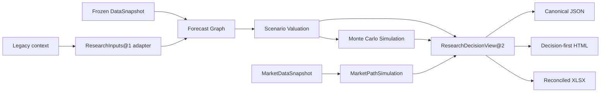

# 目标架构：确定性投研内核 + 可选 Skills

## 设计决定

外部最终体验采用 UZI-Skill 方案的默认简单性：`analyze(target)` 与 `resume(run_id)`。内部金融核心采用 daily_stock_analysis 方案的单一执行语义：`run/execute(request) -> outcome`。TradingAgents 的 `start/advance/inspect` 被吸收为持久化 facade 的生命周期能力，而不是暴露给最常见调用者。

遗留 evidence-to-outcome seam 仍用于兼容：

```python
ResearchEngine.run(ResearchRequest) -> ResearchRun
```

平台正式 seam 已提升为不可变 artifact pipeline：

```python
ApplicationFacade.run_research_workflow(request) -> ResearchWorkflowResult
ResearchDecisionViewBuilder.build(...) -> ResearchDecisionView@2
```

自由 context 只经 `LegacyResearchContextAdapter` 转成 `ResearchInputs@1`。DataSnapshot、Forecast、Valuation、Simulation 和 MarketPathSimulation 由持久化 facade 管理身份、依赖和历史版本。

## 为什么采用这一接口

| 方案 | Depth | Locality | 默认体验 | 判断 |
|---|---|---|---|---|
| `start / advance / inspect` | 高 | 高 | 需要理解 run 生命周期 | 适合 facade 内部 |
| `execute(request)` | 高 | 最高 | 请求较完整 | 适合确定性核心 |
| `analyze(target) / resume` | 高 | 高 | 最简单 | 适合用户外部接口 |

混合后，普通用户只提交标的；复杂恢复由 facade 处理；所有入口最终调用同一个确定性 `run`，不会再出现 CLI、Skill 和 Web 各自实现半套流程。

## 数据与控制流



正式展示的唯一事实源是 `ResearchDecisionView@2`，它只由同一组 typed artifacts 组装。Renderer 不抓数据、不选择方法、不修改估值数字；XLSX 只能重算并对账 artifact 已声明的 bridge。

## Module 与 seam

### 根 Module

`ResearchEngine` 的 interface 只有一个入口。它隐藏：

- 字段规范化；
- 来源/估算分层；
- capability requirements；
- method applicability；
- DCF/comps/historical calculation；
- output permissions；
- research plan；
- report view model。

删除这个 Module 后，复杂性会重新扩散到 CLI、Skills、报告和测试，因此它通过 deletion test。

### 内部 Modules

| Module | 责任 | 依赖类别 |
|---|---|---|
| `evidence.py` | canonical facts、integrity、best-evidence selection | in-process |
| `policies.py` | capability requirements 与状态 | in-process |
| `valuation.py` | method registry 与确定性计算 | in-process |
| `output_policy.py` | output-bound 金融语言规范化与最终边界 | in-process |
| `report.py` | ResearchRun 到 HTML | in-process / local renderer |
| `cli.py` | JSON/filesystem adapter | local-substitutable |

不为纯计算创建 hypothetical ports。未来真实变化的官方披露、行情、新闻、LLM、store 和 renderer 才建立 adapter seam，并至少提供 production + fixture 两种 adapter。

## 状态模型

### Run 状态

- `completed`：请求的主要能力无实质限制；
- `completed_with_limits`：有用研究完成，但部分能力 limited、estimate-supported、blocked 或 inapplicable；
- `blocked`：manifest integrity、标的身份或不可恢复 invariant 失败。

普通缺字段不再产生全局 `blocked`。

### Capability 状态

- `ready`
- `limited`
- `ready_with_estimates`
- `blocked`

### Method 状态

- `ready`
- `limited`
- `caution`
- `blocked`
- `disabled`

方法不适用是正常结果，不是系统异常。

## 核心 invariants

1. 同一 run 的标的、as-of、币种和会计口径不可变。
2. observed fact 必须有 source ID；derived fact 必须记录推导；estimate 永不成为 official。
3. 缺失永不等于零、中性或安全。
4. capability gap 只影响依赖它的能力。
5. method router 先于任何数值计算。
6. DCF 不使用默认 WACC、默认增长、默认 FCF conversion 或固定净债务比例。
7. LLM 只能解释 frozen facts/calculations，不能修改它们；报告指标必须通过 exact evidence refs 直接格式化或确定性计算。
8. 正式 HTML、JSON 和 XLSX 必须来自同一 ResearchDecisionView；遗留 ResearchRun renderer 仅用于历史读取。
9. 默认不生成个性化投资指令。
10. as-of 之后才公开可得的来源和 overlay 不得进入 run；`retrieved_at` 只用于采集审计。
11. 完整性错误在方法路由前 fail-closed；blocked HTML 只能是数据不足备忘录。
12. peer 和历史序列必须解析到同一 canonical evidence ledger 的具体字段与期间；DCF assumptions 的来源必须是可用 tier 且包含证据。

## Skills 的新角色

旧架构中，Skill 同时是控制平面和实现平面。新架构把它拆为：

- `NarrativeSkill`：读取 frozen `ResearchRun`，输出带 evidence refs 的叙事草稿；
- `EvidenceCollectionSkill`：发现来源并写 manifest 候选；
- `RuleModule`：凡是影响数据门、估值、权限和数字的规则，必须落为 typed Python implementation。

`skills/SKILL.md` 是唯一 Agent 入口和专业叙事规约。它直接描述 V3 工作流，不再跳转到版本化 Skill，也不再承载旧式多 Task 状态机。

## 当前完成与下一层

### 已完成

- `ResearchRequest -> ResearchRun` 深 Module；
- portable 意华股份与多氟多 fixtures；
- manifest integrity 与 estimate separation；
- capability matrix；
- observed multiples、peer comps、historical band、explicit-case DCF；
- `AnalysisBundle -> DebateResult -> ResearchSynthesis` 内容链；
- 逐条 `EvidenceClaim`、确定性 metric 计算和跨边质询关系校验；
- 公司、行业、基本面、技术、情绪事件、估值和治理风险分析；
- 专业研究正文与折叠审计附录分离；
- conditional research plan；
- Forecast/Valuation/Simulation 不可变 artifacts；
- 通用 DCF/SOTP/reverse DCF/peer comps 与周期、资源、金融、创新药行业方法；
- 条件 Monte Carlo 估值分布、独立市场价格路径和价值—市场背离诊断；
- ResearchDecisionView@2 作为 JSON/HTML/XLSX 单一展示事实源；
- XLSX bridge 公式对账与硬编码/断链失败门禁；
- CLI 与行为测试。

### 后续扩展

1. CNINFO/SSE/SZSE/HKEX/SEC disclosure adapters 的覆盖扩展；
2. 自动行情、K 线/成交量、新闻情绪采样和事件时间轴；
3. PDF adapter 与更多浏览器视觉回归；
4. 独立的 portfolio/backtest Module。它不应塞进 equity research 根 Module。

这些扩展不改变当前根金融接口，只在 facade、adapter 和 method registry 内增加实现。
