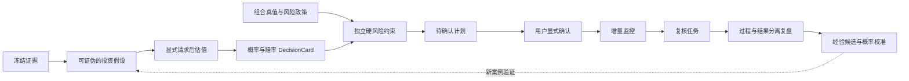
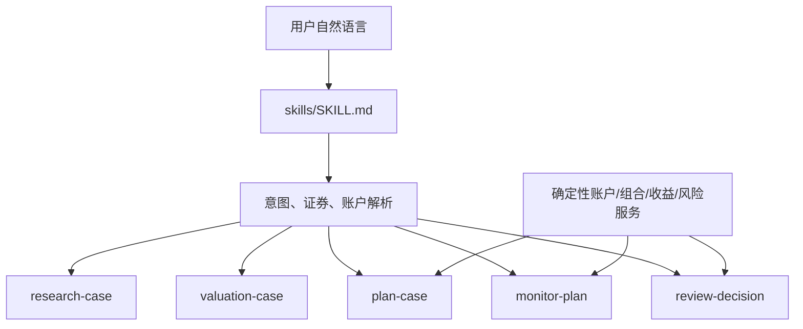
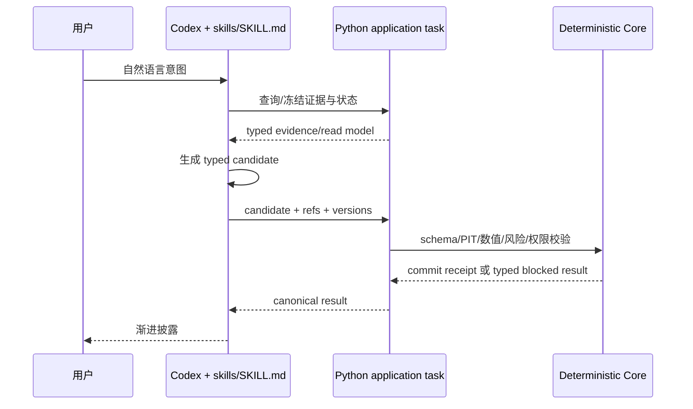
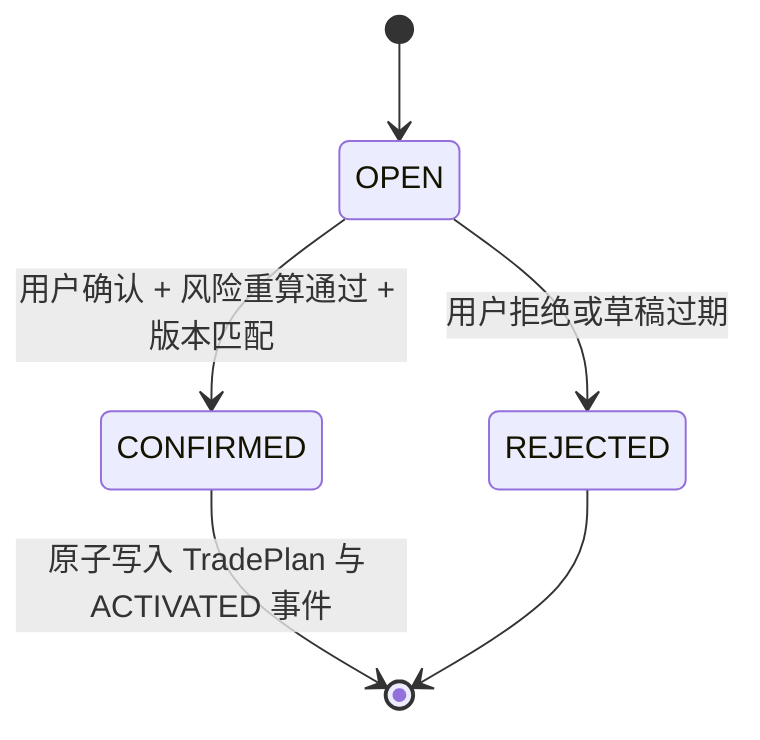
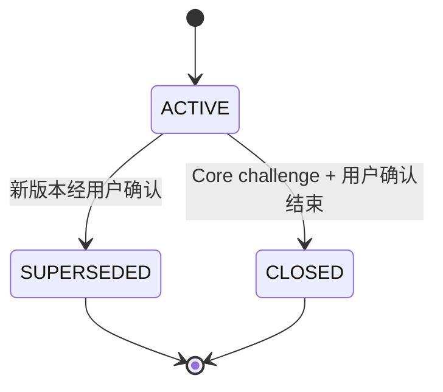
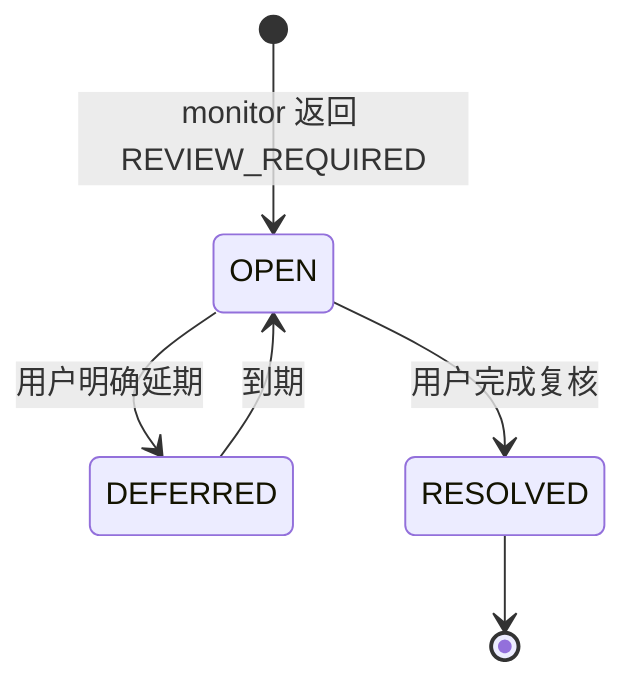
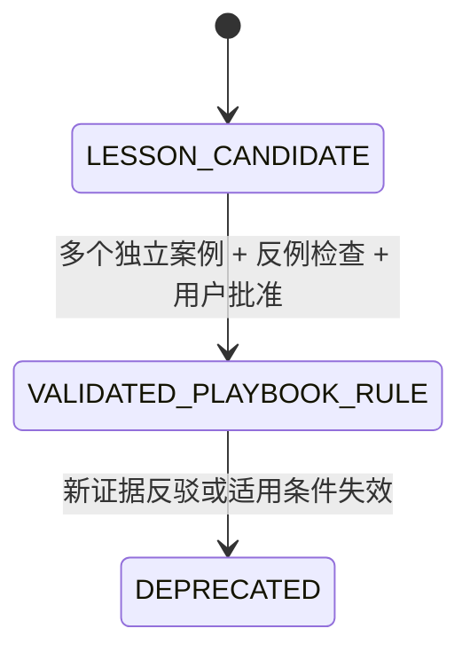
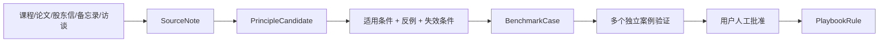

# EquityTrack V2 Phase 1：决策闭环与 Skills Fast Path

> 文档状态：重构基线候选，尚未代表代码已经实现
> 校准日期：2026-08-24
> EquityTrack 校准快照：`main @ 7d043873fad616fa00cc325d558c3500b36ba444`
> 原始文档：[EquityTrack_V2_Phase1_Skills_Fast_Path_CN.docx](./EquityTrack_V2_Phase1_Skills_Fast_Path_CN.docx)
> 后续阶段：[EquityTrack_V2_Phase2_DSH_Migration_CN.md](./EquityTrack_V2_Phase2_DSH_Migration_CN.md)

## 0. 这次重构作出的决定

EquityTrack 不再以“个人版 Bloomberg、量化平台、交易系统和投研知识库的集合”为目标。V2 的产品定义是：

> **面向单一投资者、围绕真实持仓运行的个人投资决策操作系统。**

它只优化软件能够负责的事情：证据质量、决策过程、风险预算执行、计划纪律、概率校准和经验积累。它不承诺稳定收益，不把某次盈利当作决策正确的证明，也不以“确定性最高”作为优化目标。



系统优化的是：

> **在合理的概率误差、估值误差和市场波动下，仍然保持期望值可解释、损失有界、组合可承受、假设可证伪、行动由用户确认且可以复盘的计划。**

风险约束不是概率判断的附属步骤。概率模型即使失效，组合仍必须生存。因此 `DecisionCard` 与风险政策是两条独立的门，任何一条失败都不能被另一条抵消。

### 0.1 治理优先级

当前仓库仍规定 [长期平台 Prompt](../prompts/trading_platform_codex_prompt_optimized.md) 是权威范围与验收基线。本文件记录的是用户新需求与 live HEAD 校准后的 V2 设计候选。开始实现前，必须在同一项治理变更中同步修订：

- `docs/prompts/trading_platform_codex_prompt_optimized.md`；
- 根 `AGENTS.md`；
- `README.md`、`CONTEXT.md`；
- `skills/SKILL.md` 与相应 `skills/tasks/*.md`；
- 记录“产品收缩、运行时 LLM 边界、七个跨任务记录、DSH 后置”的 ADR。

在这项变更完成前，冲突处仍以现有权威 Prompt 和 `AGENTS.md` 为准；本文件不能暗中覆盖它们。

### 0.2 本文所说的“内部 Skill”

仓库继续只有一个公开 Skill：`skills/SKILL.md`。本文的五个“内部 Skill”是五个**可独立评测、可独立重放的任务级应用能力**，对应 `skills/tasks/` 中的说明和 `trading_platform.application` 中的深接口；它们不是五个并列的控制面入口，也不允许再建五份相互漂移的 `SKILL.md`。

## 1. 证据基线与事实等级

本方案区分三种陈述，避免把愿景写成当前事实。

| 等级 | 含义 | 本文写法 |
|---|---|---|
| 已核验 | 在指定 Git 快照、源码、测试或第一手资料中直接确认 | “当前存在”“已核验” |
| 设计决定 | 本文选择的目标合同或迁移方式 | “必须”“目标为” |
| 待验证 | 需要 spike、真实数据或 Bench 才能判断 | “待验证”“不得预设” |

当前仓库核验范围包括统一 Skill、应用任务、领域合同、持久化、研究与产物链、测试树和历史设计文档。旧的产品状态审计只能作为其审计日期的历史材料，不能替代本次 `7d04387` live HEAD 证据。

### 1.1 2026-08-23 验证快照

使用当前仓库 `src` 显式设为 `PYTHONPATH` 后：

- 全量 `python -X utf8 -m pytest -q --tb=short` 在 collection 阶段出现 **24 errors，1 deselected**；共同阻断是多个 platform fixture 仍导入已从 live provider 模块移除的 `TushareCompatibleProvider`。这直接印证 provider/runtime/tests 权威漂移，不能把当前 HEAD 标记为全绿基线；
- `test_architecture_boundaries.py + test_skill_contract.py + test_skill_entrypoint.py` 为 **10 passed**；
- 顶层 `tests/test_*.py` 为 **200 passed，1 failed**；失败是 source-manifest fixture 仍预期只有 per-share 限制即可通过，而当前 validator 还要求 `sbc_options_dilution`。

这些是本次文档工作开始时的现状证据，不是 Phase 1 的目标结果。P1.0 必须先统一 provider/fixture/validator 契约并给出完整绿色或明确限制，才允许创建 V1 tag。

## 2. 当前状态：不是“缺功能”，而是主链过宽

### 2.1 已经值得保留的资产

| 资产 | 当前证据位置 | Phase 1 决定 |
|---|---|---|
| 唯一自然语言入口与六类任务路由 | `skills/SKILL.md`、`skills/tasks/` | 保留唯一入口，改写为五个决策任务加确定性账户查询 |
| 账户快照、估计状态与确认 | `domain.account_snapshots`、`application.account_snapshots` | 账户真值继续独立；`PortfolioSnapshot` 只是派生视图 |
| 风险政策与确认 | `domain.risk_policies`、`application.risk_policies` | 保留为硬约束权威，不交给 LLM |
| 命令、批准、幂等与单一应用路径 | `application.command_envelope`、`application.commands`、`domain.approvals` | 保留；新任务必须走同一任务接口 |
| Provider Job、来源政策、PIT 和官方披露 seam | `domain.data`、`application.provider_job`、`data/` | 收敛到一个证据快照合同，不建设第二数据平台 |
| 决策任务、执行声明、纪律复盘 | `domain.decision_tasks`、`decision_journal`、`discipline_reviews` | 迁移为监控复核和 `DecisionReview`，保留不可变历史 |
| 工作流账本、迁移、备份恢复 | `application.workflow_ledger`、`persistence/migration.py`、`operations.py` | 保留恢复和一次性迁移能力 |
| 研究计算、方法路由和数据不足降级 | `equity_research/`、`trading_platform/research/` | 经适用性验证后藏到深模块后；不再要求所有发布产物成功 |

### 2.2 必须收缩的复杂度

当前一次研究会跨越数据冻结、来源治理、计划编译、财务预测、情景、估值、模拟、趋势、JSON/HTML/PDF/图表/工作簿和一致性复算。计划侧又存在 `TradePlanGraph`、规则 AST、sleeve、策略目录和多层审批。它们分别有价值，但绑定成一个原子任务后，任一非核心发布环节都可能阻断决策闭环。

live HEAD 中的复杂度集中在：

- `src/trading_platform/application/plan_compiler.py` 与 `domain/plans.py`：通用计划表达和编译；
- `src/trading_platform/domain/artifact_lineage.py` 与 `application/research_publication.py`：产物和血缘治理；
- `src/equity_research/valuation.py` 与 `simulation.py`：估值与模拟的宽实现；
- `tests/platform/test_product_e2e.py`：当前端到端仍把多种发布产物作为成功证据。

这些事实说明需要改变业务完成条件，而不是再增加一个协调层。

静态审计还确认：五个目标任务名、七个目标类型名和 `bench/` 目前都没有 live runtime 实现；它们必须在本文中始终标为目标合同。当前仓库已有 25 次 SQL migration（0001—0025），而部分 README 仍停在 0024；Web 也已有正式写命令，并非只读查看器。这些文档漂移必须在 P1.0 同步修正。

### 2.3 原 DOCX 的主要漂移

| 原方案 | 漂移 | 本版修正 |
|---|---|---|
| 新建 `src/equitytrack_v2/`，冻结 V1 并平行建设 | 形成第二应用、第二持久化和长期兼容面 | 在现有 `src/trading_platform/` 内按任务切片原位替换 |
| V1/V2 双轨切换和回退开关 | 形成 runtime 版本分派 | 每个切片一次性迁移调用方和数据，再删除旧路径 |
| 七个对象等于全部领域类型 | 会形成巨型对象 | 七个仅是跨任务决策记录；权威支持记录继续小而明确 |
| `REVIEW_REQUIRED` 是计划生命周期状态 | 混淆计划真值与待办任务 | 活动计划保持 `ACTIVE`，另建 `DecisionTask` |
| 12 个 Bench 案例 | 少于原始需求明确要求的 20 个 | 第一批固定 20 个案例族；`A10` 展开后共 22 个可执行变体 |
| Fuyao/Kimi 是默认 provider | 未经本仓库生产资格验证；Kimi gateway 也不是官方披露 | 保留 `SourcePolicy` 与 provider qualification，逐个准入 |
| 直接删除 PDF/工作簿链 | 可能丢掉已验证的计算 | 先把有效计算藏进深接口，再取消发布前置并清理过时代码 |

## 3. 产品边界

### 3.1 Phase 1 必须完成

- 一个默认账户 `kong`、现有默认数据根 `E:\trading-data\kong`、一个公开自然语言入口；
- 一只证券、同一账户/证券最多一个活动计划，从证据到复盘跑通最薄闭环；
- 明确分离研究、估值、计划、监控和复盘；
- JSON 规范记录与 Markdown 只读投影；
- SQLite 业务真值、不可变版本、幂等和备份恢复；
- 20 个冻结案例族（22 个可执行变体）、G0—G5 评测门和硬验证器；
- 单一路径的一次性迁移，不新增平行 V2 runtime。

### 3.2 Phase 1 明确不做

- 自动订单或券商写入；
- 通用量化策略平台、策略市场、自动策略晋升；
- 组合优化器或“最优仓位”生成器；
- 默认 Monte Carlo、多 Agent 辩论、全量 K 线标注；
- 每次任务强制生成 PDF、工作簿、HTML 或复杂图表；
- 多账户、多数据库、多 Web 运维路径；
- DSH 产品封装或 DSH UI；
- 对稳定收益、单点价格结论或投资结果作保证。

研究完成的必要条件是 `InvestmentCase` 与证据门通过；估值完成的必要条件是用户明确请求、方法路由与 `ValuationCase` 通过；计划完成的必要条件是风险门、确认门和状态提交通过。渲染失败只能导致对应投影不可用，不得抹掉已经原子提交的业务结果。

## 4. 一个公开入口，五个内部任务能力



| 内部任务 | 必要输入 | 规范输出 | 明确不做 |
|---|---|---|---|
| `research-case` | 研究问题、期限、冻结证据 | `InvestmentCase@1` | 自动估值、生成计划、发布多种文件 |
| `valuation-case` | 用户明确请求、投资案例、冻结估值输入 | `ValuationCase@1` | 单点结论或绕过数据门 |
| `plan-case` | `monitor_only`：投资案例；`risk_bearing`：再要求已通过的估值案例、组合与政策 | `monitor_only` 止于经验证卡片；`risk_bearing` 原子产生风险结果与卡片，随后才可生成计划草稿 | 激活计划、覆盖风险上限、创建订单 |
| `monitor-plan` | 活动计划、增量证据、价格与组合变化 | `NO_CHANGE` / `REVIEW_REQUIRED` / `INSUFFICIENT_EVIDENCE` | 每日重跑全量研究、自动修改计划 |
| `review-decision` | 当时信息集、计划与执行记录、结果窗口 | `DecisionReview@1` | 用结果替代过程评价、自动晋升纪律规则 |

账户查询、持仓聚合、成本、收益、风险预算、状态转换、幂等和账本写入全部是确定性应用服务，不是 LLM Skill。

Phase 1 选择唯一推理权威，不留给实施者自由决定：



定性证据理解、反方、候选概率与叙述由 Codex 执行唯一 `skills/SKILL.md` 生成；Python application operation 只接受版本化 typed candidate，负责确定性验证、复算、事务和持久化，不自行调用产品 runtime LLM。`research-case` 等名称表示端到端任务，不意味着 Core 内存在模型循环。若以后改变这一权威，必须先修改 Prompt、ADR、威胁模型和 Bench，不能通过 Phase 2 adapter 暗中引入。

### 4.1 `TaskCatalog@1`

五个任务和确定性支持操作由 Core 发布一个版本化目录，供 Skill、测试和后续 DSH adapter 使用：

```yaml
catalog_version: TaskCatalog@1
catalog_digest: sha256
operations:
  - operation_id: string
    application_owner: module.operation
    request_schema: versioned-schema-ref
    result_schema: versioned-schema-ref
    deterministic_projection_profile: versioned-ref
    mutation: boolean
    idempotency_contract: none | BusinessInvocationReceipt@1
    required_capability: string | null
    workbench_exposure: DETERMINISTIC_UI_SAFE | CONTROL_PLANE_REQUIRED | EXPERIMENT_ONLY
```

五个端到端任务都在目录中，但只有其确定性 application operation 可标记 `DETERMINISTIC_UI_SAFE`。目录不提供任意 task 字符串、私有函数或 repository 路径。P1.1 只冻结目录规范；每个可执行 operation 必须在所属切片与迁移、调用者切换和旧接口删除一起落地。

目标 operation 清单如下；模块路径是唯一 owner，不能再由 CLI、Web 或 adapter 重实现：

| `operation_id` | application owner | request -> result | mutation | exposure |
|---|---|---|---:|---|
| `research_case.commit_candidate@1` | `application.research_case.commit_candidate` | `ResearchCaseCandidate@1 -> InvestmentCaseResult@1` | 是 | `CONTROL_PLANE_REQUIRED` |
| `valuation_case.commit_candidate@1` | `application.valuation_case.commit_candidate` | `ValuationCaseCandidate@1 -> ValuationCaseResult@1` | 是 | `CONTROL_PLANE_REQUIRED` |
| `plan_case.commit_candidate@1` | `application.plan_case.commit_candidate` | `PlanCaseCandidate@1 -> DecisionCardResult@1` | 是，原子写卡片与风险结果 | `CONTROL_PLANE_REQUIRED` |
| `plan.prepare_draft@1` | `application.plans.prepare_draft` | `PlanDraftRequest@1 -> PlanDraftResult@1` | 是 | `DETERMINISTIC_UI_SAFE` |
| `monitor_plan.evaluate@1` | `application.monitor_plan.evaluate` | `MonitorPlanRequest@1 -> MonitorPlanResult@1` | 是，可能建任务 | `DETERMINISTIC_UI_SAFE` |
| `review_decision.commit_candidate@1` | `application.review_decision.commit_candidate` | `DecisionReviewCandidate@1 -> DecisionReviewResult@1` | 是 | `CONTROL_PLANE_REQUIRED` |
| `portfolio.get_snapshot@1` | `application.portfolio.get_snapshot` | `PortfolioSnapshotQuery@1 -> PortfolioSnapshotResult@1` | 否 | `DETERMINISTIC_UI_SAFE` |
| `decision_record.get@1` | `application.decision_records.get` | `DecisionRecordQuery@1 -> DecisionRecordResult@1` | 否 | `DETERMINISTIC_UI_SAFE` |
| `plan.issue_confirmation_challenge@1` | `application.plan_confirmation.issue` | `IssuePlanChallenge@1 -> PlanChallengeResult@1` | 是 | `DETERMINISTIC_UI_SAFE` |
| `plan.confirm@1` | `application.plan_confirmation.confirm` | `ConfirmPlan@1 -> PlanConfirmationResult@1` | 是 | `DETERMINISTIC_UI_SAFE` |
| `mutation.lookup_receipt@1` | `application.receipts.lookup` | `BusinessInvocationQuery@1 -> InvocationReceiptResult@1` | 否 | `DETERMINISTIC_UI_SAFE` |

这里的模块是目标 owner，只有对应切片原位替换完成后才进入 live catalog。端到端 `plan-case` 先由 canonical Skill 生成 `PlanCaseCandidate@1`：它包含结构化场景、概率/赔率依据与意图，但**不允许填写** Core-owned 的 `risk_limit_result_ref`、`portfolio_fit`、`expected_value_range` 或 `robustness`。`monitor_only` 候选经验证后止于卡片，风险引用保持 `null/unknown`，且不能调用 `plan.prepare_draft@1`。`evaluate_risk_bearing_plan` 候选还必须携带冻结的 portfolio/policy 引用；`plan_case.commit_candidate@1` 在一个 transaction 中校验/复算候选、调用唯一 risk deep module、持久化 `RiskLimitResult@1`，再提交引用该结果的 `DecisionCard@1`。只有这一风险承担变体的规范卡片才能生成草稿；`plan.prepare_draft@1` 不创建或替换风险结果，且只要当前 portfolio/policy/price-FX/version 与卡片冻结输入不一致，就返回 `STALE_DECISION_CARD` 并要求重新运行 `plan-case`。DSH 初版只能暴露后者，不能代替前者完成金融推理。`catalog_digest` 由实际已启用清单与 request/result schema digest 共同计算；不得把尚未落地的目标 operation 宣称为可用。

每个 mutation 的 `BusinessInvocationReceipt@1` 必须把 `business_invocation_id` 绑定到 `operation_id + canonical_request_digest + actor_or_capability_scope_digest`。同一个 business id 只有在三者完全相同时才可返回原 receipt；换 operation、换规范化 payload 或换 actor/capability scope 都稳定返回 `IDEMPOTENCY_CONFLICT`，既不能泄露旧结果，也不能执行新写入。这个约束由 application/Core 拥有，CLI、Skill、Web 和 DSH adapter 不得各自定义近似规则。

## 5. 权威边界

| 决策或数据 | LLM/研究任务 | 确定性 Core | 用户 |
|---|---|---|---|
| 证据摘要、反方、证伪条件候选 | 可提出，必须引用冻结证据 | 校验来源、时点、权限、引用和完整性 | 可补证据或纠正范围 |
| 场景与概率依据 | 可提出并标明依据/不确定性 | 校验范围、归一化、重算区间；不替模型补数 | 决定是否接受为计划输入 |
| 估值方法 | 可解释适用性 | 路由硬门、公式、单位、币种、复算 | 必须明确请求估值 |
| 风险预算与上限 | 不可覆盖 | 唯一计算和执行权威，缺数即关闭 | 设定并确认风险政策 |
| 计划内容 | 只生成草稿/差异 | 校验状态、版本、风险、幂等 | 显式确认后才能生效 |
| 账户与执行事实 | 不得修改 | 由已确认快照/执行记录派生 | 声明并确认事实 |
| 经验规则 | 只能提出候选 | 保存证据、反例、状态和版本 | 多案例后人工晋升/废弃 |

任何模型输出都视为不可信候选数据，进入业务真值前必须经过 schema、证据、数值、风险和权限门。

## 6. 七个跨任务决策记录

“七个对象”是稳定的跨任务语言和版本化接口，不等于删除所有内部值对象。它们统一嵌入：

```yaml
RecordMeta@1:
  schema_version: string
  created_at: timestamp
  as_of: timestamp
  content_digest: sha256
  source_contract_versions: [string]
  producer:
    one_of:
      - kind: codex_skill
        skill_version: string
        prompt_version: string
        model_id: string
        tool_versions: object
      - kind: deterministic_core
        core_build: string
        formula_versions: [string]
      - kind: migration
        migration_id: string
        source_schema_versions: [string]
```

`content_digest` 校验的是**这一条已提交记录本身**：按版本化 canonical JSON 规则覆盖除 `meta.content_digest` 外的完整记录，因此 `created_at` 或 producer 不同的两次独立运行可以有不同摘要。G4 不拿它冒充“语义确定性”。每个 operation/result schema 必须同时发布 `DeterministicProjectionProfile@1`，明确：构成 Core 输入的 JSON Pointer、构成确定性输出的 JSON Pointer、金额/小数/集合排序规范，以及每种跨记录引用使用的 selected-input 或 upstream deterministic-projection digest。不得默认把被引用记录的完整 `content_digest` 放入 G4，因为其中可能含创建时间、producer 和自由叙述。

若某段 Codex 叙述、概率或假设实际驱动公式，它必须先结构化进入 typed candidate，并计入该 operation 的 `canonical_task_input_digest`。只有 `canonical_task_input_digest + seeded_state_digest + core_build/formula_version` 相同的 Core replay，才要求确定性输出摘要完全一致；不同 candidate 是不同输入，不能被伪报成 Core 不稳定。幂等重试仍必须返回同一已提交记录及同一 `content_digest`。相同 evidence/prompt 的端到端 Skill repeat 只要求硬不变量、合法状态、证据门与 G5 rubric，并显式记录 candidate digest 差异，不要求公式输出或叙述逐字相等。

具体记录另有稳定 ID，并明确表达 `unknown/missing/blocked`；禁止把未知写成零或空字符串。

### 6.1 `EvidenceSnapshot@1`

```yaml
meta: RecordMeta@1
snapshot_id: string
security_id: string
observations:
  - observation_id: string
    metric_or_claim: string
    value: typed-value | unknown
    period: string | null
    observed_at: timestamp | null
    published_at: timestamp | null
    available_at: timestamp
    retrieved_at: timestamp
    source_ref: string
    authority: official | qualified_structured | secondary | user_declared
    quality: verified | conflicted | incomplete | unavailable
source_refs:
  - source_id: string
    provider_id: string
    source_identity: string
    dataset_or_document_id: string
    uri: string | redacted_locator
    authority: official | qualified_structured | secondary | user_declared
    rights: SourceRights
    retrieved_at: timestamp
    content_digest: sha256
source_policy_version: string
data_quality: complete | limited | insufficient | conflicted
```

规则：`available_at <= meta.as_of` 才能进入快照；`observed_at/period`、`published_at`、`available_at`、`retrieved_at` 分开；冲突来源并存且不得静默覆盖；大正文按 digest 引用；快照摘要唯一使用 `meta.content_digest`。当前 `ProviderJob@2 + SourcePolicy -> Raw/Normalized -> PIT DataSnapshot` 是演进基础，不另建绕过路径。

### 6.2 `InvestmentCase@1`

```yaml
meta: RecordMeta@1
investment_case_id: string
evidence_snapshot_id: string
research_question: string
horizon: string
business_model: [ClaimRef]
key_drivers: [Driver]
base_rates: [EvidenceLinkedEstimate]
market_implied_expectations: [EvidenceLinkedNarrativeHypothesis] | unknown
variant_perception: [ClaimRef]
thesis: [ClaimRef]
antithesis: [ClaimRef]
falsifiers: [ObservableCondition]
catalysts: [ObservableCondition]
uncertainties: [Unknown]
evidence_refs: [string]
status: complete | completed_with_limits | data_insufficient
```

`antithesis`、`falsifiers` 和 `market_implied_expectations` 是硬字段。缺失时不得把故事摘要标记为完整投资案例。反方必须真正可能改变判断；证伪条件必须可观察，并带期限或复核条件。

这里的 `market_implied_expectations` 只保存有证据支持的市场预期叙述或 `unknown`，不做数值反向求解。任何由当前价格求解增长、利润率、资本成本或其他隐含变量的计算，都属于用户显式触发的 `ValuationCase`。

### 6.3 `ValuationCase@1`

```yaml
meta: RecordMeta@1
valuation_case_id: string
investment_case_id: string
valuation_input_snapshot_id: string
method_results: [MethodResult]
disabled_methods: [DisabledMethodReason]
assumptions: [EvidenceLinkedAssumption]
valuation_range: ConditionalRange | unavailable
implied_expectations: [SolvedExpectation]
sensitivity: [SensitivityResult]
method_differences: [Diagnostic]
data_quality: complete | limited | insufficient
```

它表达条件与区间，不表达 house rating。每个方法统一实现：

```text
applicability -> required_inputs -> calculate -> diagnostics -> sensitivity -> version
```

`MethodResult` 不是自由 JSON，至少包含：

```yaml
method_id: string
method_version: string
status: READY | LIMITED | DISABLED | NOT_RUN
valuation_as_of: timestamp
currency: string
unit: string
cash_flow_definition: string | not_applicable
discount_rate_definition: string | not_applicable
share_count:
  value: decimal | unknown
  as_of: timestamp | null
enterprise_to_equity_bridge: [BridgeItem] | not_applicable
fixed_variables: [EvidenceLinkedInput]
solved_variables: [SolvedVariable]
formula_or_implementation_version: string
value_range: [decimal, decimal] | unavailable
diagnostics: [Diagnostic]
sensitivity: [SensitivityResult]
```

G2 按 `valuation_as_of`、币种、单位、股本时点、现金流/折现率匹配、equity bridge、固定与求解变量及实现版本重算。

### 6.4 `DecisionCard@1`

```yaml
meta: RecordMeta@1
decision_card_id: string
investment_case_id: string
valuation_case_id: string | null
decision_intent: monitor_only | evaluate_risk_bearing_plan
scenario_set:
  common_horizon: [timestamp, timestamp]
  partition_policy: MUTUALLY_EXCLUSIVE_EXHAUSTIVE
  partition_validation: CORE_VALIDATED | SOFT_ONLY
  resolution_variable:
    variable_id: string
    value_type: enum | decimal
    unit: string | not_applicable
    universe: EnumDomain | NumericDomain
  residual_scenario_id: string | null
  payoff_basis:
    reference_price: Money
    reference_as_of: timestamp
    currency: string
    unit: return_fraction | money_per_share
    costs_policy_version: string
scenarios:
  - scenario_id: string
    name: string
    event_definition: string
    outcome_selector:
      one_of:
        - enum_values: [string]
        - numeric_interval:
            lower: decimal | negative_infinity
            lower_inclusive: boolean
            upper: decimal | positive_infinity
            upper_inclusive: boolean
    probability: decimal | unknown
    probability_basis: EvidenceLinkedEstimate
    evidence_refs: [string]
    calibration_class: string | insufficient_history
    forecast_made_at: timestamp
    resolution_at: timestamp
    resolution_rule: string
    payoff_range_after_costs: [decimal, decimal] | unknown
expected_value_range: [decimal, decimal] | unknown
downside_range: [decimal, decimal] | unknown
robustness: robust_positive | ambiguous | adverse | not_computable
portfolio_snapshot_id: string | null
risk_policy_version: string | null
risk_limit_result_ref: RiskLimitResultRef | null
portfolio_fit: pass | breach | unknown
decision_rationale: [ClaimRef]
```

`event_definition` 只作人类解释，不能证明互斥或完备。Core 的硬门只接受一个有限枚举域，或一个带明确开闭边界的单变量数值域；它用集合/区间运算验证所有 `outcome_selector` 两两不重叠并覆盖声明 universe。未覆盖部分必须成为可计算补集的 `OTHER` residual。多变量自然语言情景或无法结构化的分区只能标为 `SOFT_ONLY`，并强制 `not_computable`，不能标记 `robust_positive`。

所有概率已知且合计为 1 时，Core 才可按 `sum(p_i * payoff_i)` 分别复算成本后区间上下界；任一概率、区间、参考价格、币种、单位或成本政策未知，就返回 `not_computable`。`downside_range` 是所有 payoff 区间负值部分的包络：若有负值，lower 为所有 lower 的最小值，upper 为所有 `min(upper, 0)` 的最大值；若无负值则为 `[0,0]`。`robust_positive` 精确定义为期望值下界 `> 0`；`adverse` 为期望值上界 `< 0`；其余可计算情况为 `ambiguous`；任何前置门失败为 `not_computable`。这些状态仍不是行动建议，也不能越过风险门。

`portfolio_fit` 不是 Codex 判断：它只能由被引用的 `RiskLimitResult@1` 派生。`evaluate_risk_bearing_plan` 必须冻结 `portfolio_snapshot_id`、`risk_policy_version` 和 `risk_limit_result_ref`；三者缺一时为 `unknown/blocked`。没有估值时，只能形成 `monitor_only` 卡片或 `not_computable`，不得伪造赔率。

`monitor_only` 变体允许 `valuation_case_id = null`，但止于卡片和只读 follow-up，不能生成 `TradePlanDraft` 或活动计划；用户若要形成风险承担计划，必须显式运行估值并创建新的 `evaluate_risk_bearing_plan` 卡片。后者必须引用已通过适用性和数据门的 `ValuationCase@1`。两种 request/result 是 `plan-case` 的封闭变体，不能用 nullable 字段暗中绕过估值门。

### 6.5 `TradePlan@1`

```yaml
meta: RecordMeta@1
trade_plan_id: string
plan_family_id: string
plan_version: integer
supersedes_plan_id: string | null
security_id: string
decision_card_id: string
risk_policy_version: string
portfolio_snapshot_id: string
risk_limit_result_ref: RiskLimitResultRef
risk_budget: Money
max_position: PositionLimit
current_position_ref: PortfolioPositionRef
max_size_delta: PositionDeltaLimit
entry_conditions: [Trigger]
review_triggers: [Trigger]
invalidation_conditions: [Trigger]
required_evidence: [EvidenceRequirement]
allowed_state_transitions:
  - ACTIVE_TO_SUPERSEDED
  - ACTIVE_TO_CLOSED
effective_at: timestamp
expires_at: timestamp
confirmed_by: UserApprovalReceiptRef
```

`TradePlan@1` 是不可变的已确认计划内容，不持久化随时间变化的 `status` 或 `operability`。草稿是支持记录 `TradePlanDraft`，不是活动计划。生命周期由追加式支持记录拥有：

```yaml
TradePlanLifecycleEvent@1:
  meta: RecordMeta@1
  lifecycle_event_id: string
  plan_family_id: string
  trade_plan_id: string
  event_type: ACTIVATED | SUPERSEDED | CLOSED
  effective_at: timestamp
  superseding_plan_id: string | null
  previous_event_id: string | null
  approval_receipt_ref: UserApprovalReceiptRef
  business_invocation_id: uuid
```

确认首版计划时原子写入不可变计划与 `ACTIVATED` 事件；确认新版本时原子写入新计划、旧计划的 `SUPERSEDED` 事件和新计划的 `ACTIVATED` 事件；结束计划只追加 `CLOSED` 事件。Core 以事件链、当前时间、开放复核任务和政策状态派生非持久化 `TradePlanStatusView.status/operability`。同一 `plan_family_id` 的投影最多一个 `ACTIVE` 版本；supersession 必须引用前一版本和迁移/确认 receipt。任何触发器最多创建复核任务，不能产生交易、草稿、计划修订或静默改变数量；复核完成后若用户要修改，必须重新进入 `plan-case`。

到达 `expires_at` 不追加关闭事件：Core 在每次读取/操作时派生 `TradePlanStatusView.operability=EXPIRED_REVIEW_REQUIRED`；该值不进入 `TradePlan` 或其 `content_digest`。它禁止新的风险承担变更，并幂等创建 `time_review` 任务。`SUPERSEDED` 与 `CLOSED` 生命周期事件都必须经 Core challenge 和用户确认；政策 breach 也只能阻断并创建复核，不能自动关闭。

### 6.6 `PortfolioSnapshot@1`

```yaml
meta: RecordMeta@1
portfolio_snapshot_id: string
account_snapshot_version: string
cash: Money | unknown
positions: [Position]
cost_basis: [CostBasis | unknown]
market_value: Money | unknown
exposures: [Exposure | unknown]
concentration: [Concentration]
realized_pnl: Money | unknown
unrealized_pnl: Money | unknown
benchmark_state: BenchmarkState | not_configured
market_prices_as_of: timestamp | unknown
fx_as_of: timestamp | not_applicable | unknown
price_snapshot_ref: PriceSnapshotRef | unknown
fx_snapshot_ref: FxSnapshotRef | not_applicable | unknown
execution_cursor: string
execution_set_digest: sha256
corporate_action_set_digest: sha256
reconciliation: ReconciliationResult
limitations: [Limitation]
fee_tax_refs: [EvidenceRef]
corporate_action_refs: [EvidenceRef]
```

它是从已确认账户快照、冻结价格/FX、执行记录和公司行动确定性派生的只读视图，不是账户真值的替代品。`price_snapshot_ref`、`fx_snapshot_ref`、执行游标及执行/公司行动集合摘要必须足以重建同一 deterministic projection；估计状态不得冒充已确认状态。

### 6.7 `DecisionReview@1`

```yaml
meta: RecordMeta@1
decision_review_id: string
trade_plan_id: string
execution_refs: [ExecutionRecordRef]
portfolio_before_ref: PortfolioSnapshotRef
portfolio_after_ref: PortfolioSnapshotRef
outcome_window: [timestamp, timestamp]
benchmark_ref: BenchmarkStateRef | not_configured
information_set_as_of: timestamp
process_evaluation: ProcessEvaluation
outcome_evaluation: OutcomeEvaluation
attribution: Attribution | insufficient_data
plan_adherence: AdherenceResult
error_classification:
  - THESIS_ERROR
  - VALUATION_ERROR
  - SIZING_ERROR
  - TIMING_ERROR
  - EVIDENCE_ERROR
  - DISCIPLINE_VIOLATION
  - RANDOM_OUTCOME
counterfactual: string | not_defensible
lesson_candidates: [LessonCandidateRef]
```

过程评价只使用当时可获得的信息集。结果评价单独计算，不能倒灌并重写过程分数。

### 6.8 必要的权威支持记录

以下对象继续存在，因为它们拥有不同不变量；把它们合并进七个对象会制造巨型 schema：

- `AccountSnapshotVersion`、`ExecutionRecord`：账户与执行事实；
- `RiskPolicyVersion`：用户确认的组合硬约束；
- `TradePlanDraft`、`UserApprovalReceipt`：草稿与确认；
- `TradePlanLifecycleEvent`、`TradePlanStatusView`：追加式计划生命周期事实与非持久化当前投影；
- `RiskLimitResult`：针对冻结组合、政策、价格与压力输入的可重放风险上限结果；
- `DecisionTask`：复核待办；
- `WorkflowReceipt`、幂等回执和迁移回执：提交、恢复和审计；
- `SourceRef`、provider qualification receipt：来源身份、权限和准入。

### 6.9 逐对象单向 cutover

| 当前权威与字段来源 | 目标 | 不进入新 runtime 的内容 | 必要迁移证据 | 旧路径删除门 |
|---|---|---|---|---|
| `DataSnapshot`、SnapshotEvidence、source manifest 的成员/PIT/来源/质量 | `EvidenceSnapshot@1` | 报告格式专属 lineage 节点只保留为历史审计 blob | member/source old-new digest、时间字段和 rights 核对 receipt | 所有研究调用者只读新合同；旧公开 codec/export 为 0 |
| `InvestmentThesisVersion` 的 claims/drivers/risks/invalidation + `ResearchDecisionView` 的 uncertainty/expectation narrative | `InvestmentCase@1` | valuation/simulation/market-path artifact id 不复制为研究真值；原 sealed view 只读归档 | 逐字段 source map、缺失 `antithesis/falsifier` 的 `completed_with_limits` 清单 | Skill、plan、tests 全部引用新 ID；旧混合 view 写路径删除 |
| 当前 valuation route/result/input/bridge | `ValuationCase@1` | 未通过方法/输入复算的历史结果不“升级”为有效估值 | method/input/formula/as-of/digest receipt；无法复算则 `unavailable` | research 默认路径不再调用估值；旧 valuation publication owner 删除 |
| 无稳定等价物 | `DecisionCard@1` | 不从历史叙述猜概率或 payoff | 只允许从新 Investment/Valuation/Portfolio/Risk refs 创建 | plan task 已只接受 DecisionCard；无旁路 |
| `TradePlanGraph`、Rule AST、sleeve、seal、receipt | 有限 `TradePlan@1` + `TradePlanLifecycleEvent@1` + `Trigger` | 旧 graph 作为不可变审计 blob；不可映射规则不解释执行 | 全部活动计划 inventory；逐规则 mapping；old/new digest receipt；用户重新确认 | 不可映射项已人工关闭/重建；旧 compiler/evaluator/schema/test 删除 |
| `AccountSnapshotVersion`、EstimatedAccountState、execution/price read model | `PortfolioSnapshot@1` | 账户事实不复制到第二真值 | 同一输入可重建相同 snapshot digest；unknown/reconciliation 核对 | 所有组合消费者用一个派生 owner；旧重复 read model 删除 |
| `DisciplineReviewVersion` + 可复用 ForecastReview 计算 | `DecisionReview@1` | 缺执行/基准/结果窗口的历史记录保持 `insufficient_data` | process/outcome 分离 map、execution/portfolio refs、分类和旧/new digest | 新 review task/读模型就绪；旧 review writer 与私有入口删除 |

迁移器是一次性工具，不参与运行时读取。任何字段没有明确“来源、变换、丢弃/只读归档、校验 digest、删除点”时，该对象 cutover 必须 `BLOCKED`，不能添加 V1/V2 fallback。

## 7. 三个小状态机，不用一个万能计划状态机

### 7.1 草稿与确认



### 7.2 计划生命周期投影



图中的状态来自按序折叠 `TradePlanLifecycleEvent` 的 `TradePlanStatusView`，不是 `TradePlan@1` 内的可变字段。活动计划在出现新证据或到期时仍投影为 `ACTIVE`；到期只让读模型派生 `EXPIRED_REVIEW_REQUIRED` 并阻断新的风险承担变更。系统不会用待办或随时间变化的派生值改写计划事实，也不会自动关闭。

### 7.3 复核任务



监控结果是结果码，不是计划状态：

```text
NO_CHANGE
REVIEW_REQUIRED
INSUFFICIENT_EVIDENCE
```

## 8. 触发器与增量监控

Phase 1 只支持六类触发器：

```text
price_zone
valuation_gap
fundamental_event
thesis_falsifier
portfolio_breach
time_review
```

统一合同：

```yaml
trigger_id: string
trigger_type: enum
condition: typed-condition
evidence_required: [EvidenceRequirement]
on_match: REVIEW_REQUIRED
expires_at: timestamp
```

硬规则：

- `price_zone` 命中只能触发复核，不能自动等同于 `thesis_falsifier`；
- 缺少要求证据时返回 `INSUFFICIENT_EVIDENCE`，不能当作“未触发”；
- 监控只读取上次游标后的新证据、新价格和新组合状态；无变化时不得重跑全量研报或估值；
- 相同输入、活动计划版本和游标必须产生相同结果；重试不能重复创建待办；
- 计划过期先创建时间复核任务，不能继续假装有效。

## 9. 仓位和风险：确定性、量纲正确、缺数关闭

### 9.1 损失预算上限

定义：

- `V`：组合净资产，单位为基础货币；
- `B_loss`：本判断允许承受的最大损失，单位为基础货币；
- `ell_stress`：压力情景下单位仓位的损失比例，`0 < ell_stress <= 1`；
- `w_*`：相对于组合净资产的仓位比例上限。

V2 采用以下**项目政策公式**，它是保守上限聚合器，不是金融文献证明的最优定仓定理：

```text
w_loss = B_loss / (V * ell_stress)

w_max = max(
    0,
    min(w_loss, w_concentration, w_liquidity, w_exposure, w_policy)
)
```

Core 必须持久化可重放的 `RiskLimitResult@1`：

```yaml
meta: RecordMeta@1
risk_limit_result_id: string
portfolio_snapshot_id: string
account_snapshot_version: string
risk_policy_version: string
nav: Money
nav_as_of: timestamp
price_and_fx: PriceFxSnapshotRef
market_as_of: timestamp
liquidity_window: WindowRef
stress_scenario_id: string
stress_scenario_version: string
stress_as_of: timestamp
caps:
  loss: decimal
  concentration: decimal
  liquidity: decimal
  exposure: decimal
  policy: decimal
current_weight: decimal
w_max: decimal
delta_allowed: decimal
cash_available: Money | unknown
binding_constraint: string
status: PASS | EXISTING_BREACH | CASH_BLOCKED | INPUT_BLOCKED
```

`RiskLimitResultRepository` 与 domain risk deep module 是唯一 persistence/calculation owner。初始结果由 `plan_case.commit_candidate` 与 `DecisionCard` 在同一 transaction 写入；`plan.prepare_draft` 只消费并做 stale 校验。`monitor_plan.evaluate` 和 `plan.confirm` 可为各自的新时点调用同一模块写入后续结果；确认时若任何冻结输入变化，原 challenge/draft 失效，不允许用新结果静默替换旧卡片。每次结果都以 `portfolio_snapshot_id`、`risk_policy_version`、价格/FX、流动性窗口和压力情景版本形成 `meta.content_digest`，因此卡片与计划的 `risk_limit_result_ref` 可证明和组合/政策引用同源。CLI、Skill、Web、renderer 和 DSH adapter 都不得自行写入或重算近似结果。

所有 cap 和 weight 默认必须在 `[0,1]`；只有用户政策显式声明并版本化允许杠杆时才可超出。`delta_allowed = max(0, w_max - current_weight)`，还要受现金、费用、最小交易单位和 `max_size_delta` 的更小上限约束。已有仓位超过上限时返回 `EXISTING_BREACH`、`delta_allowed=0` 并创建复核任务，不自动改变仓位。

数量上限由 Core 使用冻结价格、币种、合约乘数、最小交易单位和费用确定性换算并向下取整，同时返回实际生效约束。用户意图超过上限时，系统返回 `RISK_POLICY_BREACH` 与可审计诊断，要求用户修改意图；不得静默截断并把结果包装成用户决定。

### 9.2 失败关闭规则

- `V`、`B_loss` 或 `ell_stress` 缺失或非法：不能形成风险承担计划；
- 任一政策声明为必需的 cap 缺失：返回 `unknown/blocked`，不能把上限默认为无穷；
- Phase 1 不把“相关性”压成没有方法依据的标量。先用集中度、行业/风险暴露和用户政策；只有方法与数据资格通过后才增加相关暴露 cap；
- 概率、赔率和估值再好，也不能放宽硬风险政策；
- Kelly 仅可在概率、赔率、重复性和估计误差都有可审计依据时作为只读诊断；不得生成默认仓位、覆盖风险门或激活计划。
- 价格/FX 时点、流动性窗口、压力情景版本、账户净值或现金能力无法冻结时，`RiskLimitResult` 必须 `INPUT_BLOCKED/CASH_BLOCKED`；不得复用过期上限。

## 10. 研究与估值方法

### 10.1 从“完整研报”转成“可证伪记录”

`research-case` 的顺序固定为：

1. 明确研究问题和期限；
2. 冻结当时可用证据与数据质量；
3. 解释价值创造机制和关键经营驱动；
4. 识别基准率，并只记录有证据支持的市场预期叙述；无法支持则写 `unknown`；
5. 同时建立支持与反对假设；
6. 写出可观察证伪条件和仍未知变量；
7. 形成 `InvestmentCase`，必要时以 `data_insufficient` 结束。

它不自动调用估值，也不从价格数值反解增长率、利润率或资本成本。

### 10.2 估值必须显式请求；隐含预期优先是 V2 默认

```text
用户明确请求 valuation-case
  -> 先以当前价格反推一组隐含经营/资本成本假设
  -> 检查方法适用性、数据门、合理性与可证伪差异
  -> 只有这些门通过后，才可继续正向估值
```

反向估值不会从价格读出唯一答案。系统必须展示固定变量、求解变量、可替代解释与敏感性。

Phase 1 方法类别收敛为：

- 现金流类：在适用时使用 DCF / FCFF / FCFE；
- 市场比较类：在同业、币种、会计和数据门通过时使用倍数；
- 资产与剩余收益类：按行业特征使用剩余收益、DDM、NAV 或资产法。

当金融机构把债务作为经营投入、且再投资和 FCFF 无法可靠定义时，默认禁用普通企业 FCFF/WACC 路径，优先评估权益、股息或超额收益方法；这不等于禁止所有现值法。生物医药、强周期/资源等也必须走对应适用性门。当前“可用同业少于三家则不能支撑估值结论”保留为 `MIN_USABLE_PEERS_V1` 的保守**项目政策**，不是外部通行定理；必须记录被排除对象和原因。

### 10.3 Monte Carlo 默认关闭

只有同时满足以下条件才可开启：

- 每个随机变量有经济边界、数据或行业依据；
- 参数不确定性、变量相关与尾部依赖有明确建模和诊断；
- 历史样本的结构状态仍适用，结构变化与厚尾风险已说明；
- 结果能够解释并与情景和敏感性结果对照；
- Bench 已有参数、依赖和状态误设的对抗案例。

否则只做情景分析、敏感性、压力测试、盈亏平衡和反向估值。仅有历史拟合也不自动通过；模型猜出的分布更不能通过模拟获得虚假的精确性。

## 11. 数据和来源路径

Phase 1 不另建 OpenBB 式数据产品。唯一规范路径从当前资产演进：

```mermaid
flowchart LR
    J[ProviderJob@2] --> PR[资格、用途与权限检查]
    SP[SourcePolicy@1] --> PR
    PR --> RAW[Raw Envelope]
    RAW --> N[规范化 + 单位/期间/币种]
    N --> PIT[PIT EvidenceSnapshot]
    PIT --> RC[research-case]
```

规则：

- A 股关键财务事实以 CNINFO、SSE/SZSE/BSE 公告和公司 IR 为官方权威；
- 当前文档、AGENTS、Skill 与 live provider 组合之间存在 Tushare/Kimi 权威漂移，P1.0 必须先统一，不能让实现和说明继续相互否定；
- Tushare-compatible 或 Kimi Agent gateway 的真实身份必须保留在 provenance 中，不得冒充官方披露；
- Kimi Datasource 只可作为控制面发现、候选数据和交叉核验来源，不成为隐式业务 runtime 依赖；
- Fuyao、Kimi 或其他 provider 只有经过 capability、rights、PIT、失败语义和真实旅程资格测试后才能接入同一 `SourcePolicy` seam；
- 重大数字必须有 `source_ref`，否则明确 `missing`；关键官方证据缺失时只能形成数据不足记录；
- 网页或文档内容都是不可信数据，不能作为改变系统指令、权限或风险政策的提示。

## 12. 复盘与经验系统

### 12.1 两张互不覆盖的评价表

过程评价至少检查当时证据、未来信息、反方、概率依据、估值适用性、风险预算、计划遵守和计划外行为。结果评价单独计算绝对与相对基准结果、最大不利变动、持仓/仓位/时点/费用贡献，以及可定义时的机会成本和局限。

过程评价在结果揭晓前完成，或严格使用冻结的当时信息集；结果只进入 `outcome_evaluation` 和 attribution。该分离主动对抗 outcome bias。

### 12.2 经验逐级晋升



每条候选或规则必须保存适用范围、来源决策、支持样本、反例、失效条件、最近复核日期和批准记录。LLM 最多提出 `LESSON_CANDIDATE`。

概率预测必须冻结事件定义、概率、判断时点、到期日和解析规则。结算后至少报告样本数、Brier score、可靠性/校准、分辨率和基础率；Brier 不是“校准误差”的同义词。样本不足时输出 `INSUFFICIENT_HISTORY`，不得宣称已经校准。

### 12.3 金融知识进入系统的编译流程

课程、论文、投资人材料和访谈不能直接变成系统纪律。唯一晋升路径是：



`SourceNote` 至少保存来源/版本/发布日期/访问日期、原主张、证据强度、适用范围、限制、反例和可转成的测试。没有反例、失效条件和 Bench 场景的知识只能留在笔记层。播客或访谈每期最多产生一个原则候选、一个反例和一个案例；观点不能直接成为事实、风险政策或 `PlaybookRule`。

学习顺序与系统产物绑定：

| 层 | 第一手基线 | 必须编译出的系统资产 |
|---|---|---|
| 金融基础 | MIT Finance Theory / Investments、Yale Financial Markets | 风险/收益/基准/组合约束定义及其强假设案例 |
| 估值 | Damodaran 官方课程与表格、CFA 财务和估值材料 | 方法适用性矩阵、反向估值/敏感性模板、常见错误案例 |
| 投资过程 | Mauboussin/Rappaport、Berkshire 股东信、Oaktree 官方备忘录 | 基准率、隐含预期、二阶效应、周期与风险控制的原则候选 |
| 组合与风险 | IPS、绩效归因、风险预算、模型风险一手材料 | 组合硬约束、归因案例、相关/流动性/回测偏差对抗用例 |
| 访谈与播客 | 发布者原始音频/文字稿 | 只生成情境案例和待证伪原则，不直接生成规则 |

学习进度以“新增了什么可复现案例、反例或验证规则”衡量，不以阅读页数、笔记数量或报告篇幅衡量。

## 13. EquityTrack Bench：Phase 1 的产品资产

### 13.1 案例合同与运行记录分离

```yaml
schema_version: BenchmarkCase@1
case_family_id: string
variant_id: string
case_version: string
case_digest: sha256
as_of: timestamp
decision_horizon: string
user_prompt: string
frozen_evidence_ref: EvidenceSnapshotFixtureRef
frozen_evidence_digest: sha256
portfolio_snapshot_ref: PortfolioSnapshotFixtureRef | null
portfolio_snapshot_digest: sha256 | null
risk_policy_ref: RiskPolicyFixtureRef | null
risk_policy_version: string | null
expected_hard_invariants: [Invariant]
expected_soft_rubric: [RubricItem]
forbidden_outputs: [ForbiddenOutput]
expected_task_result: typed-expectation
provenance_and_rights: FixtureProvenance
forecast_contract:
  event_definition: string | null
  resolution_at: timestamp | null
  resolution_rule: string | null
```

`BenchmarkCase@1` 完全 runner-neutral；`case_digest` 覆盖除自身字段外的案例 manifest 与所有 fixture digest。模型、重试、DSH profile 或机器信息不得写回案例。每次执行另存：

```yaml
schema_version: BenchmarkRun@1
run_id: string
case_family_id: string
variant_id: string
case_digest: sha256
replay_scope: core_replay | end_to_end_skill_repeat
seeded_state_digest: sha256
canonical_task_input_digest: sha256
candidate_semantic_digest: sha256 | not_applicable
started_at: timestamp
completed_at: timestamp
runtime:
  core_build: string
  execution_authority:
    one_of:
      - kind: codex_skill
        skill_version: string
        prompt_version: string
        model_id: string
        tool_versions: object
        randomness_and_retry_policy: object
      - kind: deterministic_core
        projection_profile_version: string
  runner:
    one_of:
      - kind: direct
      - kind: dsh
        dsh_version: string
        adapter_version: string
        profile_digest: sha256
output_refs: [RecordRef]
output_content_digests: [sha256]
deterministic_projection_digests: [sha256]
gate_results: [GateResult]
soft_rubric_result: RubricResult | not_run
```

Bench 不保存唯一标准文章或唯一估值数字。它判断合同、事实、计算、风险和用途质量。Canonical Skill 任务使用 `execution_authority.kind=codex_skill`；纯 Core replay 使用 `deterministic_core`，不得伪造模型字段。当前 Phase 2 的确定性 adapter 子操作使用自己的 `AdapterParityRun@1`，不冒充完整 `BenchmarkRun@1`；未来若 DSH 真正执行完整同一案例，才可引用相同 `case_digest` 写另一条完整运行记录。

### 13.2 六级门

| 门 | 评测内容 | 性质 |
|---|---|---|
| G0 合同与 Schema | 可解析、必填、引用、状态转换、版本 | 硬门 |
| G1 证据与 PIT | 来源、时点、未知值、冲突、权限 | 硬门 |
| G2 数值正确性 | 单位、币种、期间、估值桥、概率、风险公式 | 硬门 |
| G3 风险与计划 | 风险政策、确认、只建复核任务、账户不可由模型修改 | 硬门 |
| G4 重放与稳定性 | G4a 同 typed input 的 Core 精确重放；G4b 同 evidence/prompt 的 Skill 硬不变量重复；幂等与恢复 | 发布门 |
| G5 投资用途质量 | 假设、隐含预期、反方、证伪和下一步可理解性 | 人工 rubric + 校准样例 |

G0—G3 任一失败，案例整体失败，不允许靠文风或篇幅补分；这是 EquityTrack 的 fail-closed 政策，不是外部标准。G4a 冻结 typed candidate/application request 和 seeded state，要求结果 schema 所绑定的 deterministic output、门控、状态与回执摘要完全一致。G4b 从相同 evidence/prompt 重新运行 Skill，允许 candidate 与下游计算随输入变化，但每次都必须通过 G0—G3、记录差异并满足 G5；它不能用 G4a 的“精确重放”名称。G5 初始采用双人校准样例：每项 1—5 分，任何关键项低于 3 分不得放行；该阈值是待用基线运行验证并版本化的项目政策，不能为适应某次模型结果临时修改。LLM grader 只能辅助软 rubric，不能裁决 PIT、金额、风险或状态硬门。

### 13.3 第一批 20 个冻结案例族、22 个可执行变体

| ID | 类型 | 关键验收 |
|---|---|---|
| `B01` | 稳定现金流复利型公司 | 价值驱动、基准率、隐含预期 |
| `B02` | 强周期资源公司 | 中周期/NAV 路由，禁止外推峰值 |
| `B03` | 银行或保险 | 按业务特征禁用普通企业 FCFF，评估权益类方法 |
| `B04` | 亏损但高增长公司 | 数据不足与单位经济边界 |
| `B05` | 事件驱动公司 | 事件条件、路径依赖和证伪 |
| `B06` | 原有持仓基本面恶化 | 增量证据创建复核任务，不自动改计划 |
| `B07` | 数据严重不足 | `data_insufficient`，无虚构数字 |
| `B08` | 多来源冲突 | 保留冲突，不静默覆盖 |
| `B09` | 高质量且高估值 | 区分业务质量与当前隐含预期 |
| `B10` | 低估值但价值陷阱 | 有效反方、资本回报与治理风险 |
| `A01` | 年报在 `as_of` 后发布 | 拒绝未来信息 |
| `A02` | 股本已变化但估值仍用旧股本 | G2 复算失败 |
| `A03` | 结果有利但违反计划 | 过程与结果分开，标记纪律问题 |
| `A04` | 用户意图超过风险预算 | `RISK_POLICY_BREACH`，不静默调整 |
| `A05` | Monte Carlo 无分布依据 | 禁用模拟，回退到可解释方法 |
| `A06` | 大量参数搜索后的漂亮回测 | 不把过拟合结果当证据 |
| `A07` | 活动计划已经过期 | 创建时间复核，不继续沿用 |
| `A08` | 价格命中但基本面未证伪 | 仅 `REVIEW_REQUIRED` |
| `A09` | 同一请求重试或中断恢复 | 单次业务写入，结果一致 |
| `A10` | 恢复与缺失场景矩阵 | `A10a` 账户缺失、`A10b` 证据损坏、`A10c` 恢复后引用断裂；各自 fail-closed 与独立 oracle |

上表是 20 个案例族；`B01—B10`、`A01—A09` 各有一个默认变体，`A10` 必须拆成 `A10a/A10b/A10c` 三个独立 `variant_id`、fixture 和 oracle，因此首批共有 22 个可执行变体。这一**种子回归与安全集**只能证明已列合同、已知风险和回归行为，不能证明未来收益、总体研究质量、概率校准或跨市场泛化。开发者看过并据此修改系统的案例属于回归集；后续必须另有封存 holdout、真实失败回流、变形/对抗用例和随预测到期积累的长期校准集。

### 13.4 Fixture 不能冒充生产证据

20 个案例族的 22 个变体使用有权保存和重放的冻结 fixture，验证任务语义。provider qualification 另设至少一条受控真实旅程，验证真实来源身份、权限、PIT、超时和失败语义。fixture 全绿只能证明 fixture 路径，不证明实时 provider 或生产账户路径可用。

### 13.5 指标不得压成一个总分

- **硬安全**：Schema 失败、PIT 泄漏、复算失败、风险越权、非法状态、非幂等写入；
- **运行可靠性**：端到端成功、正确降级、重试、用户干预、增量监控避免全量重算比例；
- **软用途质量**：thesis/antithesis、隐含预期、falsifier、证据覆盖和下一步清晰度，均附证据定位；
- **长期学习**：到期样本数、Brier、可靠性、分辨率和按 horizon/base rate 分层；
- **真实纪律**：计划外行为、风险预算偏离、费用/换手和复盘完成率。

## 14. 原位重构，不建平行 V2

### 14.1 目标代码方向

```text
src/trading_platform/
├── application/          # 五个完整任务接口；事务、权限、幂等、编排
├── domain/               # 七个跨任务记录及拥有真实不变量的深模块
├── data/                 # Provider/SourcePolicy/Raw/PIT 真实外部 seam
├── persistence/          # 单一 SQLite 路径、迁移、事件与读模型
└── presentation/         # JSON/Markdown 只读投影，形成后再迁移现有 renderer

skills/
├── SKILL.md              # 唯一公开入口
└── tasks/                # 与五个应用任务同名、同语义

bench/
├── cases/
├── fixtures/
├── rubrics/
├── validators/
└── replay.py
```

这是一组职责方向，不是机械搬目录任务。只有当模块拥有不变量、事务、生命周期、失败语义或真实协议翻译时才拆出。禁止：

- `src/equitytrack_v2/`、`legacy/` 或第二个数据库；
- 只转发参数的 facade/wrapper；
- old/new dual-read、dual-write、alias、fallback 和版本分派；
- 测试绕过任务接口直接写数据库；
- 为减小文件而制造浅模块。

### 14.2 每个 ownership seam 的替换协议

每次只替换一个**最小、可独立恢复的 ownership seam**。默认一个 task 就是一个 seam；不能为了文件整理把多个 owner 合并发布。当前 live `ResearchDecisionView` 把研究、估值和计划输入封成一个共同写合同，而当前 monitor/ManualPortfolioReview 又直接读取计划图、sleeve 与 Rule AST；若只替换其中一个，必然产生临时 adapter、双读或公开任务断档。因此 P1.2—P1.5 不被称作四个独立 cutover，而被严格限定为一个“风险承担计划与有限监控纵向 seam”：

```text
EvidenceSnapshot -> InvestmentCase -> explicit ValuationCase
-> PlanCaseCandidate -> {RiskLimitResult + DecisionCard} -> TradePlanDraft
-> confirmed TradePlan -> finite monitor consumer
```

这个例外不是全仓 big-bang：它只覆盖默认账户、单一证券的计划创建写路径、有限 trigger evaluator、现有 monitor 的直接调用者，以及 review/read path 为解析新 `TradePlan` 引用所必需的最小 caller migration；不同时迁移 provider 基础设施、`DecisionReview` 输出与经验语义、Web、renderer 全家桶或多账户能力。变更开始前必须冻结受影响 operation/表/调用者/活动计划数量清单；在数据副本完成 dry-run migration、old/new digest 对账、备份恢复和失败注入。若该清单超出上述边界，或无法在一个维护窗口内原子切换，则 P1.2—P1.5 必须 `BLOCKED` 并重新设计 seam，不能用“大改一次做完”或 compatibility layer 兜底。

每个 ownership seam 都执行：

1. 固化当前行为与迁移输入，定义新合同和 Bench；
2. 在现有规范应用入口后实现深模块；
3. 编写一次性、版本化、可核对的迁移；
4. 在同一变更中切换 CLI、Skill、README、调用方和测试；
5. 删除旧 schema、旧公开导出、旧 renderer 前置、旧 fixture 和旧测试；
6. 搜索 superseded symbol，确认没有 runtime compatibility；
7. 运行任务 Bench、恢复测试和最终 diff 审计。

若无法安全迁移，不得保留兼容层伪装完成；应以命名 blocker 停止该 seam。

## 15. Phase 1 实施顺序

### P1.0 — 治理与基线锁定

交付：同步修订权威 Prompt、AGENTS、README、Skill、CONTEXT 和 ADR；统一 Tushare/Kimi/provider 权威冲突；在全量验证结果和限制写明后为当前可恢复状态打 V1 基线 tag；冻结 Web、复杂图表、默认模拟和新领域对象扩展。

退出条件：范围和 provider 权威冲突清零；tag 对应的测试、数据库版本、备份恢复和限制可复现。

### P1.1 — Bench 骨架与七个合同

交付：七个目标 schema 与 `TaskCatalog@1` 的**设计规范**、支持对象边界、G0/G1 validator protocol、20 个案例族/22 个变体 manifest、content 与 deterministic projection digest、replay 协议。P1.1 不在 runtime 导出未被调用的平行类型，也不建新表。

退出条件：案例和 schema fixture 可离线加载；未来信息、未知值和引用断裂对抗用例失败关闭。P1.2—P1.5 的可执行 schema/validator 只在共同原子发布单元落地；P1.6 在自己的 review ownership seam 落地。两类都必须与一次性 migration、全部调用者切换和旧合同删除同单元完成。

P1.2—P1.5 是一个**对外原子发布单元**。四个编号只表示同一开发分支/变更集内的构建与验证工作包，不是四个可独立部署的中间产品状态。在 P1.5 的 cutover 完成前，当前 `ResearchDecisionView` 与计划 evaluator 仍是唯一 live 公共路径；新合同不得进入生产 catalog，不得加 feature flag、双读写或临时转换 adapter。P1.5 一次性迁移研究/估值/计划数据、monitor evaluator 与全部直接调用者，然后在同一发布单元删除混合旧合同。

### P1.2 — `research-case`（原子发布单元的内部工作包）

在未发布变更集中实现 `EvidenceSnapshot -> InvestmentCase`，把可复用计算藏入研究深模块；JSON/Markdown 为投影，多产物发布不再阻断业务提交。本工作包不单独切换 live writer 或删除仍被计划路径消费的混合旧结果。

内部完成门：`B01—B10` 的研究部分、`A01` 与 `A10b`（证据损坏）在新 fixture contract 上通过；逐字段 migration map 与删除清单已冻结。对外退出门延后到 P1.5 的原子 cutover。

### P1.3 — `valuation-case`（原子发布单元的内部工作包）

从研究中拆出显式估值任务，落实方法合同、隐含预期优先、适用性和数据不足。

内部完成门：新任务不会隐式运行估值；`B02/B03/B04/B07` 与 `A02/A05/A06` 通过；旧估值发布前置的调用者/数据迁移与删除 patch 已就绪但尚未单独发布。

### P1.4 — `DecisionCard`、风险和有限计划

实现区间期望复算、量纲正确的风险上限、有限触发器、草稿确认、不可变计划版本与追加式生命周期事件。准备可表达活动计划的迁移；对不可无损映射的复杂计划生成阻断报告并要求人工处置。本工作包不先删除当前 monitor 仍读取的计划图/AST。

内部完成门：`A04/A08/A09` 通过；新计划、生命周期和迁移 patch 已就绪；旧计划 evaluator 的所有直接消费者已进入 P1.5 cutover inventory。

### P1.5 — `monitor-plan`

实现增量游标、三种结果、幂等 `DecisionTask`、过期检查和有限 trigger evaluator；把当前 monitor/ManualPortfolioReview 及其他直接 reader 切到新 `TradePlan`/状态投影。随后执行 P1.2—P1.5 的原子 cutover：数据库迁移 transaction 与同一部署制品共同切换 research、valuation、plan、monitor 的全部 owner/caller，并删除 `ResearchDecisionView`、旧估值发布 owner、通用计划图/AST/sleeve/evaluator 及其公开 codec/export/fixture/test/doc。

对外退出条件：无变化不重算全量研究；重复运行不重复写入；`B06/A07/A08/A09` 通过；研究、估值、计划和 monitor 调用者全部只接受新合同；review/read path 能直接解析新计划引用；live catalog 中不存在新旧并存或 fallback，搜索不到旧计划 evaluator 的 runtime 消费者。

### P1.6 — `review-decision` 与经验候选

迁移纪律复盘，分离过程/结果，增加错误分类、概率结算和经验候选状态机。

退出条件：`A03` 通过；结果不能修改过程分数；无自动规则晋升路径。

### P1.7 — 单一入口闭环与清理

```text
research
-> explicit valuation
-> plan draft
-> user confirmation
-> incremental monitor
-> review
```

退出条件：20 个案例族的 22 个可执行变体 G0—G4 全部通过，G5 达到已固化阈值；`A10a`（账户缺失）、`A10b`（证据损坏）、`A10c`（恢复后引用断裂）分别有独立 oracle；至少一条真实受控旅程通过；备份恢复后 digest 和状态一致；搜索不到 retired 命令、schema、公开导出、测试或文档。

## 16. 发布门与 Definition of Done

Phase 1 只有同时满足以下条件才完成：

1. **范围**：唯一入口、五个任务、`TaskCatalog@1`、七个跨任务记录和支持对象边界在所有文档一致；
2. **单路径**：没有平行 V2 package、第二数据库、compat flag、dual-read/write；
3. **金融边界**：无行动评级、单点结论或稳定收益承诺；数据不足按合同降级；
4. **证据**：PIT、来源身份、冲突、权限、重大数字引用由硬门覆盖；
5. **风险**：所有上限由 Core 重算，缺数关闭，计划只能人工确认；
6. **状态**：计划、草稿、复核任务各有单一状态机；重试和恢复不重复写入；
7. **Bench**：20 个案例族/22 个变体版本化；G0—G4 满足发布门；G5 有校准和审阅记录；
8. **恢复**：数据库迁移、备份和恢复演练有 digest/引用核对；
9. **清理**：旧接口、schema、fixture、renderer 前置、依赖和文档在各切片删除；
10. **交付证据**：准确列出测试命令、通过/失败/跳过/超时、真实 provider 未验证项和产物。

Phase 2 的 DSH 工作不得在这些门通过前进入产品实现；最多允许无业务写入的适配可行性 spike。

## 17. 主要风险与未决问题

| 风险或问题 | 默认处理 |
|---|---|
| 当前权威 Prompt 与“运行时五个 LLM Skill”冲突 | Phase 1 维持 Codex/Skill 控制面；是否引入产品内 LLM 必须单独 ADR |
| 复杂活动计划不能无损映射到六类触发器 | 生成迁移阻断清单，人工关闭或重建；不写兼容解释器 |
| 七个记录变成新的巨型 schema | 七个只承载跨任务语义；金额、证据、触发器继续为拥有不变量的值对象 |
| 种子案例族/变体被某个模型过拟合 | 保留封存 holdout；rubric 版本化，禁止临时调阈值 |
| 历史数据权利不允许固化 | 使用可再分发的合成或脱敏 fixture，保存生成规则和权利元数据 |
| 隐含预期在数据不足时不可计算 | 明确 `unknown/not_computable`，不强行反推 |
| 概率样本太少 | 保存依据和样本量；不宣称已校准；风险门不依赖校准成功 |
| 渲染器拆出后丢失复算能力 | 先区分计算与发布，把有验证价值的计算移入深模块，再删除发布前置 |

## 18. 第一手研究依据

以下资料支持方法边界，不是系统自动生成投资结论的来源。七个记录、五个任务、风险上限公式、三家同业门、G0—G5 和 20 个案例族/22 个变体都是 EquityTrack 的版本化项目政策，不是外部资料已经证明的通行标准。

1. Baron, J. & Hershey, J. C., *Outcome Bias in Decision Evaluation*, 1988. [DOI](https://doi.org/10.1037/0022-3514.54.4.569)；[作者 PDF](https://www.sas.upenn.edu/~baron/papers/outcomebias.pdf)。支持把决策过程与随机结果分开评价。
2. König-Kersting, C. et al., *Good decision vs. good results: Outcome bias in the evaluation of financial agents*, 2021. [出版社原文](https://link.springer.com/article/10.1007/s11238-020-09773-1)。替代原 DOCX 的聚合摘要链接。
3. Brier, G. W., *Verification of Forecasts Expressed in Terms of Probability*, 1950. [DOI](https://doi.org/10.1175/1520-0493(1950)078%3C0001:VOFEIT%3E2.0.CO;2)；Murphy, A. H., *A New Vector Partition of the Probability Score*, 1973. [DOI](https://doi.org/10.1175/1520-0450(1973)012%3C0595:ANVPOT%3E2.0.CO;2)。支持概率评分，并说明总分不能替代可靠性和分辨率。
4. Gneiting, T. & Raftery, A. E., *Strictly Proper Scoring Rules, Prediction, and Estimation*, 2007. [DOI](https://doi.org/10.1198/016214506000001437)。支持冻结事件定义和使用适当评分。
5. CFA Institute, Standard III(C): Suitability. [官方标准](https://www.cfainstitute.org/standards/professionals/code-ethics-standards/standards-of-practice-iii-c)；Standard V(A): Diligence and Reasonable Basis. [官方标准](https://www.cfainstitute.org/standards/professionals/code-ethics-standards/standards-of-practice-v-a)。支持组合约束、充分依据和来源审慎；本文只借鉴原则，不声称软件承担同等法律义务。
6. Kelly, J. L., *A New Interpretation of Information Rate*, 1956. [DOI](https://doi.org/10.1002/j.1538-7305.1956.tb03809.x)；MacLean, Thorp & Ziemba, *Long-term capital growth*, 2010. [机构仓储](https://escholarship.org/uc/item/5mr5k8qj)。支持 Kelly 的假设和短期风险边界。
7. Rappaport, A. & Mauboussin, M. J., *Expectations Investing*. [Columbia University Press](https://cup.columbia.edu/book/expectations-investing/9780231554848/)。支持从价格隐含预期开始分析；优先级仍是 V2 产品选择。
8. Damodaran, A., [Valuation materials](https://pages.stern.nyu.edu/~adamodar/New_Home_Page/valuation/val.htm)、[Valuing Financial Service Firms](https://pages.stern.nyu.edu/~adamodar/pdfiles/papers/finfirm09.pdf)、[Monte Carlo chapter](https://pages.stern.nyu.edu/~adamodar/pdfiles/val3ed/c29.pdf)。支持方法适用性、反向求解和模拟输入边界。
9. CFA Institute, [Free Cash Flow Valuation](https://www.cfainstitute.org/insights/professional-learning/refresher-readings/2026/free-cash-flow-valuation)、[Market-Based Valuation](https://www.cfainstitute.org/insights/professional-learning/refresher-readings/2026/market-based-valuation-price-enterprise-value-multiples)、[Residual Income Valuation](https://www.cfainstitute.org/insights/professional-learning/refresher-readings/2026/residual-income-valuation)。支持三类方法的输入与局限，但不提供本文的固定同业数量门。
10. Bailey, D. H. et al., *The Probability of Backtest Overfitting*. [作者论文](https://www.davidhbailey.com/dhbpapers/backtest-prob.pdf)。支持把反复参数搜索列为对抗案例。
11. NIST, [AI Risk Management Framework — Measure](https://airc.nist.gov/airmf-resources/airmf/5-sec-core/) 与 [Generative AI Profile](https://doi.org/10.6028/NIST.AI.600-1)。支持混合评测、真实情境、限制记录和持续监测；G0—G5 仍是项目政策。
12. Chen, Z. et al., *FinQA*, EMNLP 2021. [ACL Anthology](https://aclanthology.org/2021.emnlp-main.300/)。支持对金融数值推理使用可执行、可复算的中间表示。
13. Barber, B. M. & Odean, T., *Trading Is Hazardous to Your Wealth*, 2000. [DOI](https://doi.org/10.1111/0022-1082.00226)。其特定历史样本支持把换手和成本列入纪律评测，不能外推成普遍因果定律。
14. Li, W. W. et al., *Can LLM-based Financial Investing Strategies Outperform the Market in Long Run?* [arXiv 版本记录](https://arxiv.org/abs/2505.07078)。特定 KDD 2026 择时研究支持宽样本、长周期与偏差检查，不能泛化为所有 LLM 金融工作流。
15. NBER, *Scaling Point-in-Time Language Models*, 2026. [NBER Working Paper](https://www.nber.org/papers/w35247)。支持将模型时间污染和 PIT 泄漏纳入评测。
16. Federal Reserve, *Supervisory Guidance on Model Risk Management*, SR 11-7. [官方 PDF](https://www.federalreserve.gov/boarddocs/srletters/2011/sr1107a1.pdf)。只作为模型风险治理类比，不构成个人软件的监管义务。
17. MIT OpenCourseWare, [Finance Theory I](https://ocw.mit.edu/courses/15-401-finance-theory-i-fall-2008/) 与 [Investments](https://ocw.mit.edu/courses/15-433-investments-spring-2003/)；Yale, [Financial Markets](https://oyc.yale.edu/economics/econ-252-11)。作为基础学习源，课程结论仍需转成适用条件、反例和 Bench。
18. Berkshire Hathaway, [Shareholder Letters](https://www.berkshirehathaway.com/letters/letters.html)；Oaktree Capital, [Insights and Memos](https://www.oaktreecapital.com/insights)。只生成可追溯原则候选和案例，不把投资人观点直接晋升为纪律。

## 19. 本地实现证据索引

- [长期平台 Prompt](../prompts/trading_platform_codex_prompt_optimized.md)
- [统一 Skill](../../skills/SKILL.md)
- [领域术语](../../CONTEXT.md)
- [README](../../README.md)
- `src/trading_platform/application/`
- `src/trading_platform/domain/`
- `src/trading_platform/data/`
- `src/trading_platform/persistence/`
- `tests/platform/test_product_e2e.py`
- `tests/platform/test_architecture_boundaries.py`
- `tests/platform/test_skill_contract.py`

这些路径说明当前系统真实存在的 seam；它们不等于 Phase 1 已经完成。实现状态只由对应切片的迁移、测试、Bench 和最终 diff 共同证明。
