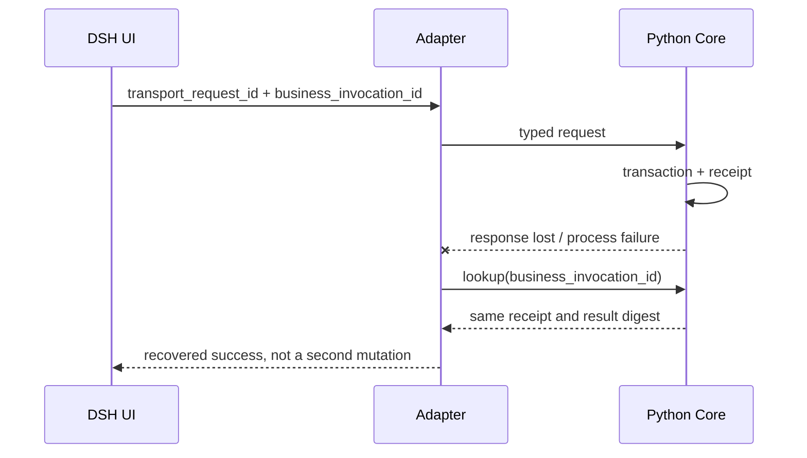

# EquityTrack V2 Phase 2：DeepSeek Harness 产品封装与迁移

> 文档状态：条件式迁移基线；Phase 1 未通过前不得进入产品实施
> 校准日期：2026-08-24
> EquityTrack 基线：`main @ 7d043873fad616fa00cc325d558c3500b36ba444`
> DSH 审计基线：`master @ b150a551b8d465e31e418e1b2eaf5e79bbb7d28e`，`dsh-v0.1.1-rc.2`
> 原始文档：[EquityTrack_V2_Phase2_DSH_Migration_CN.docx](./EquityTrack_V2_Phase2_DSH_Migration_CN.docx)
> 前置阶段：[EquityTrack_V2_Phase1_Skills_Fast_Path_CN.md](./EquityTrack_V2_Phase1_Skills_Fast_Path_CN.md)

## 0. 迁移结论

Phase 2 不把 EquityTrack 重写成 TypeScript/Cordis 插件，也不让 DSH 决定金融领域合同。它采用以下结构：

> **EquityTrack Python Core 继续拥有全部金融业务真值；DSH 是精确锁版本、可完整移除的本地宿主、会话运行器与工作台适配层。**

```mermaid
flowchart TB
    UI[DSH Web client plugin<br/>只读投影与显式确认 UI]
    UI -->|loopback-only /equitytrack RPC| HOST[@equitytrack/dsh-adapter<br/>Host Cordis plugin]
    HOST -->|ctx.subprocess.spawn + 版本化 framed JSON| CORE[EquityTrack Python<br/>application task interfaces]
    CORE --> DOMAIN[七个跨任务记录<br/>确定性风险与状态机]
    DOMAIN --> STORE[(EquityTrack SQLite / object store<br/>唯一业务真值)]
    HOST -.correlation only.-> SESSION[(DSH session log<br/>模型与工具轨迹)]
```

关键决定：

1. Phase 1 的合同与 Bench 先于 DSH；
2. 初版只有一个 out-of-tree adapter bundle、一个产品 workbench profile；另有一个 fixture-only transport test profile，不是用户入口；
3. Windows 产品桥使用 DSH Host plugin 的 `ctx.subprocess.spawn(spec)` 调用版本化 Python 协议；官方 Python SDK 不作为该方向的桥；
4. DSH session、workspace、approval 和 sandbox 都不等于 EquityTrack 的事件库、隔离、业务确认或风险授权；
5. 当前权威 Prompt 禁止产品业务 runtime 自行调用 LLM。DSH Agent loop 若要执行金融推理，必须先有单独 ADR 和治理变更；在此之前 DSH 只做 UI/transport 与强制 adapter parity；可选的仅是隔离 Agent/SDK 实验 runner；
6. 本阶段允许两个 presentation surface：唯一自然语言 Skill 与结构化 DSH 工作台；二者共享唯一 application/write/persistence path。不得形成两套自然语言入口、业务逻辑或业务状态。

## 1. Phase 2 的硬前置

Phase 2 产品实现只有在以下证据同时存在时才可开始：

| 前置 | 必要证据 |
|---|---|
| Phase 1 单一路径完成 | 五个任务已通过现有 `trading_platform.application` 的唯一接口运行；无平行 V2 runtime 或 compat branch |
| 合同冻结 | Phase 1 的 named application task contracts、task catalog、七个记录的 JSON Schema 与 digest 固化；不反向依赖 DSH envelope |
| 金融 Bench 通过 | 20 个案例族/22 个可执行变体 G0—G4 通过、G5 达到已固化门；限制完整披露 |
| 数据和风险边界统一 | AGENTS、Prompt、Skill、runtime 与 provider provenance 无冲突；风险门 fail-closed |
| 恢复可证明 | 迁移、幂等、中断恢复、备份恢复和 digest 引用核对通过 |
| 运行时 LLM 决策明确 | 维持“DSH 不执行金融推理”，或通过单独 ADR 明确模型、数据披露、工具权限、日志和评测边界 |
| DSH spike 通过 | 在被锁定 DSH revision 上实际完成插件加载、RPC、Python 子进程、取消、崩溃恢复、卸载和敏感日志检查 |

Phase 1 未完成时，只允许 P2.0 的**无业务写入适配可行性 spike**；不得建立真实账户、计划或复盘的第二入口。

## 2. DSH 当前事实、设计提案与待验证项

### 2.1 已核验事实

本节只描述本地 `D:\dsh-proj\deepseek-harness` 指定快照的真实能力。

| 主题 | `b150a551` 的事实 | 对 EquityTrack 的含义 |
|---|---|---|
| 版本与成熟度 | 根包/CLI 为 `0.1.1-rc.2`；README 明确 developer preview，可能发生 breaking change | 精确锁 commit、tag、lockfile 和配置；不追“最新” |
| 插件架构 | 模型、工具、Agent loop、session 等通过 Cordis 插件组合；支持 profile/bundle 与 out-of-tree package | 可做外置 adapter，无需 fork DSH |
| Session | 追加式类型事件日志，模型上下文由其派生；model-visible 内容必须可从日志重建 | 任何给模型看的持仓/证据都会落 DSH 日志；session 不能是金融 event store |
| Persistence | Session 可用 JSONL/SQLite；当前格式无长期兼容承诺，旧格式可能被拒绝 | DSH 升级不得决定金融业务可恢复性 |
| Workspace | 注册并分组一个已经存在的目录，不自动复制，也不是 sandbox | Bench 自己创建真实独立目录、session root 和 ID |
| 通用 Bench | `BENCHMARK.md` 仅提示独立任务使用不同 workspace/session；没有金融 schema、grader、rubric 或发布门 | EquityTrack Bench 永远由 Core 拥有 |
| Python SDK | 方向是 Python 启动/驱动 DSH；发行 runtime 仅覆盖 Linux x64/arm64 与 macOS 14 arm64 | 不适合作为当前 Windows 上的 DSH→Python Core 桥；可用于支持平台的可选 runner |
| Subprocess | `ctx.subprocess` 支持显式 argv/cwd/env/stdio、取消和进程树终止，argv 不经 shell | 是 Windows 上最合适的外部进程 seam |
| Web/RPC | Web 默认本地 `127.0.0.1:3080`；Connection RPC 支持独立 channel、loopback authority 与取消 | 可做 `/equitytrack` 专用通道；不得公开暴露 |
| Web 安全 | Host/Origin fence 只是 reachability policy，不是 authentication | 默认仅 loopback；远程访问必须等待独立认证设计 |
| Sandbox/approval | Sandbox 主要治理文件效果，不覆盖网络；Windows 可能报告 partial。Approval 是单次工具动作 | 两者都不能替代计划确认、账户权限或风险政策 |
| Dynamic Cordis tool | VM 明确不是安全边界 | 金融 profile 必须关闭 |
| Telemetry | 默认 `DISABLED`；启用时可包含完整消息、工具参数/结果、文件、system prompt 和 cwd，且无内建脱敏 | profile 显式锁定并启动断言 `DISABLED` |

本机只读审计还验证了 Node `v25.8.1`、pnpm `11.7.0` 下 `pnpm dsh --version` 与 `--help` 可运行。DSH manifest 接受 Node `^22.19.0 || >=24.0.0`；这不等于已经选择生产 Node 版本，P2.0 必须固定一个具体 patch 并重跑验证。

### 2.2 本文的设计提案

- 一个 out-of-tree `@equitytrack/dsh-adapter`，包含 Host 与 client 两半；
- Host 通过专用 loopback Connection RPC 接受强类型请求；
- Host 通过 `ctx.subprocess.spawn(spec)` 和唯一版本化 stdio 协议调用 Python Core；
- client 只渲染 Core 的 presentation DTO，并转发 Core 签发的确认 challenge；
- 所有业务对象、状态、幂等键和审计仍由 Python Core/SQLite 拥有；
- 一个产品 workbench profile 起步，另有非产品 transport-test profile；只有安全或模型配置确有差异时才拆产品 profile。

### 2.3 P2.0 必须回答的开放问题

| 问题 | 决策方法 | 禁止的默认假设 |
|---|---|---|
| 每请求子进程还是长驻 Python 进程 | 比较 Windows 冷启动/热调用 p50/p95、取消、崩溃、内存和双写风险后选一条 | 两条长期并存 |
| DSH 能否直接加载仓库唯一 `skills/SKILL.md` | 用被锁定 revision 做 filesystem provider spike | 复制到 `.dsh/skills` |
| client RPC 响应是否进入 durable session | 浏览器和 session persistence 实测并做敏感内容扫描 | 因“不是模型消息”就认定绝不落盘 |
| P2.6 是否允许真实持仓发送到模型 endpoint | 单独 ADR、`ContextDisclosurePolicy`、模型/endpoint/保留政策评审和用户确认 | 把完整账户自动放入 Agent context |
| DSH UI API churn 成本是否可接受 | 用一个只读页面完成 build/load/unload/upgrade 测试 | 内置 Web 已等同于投资工作台 |
| Windows sandbox 报告为 partial 时如何处理 | 明确 fail-closed 或禁用具有文件副作用的 profile | 把 partial 当 full |

## 3. 角色与真值边界

### 3.1 DSH 可以拥有

- profile、bundle、plugin 配置与可重建 UI 偏好；
- DSH session id、模型消息、工具调用、运行原因、用量和诊断；
- adapter correlation id、Core contract version、redacted failure code；
- Bench 的 DSH transcript，且只作为诊断附件；
- 从 Core 临时读取、随时可重建的只读 presentation DTO。

### 3.2 DSH 禁止拥有

- 账户、现金、持仓、成本、执行事实和 `PortfolioSnapshot` 的规范版本；
- `EvidenceSnapshot`、来源 manifest、PIT、冲突和数据质量；
- `InvestmentCase`、`ValuationCase`、`DecisionCard`；
- 风险政策、风险预算、仓位上限和确定性计算；
- 计划版本、确认、激活、替代、过期、关闭和待办状态；
- `DecisionReview`、概率结算、经验候选和 playbook rule；
- Bench 案例、fixture、hard invariant、rubric、分数、基线与发布决定；
- 业务幂等键、不可变业务审计和迁移回执。

DSH durable conversation event 不能复制这些对象形成第二账本。DSH 只保存业务记录的可空 correlation/ref；删除整个 DSH_HOME 必须只损失 DSH 会话和偏好，不能损失任何金融业务真值。

### 3.3 四类“权限”不能混用

| 机制 | 负责 | 不负责 |
|---|---|---|
| DSH reachability fence | 限制 Host/Origin 可达范围 | 身份认证、远程授权 |
| DSH sandbox | 文件系统效果及其 full/partial 结果 | 网络隔离、业务授权、账户写入 |
| DSH approval | 一次具体工具动作的允许/拒绝 | 计划版本、用户投资意图、风险上限 |
| EquityTrack authority | 账户真值、风险、确认 challenge、状态机、事务和幂等 | DSH UI/进程生命周期 |

因此，DSH 显示某个 approval 已通过，不能让 `TradePlanDraft` 变成 `ACTIVE`。激活、替代或关闭必须由 Core 校验当前版本、内容 digest、用户意图和 Core 签发的 challenge。

## 4. Adapter 必须是一个深协议模块

### 4.1 推荐拓扑

```text
DSH client plugin
    -> Connection RPC channel: /equitytrack (authority=loopback)
        -> @equitytrack/dsh-adapter Host plugin
            -> contract/version/config/size/authz/cancellation gates
            -> ctx.subprocess.spawn(spec: argv, cwd, env, stdio, signal)
                    -> EquityTrack Python protocol endpoint
                        -> named application task interface
                            -> domain + persistence
```

它不是只做字段改名的 glue。Adapter 必须完整拥有真实外部 seam 的行为：

- DSH 配置 schema 和启动失败语义；
- Core 版本握手与 schema digest 校验；
- framed JSON 编解码、消息大小和 stdout/stderr 隔离；
- 请求关联、超时、取消、进程树终止和崩溃恢复；
- interaction channel 与能力映射，但不伪造业务 actor；
- 幂等键透传、重试边界和“结果未知”恢复查询；
- typed Core failure 到 DSH presentation failure 的一对一映射；
- 敏感字段最小化、redaction 与日志断言；
- 插件卸载时撤销 RPC/effect、终止子进程且不留下业务半提交。

删除这个模块后，如果上述职责只是散落到 UI 或 Python 调用者中，说明设计仍然太浅；如果删除它会失去明确的协议、安全和进程边界，则它是合理的深 adapter。

### 4.2 禁止通用 `run(task, payload)`

协议使用封闭的 discriminated union，不接受自由字符串任务、任意 JSON、文件路径、SQL 或 shell 命令。

```yaml
schema_version: DshBridgeRequest@1
transport_request_id: uuid
business_invocation_id: uuid | null
interaction_channel: dsh_local
task:
  one_of:
    - kind: portfolio.get_snapshot@1
      payload: PortfolioSnapshotQuery@1
    - kind: decision_record.get@1
      payload: DecisionRecordQuery@1
    - kind: plan.prepare_draft@1
      payload: PlanDraftRequest@1
    - kind: plan.issue_confirmation_challenge@1
      payload: IssuePlanChallenge@1
    - kind: plan.confirm@1
      payload: ConfirmPlan@1
    - kind: monitor_plan.evaluate@1
      payload: MonitorPlanRequest@1
    - kind: mutation.lookup_receipt@1
      payload: BusinessInvocationQuery@1
```

`transport_request_id` 由 adapter 生成，只作 DSH/RPC 关联；`business_invocation_id` 属于 Phase 1 application contract，是 mutation 的业务幂等键，并由 Core receipt 持久化。查询可以为 `null`；mutation 必须携带 Core 合同要求的稳定值。Adapter 不得在重试时换一个新的 business id。Core receipt 把该 ID 绑定到 `operation_id + canonical_request_digest + actor_or_capability_scope_digest`；同一 ID 与任一绑定项不一致时必须返回 `IDEMPOTENCY_CONFLICT`，不返回旧结果，也不执行新写入。Mutation 仍使用 Core 的 expected version、digest、capability 和幂等规则。客户端提供的 `actor`、风险结果、计划状态或账户字段都不可信；Core 从自己的确认合同判断权限和状态。

每个 operation 还必须由 Core-owned task catalog 标记暴露级别：

| 级别 | 含义 | 初始 workbench |
|---|---|---|
| `DETERMINISTIC_UI_SAFE` | 查询、确定性计算、投影、草稿和 Core challenge 转发 | allowlist 后可用 |
| `CONTROL_PLANE_REQUIRED` | 需要 canonical Skill/Codex 完成证据理解或候选叙述 | 只显示下一步，不在 DSH 执行 |
| `EXPERIMENT_ONLY` | 使用 DSH Agent/model-facing tool 的研究实验 | 仅隔离 Bench，生产禁用 |

初始 `DshBridgeRequest@1` 只生成 `DETERMINISTIC_UI_SAFE` 子集；`CONTROL_PLANE_REQUIRED` 与 `EXPERIMENT_ONLY` 根本不进入该版本的 union。未启用的确定性能力稳定返回 `CAPABILITY_NOT_ENABLED`。分类由 Python Core 发布并参与 schema digest，不能由 TypeScript 自行放宽。P2.6 若获批准，必须发布新的精确 bridge schema，而不是放宽现有 union。

响应：

```yaml
schema_version: DshBridgeResult@1
transport_request_id: uuid
business_invocation_id: uuid | null
core_contract_version: string
core_schema_digest: sha256
outcome: success | blocked | data_insufficient | failed | outcome_unknown
result: typed-task-result | null
receipt_ref: string | null
presentation: ProgressiveDisclosureView@1 | null
failure:
  code: typed-code
  substep: string
  redacted_detail: string
retry:
  safe: boolean
  lookup_by_business_invocation_id: boolean
```

Phase 1 named task schema 是业务合同的单一来源；Phase 2 自己拥有 `DshBridgeRequest@1/Result@1` 的传输 envelope。TypeScript validator/type 由固定构建步骤从 Phase 1 schema artifact 和本 adapter envelope 生成并绑定组合 digest，禁止人工维护第二份近似业务合同。Adapter 只支持一个精确 Core task-catalog digest；遇到其他版本在加载时 fail loud，不做多版本协商或旧字段 fallback。

Python protocol endpoint 在 composition root 中获得与 Phase 1 相同的 application task module。Adapter 禁止拼 shell 命令调用 CLI、解析 CLI 文本、直连 repository 或数据库，也不得调用退役的研究/计划私有函数。

### 4.3 业务提交与进程故障

必须处理最危险的时序：Core 已提交，但 DSH 在收到响应前崩溃。



Adapter 不得在不确定时自动用新 business id 重试 mutation。它先按原 `business_invocation_id` 查询 Core receipt；只有 Core 明确返回“从未开始且可安全重试”才允许同 id 重放。暂时无法确认时返回 `outcome_unknown` 和稳定查询句柄，不能把未知状态改写成普通失败。

## 5. Skill、Profile 和 Bundle：一份来源，不做机械映射

### 5.1 唯一 Skill 来源

Phase 1 的唯一公开入口仍是仓库 `skills/SKILL.md`。Phase 2 禁止新增手工维护的 `.dsh/skills/equitytrack/SKILL.md` 副本。

优先顺序：

1. 在固定 DSH revision 上验证 filesystem skill provider 能否直接读取规范文件所在目录；
2. 若不能，默认工作台继续用非 model-facing client RPC，不加载第二份 Skill；human command 只允许导航、health 和 adapter 诊断，不承载业务 task；
3. 本 Phase 2 不迁移 Skill 宿主；`skills/SKILL.md` 始终是唯一自然语言入口，DSH 只是结构化 presentation surface；
4. 生成副本、同步脚本、symlink 假设和双目录优先级都不能作为长期路径。未来若要替换自然语言宿主，必须是超出本文范围的新阶段和新 ADR。

五个内部任务是 Core 的 application contracts，不需要五个 DSH `SKILL.md`。

### 5.2 一个 Bundle、一个产品 Profile、一个测试 Profile

建议初版：

```text
@equitytrack/dsh-adapter
└── equitytrack-workbench profile
```

在 EquityTrack 仓库中的建议物理边界是一个包，而不是散落插件：

```text
integrations/dsh/
├── package.json
├── pnpm-lock.yaml
├── src/
│   ├── host/              # config、RPC、subprocess、protocol、redaction
│   └── client/            # read-only views、diff、confirmation forwarding
├── profiles/
│   ├── transport-test/    # fixture only, no Web/model
│   └── workbench/         # loopback, telemetry disabled
└── tests/
    ├── conformance/
    ├── windows-transport/
    └── browser/
```

两个 profile 共享同一个 adapter 包和协议；`transport-test` 只用于无业务 fixture 验证，不是第二产品路径。禁止修改 DSH monorepo、复制 Python 业务逻辑或为五个任务创建五个包。

只有当模型 endpoint、工具 allowlist、数据披露或运行环境确实不同，才拆 `bench` 或其他 profile。不要因为有五个领域任务就复制五份 DSH 配置；Profile 是运行时组合，不是领域边界。

### 5.3 当前 LLM 边界

现有权威 Prompt 要求产品业务 runtime 不自行调用 LLM，Codex/Skill 是控制面。因此默认 Phase 2：

- 结构化 DSH workbench client RPC 可以调用 allowlist 中的确定性 Core task；human command 只做导航、health 和无业务语义的诊断；
- DSH 可以显示已由规范控制面产生的研究、计划与复盘投影；
- DSH Agent loop 只可在隔离 Bench 中作为实验 runner，并且不能写真实业务库；
- 生产中不得把五个任务注册成 model-facing tools，除非新 ADR 同时修改 Prompt、威胁模型、数据披露、日志、模型 endpoint 和 Bench 发布门。

若以后批准 Agent 模式，模型仍只能生成候选记录；风险、账户、确认和状态转换继续在 Core。

## 6. 隐私与安全模型

### 6.1 当前阶段：业务 payload 不进入 Agent context

模型可见内容在 DSH 中必须可从 session 重建，因此“发给模型”和“写入 DSH session”是同一个披露决定。本阶段生产 profile 不注册 model-facing EquityTrack tool，也不把账户、证据、研究、计划或复盘 payload 放入 Agent context/session。client RPC 只传给可信 Host adapter，并以 canary 实测其是否进入 durable session、浏览器缓存或诊断日志；任何超范围落盘都阻断发布。

完整账户别名、现金、成本、全部持仓、未公开研究、凭据和本地绝对路径不得进入 DSH Agent、日志、artifact 或错误。若 P2.6 获批，再由新 ADR 定义 `ContextDisclosurePolicy`、模型 endpoint、供应商保留、用户确认和过期语义；该未来草案不是当前 runtime 合同。

### 6.2 间接提示注入

公告、网页、研报、文件和 provider 字段一律视为**不可信数据**。无论文本声称什么，都不能：

- 改写 system/Skill 指令；
- 扩大 provider、文件、网络或账户权限；
- 修改风险政策、账户事实、计划状态或确认内容；
- 请求通用 shell、SQL、文件写入或动态 Cordis 工具；
- 绕过证据引用、PIT、schema 或 human confirmation。

工作台 profile 只暴露封闭 task union；关闭动态 Cordis tool，不加载通用 shell/filesystem/浏览器工具。渲染时转义不可信 Markdown/HTML，外链与附件只作为证据引用呈现。

### 6.3 部署硬门

- Web 与 `/equitytrack` 仅绑定 loopback；不得监听公网或局域网地址；
- DSH reachability fence 不是 authentication，远程访问在独立认证设计完成前禁止；
- telemetry 显式配置 `DISABLED`，adapter 启动读取有效配置并 fail closed；
- 使用独立、最小 ACL 的 DSH_HOME；真实业务数据库不放入 DSH workspace，但这只是减少误暴露，不是访问控制保证；
- Python 子进程只获得所需数据根和环境；不传券商下单凭据；
- stdout 只允许协议 frame，诊断走有上限且脱敏的 stderr；
- Windows sandbox 为 `partial` 时，带文件副作用或不可信工具的 profile 不得运行；
- Adapter、client bundle 和 schema artifact 固定 hash；CSP/依赖审计进入发布门。

### 6.4 Host plugin 信任模型

Cordis Host plugin 与 DSH Host 共享操作系统进程权限，`ctx.subprocess` 也不会自动建立安全隔离。把数据库放到 workspace 外，不能阻止恶意 Host plugin 读取本机可访问文件。因此初版明确采用：

- profile 中所有 Host plugin 与同源 client plugin 都属于确认路径的 **TCB（trusted computing base）**，只安装最小必要集合，并按 package/version/hash allowlist 固定；不允许用户任意加第三方插件；
- P2.0 清点 Host 实际 OS identity、可读路径、环境变量和 child capability，并用 canary 验证；
- DSH 进程使用最小权限的本地 OS 身份和 ACL；若 Core 子进程无法在该模型下只获得必要数据能力，Phase 2 阻塞；
- 若未来要求运行不可信 Host plugin，必须增加独立 OS identity/broker/ACL 安全架构，不得把 DSH workspace 或 sandbox 宣称为替代品。

该信任假设与剩余风险必须在安装界面和发布报告中明示。

## 7. Windows Transport Spike：选择一条生命周期路径

DSH→Python 的协议固定为 `ctx.subprocess.spawn(spec)` + framed JSON stdio，但进程生命周期尚未由源码审计证明。P2.0 比较：

| 候选 | 优点 | 风险 | 必测 |
|---|---|---|---|
| 每请求一次进程 | 隔离简单、崩溃边界清楚 | 冷启动延迟、并发进程、提交后响应丢失 | p50/p95、取消、重复 mutation |
| 单个长驻进程 | 热调用低延迟、连接复用 | frame 解码、健康检查、卡死、重启和背压复杂 | 半帧、并发、崩溃恢复、内存 |

P2.0 只实现这两种 stdio 生命周期 spike。若两者都不能满足门槛，Phase 2 状态为 `BLOCKED`，必须重新评审架构；不得临时加入 loopback HTTP、CLI 文本解析或第二协议绕过。决策记录必须给出：

- 空闲/热调用 p50、p95、p99；
- 10/100 次并发或串行任务的资源曲线；
- DSH 取消到 Python 进程树终止的时延；
- 崩溃发生在“提交前、提交后响应前、响应中”三处的结果；
- malformed frame、超大响应、stderr 洪泛和无响应；
- 卸载 adapter、结束 DSH、重启 Core 后无孤儿进程；
- `business_invocation_id` 恢复查询和无重复业务写入；`transport_request_id` 仅作关联。

完成后选择一条规范生命周期，删除另一条 spike 实现。不得用 runtime flag 长期保留两条路径。

## 8. DSH Adapter 与 EquityTrack Bench

### 8.1 所有权

```text
EquityTrack owns:
  runner-neutral BenchmarkCase@1 + BenchmarkRun@1 + frozen inputs + schemas + hard validators + rubric + baseline + release decision

DSH supplies, but does not own:
  execution-environment metadata + session/tool transcript refs + runtime diagnostics
```

EquityTrack Bench harness 创建并持久化 `BenchmarkRun@1`；DSH 只能提供其中的非规范 runtime 附件。DSH 的 `BENCHMARK.md` 不是金融 Bench。Workspace 只是目录注册；未来只有在 P2.6 获批并执行**完整同一案例**时，DSH runner 才为每个 case 创建真实独立目录、独立 session root、唯一 session id 和隔离 DSH_HOME，并把这些 ID 返回给 EquityTrack harness。

### 8.2 两类测试不能互相替代

1. **Phase 1 financial Bench**：直接通过规范 application task interface 运行 20 个案例族的 22 个可执行变体和后续 holdout；验证 G0—G5。
2. **DSH adapter conformance**：验证 plugin/config/protocol/process/UI/security；它不能给金融质量加分。

DSH conformance 最低集合：

- 插件加载、卸载、重复加载无残留 effect；
- 非法配置、错误 Core 版本、schema digest 不匹配时 fail loud；
- 所有 request/result union 分支 round-trip；
- 超时、取消、进程崩溃、半帧、超大响应和 stderr 上限；
- Core 已提交但响应丢失时按 `business_invocation_id` 恢复，不双写；
- 同一 `business_invocation_id` 换 operation、payload digest 或 actor/capability scope 时稳定返回 `IDEMPOTENCY_CONFLICT`；
- loopback-only，远程 origin/host 被拒绝；
- telemetry 有效配置确为 `DISABLED`；
- session、日志、错误和浏览器缓存的敏感模式扫描；
- DSH approval 无法代替 Core confirmation challenge；
- 删除 DSH_HOME 后业务数据库和 Phase 1 闭环完整。

### 8.3 Adapter operation parity 门

当前 Phase 2 不把确定性子操作伪装成完整金融案例重放。它由 adapter conformance harness 为 task catalog 中每个 `DETERMINISTIC_UI_SAFE` operation 创建独立测试产物：

```yaml
AdapterParityRun@1:
  parity_run_id: string
  task_catalog_digest: sha256
  operation_id: string
  seeded_state_digest: sha256
  canonical_request_digest: sha256
  direct_result_projection_digest: sha256
  dsh_result_projection_digest: sha256
  direct_receipt_digest: sha256 | not_applicable
  dsh_receipt_digest: sha256 | not_applicable
  dsh_runtime_metadata: object
  diagnostics: [redacted-diagnostic]
```

Direct 与 DSH 在两个从同一 seed 恢复的隔离 Core fixture 中执行同一 operation/request；mutation 还使用相同、仅在各自隔离 fixture 内有效的 `business_invocation_id`。`AdapterParityRun@1` 不是 `BenchmarkCase@1`、不计入 20 个案例族/22 个变体，也不给 G5 金融质量加分。Phase 1 金融案例仍全量走 canonical Skill/application Bench；含 `CONTROL_PLANE_REQUIRED` 的步骤在当前 Phase 2 只验证 DSH 能读取其规范结果，不通过 DSH 重新执行金融推理：

- 查询/独立重放的 deterministic projection digest、typed status 和状态变化完全一致；同一 `business_invocation_id` 的 mutation 重试还必须返回同一 receipt 与同一已提交 `content_digest`；
- DSH 只允许增加 correlation、运行时耗时和脱敏诊断；
- DSH transcript 不进入金融 grader，也不成为重放所需输入；
- Adapter 失败不能把 Core 的 `data_insufficient/blocked` 改成普通成功或模糊异常。

官方 Python SDK 只可在其支持的 Linux/macOS 环境中作为“Python 驱动 DSH Agent”的可选实验 runner；它不是 Windows 产品桥，也不能成为 Phase 2 发布的唯一证据。

## 9. 工作台演进：先只读，再确认，最后才讨论 Agent

### P2 UI-0：只读投影

页面只显示：

- 当前已确认账户摘要和数据质量；
- 活动计划状态、到期与开放复核任务；
- `InvestmentCase`、`ValuationCase`、`DecisionCard` 的决策相关摘要；
- 来源、过程、digest 和诊断通过渐进披露展开。

所有页面从 Core read model 重建，不在 DSH 保存业务草稿或本地-only 状态。

### P2 UI-1：草稿与显式确认

允许 Core 创建草稿；DSH 展示完整差异、风险约束、生效版本和限制。确认流程：

1. Core 签发一次性 challenge，绑定 draft id、expected version、digest、风险政策、业务 invocation id 和过期时间；
2. DSH 完整呈现，不修改内容；确认 endpoint 不注册成 model-facing tool/command；
3. client 只有在受信任页面上的明确用户 gesture 后，才能获得一次性 UI capability；该 capability 不进入 Agent/session；
4. Host 同时校验 exact Origin、CSRF token、一次性 UI capability、challenge 和请求时限；loopback 本身不被当作人类身份；
5. DSH 原样转发 challenge、用户意图和业务 invocation id；
6. Core 重读账户/政策、重算风险、校验 challenge/digest/version 并原子提交；
7. DSH 只展示 Core receipt。

任何版本变化、challenge/capability 过期、重复使用、Origin/CSRF 失败或风险门变化都必须拒绝并重新确认。Origin/CSRF 与一次性 capability 能拒绝跨源页面、模型输出和 session replay，但**不能**防御已安装的恶意或被攻陷的同源/Host plugin；这些插件全部属于确认 TCB。初版的确认保证只在“最小且 hash 固定的受信任 Host/client plugin 集 + 本机 OS 用户 + 明确 UI gesture”的威胁模型内成立；TCB 清单或 hash 变化必须重新验收并阻断静默加载。

### P2 UI-2：可选 Agent 模式

只有运行时 LLM ADR 通过后才可进入。它需要独立 profile、模型 endpoint、`ContextDisclosurePolicy`、工具 allowlist、只读/草稿能力和完整 Bench。即便启用，Agent 也没有账户事实写入、计划激活或订单权限。

## 10. 版本锁定、升级与退出

### 10.1 首个 spike 的锁定清单

| 项 | 锁定值/动作 |
|---|---|
| DSH commit | `b150a551b8d465e31e418e1b2eaf5e79bbb7d28e` |
| DSH tag/package | `dsh-v0.1.1-rc.2` / `@deepseek-ai/dsh@0.1.1-rc.2` |
| Node | 在 DSH 支持范围中选定一个精确 patch；记录二进制 hash |
| pnpm | `11.7.0` |
| DSH dependency graph | DSH lockfile + adapter lockfile + package tarball/hash |
| Core/bridge contract | Phase 1 task-catalog digest + `DshBridgeRequest@1` / `DshBridgeResult@1` |
| Profile | 独立 DSH_HOME、有效配置 dump、telemetry `DISABLED`、loopback-only |
| Skill | 唯一源路径和内容 digest；没有 `.dsh/skills` 副本 |
| Security | adapter/client hash、tool allowlist、无动态 Cordis、数据披露策略 |

DSH vendored 并修改 Cordis，因此审计和锁定单位是完整 DSH commit/lockfile，不是独立追随一个外部 Cordis semver。

### 10.2 升级门

每次 DSH 升级在独立分支和全新 DSH_HOME 完成：

1. 阅读 release diff，固定新 commit、运行时和 lockfile；
2. 替换 adapter 实现以支持新 revision，删除旧 revision 分支；
3. 运行 adapter conformance、浏览器验收和敏感日志扫描；
4. 运行 Phase 1 全量金融 Bench 与 direct-vs-DSH parity；
5. 证明业务数据库未被 DSH upgrade/rollback 修改；
6. 人工确认后原子切换 profile artifact；
7. 旧 DSH_HOME 仅作只读诊断保留或按用户批准清理。

不要求新 DSH 能读取旧 session；DSH 当前没有这个兼容承诺。业务连续性来自 Core，而不是 session migration。禁止 `dsh-compat.ts`、多 revision 分派、旧 session shim 或业务 dual-write。

### 10.3 退出演练

接入前必须证明：

- 禁用/卸载 adapter 后，唯一 `skills/SKILL.md`、Core application interface 和维护 CLI 仍可完成 Phase 1 闭环；
- DSH session id 只作可空 correlation，不参与业务主键、版本、digest 或幂等；
- 删除 DSH_HOME 不损失账户、证据、研究、风险、计划、复盘或 Bench；
- UI 没有不可重建的业务状态；
- 可靠回退目标是 canonical Skill/Core。只有旧 adapter 的**不可变已发布制品**已验证支持当前精确 Core task-catalog digest、且没有单向 schema 迁移时，才可短期恢复该制品与其独立 DSH_HOME；这不是保留源码分支、版本分派或兼容逻辑。发生单向 schema 迁移后绝不回退旧 DSH；
- DSH API churn 超过成本阈值时可以删除 adapter，而无需把 Python Core 重写到 DSH。

## 11. Phase 2 实施顺序

### P2.0 — 适配可行性 spike，无业务写入

交付：固定 revision 的 out-of-tree 插件加载、`/equitytrack` loopback RPC、Core health/contract 握手、Windows stdio 两种生命周期 spike、卸载和敏感日志报告。

退出条件：选定且只保留一条进程生命周期；无孤儿进程、无业务写入、无敏感日志、错误版本 fail loud。

### P2.1 — Host adapter 与协议 conformance

交付：封闭 task union、生成 validator、typed failure、超时/取消/恢复查询、配置门和 conformance suite。

退出条件：所有读任务和无副作用 conformance fixture 通过；malformed/oversize/crash/duplicate/idempotency-conflict 测试通过。

### P2.2 — 只读 Workbench

交付：out-of-tree client bundle、只读投影、渐进披露、loopback-only profile。

退出条件：浏览器验收通过；页面可由 Core 完整重建；DSH session/浏览器存储无超范围敏感信息。

### P2.3 — 草稿与 Core 确认

交付：草稿、差异、challenge 展示与确认转发；没有客户端状态转换。

退出条件：并发版本变化、过期 challenge、风险变化、重复确认和响应丢失全部 fail-closed 或返回同一 receipt。

### P2.4 — Windows Adapter Parity（强制）

交付：每个 bridge-exposed operation fixture 在同一 seed 的两个隔离 Core 状态上执行，DSH 一侧使用独立物理 workspace/session root/DSH_HOME，生成 `AdapterParityRun@1` 与 direct-vs-DSH 报告；同时通过 canonical Skill/application 路径重跑完整 Phase 1 20 个案例族/22 个变体，证明 Core 金融回归基线未退化。Linux/macOS Python SDK 或 DSH Agent 完整案例 runner 是可选附件，不影响此强制门。

退出条件：全部 adapter parity fixture 通过，Phase 1 Bench 结果未退化；没有把确定性子操作记成完整 `BenchmarkRun@1`，DSH transcript 只作诊断附件。

### P2.5 — 生产切换与退出演练

交付：固定 artifacts、配置 dump、安装/卸载说明、备份、退出报告和用户验收。

退出条件：完整 workbench 旅程通过；移除 DSH 后 Phase 1 业务真值与闭环无损；没有兼容分支或第二产品入口。

### P2.6 — Agent 模式（默认不在本阶段）

只有单独 ADR 批准后才可排期。其交付与发布门不能被前述 UI/transport 完成自动满足。

## 12. Definition of Done

Phase 2 只有全部满足才完成：

1. **前置真实**：Phase 1 的合同、20 个案例族/22 个变体 Bench、迁移和恢复证据仍有效；
2. **版本可复现**：DSH commit/tag、Node/pnpm、lockfile、adapter、schema、profile dump 和 DSH_HOME 均已记录；只有一个产品 workbench profile，fixture-only transport-test profile 不对用户开放；
3. **单一协议**：一个 task union、一个 Python endpoint、一个进程生命周期；没有 generic run、HTTP/stdio 双轨或多版本 wrapper；
4. **真值唯一**：DSH 只保存 correlation 与运行轨迹；删除 DSH_HOME 后业务数据和 Bench 无损；
5. **确认正确**：DSH approval 不参与计划状态；所有 mutation 受 capability、版本、digest 和幂等保护；只有计划激活、替代、关闭等确认型状态变更额外要求 Core challenge 与风险重算；
6. **隐私**：telemetry `DISABLED`、loopback-only、最少上下文、凭据零落盘、敏感日志扫描全通过；
7. **信任与注入防护**：Host/client plugin TCB 为最小 hash allowlist；外部证据只作数据；无 dynamic Cordis、通用 shell/SQL/文件写入；
8. **可靠性**：超时、取消、崩溃、响应丢失、中断恢复和卸载无重复写入或孤儿进程；
9. **Parity**：direct 与 DSH 的 deterministic projection、typed 状态完全一致；mutation 重试的 content digest 与 receipt 完全一致；
10. **UI**：所有业务状态可从 Core 重建；渐进披露不改变规范记录；
11. **升级**：在全新 DSH_HOME 完成一次模拟升级并删除旧 adapter 分支；
12. **退出**：实际卸载 adapter/删除测试 DSH_HOME 后，Phase 1 闭环和业务 digest 验证通过；
13. **证据诚实**：报告精确列出通过、失败、跳过、超时、未运行的模型/实网/远程安全检查；
14. **清理**：无 Skill 副本、compat 文件、dual path、无效 profile、过时文档或未使用依赖。

## 13. 风险登记

| 风险 | 触发信号 | 默认处置 |
|---|---|---|
| DSH breaking change | plugin/RPC/session/client API 变化 | 停止升级；在独立 DSH_HOME 替换 adapter，完整重验，不给 Core 加 shim |
| DSH session 泄露真实账户 | session/telemetry/浏览器存储出现超范围字段 | 停止 rollout，吊销该披露策略，清理测试数据并修正最小化门 |
| Windows sandbox 只有 partial | capability report 非 full | 禁止含不可信文件副作用的 profile；不以 approval 补偿 |
| Core 提交后 adapter 丢响应 | UI 显示失败但 receipt 已存在 | 原 `business_invocation_id` 查询并恢复同一结果，禁止新 business id 重试 |
| DSH UI 形成第二状态 | 刷新后结果与 Core 不一致 | 删除 UI-local 业务状态，只从 read model 重建 |
| Skill 复制漂移 | `.dsh/skills` 与仓库 Skill digest 不同 | 不发布；删除副本，回到唯一源或非 model-facing 模式 |
| Agent 模式偷渡进入生产 | model-facing tool 能访问真实 task | 阻断发布；要求运行时 LLM ADR 和专用 Bench |
| 远程暴露无认证 | bind 非 loopback 或 proxy 暴露 | fail closed；Phase 2 不支持远程工作台 |
| Adapter 变成业务编排层 | TS 内出现风险公式、状态转换或账户写入逻辑 | 把行为移回 Core并删除重复实现；conformance 增加反例 |
| DSH 退出后产品不可用 | 业务主键/状态依赖 session 或 UI | Phase 2 不得发布，先移除依赖并通过退出演练 |

## 14. DSH 一手证据

以下链接固定到本次审计 commit，避免 `master` 漂移：

1. DSH [README](https://github.com/deepseek-ai/deepseek-harness/blob/b150a551b8d465e31e418e1b2eaf5e79bbb7d28e/README.md) 与 [architecture](https://github.com/deepseek-ai/deepseek-harness/blob/b150a551b8d465e31e418e1b2eaf5e79bbb7d28e/docs/architecture.md)：插件化 Agent Harness、developer preview 与总体架构。
2. [BENCHMARK.md](https://github.com/deepseek-ai/deepseek-harness/blob/b150a551b8d465e31e418e1b2eaf5e79bbb7d28e/BENCHMARK.md)：当前只有 workspace/session 操作提示，不是金融评测系统。
3. [Session subsystem](https://github.com/deepseek-ai/deepseek-harness/blob/b150a551b8d465e31e418e1b2eaf5e79bbb7d28e/docs/subsystems/session.md) 与 [persistence](https://github.com/deepseek-ai/deepseek-harness/blob/b150a551b8d465e31e418e1b2eaf5e79bbb7d28e/docs/subsystems/persistence.md)：会话事件、重放和格式边界。
4. [Python SDK guide](https://github.com/deepseek-ai/deepseek-harness/blob/b150a551b8d465e31e418e1b2eaf5e79bbb7d28e/docs/user/guide/python-sdk.md) 与 [SDK runtime README](https://github.com/deepseek-ai/deepseek-harness/blob/b150a551b8d465e31e418e1b2eaf5e79bbb7d28e/python/sdk-runtime/README.md)：调用方向与发行平台限制。
5. [Subprocess subsystem](https://github.com/deepseek-ai/deepseek-harness/blob/b150a551b8d465e31e418e1b2eaf5e79bbb7d28e/docs/subsystems/subprocess.md)：argv、stdio、取消和进程树生命周期。
6. [Connection RPC](https://github.com/deepseek-ai/deepseek-harness/blob/b150a551b8d465e31e418e1b2eaf5e79bbb7d28e/packages/client/connection/src/rpc.ts) 与 [connection boundary](https://github.com/deepseek-ai/deepseek-harness/blob/b150a551b8d465e31e418e1b2eaf5e79bbb7d28e/packages/client/connection/README.md)：独立 channel、loopback authority 与 reachability 非认证边界。
7. [Sandbox subsystem](https://github.com/deepseek-ai/deepseek-harness/blob/b150a551b8d465e31e418e1b2eaf5e79bbb7d28e/docs/subsystems/sandbox.md)、[approval](https://github.com/deepseek-ai/deepseek-harness/blob/b150a551b8d465e31e418e1b2eaf5e79bbb7d28e/docs/subsystems/approval.md) 与 [permission presets](https://github.com/deepseek-ai/deepseek-harness/blob/b150a551b8d465e31e418e1b2eaf5e79bbb7d28e/docs/subsystems/permission-presets.md)：文件 sandbox、单次工具批准与 preset 的真实语义。
8. [Telemetry README](https://github.com/deepseek-ai/deepseek-harness/blob/b150a551b8d465e31e418e1b2eaf5e79bbb7d28e/packages/session/session-telemetry-otel/README.md)：上传内容和无内建脱敏规则。
9. [Dynamic Cordis tool](https://github.com/deepseek-ai/deepseek-harness/blob/b150a551b8d465e31e418e1b2eaf5e79bbb7d28e/packages/extensions/tool-cordis/README.md)：VM 不是安全边界。
10. [Client modules](https://github.com/deepseek-ai/deepseek-harness/blob/b150a551b8d465e31e418e1b2eaf5e79bbb7d28e/docs/subsystems/client-modules.md) 与 [UI slots](https://github.com/deepseek-ai/deepseek-harness/blob/b150a551b8d465e31e418e1b2eaf5e79bbb7d28e/packages/client/ui-slots/README.md)：out-of-tree client bundle 与 UI 扩展面。

## 15. 本地证据与复现命令

EquityTrack：

- [Phase 1 基线](./EquityTrack_V2_Phase1_Skills_Fast_Path_CN.md)
- [长期平台 Prompt](../prompts/trading_platform_codex_prompt_optimized.md)
- [统一 Skill](../../skills/SKILL.md)
- [领域术语](../../CONTEXT.md)

DSH 审计快照可用以下命令复现：

```powershell
Set-Location -LiteralPath D:\dsh-proj\deepseek-harness
git status --short --branch
git rev-parse HEAD
git describe --tags --always --dirty
node --version
pnpm --version
pnpm dsh --version
pnpm dsh --help
```

源码审计没有完成下列运行证据：out-of-tree EquityTrack 插件加载、浏览器交互、Windows Python bridge、真实模型调用、Linux/macOS SDK 运行、DSH 全仓 check/e2e。它们必须由 P2.0—P2.4 的实际测试补齐，不能由本文或原 DOCX 代替。
