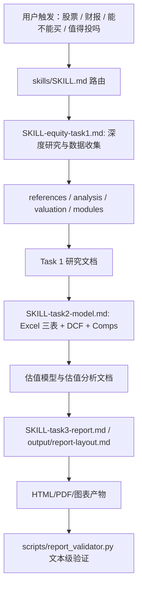

# Equity Research Skill Audit Report

> Historical audit: this document describes the retired pre-V3 skill graph. Refer to `skills/SKILL.md` for the current workflow; referenced legacy Skill entry files have been removed.

审计日期：2026-07-02  
审计范围：`E:/workspace/tradingSystem/skills/` 下的 `SKILL.md`、`references/`、`analysis/`、`valuation/`、`modules/`、`scripts/` 及相关输出模板。  
审计性质：方法论与 Codex 技能工程审计，不生成股票研报，不给出真实投资建议。

## 结论

当前技能 **不建议直接用于 A 股/港股/美股个股深度研究的最终投资结论或目标价输出**。它可以作为“研报写作与材料组织框架”继续保留，但必须先修复 P0/P1 问题，尤其是数据源可复现性、DCF 适用性门禁、行业估值路由、Excel 模型校验、创新药 rNPV 和投资建议边界。

综合判断：**可用但需修复；修复前不建议继续使用为个股深度研究技能**。

## 外部方法论依据

以下外部来源用于判断通用估值原则与数据源约束：

- [Aswath Damodaran, DCF Input Page](https://pages.stern.nyu.edu/~adamodar/New_Home_Page/lectures/dcfinput.html)：DCF 的现金流与折现率必须一致；WACC、CAPM、风险溢价、beta、市场价值权重等输入需要匹配。
- [Aswath Damodaran, Firm Valuation: Cost of Capital and APV Approaches](https://pages.stern.nyu.edu/~adamodar/pdfiles/valn2ed/ch15.pdf)：FCFF、WACC、终值、非经营性资产和债务桥的基本框架；稳定增长假设必须与再投资、增长和资本成本一致。
- [Aswath Damodaran, Valuing Financial Service Firms](https://pages.stern.nyu.edu/~adamodar/pdfiles/papers/finfirm.pdf)：银行、保险等金融企业不宜用普通 FCFF/WACC 企业价值 DCF，因为债务是经营原料、再投资难以定义，通常应直接估股权。
- [Aswath Damodaran, Measuring Earnings and Cash Flows](https://pages.stern.nyu.edu/~adamodar/pdfiles/valn2ed/ch9.pdf)：研发、租赁、一次性项目等会扭曲会计利润，R&D 资本化在高研发企业中是必要调整。
- [Aswath Damodaran, Valuing Young, Start-up and Growth Companies](https://pages.stern.nyu.edu/~adamodar/pdfiles/papers/younggrowth.pdf)：年轻成长公司需要处理失败概率，不能只用单一路径现金流。
- [SEC EDGAR Search and Access](https://www.sec.gov/search-filings) 与 [SEC EDGAR APIs](https://www.sec.gov/search-filings/edgar-application-programming-interfaces)：美股公告、提交历史和 XBRL 公司事实数据可官方获取、可自动化复现。
- [CNINFO 巨潮资讯](https://www.cninfo.com.cn/new/index)：A 股公告披露平台，覆盖深市、沪市、创业板、科创板、北交所和港股公告入口；但其免责声明也提示需要保留来源与校验。
- [SSE 上交所上市公司公告](https://www.sse.com.cn/disclosure/listedinfo/announcement/) 与 [HKEXnews](https://www.hkexnews.hk/index.htm)：A 股/港股官方公告入口，适合作为财报与公告原始来源。
- [FDA Clinical Research Step 3](https://www.fda.gov/patients/drug-development-process/step-3-clinical-research)：临床试验阶段、试验方案、样本量、终点和阶段推进概率是创新药估值输入。
- [BIO Clinical Development Success Rates 2011-2020](https://www.bio.org/clinical-development-success-rates-and-contributing-factors-2011-2020)：药物研发成功率应按适应症、阶段、技术路径等差异化处理。

## 技能现状梳理

### 优点

- `skills/SKILL.md` `## Core Principles`（约 112-133 行）明确要求真实来源、交叉验证、最新财务与市场数据、禁止编造。
- `skills/SKILL-equity-task1.md` `## Non-Negotiable Quality Bar`（约 17-28 行）要求真实数据、无占位符、无 shortcuts。
- `skills/references/financial-model-spec.md` `## Required Tabs` 与 `## Formula Principles`（约 20-75、574-620 行）已经有 Raw Data、Operating Drivers、三表、DCF、Comps、Sensitivity 的雏形。
- `skills/valuation/dcf-and-sensitivity.md`（约 39-190 行）已覆盖 WACC、FCFF、终值、股权桥、敏感性矩阵的基础字段。
- `skills/scripts/stock_chart_generator.py` 明确禁用 mock data，并对价格数据、复权、benchmark 做了校验，是当前脚本体系中较好的工程实践。
- `skills/output/report-layout.md` `References / Data Sources`（约 789-845 行）要求列出来源和孤立引用检查，方向正确。

### 关键缺口

- 数据源以 iFind/Yahoo/Web 为核心，缺少官方公告优先、原始文件哈希、查询参数、时间戳、币种/单位、交叉验证状态等可复现字段。
- L2 深度研究默认执行 DCF，没有方法适配门禁；对金融、周期、资源、创新药、地产、早期软件/互联网等高风险场景不够安全。
- 财务模型规格较完整，但缺少可执行的 Excel 模型 validator；当前 `report_validator.py` 只能检查报告文本是否出现 DCF 关键词。
- 创新药/biotech 没有 rNPV、管线概率、license-out、里程碑、上市爬坡、研发费用路径等专门框架。
- 输出中含 BUY/HOLD/SELL、target price、upside 等投资建议式语言，和“用户不懂投资”场景存在误导风险。

## 当前流程图

主要风险点集中在 C-D-F-J：数据源不可复现、行业估值路由缺失、DCF 自动化过度、模型公式无法被脚本验证。

## 严重问题列表

### P0-1：DCF 在 L2 中被默认强制使用，缺少适用性门禁

位置：

- `skills/SKILL.md` `## Equity Research Report`（约 75-106 行）：L2 被定义为完整三表模型、DCF、可比公司、敏感性、历史估值区间。
- `skills/SKILL-equity-task1.md` `Phase 2.5: Valuation Framework`（约 237-263 行）：L2 执行 DCF、历史估值、敏感性、SOTP、估值综合，没有行业/数据可用性门禁。
- `skills/output/report-layout.md` `§XIII Valuation`（约 627-667 行）：L2 DCF、Historical Band、Sensitivity 被模板化要求。
- `skills/valuation/dcf-and-sensitivity.md` `## DCF Valuation Framework`（约 21-37 行）：直接进入 WACC、FCF、终值和股权桥。

为什么不合理：

DCF 不是通用估值按钮。Damodaran 明确要求现金流与折现率匹配，FCFF 应以 WACC 折现，FCFE 应以股权成本折现；金融企业因债务和再投资定义特殊，通常应直接估股权而非普通企业价值 DCF。周期、资源、地产、早期亏损软件、创新药 pipeline 公司常常无法给出稳定 FCFF 与终值假设。

可能造成的错误：

- 给金融机构套用 EV/WACC/FCFF，导致企业价值、债务桥和股权价值重复或错配。
- 给周期高点公司按峰值利润做 DCF，得到虚高终值。
- 给 pre-revenue 创新药公司用 consolidated DCF，掩盖单管线失败概率。
- WACC、终值增长率、长期利润率微调造成虚假的目标价精度。

建议修复：

- 新增 `skills/valuation/valuation-method-router.md`：先判定行业、生命周期、现金流可预测性、财务口径，再允许或禁用 DCF。
- L2 估值不再等于“必须 DCF”；改成“必须执行行业适配估值框架，并记录被禁用方法的原因”。
- DCF 允许条件：
  - 经营性 FCFF 可预测，至少有稳定利润或可信的三年内正经营现金流路径。
  - 非金融企业，或能清楚区分经营债务、金融债务与资本结构。
  - 终值期达到成熟状态，长期增长率不高于长期名义经济增长，且 `WACC > g`。
  - 终值占 EV 超过 80% 时必须降级为高风险或改用多方法交叉验证。
- DCF 禁用或谨慎场景：
  - 银行、保险、券商等金融企业：用 P/B x ROE/COE、DDM、剩余收益或 excess return。
  - pre-revenue 创新药：用 rNPV / SOTP。
  - 强周期资源品：用 mid-cycle EBITDA、P/B、NAV、储量/成本曲线，DCF 只能用周期均值。
  - 地产开发：用 NAV/RNAV、项目现金流、土地储备和债务安全边际。
  - 高 SBC/高研发软件：必须处理股权激励稀释、研发资本化或长期 FCF margin，否则禁用。

### P0-2：数据源不可稳定获得、不可完整复现

位置：

- `skills/references/data-sources.md` `Market-Specific Priority Order`（约 7-20 行）：A/HK 优先 iFind，其次 Yahoo，最后 Web Search；美股优先 Yahoo。
- `skills/references/data-sources.md` `iFind API Priority` 与 `Yahoo Finance APIs`（约 32-44、82-90 行）：假设存在 API 调用能力。
- `skills/references/data-sources.md` `Missing Data Handling`（约 153-179 行）：关键数据缺失可跳过模块，但没有强制停止估值结论。
- `skills/references/data-sources-detail.md`（约 7-170 行）：列出大量 iFind/Yahoo/Tianyancha 假定接口，但没有实际工具发现、认证、返回结构校验。
- `skills/references/research-document-template.md` `Data Sources and Quality`（约 369-373 行）：来源表字段过粗。

为什么不合理：

A 股、港股、美股个股研究的财报与公告应优先使用官方披露与公司公告。美股可以使用 SEC EDGAR 与 XBRL APIs；A 股应优先使用 CNINFO、交易所公告、公司年报原文；港股应优先使用 HKEXnews 和公司公告。iFind 属于商业终端，Codex 环境不一定有权限；Yahoo Finance 对行情有用，但不是财报原始口径来源。

可能造成的错误：

- Codex 在没有 iFind 工具时退到普通 web search，误用二手数据或过期数据。
- 无法复现某个表格数字来自哪个公告、哪一页、哪个币种与单位。
- 多市场公司使用不同币种、会计准则、报告期，模型仍通过。
- 后续 agent 或用户无法审计数据是否被修改、四舍五入或误读。

建议修复：

- 新增 `skills/references/source-manifest.md`，要求每个关键数字绑定：
  - `source_id`
  - `market`
  - `publisher`
  - `official_or_secondary`
  - `url_or_api`
  - `retrieved_at`
  - `query_params`
  - `filing_period`
  - `report_date`
  - `currency`
  - `unit`
  - `raw_file_path`
  - `raw_file_sha256`
  - `table_or_page_ref`
  - `cross_check_source_id`
  - `confidence`
- 修改数据优先级：
  - A 股财报/公告：CNINFO、SSE/SZSE、上市公司 IR PDF 原文优先；iFind 可作为二次校验。
  - 港股财报/公告：HKEXnews、公司 IR 原文优先；iFind/Yahoo 作行情和交叉校验。
  - 美股财报/公告：SEC EDGAR filings、companyfacts/companyconcept XBRL APIs、公司 IR 原文优先。
  - 行情/复权/历史倍数：交易所/终端/Yahoo 可以使用，但必须保存查询时间和字段定义。
- 若关键财报数据无官方来源，不得输出目标价或评级，只能输出“数据不足的研究备忘录”。

### P0-3：三表模型与 DCF 只有规格，没有可执行模型校验

位置：

- `skills/references/financial-model-spec.md` `Raw Data`（约 45-75 行）：source annotation 只是 optional。
- `skills/references/financial-model-spec.md` `DCF Tab`（约 350-417 行）：给出公式结构，但未要求脚本验证公式引用。
- `skills/references/financial-model-spec.md` `Model Quality Checks`（约 553-570 行）：检查项存在，但没有对应 XLSX validator。
- `skills/scripts/report_validator.py` `DCF validation`、`Sensitivity Matrix Validation`、`Historical Band Validation`（约 507-594 行）：只通过关键词检查报告文本。

为什么不合理：

财务模型错误常来自公式引用、硬编码、单位、币种、时间错配、三表不平、现金流与资产负债表不勾稽。文本 validator 看到 “WACC / FCF / Terminal value” 并不能证明模型正确。Damodaran 的 DCF 框架要求现金流、折现率、资本结构与终值一致；这些必须在 workbook 层验证。

可能造成的错误：

- Excel 公式断链或硬编码仍能通过报告验证。
- 历史财务数据没有和 Raw Data 勾稽。
- DCF 股权桥遗漏少数股东权益、租赁负债、非经营性资产、联营合营价值。
- 敏感性中心值不是 base case，导致上下行结果不一致。

建议修复：

- 新增 `skills/scripts/model_validator.py`，对 XLSX 做结构化检查：
  - Required sheets 是否存在。
  - Raw Data 每个历史数字是否有 source_id、币种、单位、期间。
  - 历史三表是否与 Raw Data 一致，容差不超过 0.5%-1%。
  - 资产负债表是否平衡，现金流是否勾稽到现金变动。
  - 预测单元格不得硬编码，必须引用 Operating Drivers 或公式。
  - WACC 公式、FCFF 公式、终值公式、股权桥公式是否存在且引用正确。
  - `WACC > terminal_growth`。
  - 终值占 EV、隐含终值倍数、ROIC/再投资是否合理。
  - 敏感性矩阵中心值等于 base case。
  - DCF 禁用场景不得出现目标价型 DCF 输出。
- 将 `financial-model-spec.md` 的 source annotation 从 optional 改为 mandatory。
- `report_validator.py` 只作为最终报告排版和叙事校验，不能替代模型校验。

### P0-4：创新药/biotech 估值框架缺失

位置：

- `skills/valuation/comparable.md` `Metric Selection by Company Type`（约 37-49 行）：Pharma 仅列 PE/PS。
- `skills/SKILL-equity-task1.md` `Industry Specific Data`（约 117 行附近）只提到 biotech 需要管线和临床阶段。
- `skills/references/research-document-template.md` `Pipeline Analysis`（约 160-175 行附近）有管线描述，但未连接 rNPV。

为什么不合理：

创新药公司尤其是未盈利或单产品公司，价值常来自单个或多个管线资产的风险调整现金流。FDA 的临床研究阶段定义显示，阶段、试验设计、样本量、终点和安全性数据是核心输入；BIO 的成功率研究说明不同阶段、适应症和技术路线成功率差异很大。用 PE/PS 或普通 DCF 会把研发失败概率、里程碑付款、license-out、专利到期和上市爬坡全部抹平。

可能造成的错误：

- 用亏损公司的 PS 倍数给出高置信目标价。
- 把研发费用简单作为费用拖入 consolidated DCF，忽略资产成功概率。
- 忽略 license-out 首付款、里程碑、销售分成和区域权益。
- 不区分 Phase I、Phase II、Phase III、NDA/BLA、上市后放量的风险。

建议修复：

- 新增 `skills/valuation/biopharma-rnpv.md` 和 `skills/analysis/biopharma-pipeline.md`。
- rNPV 输入字段：
  - asset / indication / geography / phase / next catalyst
  - target patients / penetration / price / net price / peak sales
  - launch year / ramp curve / patent or exclusivity end / LOE decline
  - COGS / SG&A / continuing R&D / CMC / trial cost
  - phase probability of success / regulatory probability / commercial probability
  - upfront / milestone / royalty / profit share / license-out economics
  - tax / discount rate / cash / debt / corporate overhead
- rNPV 公式：
  - `asset_rNPV = Σ_t probability_adjusted_FCF_t / (1 + r)^t`
  - `probability_adjusted_FCF_t = PoS_stage * post_tax_asset_FCF_t - probability_adjusted_remaining_R&D_or_milestone_cost_t`
  - `equity_value = Σ asset_rNPV + commercial_franchise_value + cash + non_operating_assets - debt - corporate_overhead_value`
- 校验：
  - 概率必须有来源，不能手填“看起来合理”。
  - 临床阶段和适应症成功率必须分层，不得全管线使用同一概率。
  - 里程碑和 royalty 不得和收入权益重复计算。
  - 若没有管线、试验阶段、权益比例和现金 runway，禁止输出目标价。

### P1-1：行业估值方法表过粗，不能覆盖 A/HK/US 深度研究

位置：

- `skills/valuation/comparable.md` `Metric Selection by Company Type`（约 37-49 行）。
- `skills/valuation/dcf-and-sensitivity.md` `Sensitivity Matrix Templates by Company Type`（约 354-360 行）。

为什么不合理：

当前表把 Pharma、Tech/Internet、Finance、Cyclical 等粗略归类，缺少半导体、SaaS、互联网平台、地产开发、保险、券商、创新药、资源品、消费细分等差异。估值方法应先由商业模式、会计科目、生命周期和可得数据决定。

建议修复：

新增行业方法路由表，至少覆盖下表：

| 行业 | 推荐估值方法 | 禁用/谨慎方法 | 所需数据 |
|---|---|---|---|
| 消费 | PE/PEG、EV/EBITDA、稳定成熟公司可 DCF | 只用 PS；高增长假设 DCF | 分品类收入、价格/销量、渠道、同店、毛利率、费用率、库存 |
| 周期制造 | Mid-cycle PE/EV/EBITDA、P/B、历史区间 | 以景气高点利润做永久 DCF | 产能、利用率、ASP、成本曲线、订单、库存、资本开支 |
| 金融 | P/B x ROE/COE、DDM、剩余收益、excess return | 普通 FCFF/WACC DCF、EV/EBITDA | 净资产、ROE、CET1、NIM、不良率、拨备、综合成本率 |
| 创新药 | rNPV、SOTP、管线可比交易 | PE、普通 DCF、无概率 PS | 管线阶段、适应症、PoS、试验数据、license terms、现金 runway |
| 半导体 | 分子行业：设备/材料 EV/EBITDA，fabless PE/PEG，foundry P/B/EV/EBITDA | 不经周期归一化的 DCF | wafer starts、ASP、稼动率、backlog、capex、库存、制程节点 |
| 软件/SaaS | EV/Sales、Rule of 40、ARR/NRR、成熟期 FCF DCF | 忽略 SBC 的 DCF；无 retention 数据 PS | ARR、NRR、churn、CAC payback、SBC、gross margin、FCF margin |
| 互联网 | SOTP、EV/GMV、EV/EBITDA、成熟平台 PE | 只看 MAU 或只用 PS | MAU/DAU、GMV、take rate、广告加载、佣金率、监管、分部利润 |
| 地产 | NAV/RNAV、P/B、项目现金流、股息率 | 合并 FCFF DCF；忽略债务到期 | 土储、货值、去化、售价、建安成本、净负债率、债务期限 |
| 资源品 | NAV、储量价值、mid-cycle EV/EBITDA、P/B | 使用当前商品价格长期外推 DCF | 储量、品位、现金成本、AISC、商品价格曲线、采矿权期限 |

### P1-2：DCF 公式有雏形，但输入、假设和校验不够刚性

位置：

- `skills/valuation/dcf-and-sensitivity.md`（约 39-171 行）。
- `skills/references/financial-model-spec.md` `DCF Tab`（约 350-417 行）。

需要明确写入的 DCF 规则：

- FCFF：
  - `FCFF = EBIT * (1 - tax_rate) + D&A - CapEx - ΔNWC`
  - 或 `FCFF = CFO - CapEx + Interest * (1 - tax_rate)`，但必须解释 CFO 口径。
- 企业价值：
  - `EV = Σ FCFF_t / (1 + WACC)^t + TV / (1 + WACC)^n`
- 终值：
  - `TV = FCFF_(n+1) / (WACC - g)`
  - 必须满足 `WACC > g`。
  - `g` 不得高于长期名义经济增速，且终值期 ROIC、再投资率、利润率必须是成熟企业状态。
- WACC：
  - `WACC = Ke * E/V + Kd * (1 - tax_rate) * D/V + Kps * PS/V`
  - 权重使用市场价值；`Ke = Rf + beta * ERP (+ country/size premium only if not double counted)`。
  - beta 应优先使用可比公司 unlever / relever；单公司回归 beta 只能作为交叉验证。
- 股权桥：
  - `Equity Value = EV - gross debt - lease debt - preferred stock - minority interest - pension deficit + cash/excess cash + non_operating_assets + associates/JV fair value`
  - 每股价值使用 fully diluted shares，并处理 stock options / SBC 稀释。
- 校验：
  - 币种、税率、报告期一致。
  - 终值占 EV 超过 70% 需解释，超过 80% 需风险标记。
  - 终值隐含 EV/EBITDA 或 PE 应和成熟 peer 匹配。
  - 终值期 margin 不得高于成熟竞争者，除非有来源。
  - 负营运资本公司不得机械外推永久释放现金。
  - DCF 结果必须和 comps、历史区间、反向 DCF 交叉验证。

### P1-3：情景概率容易制造虚假精度

位置：

- `skills/analysis/scenario-deep-dive.md` `Scenario Structure`（约 23-43 行）：Bull/Base/Bear 固定概率区间。

为什么不合理：

情景概率是主观输入，若没有历史频率、市场隐含、临床 PoS、商品价格曲线或管理层指引支持，固定概率会让用户误以为目标价是统计意义上的期望值。

建议修复：

- 增加 `probability_basis` 字段：历史频率、市场隐含、专家共识、监管阶段、商品曲线或“未量化”。
- 没有依据时用情景范围，不计算概率加权目标价。
- 增加反向 DCF / current-implied scenario，展示当前股价隐含的增长、margin、WACC 或 PoS。

### P1-4：研究预算与数据搜索规则冲突

位置：

- `skills/SKILL-equity-task1.md` `Phase 1: Data Collection`（约 126-159 行）：web search cap 不超过 25。
- `skills/output/report-layout.md` `Data Requirement`（约 616-623 行）：每个主要模块至少 1 次 web search，且无 web search cap。

为什么不合理：

一个地方要求有限搜索，一个地方要求无限搜索，会导致 agent 行为不稳定。更重要的是，官方公告/API 抓取不应和普通网页搜索混为一谈。

建议修复：

- 将官方公告、SEC/CNINFO/HKEX/交易所、公司 IR、已下载 PDF/XBRL 不计入普通 web search cap。
- 普通 web search 用于新闻、行业背景和二级来源交叉验证。
- 取消“每个模块至少 1 次 web search”，改为“每个关键结论至少有 source_manifest 支撑”。

### P1-5：Codex 技能依赖写死，环境适配脆弱

位置：

- `skills/SKILL-task2-model.md` `Environment Skills Integration`（约 111-143 行）：引用 `/app/.agents/skills/xlsx/reference/` 和环境技能名。
- `skills/SKILL-task2-model.md` 同段落存在未闭合或不完整 markdown 标记。

为什么不合理：

Codex 技能不应假设固定 `/app/.agents` 路径或某个技能一定存在。不同 Codex 桌面、CLI、插件环境中的可用工具会不同。

建议修复：

- 在 `SKILL.md` 中写“发现可用工具/技能”的通用规则，而不是写死路径。
- Excel 生成优先使用当前环境可用的 spreadsheet/xlsx 工具；没有时 fallback 到 Python `openpyxl`。
- 外部数据工具不可用时进入“数据不足降级模式”，不得继续输出强结论。

### P1-6：触发词和最终产物存在投资建议风险

位置：

- `skills/SKILL.md` frontmatter description（约 1-3 行）：触发包括“能不能买”“值得投吗”。
- `skills/SKILL-task2-model.md` `Valuation Analysis Document`（约 230-296 行）：输出 BUY/HOLD/SELL、target/current/upside。
- `skills/references/research-document-template.md` `Valuation Synthesis`（约 400-436 行）：包含 target price 与评级语言。

为什么不合理：

用户明确“不懂投资和财报分析”时，技能若直接输出 BUY/HOLD/SELL 和 upside，容易被误解为个性化投资建议。技能可以做研究框架和估值情景，但应把“投资建议”降级为“教育性研究结论/估值视角”。

建议修复：

- 默认输出不使用 BUY/HOLD/SELL，改为：
  - `valuation_view`
  - `risk_reward_summary`
  - `data_quality_grade`
  - `key_uncertainties`
  - `what_would_change_the_view`
- 只有用户明确要求“机构研报风格评级”时，才允许生成评级段落，并加上非投资建议声明和适用边界。
- AGENTS 规则中明确：不得根据用户个人情况给买卖建议，不得输出保证收益、确定性结论。

### P2-1：部分文件路径和章节引用不一致

位置：

- `skills/modules/valuation.md` 开头引用 `modules/comparable.md`，实际文件位于 `valuation/comparable.md`。
- `skills/SKILL-task2-model.md` `Extract From Research Document`（约 46-61 行）说 comparable companies 来自 `§V`，但模板中初步估值输入在 `§XII`。

建议修复：

- 统一文件索引与章节编号。
- 增加一个轻量链接检查脚本，检查 skill 内部相对路径是否存在。

### P2-2：output schema 缺少估值方法适用性和来源 ID

位置：

- `skills/references/output-schema.md` `Financial Data Structure` 与 `Valuation Data Structure`（约 148-206 行）。

建议修复：

- 所有 financial/valuation 字段增加 `source_id`、`currency`、`unit`、`period`、`retrieved_at`。
- 增加：
  - `industry_classification`
  - `valuation_method_router_result`
  - `disabled_methods`
  - `dcf_applicability`
  - `rnpv_assets`
  - `model_validation_status`

### P2-3：图表脚本默认来源标签可能掩盖缺失来源

位置：

- `skills/scripts/embed_charts.py` 默认 `source_label = "Model calculation; public filings"`。

建议修复：

- `source_label` 必须从 source_manifest 或 model workbook 传入。
- 未传入来源时图表生成失败，而不是使用默认公共来源标签。

## 估值方法适配表

| 行业 | 推荐估值框架 | 禁用/谨慎方法 | 必需数据 |
|---|---|---|---|
| 消费 | PE/PEG、EV/EBITDA、成熟公司 DCF、历史估值区间 | 单纯 PS；无品牌/渠道证据的高溢价 DCF | 分品类收入、价格/销量、渠道、同店、毛利率、费用率、库存、营运资本 |
| 周期制造 | Mid-cycle PE、EV/EBITDA、P/B、景气周期归一化 | 景气高点利润 DCF；直接用最近一年 EPS | 产能、利用率、ASP、成本、订单、库存、资本开支、周期位置 |
| 金融 | P/B x ROE/COE、DDM、剩余收益、excess return | FCFF/WACC DCF、EV/EBITDA | 净资产、ROE、资本充足率、NIM、不良率、拨备、负债成本、监管资本 |
| 医药成熟公司 | PE/PEG、EV/EBITDA、DCF、产品 SOTP | 忽略专利悬崖的永续 DCF | 产品收入、专利期、集采/医保、研发管线、销售费用、毛利率 |
| 医药创新药 | rNPV、管线 SOTP、可比交易、现金 runway | PE、普通 DCF、无概率 PS | 适应症、临床阶段、PoS、患者数、价格、峰值销售、license 条款、研发成本 |
| 半导体 | 设备/材料 EV/EBITDA；fabless PE/PEG；foundry P/B/EV/EBITDA；周期归一化 | 不处理库存和周期的 DCF | 稼动率、ASP、出货、库存、backlog、capex、制程节点、客户集中度 |
| 软件/SaaS | EV/Sales、Rule of 40、ARR/NRR、成熟期 FCF DCF | 忽略 SBC/摊薄的 DCF；无 retention 数据 PS | ARR、NRR、churn、CAC payback、SBC、毛利率、FCF margin、客户 cohort |
| 互联网 | SOTP、EV/GMV、EV/EBITDA、成熟平台 PE | 只用 MAU/GMV；无 monetization 的 PS | MAU/DAU、GMV、take rate、广告加载、佣金率、分部利润、监管风险 |
| 地产 | NAV/RNAV、P/B、项目现金流、股息率 | 合并 FCFF DCF；忽略债务期限 | 土储、货值、去化、售价、建安成本、净负债率、债务到期、预售监管 |
| 资源品 | NAV、储量价值、mid-cycle EV/EBITDA、P/B | 当前商品价格永续外推 DCF | 储量、品位、成本曲线、AISC、商品价格曲线、矿权期限、capex |

## DCF 专项审计

### 当前状态

`skills/valuation/dcf-and-sensitivity.md` 已有 WACC、FCFF、终值、股权桥和敏感性基础；`skills/references/financial-model-spec.md` 已有 DCF tab。问题是缺少“是否应该做 DCF”的前置判断，也缺少 workbook 级公式校验。

### 应写入技能的 DCF 门禁

允许 DCF：

- 非金融企业。
- 经营现金流或 FCFF 有可解释、可验证的路径。
- 预测期能达到成熟状态。
- 关键输入有官方来源、公司披露、共识或可解释的行业依据。
- `WACC > g`，并且长期 `g` 不高于长期名义经济增长。

谨慎或禁用 DCF：

- 金融企业：改用股权模型。
- pre-revenue 创新药：改用 rNPV。
- 周期/资源品：只能用 mid-cycle 或储量/NAV；禁止把当前高景气永续化。
- 地产开发：优先 NAV/RNAV 和项目现金流。
- 长期负 FCFF 或高度依赖融资的公司：如果不能解释转正路径，禁用目标价型 DCF。
- 终值占 EV 超过 80% 且无成熟期校验：不得作为主估值结论。

### 输入、公式、输出、校验

输入：

- 历史三表、分部收入、EBIT、税率、D&A、CapEx、NWC、净债务、现金、少数股东权益、优先股、联营合营、非经营性资产、稀释股本。
- WACC 组件：risk-free rate、ERP、beta、debt cost、tax rate、capital structure、country/size premium。
- 预测假设：收入、margin、税率、CapEx、D&A、NWC、ROIC、terminal growth。

公式：

- `FCFF = EBIT * (1 - tax_rate) + D&A - CapEx - ΔNWC`
- `EV = Σ FCFF_t / (1 + WACC)^t + TV / (1 + WACC)^n`
- `TV = FCFF_(n+1) / (WACC - g)`
- `Equity Value = EV - debt - lease_debt - preferred - minority_interest + cash + non_operating_assets + associates_JV_value`
- `Value per share = Equity Value / fully_diluted_shares`

校验：

- 现金流口径和折现率口径一致。
- FCFF 不扣利息；FCFE 才使用 equity cost。
- 币种、税率、单位、报告期一致。
- 终值期增长、ROIC、再投资率一致。
- 终值占比、隐含倍数、margin 与成熟 peer 对比。
- 股权桥完整处理净债务、租赁、少数股东、非经营性资产、联营合营、SBC/期权稀释。
- 敏感性至少包含 WACC x g；高风险行业还要包含收入增速 x margin 或 PoS x peak sales。

## 数据源专项审计

### 通用估值原则

估值模型必须保存来源、公式和假设。官方公告和原始报表应优先于二手数据库；商业终端和网页数据可作交叉验证。SEC EDGAR 的 filings 和 XBRL APIs 提供美股官方、可程序化来源；CNINFO、SSE、SZSE、HKEXnews、公司 IR PDF 是 A/HK 财报和公告的关键原始来源。

### 中国 A 股实际可获得数据约束

- A 股财报 PDF、公告、交易所披露可获得，但机器可读结构化程度不稳定。
- iFind/Wind/Choice 等商业终端数据质量高但依赖权限，不应作为 Codex 技能默认唯一来源。
- CNINFO/SSE/SZSE 公告 PDF 需要下载、解析、保留原文与页码；表格抽取要有人工/脚本校验。
- 行业数据、市场规模、份额、价格指数常来自协会、统计局、公司公告、券商研报或新闻，必须标明口径差异。
- A 股公司常有合并报表、母公司报表、非经常性损益、政府补助、少数股东损益和多币种披露，必须在模型中显式处理。

### 当前技能缺口

- 缺少 source_manifest。
- 缺少官方源优先级。
- 缺少原始 PDF/XBRL/HTML 的持久化与 hash。
- 缺少单位、币种、会计准则、报告期冲突处理。
- 缺少“关键数据不可验证时禁止估值结论”的硬门禁。

## Codex 适配专项审计

### 适合 Codex 的部分

- 顶层 `SKILL.md` 有路由和 progressive loading 意识。
- 研究、模型、报告三个任务拆分清楚。
- 文档化程度高，有 modules、references、analysis、valuation 分层。
- `stock_chart_generator.py` 已体现“无 mock、可失败降级”的好模式。

### 不适合 Codex 的部分

- 技能假设外部 API 和环境技能存在，没有先做工具发现。
- 长文档加载顺序容易过重，且部分文件互相引用冲突。
- 缺少 validator 与 source manifest，Codex 很容易生成看似完整但不可审计的报告。
- 投资建议式输出会让非专业用户误读。
- 没有 AGENTS.md 写明金融安全边界、数据可验证边界、禁止编造边界和降级策略。

## 是否建议继续使用

建议：**可用但需修复；修复前不建议继续用于 A 股/港股/美股个股深度研究的目标价、评级或投资结论。**

当前技能可继续用于：

- 财报学习框架。
- 研究清单。
- 非投资建议的资料整理。
- 模型模板设计讨论。

当前技能不应直接用于：

- 自动生成买卖评级。
- 自动输出目标价。
- 没有官方来源的财务建模。
- 默认 DCF 的深度研报。
- 创新药、金融、周期、地产、资源品等需要专门框架的公司估值。
