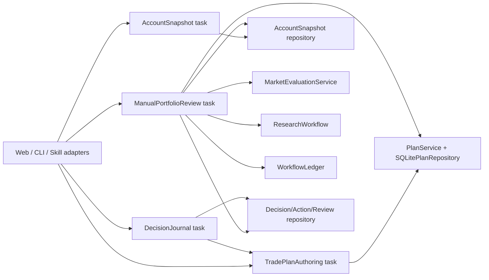
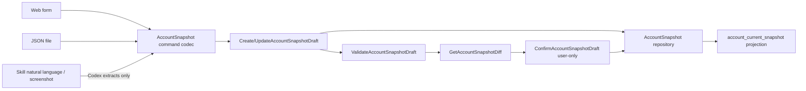

# TradingSystem 第二轮：交易纪律内核实现 Seam 审计

审计日期：`2026-07-26 Asia/Shanghai`

审计范围：`current-product-state-audit.md`、当前长期 Prompt、第一纵向切片 Spec/Wayfinder、组合周纪律 Wayfinder、`CONTEXT.md`、`src/trading_platform/`、migration 0001–0014、production Web、CLI、active Skill 与相关测试。

本文件只审计实现 seam、迁移影响、现有缺陷与可复用代码。它不修改业务代码，不包含 UI 原型，不是最终实现 Spec，也不替产品负责人选择 Strategy/Plan 多重性模型。

> `2026-07-27` 执行说明：第 2 节记录的是清理前 Git 状态和当时尚未执行的建议。
> 随后的实施前基线清理已按该建议保留权威文档，移除旧运行输出、冲突审计、
> `node_modules`、未获再分发许可的 raw 数据及明文连接资料。当前 TDK 实施权威以
> `.scratch/trading-discipline-kernel/` 为准。

## 1. 执行摘要

### 1.1 总结论

目标闭环不能通过扩展当前 Web dict、给 `DailyResearchCycle` 加循环或让 Skill 直接写 SQLite 实现。当前最可复用的真实内核是：

```text
DataSnapshot
ResearchWorkflow / ResearchDecisionView / Artifact
TradePlanDraft -> TradePlanVersion
PlanCondition AST@1
MarketSnapshot -> PlanEvaluation
WorkflowRun / WorkflowLedger
```

真正缺少的是三组深模块：

1. **用户确认型真值入口**：`AccountSnapshotDraft -> AccountSnapshotVersion` 与正式 `TradePlanDraft` authoring；Web、CLI、Skill 只做 adapter，全部进入同一 typed application command。
2. **账户级手动组合评估**：新的 `ManualPortfolioReviewRun@1` 冻结同一 account/cutoff 下的 StrategyVersion、AccountSnapshot、active PlanVersion、DataSnapshot、Research/Evidence、MarketSnapshot 和 policy identity；它复用 WorkflowRun/WorkflowLedger 的 identity、lease、checkpoint、resume 和 immutable manifest，但不能继续扩大当前单证券 `daily`。
3. **行为与复盘账本**：`DecisionTask -> ActionLogEntry -> ExecutionRecord/Reconciliation -> WeeklyReview -> PlanImpactAssessment -> PlanChangeProposal`。其中 proposal 只能创建/更新 draft，绝不能直接改变 active plan truth。

当前有 12 个实施门禁，其中前 6 个是 schema/domain blocker：`user_fixture_input`、同 security 多 active plan、inactive lifecycle 与 open activation 并存、`trade_plan` 无 account ownership、完整 PlanVersion graph 未封口、opening state 被称为 current position。Strategy/Plan Model A/B/C 的选择也必须先于 ownership/uniqueness migration；否则 migration 无法定义正确的唯一键。

### 1.2 当前状态分级

| 能力 | 状态 | 当前证据 | 本轮结论 |
|---|---|---|---|
| Plan draft/version/rule repository | 可复用但用户不可完整到达 | `src/trading_platform/plans.py::PlanService`；`src/trading_platform/persistence/plans.py::SQLitePlanRepository`；`tests/platform/test_trade_plans.py` | 保留并提升为正式 application task，不另建 plan engine |
| Plan diff/confirmation view | 可复用但无正式 query route | `PlanService.confirmation()` | 直接作为 validate/diff/confirm read model 的基础 |
| Account opening import | 部分可复用 | `src/trading_platform/account.py::AccountOpeningService`；migration 0009 | 可作为 legacy/broker snapshot ingestion adapter；不能继续充当 current account model |
| Broker history import | 可复用为 evidence/reconciliation | `src/trading_platform/account_history.py::AccountHistoryImportService`；migration 0010 | 不应自动改写 current snapshot |
| Single-plan deterministic evaluation | 可复用 | `src/trading_platform/market.py::MarketEvaluationService.evaluate_plan()`；`domain/market.py::evaluate_rules()` | 作为组合 workflow 的单计划 node，不负责选 plan 或解冲突 |
| Workflow recovery ledger | 可复用但接口偏 Research | migration 0003/0007；`application/workflow_ledger.py::WorkflowLedgerPort` | 复用通用 run/node/attempt/transition/manifest；新增 typed portfolio-review commit/query，不能复制 ledger |
| Production Web workspace | 部分可复用 read adapter | `web_server.py::LocalChartWorkspaceServer`；`persistence/workspace.py::WorkspaceService` | `/api/workspace` 必须被 versioned schema 替代；不能把现 dict 扩成第二领域模型 |
| CLI/Skill composition | 可复用 | `application/bootstrap.py::open_*`；`cli.py`；`skills/SKILL.md` | 新命令共享同一 application task 与 command codec |
| StrategyVersion | 缺失 | `src/`, `migrations/`, `tests/` 无生产符号 | A/B/C 任一模型都必须新增 |
| DecisionTask/ActionLog/WeeklyReview | 缺失 | `src/`, `migrations/`, `tests/` 无生产对象 | 必须新增最小持久化关系 |

### 1.3 建议的真实闭环 seam



这里的 `TradePlanAuthoring`、`AccountSnapshot`、`ManualPortfolioReview`、`DecisionJournal` 是任务级 interface，不是转发 facade。Web、CLI、Skill 不得各自拼一次流程，也不得恢复已删除的聚合 `ApplicationFacade`。

## 2. 实现基线、仓库权威与最小 Git 清理

### 2.1 Live Git 事实

| 项目 | 当前事实 |
|---|---|
| 当前 branch | `codex/research-system-refactor` |
| 当前 HEAD | `68f23c4785237d349975da5f3bb7a8f8273b565c`，`docs: decide portfolio risk policy guardrails` |
| `master` | `71403d96d0c086a3748e2934c572eeb783ba68f9`；不含当前 platform 代码 |
| prototype branch | `codex/prototype-weekly-discipline-workspace`，tip `fdf8fa1cf76cb5d8715188baec8812c075ab558f` |
| prototype merge-base | 与当前 branch 的 merge-base 正是 `68f23c4` |
| 当前工作树 | dirty；权威 Prompt 有修改，多份权威/审计/Wayfinder 文件未跟踪 |

**代码实现基线**应是 `codex/research-system-refactor@68f23c4`，不是 `master`，也不是 prototype branch。**真正开新切片时的 branch point**应是“在 `68f23c4` 之上完成下列文档清理并提交后的新 docs baseline commit”；该未来 commit 尚不存在，不能在本审计中伪造 SHA。

建议的新 feature branch 名：`codex/trading-discipline-kernel`，从上述 docs baseline commit 创建，不从 prototype tip 创建。

### 2.2 当前未进入 branch tip 的权威材料

| 路径 | Git 状态 | 处理建议 |
|---|---|---|
| `docs/prompts/trading_platform_codex_prompt_optimized.md` | modified | 审核后提交；它包含 branch tip 中缺失的产品/交互原则 |
| `CONTEXT.md` | untracked | 提交；它定义 AccountSnapshot/Draft/Revision/Correction 等当前术语 |
| `current-product-state-audit.md` | untracked | 提交为当前状态审计 |
| `.scratch/trading-platform-first-vertical-slice-spec/` | 整目录 untracked | 只提交权威 Spec、map、issues、必要 research/validation；排除 `node_modules`、下载数据和不具再分发权的 raw |
| `.scratch/portfolio-aware-weekly-discipline/issues/01-03` | untracked | 提交；它们已被 map 作为 resolved 决策引用 |
| `.scratch/portfolio-aware-weekly-discipline/issues/07-*` | modified | 若保留，只记录 prototype 结论/状态；不要把 prototype 源码并入实现 branch |
| `.scratch/portfolio-aware-weekly-discipline/issues/09,10,13` | untracked/open | 可提交为 tracker 状态，但不得写成已决策或已实现 |
| `docs/current-state-audit.md` | untracked、内容已过时 | 删除或归档到明确的 historical 路径；不能与当前审计并列为“current” |
| `docs/open-source-research.md` | untracked | 若仍被第一切片 Spec 引用，应审核权利/时态后提交 |

组合 Wayfinder 的 `map.md`、Issue 04/05/06/08/11/12 已在当前 branch tip；Issue 08/09/10/11/12/13 仍是 open 或受阻状态。第一纵向切片 `spec.md` 虽标为 `implementation-ready 0.2.0`，但当前完全未跟踪，且其 `ApplicationFacade/scripts/platform.py` 章节已被后续 named-task cutover supersede。

### 2.3 Prototype branch 的保留边界

`68f23c4..fdf8fa1` 只有 9 个 Web/prototype/build 文件，新增 1499 行：

```text
web/src/weekly-discipline-prototype.js
web/src/weekly-discipline-prototype.css
web/prototypes/weekly_discipline/run.py
web/index.html
web/dist/index.html
web/dist/assets/*
```

没有 domain、application、migration、repository 或 test 业务代码。`weekly-discipline-prototype.js` 的账户、持仓、计划、规则与周复盘来自 hardcoded `discussionScenario` 和浏览器内存；唯一 production read 是 `GET /api/workspace`。

结论：**不合并 prototype branch 的任何业务/构建文件**。可保留的只有：

- `current-product-state-audit.md` 中已经记录的截图、点击数、A/B/C 比较与交互结论；
- 若图片要进入仓库，单独审核来源、隐私和大小后放入 docs evidence，不 cherry-pick prototype commit。

### 2.4 开始实施前的最小 Git 清理

1. 提交经过审核的长期 Prompt、`CONTEXT.md`、当前产品审计、第一纵向切片权威 Spec/Wayfinder 和当前组合 Wayfinder tracker 状态。
2. 删除或明确归档过时的 `docs/current-state-audit.md`；全仓只能有一个当前产品事实审计。
3. 排除 `.scratch/.../node_modules/`、Kimi/Tushare raw 下载、临时浏览器目录与没有再分发许可的数据。
4. 不 merge/cherry-pick `fc3a806`、`fdf8fa1` 或 prototype 的 `web/src`/`web/dist`。
5. 从清理后的 docs baseline commit 创建 `codex/trading-discipline-kernel`。

本节只报告事实和风险；本轮没有执行 add/commit/branch/merge/delete。

## 3. 当前代码可复用能力矩阵

| 领域 | 可直接复用 | 只能 tests/fixture 到达或仍有缺口 | 关键证据 |
|---|---|---|---|
| Plan commands | `CreatePlanDraftCommand`, `UpdatePlanDraftCommand`, `DiscardPlanDraftCommand`, `ConfirmPlanDraftCommand`, `ActivatePlanVersionCommand`, `ChangePlanLifecycleCommand` | public Web protocol 只暴露 confirm；CLI/Skill 无 plan authoring | `src/trading_platform/domain/plans.py`; `src/trading_platform/application/web_tasks.py::PlanConfirmation`; `src/trading_platform/cli.py::_parser` |
| Plan application behavior | validate-before-write、expected revision、receipt replay、confirmation sections/diff、atomic confirm/activate | `PlanService.confirmation()` 无 Web/CLI/Skill query consumer | `src/trading_platform/plans.py::PlanService`; `tests/platform/test_trade_plans.py` |
| Plan persistence | draft revision、immutable core version、rules/refs/risk/activation/transitions、receipt | graph sealing 不完整；跨 plan active uniqueness 不存在；account ownership 不在 plan | `migrations/0005_market_trade_plan.sql`、`migrations/0011_plan_account_context.sql`；`src/trading_platform/persistence/plans.py` |
| Rule AST/evaluator | typed leaf/all/any/not、十个 operator、多值结果、account operands、market components | priority、conflict resolution、grid、event/time、candidate-action quantity 缺失 | `src/trading_platform/domain/plans.py`; `src/trading_platform/domain/market.py::evaluate_rules` |
| Account import | preview、atomic initialize、idempotency、restart、rollback、stable security identity | current truth 只能从 rigid opening file 建立；unknown 字段不能表达 | `src/trading_platform/account_import.py`; `src/trading_platform/account.py`; `tests/platform/test_account_opening.py` |
| Account history | append events/transactions/cash/summary、overlap/revision/reconciliation | 不更新 current positions；transaction 不关联 plan/evaluation | `src/trading_platform/account_history.py`; `migrations/0010_account_history.sql` |
| Current workspace | 单 security 聚合 snapshot/research/plan/evaluation/history | unversioned dict；`current_positions` 是 opening state；没有 portfolio/task/action/review schema | `src/trading_platform/persistence/workspace.py::WorkspaceService.build` |
| Market/evaluation | frozen MarketSnapshot、exact active version gate、deterministic identity、immutable evaluation | caller 必须先选一个 plan；无 portfolio iteration/conflict resolver | `src/trading_platform/market.py::MarketEvaluationService`; `tests/platform/test_market_evaluation.py` |
| Research/artifacts | Request@2、ResearchWorkflow、View@2、JSON/HTML/PDF、artifact manifest/reload | research action-language boundary是全局输出 sanitizer；无 PlanDraft skill | `src/trading_platform/workflows/research.py`; `src/equity_research/output_policy.py`; `tests/platform/test_decision_research_view.py` |
| Workflow | invocation replay、lease、heartbeat、resume、attempt、transition、checkpoint、manifest | `WorkflowLedgerPort.complete/commit_checkpoint` 偏 research evaluation；daily 自身无 WorkflowRun | `migrations/0003_workflow_research_manifest.sql`、`migrations/0007_workflow_recovery.sql`；`src/trading_platform/application/workflow_ledger.py` |
| Composition | `src/trading_platform/application/bootstrap.py::open_*` 与 `_store()` | `open_trade_plan()` 类型被缩窄为 `PlanConfirmation` | `src/trading_platform/application/bootstrap.py::open_trade_plan` |
| Web mutation | annotation、update authorization、plan confirm 的 Host/Origin/CSRF/size gate | update authorization 不执行 update；plan create/update/diff/discard/lifecycle 缺 route | `src/trading_platform/web_server.py::LocalChartWorkspaceServer` |
| CLI/Skill | stable JSON envelope、command codecs、named task imports | account initialize/history 可直接提交 account/event truth；Skill 无 account/plan draft | `src/trading_platform/cli.py`; `src/trading_platform/application/command_codecs.py`; `skills/SKILL.md` |

当前最重要的 regression anchors（均为现存测试名）：

- Plan repository：`tests/platform/test_trade_plans.py::test_atomic_confirmation_idempotency_preview_and_restart`、`::test_confirmation_failure_rolls_back_every_record`、`::test_revision_v2_switch_discard_and_ended_terminal`、`::test_confirmation_contract_rejects_invalid_risk_and_time`、`::test_typed_ast_references_account_applicability_and_adjusted_evidence`。
- Evaluation：`tests/platform/test_market_evaluation.py::test_transparent_market_snapshot_and_read_only_plan_evaluation`、`::test_coverage_and_freshness_fail_closed_without_erasing_history`、`::test_evaluation_requires_exact_active_version_and_snapshot_scope`、`::test_suspension_and_limit_facts_are_evaluated_without_lifecycle_side_effects`。
- Account：`tests/platform/test_account_opening.py::test_atomic_opening_state_is_exact_idempotent_and_survives_restart`、`::test_invalid_position_or_reconciliation_rolls_back_entire_account`、`::test_unknown_market_and_quantity_relation_fail_closed`；`tests/platform/test_account_history_import.py::test_history_import_maps_events_reconciles_cash_and_is_idempotent`、`::test_overlap_extension_appends_only_new_rows_and_revision_blocks_snapshot`、`::test_cash_chain_failure_and_injected_crash_leave_no_partial_batch`。
- Account/Plan projection：`tests/platform/test_account_workspace_plans.py::test_workspace_distinguishes_position_and_plan_freezes_account_snapshot`、`::test_watchlist_without_position_is_not_reported_as_missing_data`、`::test_incremental_snapshot_creates_parallel_evaluation_without_rewriting_history`。
- Workflow recovery：`tests/platform/test_workflow_ledger_recovery.py::test_resume_after_atomic_evaluation_checkpoint_does_not_recompute_or_duplicate`、`::test_replay_after_terminal_commit_returns_identical_result`；`tests/platform/test_workflow_ledger.py::test_checkpoint_members_are_content_addressed_and_role_complete`。

这些测试是要迁移/扩展的证明资产，不证明 production user journey 已存在：Plan create/update/diff/lifecycle 仍主要由 fixture 直接调用完整 service，account tests 仍以 opening/history 两条旧语义为中心，workflow recovery 仍绑定单证券 research checkpoint。

## 4. 计划编制入口的最低改造路径

### 4.1 当前真实入口

```text
tests / BrowserAcceptanceFixture
  -> PlanService.create/update/discard/confirmation/confirm/activate/deactivate/end
  -> SQLitePlanRepository

Production Web
  -> POST /api/plan-confirmations
  -> application.web_tasks.PlanConfirmation
  -> PlanService.confirm_draft

Production CLI / Skill
  -X-> no plan authoring command
```

`application/bootstrap.py::open_trade_plan()` 实际构造完整 `PlanService`，但返回类型标注是 `Iterator[PlanConfirmation]`；这把生产 application interface 人为缩窄为 confirm。测试中的 `PlatformTaskFixture.plans` 直接持有完整 `PlanService`，因此 create/update/discard/diff/lifecycle 是 **tests/fixture 可达，不是正式用户可达**。

### 4.2 应新增的 `open_*` task

最低改造不应为每个 command 新增一个 opener。建议：

- **不新增七个 `open_*`**；
- 保留一个 composition function，但把当前 `open_trade_plan` 的 public interface 从 `PlanConfirmation` 单向替换为 `TradePlanAuthoring`；
- `TradePlanAuthoring` 暴露完整用户任务：create/update/validate/get/diff/discard/confirm/activate/deactivate/end；
- 同一变更更新 Web、CLI、Skill、tests，并删除旧 `PlanConfirmation` protocol，避免 alias/兼容层。

若命名必须反映新职责，可将它一次性重命名为 `open_trade_plan_authoring`，但必须同时删除 `open_trade_plan`，不能双入口共存。

### 4.3 正式 command/query 候选

| 用户能力 | Application command/query | 建议输入 schema | 建议输出 schema |
|---|---|---|---|
| create draft | `CreatePlanDraftCommand`（扩 actor metadata） | `CreateTradePlanDraft@1` | `TradePlanDraftView@1` |
| update draft | `UpdatePlanDraftCommand` | `UpdateTradePlanDraft@1` | `TradePlanDraftView@1` |
| validate | 新 `ValidatePlanDraftCommand`，只读 deterministic validation | `ValidateTradePlanDraft@1` | `PlanDraftValidationView@1` |
| view diff | `PlanService.confirmation()` 的 query 语义 | `GetPlanDraftConfirmation@1` | `PlanConfirmationView@1` |
| discard/reject | `DiscardPlanDraftCommand` | `DiscardTradePlanDraft@1` | `TradePlanDraftView@1` |
| confirm | `ConfirmPlanDraftCommand` | `ConfirmTradePlanDraft@1` | `TradePlanVersionView@1` |
| activate | `ActivatePlanVersionCommand` | `ActivateTradePlanVersion@1` | `TradePlanLifecycleView@1` |
| deactivate/end | `ChangePlanLifecycleCommand` 应拆成明确 command name，但可共享内部方法 | `DeactivateTradePlan@1` / `EndTradePlan@1` | `TradePlanLifecycleView@1` |

拆开 deactivate/end 的 wire schema 是为了稳定 command name 与 reason 校验；不要新增只转发的 Python service。

### 4.4 每个正式入口的修改面

| 入口 | 必改文件/符号 | 必补测试 |
|---|---|---|
| create/update | `domain/plans.py` command/content；`plans.py::PlanService`; `persistence/plans.py`; `application/web_tasks.py`; `application/bootstrap.py`; `application/command_codecs.py`; `cli.py`; `web_server.py`; `skills/SKILL.md` | 扩展 `tests/platform/test_trade_plans.py`; `tests/platform/test_web_application_tasks.py`; `tests/platform/test_cli_application_tasks.py`; `tests/test_skill_entrypoint.py` |
| validate | `PlanService` 新 typed result；复用 `SQLitePlanRepository.validate_content()`，不能在 Web/Skill 重写规则 | validation error code/field path、无写入、Web/CLI hash 一致 |
| diff | 复用 `PlanService.confirmation()`；为它增加正式 query route/codec | initial v1、based-on vN、nested rule diff、restart 后一致 |
| discard/reject | 复用 `discard_draft()`；Web 明确叫 reject/discard，不删除行 | 用户拒绝后无 version/activation/transition；重放返回同一 discarded draft |
| confirm | 修复 lifecycle/activation invariant 后复用 atomic transaction | existing active + confirm inactive；confirm activate switch；rollback；actor=user gate |
| activate/deactivate/end | 修复 uniqueness 和 account ownership；公开 lifecycle query | cross-plan uniqueness；stale transition；ended terminal；deactivate closes activation |

Web 和 CLI 只负责把同一 envelope 解码为上述 dataclass，再调用同一 `TradePlanAuthoring` interface；Skill 只生成 envelope/文件并调用 CLI。禁止在 `web_server.py`、`cli.py` 或 `skills/` 复制 plan validation。

### 4.5 `user_fixture_input` 的完整修复面

当前生产/测试命中：

| 路径 | 符号/约束 |
|---|---|
| `src/trading_platform/domain/plans.py` | `validate_plan_content()` 强制 `content.user_input_source == "user_fixture_input"` |
| `migrations/0005_market_trade_plan.sql` | `trade_plan_version.user_input_source CHECK(user_input_source='user_fixture_input')` |
| `src/trading_platform/persistence/doctor.py` | 非 `user_fixture_input` 直接报 `PLAN_INPUT_SOURCE_INVALID` |
| `src/trading_platform/application/browser_acceptance.py` | `BrowserAcceptanceFixture.prepare()` 创建 fixture draft |
| `tests/platform/test_trade_plans.py::_content` | 所有 plan tests 的默认来源 |
| `tests/platform/test_secure_workspace.py` | fixture create 与 history/confirm assertions |
| `web/index.html` / built `web/dist/index.html` | 页面文案硬编码 fixture source |
| `web/tests/workspace-policy.test.js` | 断言页面必须包含 `user_fixture_input` |

`tests/platform/test_account_workspace_plans.py` 复用 `test_trade_plans._content()`，因此虽无字面字符串，也受 fixture source 约束。

不能修改已应用的 migration 0005。下一条 migration 必须重建 `trade_plan_version` 的 CHECK，并同步 doctor：

```text
user_input_source:
  user_entered
  agent_generated_for_user_review
  imported_user_draft
  acceptance_fixture
```

建议把 actor/source 分开：`user_input_source` 描述内容来源，`actor_type` 描述谁调用 command。fixture 只允许 acceptance data root；production draft 可来自 user 或 agent，但 `confirmation_actor_type` 必须是 `user`。

迁移测试至少覆盖：

- ownership/integrity migration 后的 fresh schema 接受四个受控 enum；
- 0001–0014 populated root 升级后把 `user_fixture_input` 一次性迁移为 `acceptance_fixture`；
- 非 acceptance fixture 历史若无法证明来源，preflight 阻断，而不是猜成 user；
- rollback/retry/backup/restore；
- doctor 接受新 enum、拒绝未知 enum；
- old version hash/content 不变，只有受控 source classification migration 被记录。

### 4.6 Research 与 PlanDraft 的行动语言边界

当前 Research 层的生产 validator 是：

- `src/equity_research/output_policy.py::{ACTION_LANGUAGE, normalize_action_language, contains_action_language}`;
- `src/equity_research/engine.py` 和 `evidence.py` 在输出/证据入口中 neutralize；
- `src/equity_research/models.py::_sanitize_output_payload` 递归清理 serialized output。

当前 regression tests：

- `tests/test_research_engine.py::test_default_output_normalizes_prohibited_action_language`;
- `tests/test_research_engine.py::test_typed_research_inputs_normalize_action_language`;
- `tests/platform/test_decision_research_view.py::test_limited_view_exposes_unknowns_without_rating_or_target_language`;
- `tests/platform/test_research_evaluation.py` 对 `institution_style_rating=False` 的断言。

边界不应通过放宽 `output_policy.py` 实现。精确改造应是：

1. `ResearchRun`、`ResearchDecisionView@2`、Research artifact 继续禁止直接行动语言和个性化评级。
2. `TradePlanDraft` 使用独立 typed schema 表达用户/Agent 候选的价格、数量、仓位、条件和适用范围；字段不是 Research narrative，也不通过 Research sanitizer。
3. Agent 只能写 `agent_generated_for_user_review` 的 draft；draft/status/command receipt 必须显示尚未确认。
4. 只有 `ConfirmPlanDraftCommand(actor_type=user)` 创建 immutable `TradePlanVersion`；只有用户 actor 可 activate。
5. Research/Evidence 更新最多生成 `PlanImpactAssessment` 与 `PlanChangeProposal`，不能直接 update active plan、confirm 或 activate。

对应新增测试应明确断言：同一句具体计划内容在 `ResearchDecisionView` 中被拒绝/中和，在 `TradePlanDraft` typed fields 中可被保存，但 draft 在 confirm 前不会出现在 active lookup、PlanEvaluation 或 DecisionTask truth 中。

## 5. Strategy 与 Plan 多重性影响审计

### 5.1 当前已证明的问题

| 问题 | 代码/DB 根因 | 真实修复面 |
|---|---|---|
| 同 security 可有多个 active plan | `trade_plan` 只按 `plan_id`；`one_active_version_per_plan` 只约束单 plan | ownership 模型、跨 plan active uniqueness、lookup 和 migration 必须一起改 |
| inactive lifecycle + open activation | `confirm_draft(...inactive)` 总先 `_transition(...status="inactive")`，但不结束旧 activation | confirmation 与 lifecycle transition 解耦；DB invariant/doctor/test |
| plan 无 account ownership | `trade_plan(plan_id, security_id, ...)`；account 只在 version optional ref | `trade_plan.account_id NOT NULL`，所有 lookup/evaluation 带 account |
| version graph 未完全封口 | `plan_account_snapshot_reference` 无 immutable trigger；children 无统一 seal/late-insert gate | version seal、child no-update/no-delete/no-late-insert、activation history invariant |
| `rule_no` 无 priority | repository 用 enumerate 写 `rule_no`，evaluator同顺序遍历 | 新 `priority`/conflict policy；`rule_no` 只保留 canonical order |
| 多规则无 resolver | aggregate 只要一条 triggered 就 `triggered`；blocked 优先全局返回 | AST@2/evaluation policy 定义冲突集合和 deterministic resolution |

`SQLitePlanRepository.get_active_for_security()` 的 SQL 是：

```text
SELECT * FROM trade_plan
WHERE security_id=? AND lifecycle_status!='ended'
ORDER BY created_at DESC LIMIT 1
```

然后只查该 plan 的 open activation。它既不要求所选 plan 为 active，也不返回多个 active，因此可能让一个较新的 inactive plan 遮住较早仍 active 的 plan。

`MarketEvaluationService.evaluate_plan()` 本身只验证调用者给定的 version 是其 plan 的 exact active version；它不负责从 account/security 选 plan，也不能解决跨 plan 冲突。

### 5.2 三模型比较总表

| 影响 | Model A：account+security 单 Active Plan | Model B：单 Active Master Plan + sleeves | Model C：多个独立 Active Plan |
|---|---|---|---|
| `trade_plan.account_id` | 必须 | 必须 | 必须 |
| Strategy relation | `strategy_version_id` FK，active slot 同时冻结 strategy | master plan 引用 strategy；sleeve 可引用 strategy sub-purpose | 每个 plan 引用 strategy version |
| 新表 | `strategy`, `strategy_version` | A + `position_sleeve`/version child | A 的 strategy 表；另需 portfolio conflict result |
| active uniqueness | `(account_id,security_id)` 唯一 | `(account_id,security_id)` 唯一 master | 只保留 `(plan_id)` 单 active version；可选 `(account,security,strategy)` 唯一需产品决定 |
| lookup | `get_active(account,security)->0..1` | 同 A，返回 master+sleeves | `list_active(account,security)->0..N`；删除 singular lookup |
| PlanEvaluation | 一次评估唯一 plan | 一次 master evaluation，按 sleeve 子结果再总解冲突 | 每 plan 独立 evaluation，再做 account/security aggregate resolution |
| 数量/风险冲突 | 单 plan 内 deterministic resolver | sleeve budget + master budget + resolver | 跨 plan portfolio resolver，复杂度最高 |
| 历史自动迁移 | account/strategy 无法无事实推断 | 同 A，且旧规则无法自动分 sleeve | 同 A；可保留多 plan，但仍缺 account/strategy mapping |
| fixture/tests | 改 singular account-aware | 最大改动：fixture 加 sleeves | 所有 singular active assertions 改 list/aggregate |
| AST@2 | priority/conflict 最低需要 | 需要 sleeve scope + priority/conflict | plan AST可独立，跨 plan resolver仍必须新增 |

### 5.3 Model A

最小 schema：

- `strategy(strategy_id, account_id, ...)`;
- `strategy_version(strategy_version_id, strategy_id, version_no, content_hash, confirmed_at, ...)`;
- rebuild `trade_plan`，增加 `account_id NOT NULL`、`strategy_version_id NOT NULL`;
- rebuild `plan_activation`，冗余并验证 `account_id, security_id`，建立 partial unique：
  `UNIQUE(account_id, security_id) WHERE ended_at IS NULL`；
- 或以 `active_trade_plan(account_id, security_id PRIMARY KEY, activation_id, plan_id, plan_version_id)` 作为事务 projection，同时保留 append-only activation history。二选一，不可双 path。

`get_active_for_security()` 必须替换为 `get_active_for_account_security(account_id, security_id)`。Portfolio review 以 confirmed AccountSnapshot 的 holdings 与 active slot 做 left join；没有计划的持仓生成“缺计划” review task，不由 evaluator猜计划。

冲突面集中在同一 PlanVersion 内：规则 priority、effect precedence、candidate intent quantity 与账户/风险 policy。旧计划结构可保留为一个 plan，但 account 与 StrategyVersion 不能自动推断。只有当所有版本的 `plan_account_snapshot_reference.account_id` 一致时才可证明 account；无引用或冲突必须 migration preflight 阻断并要求显式 mapping。Strategy 只能显式映射为已确认的 `legacy_unclassified`/用户选择版本，不能从 rationale 猜。

### 5.4 Model B

在 Model A 上增加 immutable version child：

```text
position_sleeve(
  plan_version_id,
  sleeve_id,
  sleeve_kind=core|tactical|grid,
  quantity_budget,
  max_notional,
  max_loss,
  priority,
  content_hash
)
```

规则必须显式 `sleeve_id` 或 `scope=master`。底仓不可动数量、机动仓数量、grid 配置属于 sleeve/master plan content，不应伪装成普通 market leaf。

active uniqueness 仍是 account+security 一个 master。PlanEvaluation 先生成每个 sleeve 的 deterministic rule results，再由 master resolver检查：

- sleeve 数量之和不超过 confirmed snapshot total/available capability；
- sleeve notional/loss 之和不超过 master 与 PortfolioRiskPolicy；
- core floor、tactical/grid candidate quantity 不冲突；
- blocked/unknown 不被另一个 sleeve 的 true 覆盖。

旧历史无法自动无损拆成 core/tactical/grid；自动把全部旧规则塞进 `core` 会发明产品含义。migration 必须保留为 `legacy_unsleeved` 且禁止 active，或要求用户显式分类后再激活。哪一种属于产品决策。

### 5.5 Model C

`trade_plan` 仍必须有 account 与 strategy ownership，但不能建立 `(account_id,security_id)` active unique。singular `get_active_for_security()` 必须删除，所有 caller 改为：

```text
list_active_for_account_security(account_id, security_id)
```

每个 PlanEvaluation 仍只评一个 exact version；随后新增 `PlanConflictResolution`/portfolio aggregate，冻结：

- active plan set identity；
- 每 plan candidate effects/quantity/notional/loss；
- shared AccountSnapshot/PortfolioRiskPolicy；
- priority/precedence policy；
- conflicts、blocked inputs 和最终 review disposition。

没有 aggregate resolver 时，Model C 不能上线，因为两个各自合法的 plan 可同时超出现金、available quantity、单证券敞口或总 loss budget。`StrategyVersion` 不能充当隐式 resolver。

历史 plan identities 最容易保留，但 account/strategy 仍无法自动推断；所有现有 fixture 的 singular active assumption、`get_active_for_security()` assertion、workspace `changes` 和 daily evaluation template 都必须改为 collection/aggregate。

### 5.6 是否需要 Plan AST@2

- Model A：需要最低 AST@2，原因是 priority/conflict/candidate-intent scope，不是多 plan 本身。
- Model B：必须 AST@2，增加 sleeve scope 与 master/sleeve conflict。
- Model C：单 plan condition 可继续表达 AST@1 叶子，但整体产品仍需要 versioned resolver contract；为了避免两个版本体系，实际应同步升级到 AST@2。

任何模型都不应让 `rule_no` 兼任 priority，也不应让 UI 顺序决定冲突结果。

## 6. AccountSnapshot 的最低实现路径

### 6.1 现有表的可复用性

| 当前表/对象 | 可复用部分 | 不能继续承担的职责 |
|---|---|---|
| `account` | stable local account identity、alias、base currency、FK root | 当前 identity 由 opening source hash 派生且整行 immutable；未来 alias/correction 需单独 version/audit |
| `portfolio_snapshot` | confirmed opening totals、account/as-of/source hash、计划已有引用 | 所有金额 NOT NULL，无法表达 unknown；不是通用版本链；只有 date 无 timezone/session |
| `account_position` + lot/observation | legacy opening state 与可迁移证据 | `UNIQUE(account_id,security_id)` 把它固定成 opening projection；history import 不更新；不能称 current |
| `account_history_snapshot` | 某次 broker history import 的 evidence/reconciliation summary | 不包含 current holdings/cash；不能替代 AccountSnapshot |

`WorkspaceService.build()` 中 `current_positions` 与 `account_opening_state` 指向同一个 `account_positions` list；SQL 直接读取 `account_position + account_position_lot + account_position_observation + portfolio_snapshot`。`AccountHistoryImportService.import_history()` 写 `account_event/account_transaction/cash_ledger_entry/holding_history_summary/account_history_snapshot`，不会更新 opening rows。

### 6.2 最小 canonical schema delta

建议下一版建立一个 canonical AccountSnapshot graph，而不是在旧 opening tables 上增加第二个“current”解释：

```text
account_snapshot_draft
  draft_id, account_id, revision, status(open|discarded|confirmed),
  source_kind, content_json, content_hash,
  previous_snapshot_id, revises_snapshot_id, corrects_snapshot_id,
  created_by_actor, created_at, updated_at

account_snapshot_version
  account_snapshot_id, account_id, version_no,
  as_of_at, as_of_precision, timezone, session_semantics,
  declared_at, retrieved_at, source_kind, source_ref,
  trust_status, consistency_status,
  schema_version, policy_version, content_hash,
  previous_snapshot_id, revises_snapshot_id, corrects_snapshot_id,
  confirmed_by_actor, confirmed_at

account_snapshot_cash
  account_snapshot_id, value_state(known|unknown),
  amount_decimal NULL, currency, lineage_json

account_snapshot_position
  account_snapshot_id, security_id,
  total_quantity_decimal,
  available_state/value, frozen_state/value,
  cost_state/value/type/currency,
  price_state/value, market_value_state/value,
  lineage_json

account_snapshot_capability
  account_snapshot_id, capability_id,
  status(ready|limited|unavailable), reason_code, dependency_json

account_current_snapshot
  account_id PRIMARY KEY, account_snapshot_id, projection_revision

account_snapshot_transition
  account_id, sequence_no, from_snapshot_id, to_snapshot_id,
  reason, invocation_id, occurred_at
```

known/unknown 使用成对 CHECK：`value_state='known'` 时值必须非 NULL 且通过 exact/non-negative/单位校验；`unknown` 时值必须为 NULL。不得用 `"0"`、空字符串或缺 row 表示 unknown。

`account_current_snapshot` 是可变 projection，确认时与 append-only transition 原子更新；历史 PlanVersion/Evaluation/WorkflowRun 永远引用确切 version，不跟随 projection。

### 6.3 统一输入调用图



Skill 的自然语言/OCR 只做 adapter-level extraction，必须生成同一 `CreateAccountSnapshotDraft@1`；普通业务运行时不调用 LLM。歧义、证券身份、日期/时区、总量或算术冲突会让 draft validation 失败，不能进入 confirm。

### 6.4 Broker history import 的边界

`account-history-import` 应继续生成 **evidence + reconciliation**，不自动修改 current snapshot。原因：

- history window 可能不完整；
- `account_transaction` 费用是 aggregate inferred；
- history summary 不能证明当前现金/持仓；
- 当前 Wayfinder 已锁定“不能从快照差额伪造交易，也不能从不完整流水伪造 current truth”。

若导入包同时包含可资格化的券商 current-position export，可由 import adapter额外生成 `AccountSnapshotDraft(source_kind=broker_imported)` 和 reconciliation result；仍需同一 validate/diff/user confirm command 才能成为 current projection。历史导入本身不得移动 `account_current_snapshot`。

### 6.5 Legacy migration

一条 one-way migration 应：

1. 将每个 `portfolio_snapshot + account_position/lot/observation + account_cash_opening` 转成一个 confirmed `AccountSnapshotVersion`；
2. 来源标为 `legacy_broker_opening_import`，保持原 reconciliation/limitations；
3. 缺少时刻时保存 `as_of_precision=date`、`session_semantics=legacy_unknown`，不得伪造收盘时刻；
4. 将 `plan_account_snapshot_reference` 重写到新 snapshot id；
5. 将 workspace/plan operands 切到新 repository；
6. 删除旧 `portfolio_snapshot/account_position/account_position_lot/account_position_observation/account_cash_opening` runtime path，不能双读兼容；
7. 保留 `account_history_*`、`account_event`、`account_transaction` 作为不同语义的 evidence/history。

若旧 plan 引用或 account ownership 无法唯一映射，migration 必须 preflight fail closed。不能保留“先读新表、读不到再读 opening 表”的兼容分支。

### 6.6 必补测试

建议新增 `tests/platform/test_account_snapshots.py`：

- `test_draft_validate_diff_confirm_and_restart_use_one_snapshot_command_path`;
- `test_unknown_cash_cost_and_available_quantity_remain_null_not_zero`;
- `test_revision_and_correction_preserve_old_plan_and_evaluation_refs`;
- `test_confirmation_replay_and_concurrent_expected_revision_are_idempotent`;
- `test_rejected_draft_does_not_move_current_projection`;
- `test_mid_commit_failure_rolls_back_version_positions_capabilities_and_pointer`;
- `test_broker_history_import_only_adds_evidence_and_reconciliation`;
- `test_broker_current_export_creates_draft_not_current_truth`;
- `test_legacy_opening_migration_preserves_values_and_marks_date_precision`;
- `test_backup_restore_and_doctor_preserve_current_pointer_and_all_versions`.

现有 `test_account_opening.py` 的 atomic/idempotent/restart/rollback/security identity cases 可迁移到新 public interface；替换测试后删除只验证 retired opening private seam 的部分。

## 7. HardRule 与 ReviewRule 可行性

### 7.1 AST@1 的真实边界

`src/trading_platform/domain/plans.py::PlanCondition` 当前只有 `leaf/all/any/not`；leaf operator 为 `eq/ne/lt/lte/gt/gte/between/crosses/changed_to`。可用 metric 包括证券价格、停复牌/涨跌停、四个 market regime 分量、`position.quantity` 和 `portfolio.net_asset_value`。`src/trading_platform/domain/market.py::evaluate_rules()` 逐规则求值，但只形成 `triggered/not_triggered/unable_to_evaluate/blocked`，没有候选交易意图、priority 或跨规则冲突解析。

下表中的“增加 metric”只适用于有确定来源、单位、as-of 和 unknown 语义的 typed operand；不能把 Agent 判断伪装成 metric。

| 真实需求 | AST@1 分类 | 最小落点 |
|---|---|---|
| 建仓价格区间 | 已支持 | `security.close_price between [low, high]`，规则 `applies_to=entry` |
| 加仓区间 | 已支持 | 同上，`applies_to=increase`；实际数量属于 intent/plan parameter |
| 减仓区间 | 已支持 | 同上，`applies_to=decrease` |
| 底仓不可卖数量 | 增加 metric/typed constraint | `position.quantity` 已有，但需 `candidate.remaining_quantity` 或 sleeve floor；不能只比较当前数量 |
| 机动仓数量 | typed plan/sleeve parameter | Model B 为 `PositionSleeve` budget；A/C 可为 plan risk constraint，不应伪装为布尔条件 |
| 最大仓位百分比 | 增加 metric | `position.market_value`、`portfolio.net_asset_value` 与 typed ratio；unknown NAV 必须 unable |
| 可用现金 | 增加 metric | `portfolio.available_cash`，来自 confirmed AccountSnapshot capability |
| 单次交易数量 | 新 candidate-intent operand | 规则必须对 proposed quantity 求值；当前 evaluator 没有 candidate action context |
| 网格上下界 | 已支持一部分 | price `between` 可表达边界 |
| 网格档数 | 新 typed grid config/node | 不是一组手写重复 leaf |
| 每档数量 | 新 typed grid config/node | 与档位、lot size、可用现金一起验证 |
| 冷静期 | 新 temporal node | `elapsed_trading_sessions`，绑定 calendar/cutoff，不能用 wall-clock 猜测 |
| 事件条件 | 新 node 或 ReviewRule | 结构化公告/event type + event window 可 hard-evaluate；开放文本事件进入 ReviewRule |
| 公司逻辑失效 | ReviewRule | Agent 生成 Evidence 和 PlanImpact；只有产品定义了确定 typed observation 后，个别子条件才可 hard-evaluate |
| 市场状态 | 已支持 | `market.trend/regime/liquidity/volatility`；仍要求同一 MarketSnapshot |
| 规则优先级 | AST@1 不支持 | AST@2 rule metadata；`rule_no` 仅是稳定序号，不得暗含 priority |
| 规则冲突 | AST@1 不支持 | AST@2 resolver policy + aggregate result |
| no-action | 不应是 condition | 是 evaluation/DecisionTask disposition，需记录原因 |
| 手工复核条件 | ReviewRule | 当前 `effect=prompt_review` 可用于路由，但还缺 ReviewRule evidence/impact contract |

### 7.2 建议的两层合同

```text
HardRule
  typed operands + deterministic evaluator
  -> RuleEvaluation + CandidateConstraintResult

ReviewRule
  frozen Evidence + Agent-authored PlanImpactAssessment draft
  -> DecisionTask(manual_review_required)
  -> user disposition / proposal
```

这不是两个入口。两类规则都属于同一 `TradePlanDraft/TradePlanVersion` graph，由同一 ManualPortfolioReviewRun 冻结；区别只在 evaluation authority：

- HardRule 的事实结果由 deterministic evaluator 产生，Agent 不得改写；
- ReviewRule 的 Agent 输出是 evidence-constrained assessment，不是交易事实；
- ReviewRule 不能直接产生 execution，也不能 activate/deactivate/end plan；
- 两者冲突时由显式 resolver 形成 `review_required` 或 fail-closed，而不是“任意 triggered 即 triggered”。

### 7.3 AST@2 的最低新增内容

不应设计无限通用 DSL。第一条闭环只需：

1. rule metadata：`rule_class=hard|review`、显式 `priority`、`scope=plan|sleeve`；
2. candidate intent context：`intent_type`、`quantity`、`remaining_quantity`、`notional`；
3. 两个 node：`elapsed_trading_sessions` 和有 typed event taxonomy 的 `event_window`；
4. typed `GridConstraint`：上下界、档数、每档数量，而非动态表达式语言；
5. plan-level `conflict_policy_version` 与有限 resolver 结果：
   `resolved_intent | no_action | manual_review_required | unable_to_evaluate | blocked`；
6. operand schema 中显式 `value_state=known|unknown|not_applicable`、unit、currency、as-of identity。

实现面位于 `src/trading_platform/domain/plans.py`、`src/trading_platform/domain/market.py`、`src/trading_platform/market.py`、`src/trading_platform/persistence/plans.py`，并需要 versioned one-way migration；不能在 evaluator 中按新旧 AST 分支双跑。

## 8. ManualPortfolioReviewRun 的实现 seam

### 8.1 可复用与不可直接复用

可复用：

- migration `migrations/0003_workflow_research_manifest.sql` 的 `workflow_run/node/attempt/transition/artifact_reference/source_manifest`；
- migration `migrations/0007_workflow_recovery.sql` 的 deterministic identity、lease、checkpoint、resume 与 replay 约束；
- `src/trading_platform/application/workflow_ledger.py::WorkflowLedgerPort` 的 start/load/transition 基础；
- immutable DataSnapshot、ResearchWorkflow/ResearchRun、Artifact、MarketSnapshot、PlanEvaluation 引用；
- `tests/platform/test_workflow_ledger.py` 与 `test_workflow_ledger_recovery.py` 中的 restart/lease/idempotency failure shapes。

不能直接复用为完整组合 review：

- `WorkflowLedgerPort.checkpoint_evaluation()` 和 `complete_success()` 的参数仍绑定单证券 research/evaluation；
- `src/trading_platform/application/cli_tasks.py::DailyResearchCycle` 一次处理一个 job/security，且没有 account/strategy/account snapshot identity；
- `daily` 的 CLI/Skill 语义不是组合 workflow type；
- 当前 workflow manifest 没有 StrategyVersion、AccountSnapshotVersion、active plan set、统一 cutoff policy 或 per-security outcome。

因此应新增 workflow type `manual_portfolio_review@1` 和 `open_manual_portfolio_review()` application task，扩展同一个 ledger 的 typed portfolio checkpoint/finalize 行为，而不是复制第二套 ledger。

### 8.2 冻结合同

run start transaction 至少冻结并写入 immutable manifest：

```text
ReviewCutoff@1
  requested_date
  requested_at
  timezone
  effective_session
  effective_session_close
  source_cutoff
  calendar_version
  freshness_policy_version

ManualPortfolioReviewInputs@1
  account_snapshot_version_id
  strategy_version_id
  active_plan_version_ids[]
  data_snapshot_ids[]
  research_run/evidence_ids[]
  market_snapshot/review_evidence_ids[]
  policy_versions{}
```

全部持仓必须从同一个 confirmed AccountSnapshotVersion 枚举；每个数据/研究/市场 snapshot 必须证明与同一 `requested_date/effective_session/timezone/cutoff` 兼容。不能让每只证券在循环中重新计算“今天”。

### 8.3 调用图

```text
Web / CLI / Skill manual trigger
        |
        v
open_manual_portfolio_review()
        |
        +--> StartManualPortfolioReviewCommand
        |      - actor/invocation/expected account snapshot
        |      - requested date + cutoff policy
        |
        v
ManualPortfolioReviewService.start()
        |
        +--> load confirmed AccountSnapshotVersion
        +--> load StrategyVersion
        +--> list holdings UNION active plans for account
        +--> freeze ReviewCutoff + active PlanVersion set
        +--> WorkflowLedger.start(manual_portfolio_review@1)
        |
        v
per SecurityReviewItem
        +--> acquire compatible DataSnapshot
        +--> acquire/reuse ResearchRun + Evidence
        +--> acquire MarketSnapshot / Review Evidence
        +--> evaluate each selected active PlanVersion
        +--> resolve hard-rule conflicts
        +--> create DecisionTask or governed blocked result
        +--> ledger checkpoint
        |
        v
FinalizeManualPortfolioReview
        +--> immutable run manifest + per-item outcomes
        +--> draft PlanImpactAssessment where review rules require it
        +--> no plan/account truth mutation
```

### 8.4 枚举、失败与幂等

- 枚举集合应为 `confirmed positions ∪ active plans`。这可同时发现“有持仓无计划”和“有 active plan 但当前无持仓”。
- Model A/B 每个 account+security 选唯一 master/plan；Model C 返回 plan list，逐 plan evaluation 后进入账户级 conflict resolver。不得继续使用 `get_active_for_security()` 的奇异返回。
- 某证券因数据缺失、停牌、freshness、ReviewRule 无法自动判断而失败时，记录该 item 的 typed blocked/unable outcome，其他证券可以继续。
- invariant violation、无法唯一选择 active plan、ledger/manifest identity 冲突、持久化损坏必须使整次 run fail closed。
- 相同 `invocation_id + request_hash` 重放返回同一 run；相同 invocation 不同 payload 冲突。新 invocation 可创建新 run，但应复用兼容的 immutable snapshot/research/evaluation。
- restart 从最后一个 committed node 继续；不能重复创建 DecisionTask。Task identity 可由 `workflow_run_id + plan_evaluation_id + task_kind` 唯一化。

正式事实包括 frozen input refs、deterministic evaluation、run/node outcome、用户 action log 和 confirmed execution reconciliation。Agent 生成的 PlanImpactAssessment 与 PlanChangeProposal 都只是 draft。DecisionTask 是正式的“需要处理”事实，但它不是交易指令。

### 8.5 `DailyResearchCycle` 的去向

不要重命名后保留旧 alias。新的组合 public task 落地时：

1. 将 `DailyResearchCycle` 内可复用的单证券 research/market/evaluation 行为提取为 application 内部的 `ReviewSecurityTask` 深模块；
2. production CLI/Skill 切到 `manual-portfolio-review`；
3. 同一变更删除 public `daily` 旧入口、过时文档与只验证旧入口的测试；
4. 若仍需单证券研究，将它作为明确的 `open_security_research()` task，不得伪装成组合 review。

这遵守 `AGENTS.md` 的 one-way cutover；不引入 scheduler。

## 9. DecisionTask、ActionLog 与 Weekly Review 的最小 ER delta

### 9.1 最小对象关系

```text
ManualPortfolioReviewRun
  1 ── * DecisionTask
          1 ── * DecisionTaskTransition
          1 ── * ActionLogEntry ── 0..1 ExecutionRecord
                                      * ── * account_transaction
                           \
                            * ── 1 WeeklyReviewVersion

PlanEvaluation ── * DecisionTask
TradePlanVersion ─┘

ResearchRun/Evidence ── * PlanImpactAssessment
PlanEvaluation ─────────┘
PlanImpactAssessment ── * PlanChangeProposalRevision
accepted proposal ─────> TradePlanDraft
```

建议 migration `0017_manual_portfolio_review_journal.sql`（在 AccountSnapshot 和 Strategy/ownership migration 之后）只增加第一条闭环所需的表，不提前设计 execution management system。

### 9.2 对象合同

| 对象 | Identity / 可变性 | 必要引用 | 修订与 reconciliation |
|---|---|---|---|
| `DecisionTask` | immutable identity；状态由 append-only transition 投影 | workflow run/item、account snapshot、strategy version、plan version、evaluation；需要 review evidence 时再引 research run | 不覆盖 task；open/resolved/superseded transitions。相同 run/evaluation/kind 唯一 |
| `ActionLogEntry` | immutable entry，允许 `corrects_entry_id` | task、actor、disposition、reason、recorded_at；继承 task 的 frozen refs | 用户修订写新 entry，不 update；current projection 取最新有效 correction |
| `ExecutionRecord` | immutable version；source 为 user-declared 或 broker-imported | action entry、account、security、trade time/session、side、quantity/price/fees 的 value state，plan/evaluation/workflow refs | 更正写新 version；通过 junction 与 `account_transaction` 0..* 对 0..* reconciliation |
| `WeeklyReviewVersion` | account+week+revision immutable；draft/confirmed lifecycle | week cutoff、review runs、account snapshots、strategies、plan/evaluations、tasks/action entries、history completeness evidence | 用户确认后不可覆盖；修订产生新 version。必须保存无法核验项 |
| `PlanImpactAssessment` | immutable generated assessment，draft-grade | review rule、frozen evidence/research、plan/evaluation/workflow、model/prompt/policy identity | Agent 可生成新 assessment，不能改 plan truth |
| `PlanChangeProposalRevision` | revisioned mutable draft head；accepted/rejected terminal transition | assessment、base plan version、proposed typed diff、actor、expected revision | 接受只创建/更新 `TradePlanDraft`；仍需独立 validate/confirm/activate |

所有对象都应直接引用 exact immutable id，不只存 security/date。`DecisionTask` 不必复制所有外键列，但它的 frozen manifest 必须能从 task 无歧义追溯到 AccountSnapshot、StrategyVersion、PlanVersion、Evaluation、ResearchRun 和 WorkflowRun。

### 9.3 用户 disposition 写入语义

| disposition | 最少写入 |
|---|---|
| `executed` | ActionLogEntry + ExecutionRecord；若暂无 broker match，写 `verification_status=user_declared_unverified`，不得伪造 transaction |
| `deferred` | reason、defer-until session/date 或 review trigger；task 保持待处理或转为 scheduled-for-manual-review |
| `skipped` | reason；task resolved，但作为本周纪律输入保留 |
| `overridden` | reason、override category、用户 actor；若实际执行仍需 ExecutionRecord |
| `not_applicable` | reason 与 supporting evidence；不能等同 skipped |

没有 ActionLogEntry 是 `unrecorded`，不是 `skipped`。周复盘纳入全部 task：executed、deferred、skipped、overridden、not_applicable、unrecorded；broker history 不完整时标记 `verification=insufficient_evidence`，不能把未匹配当成未执行。

### 9.4 与 `account_transaction` 的边界

`account_transaction` 是 broker/history evidence，不是用户 action log，也不是 AccountSnapshot truth。应新增 `execution_transaction_reconciliation`：

- 支持一笔 execution 对多笔 transaction、反向亦然；
- 保存 match status、method、confidence/evidence、reviewed_by；
- imported transaction 不得自动证明 plan compliance；
- unmatched execution/transaction 都是周复盘的数据质量事实；
- correction 通过新 reconciliation version/transition，不物理覆盖历史匹配。

## 10. Web、CLI、Skill 统一 command contract

### 10.1 当前可直接成为共享合同的能力

可直接提升到 application task 后复用：

- `CreatePlanDraftCommand`、`UpdatePlanDraftCommand`、`DiscardPlanDraftCommand`；
- `ConfirmPlanDraftCommand`、`ActivatePlanVersionCommand`、`ChangePlanLifecycleCommand`；
- `PlanService.confirmation()`；
- AccountOpening/History 的 typed command/receipt shapes，仅作为新 snapshot draft adapter 与 history evidence command 的参考；
- Workflow ledger 的 invocation/identity/replay contract；
- `MarketEvaluationService.evaluate_plan()` 的 exact active-version contract。

当前不可作为共享合同：

- `web_server.py::_workspace_payload()` 等 unversioned dict；
- Web route 内自行解析 activation intent；
- CLI/Skill 直接调用 maintenance/import task 形成 account truth；
- Markdown 形式的 Skill 输出。

### 10.2 建议 envelope

```json
{
  "schema_version": "ApplicationCommandEnvelope@1",
  "command_name": "trade_plan.create_draft@1",
  "invocation_id": "uuid",
  "actor": {
    "actor_type": "user|agent",
    "actor_id": "stable-local-identity"
  },
  "draft_id": "optional",
  "expected_revision": 1,
  "payload": {}
}
```

adapter 必须把它解析成 typed domain/application command，而不是把 dict 传到 repository。receipt 至少为：

```text
ApplicationCommandReceipt@1
  invocation_id
  command_name
  result_type
  aggregate_id
  revision/version_id
  status
  request_hash
  actor
  created_at
```

`actor metadata` 足以完成本地第一闭环的 audit/guard，不需要复杂 ACL；但 application service 必须执行 capability matrix，不能只靠隐藏按钮：

| actor | 允许 | 禁止 |
|---|---|---|
| agent | create/update/validate/diff/discard plan draft；create/update account snapshot draft；生成 assessment/proposal | confirm account/plan truth；activate/deactivate/end；写 executed truth |
| user | 上述全部；confirm/reject；activate/deactivate/end；记录 disposition/execution | 绕过 validate、expected revision、invariant |

CLI shell 由 Agent 调用时必须显式 `actor_type=agent`。不能因为进程是本机就把它当 user。Web authenticated/local user interaction注入 user actor。每次 mutation 都保存 envelope identity/request hash，确保重放一致；reject/discard 只改变 draft lifecycle，不产生正式 version。

### 10.3 application task 与 schema 清单

| task opener | commands/queries | input/output schema |
|---|---|---|
| `open_trade_plan_authoring()` | create/update/validate/get diff/discard/confirm/reject/activate/deactivate/end | `TradePlanDraftCommand@1`、`TradePlanDraftView@1`、`TradePlanValidation@1`、`TradePlanDiff@1`、`TradePlanConfirmationView@1`、`TradePlanVersionView@1`、`TradePlanLifecycleView@1`、`ApplicationCommandReceipt@1` |
| `open_account_snapshot_authoring()` | create/update/validate/diff/discard/confirm/reject | `AccountSnapshotDraftCommand@1`、`AccountSnapshotValidation@1`、`AccountSnapshotDiff@1`、`AccountSnapshotVersionView@1` |
| `open_manual_portfolio_review()` | start/resume/get | `StartManualPortfolioReview@1`、`ManualPortfolioReviewView@1` |
| `open_decision_journal()` | list tasks/record disposition/correct/reconcile | `DecisionTaskView@1`、`RecordActionDisposition@1`、`ExecutionRecord@1` |
| `open_weekly_discipline_review()` | build/get/confirm/propose change | `WeeklyReviewDraft@1`、`WeeklyReviewVersion@1`、`PlanChangeProposal@1` |

`src/trading_platform/application/bootstrap.py` 是 composition root；typed protocols 应放在 application package 的 cohesive task modules，不能继续让名为 `PlanConfirmation` 的 protocol 掩盖 `open_trade_plan()` 实际构造的完整 mutable service。

### 10.4 adapter 修改面

- Web：`src/trading_platform/web_server.py` 仅负责 HTTP/auth/codec，所有 route 调 named task；`/api/workspace` 改为 `WorkspaceView@1`，并为 plan/account/review/task responses 各用正式 schema。`web/index.html` 与 `web/dist/**` 不能作为 domain contract。
- CLI：`src/trading_platform/cli.py` 新增与上述 task 一一对应的命令族；`src/trading_platform/application/cli_tasks.py` 只实现 adapter orchestration，不复制 plan/account规则。
- Skill：`skills/SKILL.md` 将自然语言/JSON 文件解析成 envelope + typed draft payload，经 `python -m trading_platform.cli` 进入同一 task；不写 Markdown 当正式 draft，不直调 SQLite/私有 research。
- Tests：`tests/platform/test_web_application_tasks.py`、`test_secure_workspace.py`、CLI tests 和 Skill acceptance 应使用同一 golden schema/envelope/receipt。

### 10.5 当前可直接提交 truth 的入口

`python -m trading_platform.cli account-initialize` 通过 `AccountOpeningService` 直接写 opening truth；account history import 直接写 evidence/history truth。它们有 explicit confirmation flags，但没有 `actor_type` 或 draft-confirm version seam。Plan 的测试/fixture 可直接构造 service 并 confirm/activate；production Web 只暴露 confirm，且 activation intent contract 漂移。第一条闭环应让普通 Agent 使用 draft commands；maintenance/import 命令仍需 typed actor、source 与明确 capability，不能作为自然语言账户更新后门。

## 11. 实施前必修缺陷门禁

当前 next migration number 是 `0015`。建议顺序是：

1. `0015_account_snapshot_version.sql`；
2. 产品选择 A/B/C 后，`0016_strategy_plan_ownership.sql` 同时完成 input source、ownership、active uniqueness、lifecycle 与 graph seal；
3. `0017_manual_portfolio_review_journal.sql`。

名称是审计候选，不是已批准 Spec。迁移必须一向切换并删除旧 runtime path。

| # | 根因与影响 | 修复文件/迁移 | regression test | 阻断 |
|---|---|---|---|---|
| 1 `user_fixture_input` | `validate_plan_content()`、0005 CHECK、doctor 将 production authoring 固定为 fixture | `domain/plans.py`、`persistence/doctor.py`、`browser_acceptance.py`、0016；更新 Web/fixtures | `test_user_and_agent_sources_are_typed_and_fixture_source_is_acceptance_only`；更新 `test_trade_plans.py`、`test_secure_workspace.py`、workspace-policy JS | 是 |
| 2 同 security 多 active | unique index 仅保证每个 plan 一个 active；security lookup 只看最新 plan | `persistence/plans.py`、0016，按 A/B/C 建 account-aware uniqueness/list | `test_active_uniqueness_is_enforced_for_selected_multiplicity_model` | 是 |
| 3 inactive + open activation | `confirm(... inactive)` 无条件 lifecycle transition，却不结束已有 activation | `SQLitePlanRepository.confirm()`、activation triggers、0016 | `test_confirming_inactive_revision_does_not_leave_open_activation_or_demote_active_version` | 是 |
| 4 plan 无 account | account 仅是 version context reference，plan aggregate 无 ownership | `domain/plans.py`、`persistence/plans.py`、0016；所有 plan task 加 account | `test_plan_ownership_is_immutable_and_cross_account_activation_is_rejected` | 是 |
| 5 graph 未封口 | child tables缺统一 seal；`plan_account_snapshot_reference` 无 update/delete guard；activation history约束不足 | `persistence/plans.py`、0016；seal/count/hash + triggers | `test_confirmed_graph_rejects_late_child_insert_update_delete_and_activation_rewrite` | 是 |
| 6 current position 是 opening | `WorkspaceService.build()` 两个字段都读 opening；history import 不投影 current | `workspace.py`、account repository、0015；删除 old runtime read | `test_workspace_current_positions_come_only_from_latest_confirmed_snapshot` | 是（组合 slice） |
| 7 `/api/workspace` 无版本 | `web_server.py` 返回 ad-hoc dict | `application/web_tasks.py`、`web_server.py`、Web JS；无需 DB migration | `test_workspace_route_returns_workspace_view_v1_and_rejects_unknown_schema` + JS contract | 是（Web E2E） |
| 8 Web/CLI/Skill confirm 不一致 | Web 自有 payload，默认 `keep_inactive` 与 repository 接受值不一致；CLI/Skill 无同一 plan contract | named tasks、`web_server.py`、`cli.py`、`skills/SKILL.md` | adapter conformance test 对同 envelope 得相同 receipt | 是 |
| 9 update authorization 不执行更新 | route 只登记 authorization，按钮语义暗示已触发 sync/update | `web_server.py`、Web JS；应拆成 authorize 与显式 manual run command | `test_authorization_never_claims_update_and_manual_run_is_separate_command` | 是（真实 journey） |
| 10 Web 标题硬编码证券 | `web/index.html` 与 dist 写死“意华股份 002897.SZ” | source Web renderer + regenerate canonical dist；prototype 文件不合并 | Web test 对两只证券/title view model | 是（production acceptance） |
| 11 acceptance ledger/symbol 漂移 | `acceptance.py` 映射旧 test symbol，AC015 golden/applicability 仍描述 watchlist 无 account | `acceptance.py`、acceptance criteria/evidence；无需 migration | `test_acceptance_mappings_resolve_and_golden_matches_current_public_contract` | 是（release gate） |
| 12 Spec/CONTEXT 未进 tip | authority 文档和多个 tickets untracked/modified，新 branch 无可重复 baseline | 先独立 docs commit；归档 superseded audit；不改 migration | `git status`/branch-tip evidence check | 是（开始实施） |

### 11.1 第 1 项的精确命中

`user_fixture_input` 当前位于：

- `src/trading_platform/domain/plans.py::validate_plan_content`;
- `migrations/0005_market_trade_plan.sql` 的 CHECK；
- `src/trading_platform/persistence/doctor.py`;
- `src/trading_platform/application/browser_acceptance.py`;
- `tests/platform/test_trade_plans.py::_content`;
- `tests/platform/test_secure_workspace.py`;
- `web/index.html`、`web/dist/index.html` 及对应 bundled JS；
- `web/tests/workspace-policy.test.js`。

不能修改 0005；0016 重建表/约束，把 source 与 actor 分离。候选 source：
`user_entered`、`agent_generated_for_user_review`、`imported_user_draft`、`acceptance_fixture`。历史 fixture 只能在可证明时迁到 `acceptance_fixture`，否则 preflight fail。

### 11.2 第 3、5 项的数据库封口

至少增加：

- confirmed version graph seal/hash/count；
- confirmed 后 rule/condition/reference/risk/account-ref 不能 insert/update/delete；
- activation row不可删除，version/plan identity不可改；
- `ended_at` 只能从 null 写一次，且不得恢复；
- active projection 与 lifecycle 在同一 transaction/trigger invariant 下；
- inactive confirmation 不得改变当前 active version；
- deactivate/end 必须显式 lifecycle command。

### 11.3 第 11 项的精确漂移

`src/trading_platform/acceptance.py` 中 AC003/039、AC008/040、AC027/028、AC034 指向旧 test symbol；AC015 的 expected golden/applicability 仍以 watchlist/no-account 为前提。当前 `current-product-state-audit.md` 已记录 suite 运行出现 mapping/golden drift，不能用“pytest 通过数量”替代 canonical acceptance closure。

## 12. 第一条真实 E2E 的最小测试链

目标不是一次覆盖整个产品，而是证明“Agent 只产生 draft，用户确认后才成为 truth，手动 review 可追溯到行为与周复盘”：

1. **Migration/doctor**
   - legacy opening -> AccountSnapshotVersion 值与 unknown 无损；
   - legacy plan -> account/strategy mapping preflight；
   - confirmed graph seal、active uniqueness/lifecycle invariant；
   - backup/restore/doctor。
2. **Account snapshot**
   - Agent 从 JSON/NL adapter create/update draft；
   - validate/diff；
   - user confirm；
   - replay/restart/concurrent revision；
   - workspace projection切换且旧引用不变。
3. **Plan draft**
   - Agent 基于 StrategyVersion+AccountSnapshot+Evidence create/update；
   - Research artifact 仍净化行动语言；
   - plan draft 可保存价格/数量/仓位/条件；
   - validate/diff；
   - Agent confirm/activate 被 application 拒绝；
   - user confirm 后生成 sealed inactive version，再显式 activate。
4. **Multiplicity/integrity**
   - 按已选 A/B/C 验证 account-aware active selection；
   - inactive revision 不污染 open activation；
   - restart 后 selection 不变。
5. **Manual review**
   - 一次 run 冻结统一 cutoff/account/strategy/plan/data/research/market refs；
   - 两只证券，一只成功、一只 governed blocked；
   - replay 不重复 evaluation/task；crash checkpoint 可恢复。
6. **Decision journal**
   - task list回答“今天哪些计划需要处理”；
   - executed+unverified、deferred、skipped、overridden、not_applicable、unrecorded 均可区分；
   - broker transaction reconciliation 不完整不被误判。
7. **Weekly review/proposal**
   - 汇总全部 disposition 和 evidence gap；
   - Agent assessment/proposal 只创建新 TradePlanDraft；
   - rejected proposal 不污染 current/active truth。
8. **Adapter conformance**
   - 同一个 envelope 分别经 Web、CLI、Skill codec 到达同一 application command，receipt/request hash 等价；
   - `/api/workspace` 与 task/draft/review responses 都有 schema version；
   - production title来自 view model。
9. **Canonical acceptance**
   - acceptance symbol mapping 全部可解析；
   - golden/applicability 更新到 account-aware slice；
   - 记录 exact pass/fail/timeout/external skipped，不把局部 pytest 当 release pass。

建议最小新测试文件：

- `tests/platform/test_account_snapshots.py`;
- `tests/platform/test_strategy_plan_ownership.py`;
- `tests/platform/test_trade_plan_authoring_tasks.py`;
- `tests/platform/test_manual_portfolio_review.py`;
- `tests/platform/test_decision_journal.py`;
- `tests/platform/test_weekly_discipline_review.py`;
- `tests/platform/test_command_adapter_conformance.py`。

同时修改而非叠加：
`test_trade_plans.py`、`test_market_evaluation.py`、`test_account_workspace_plans.py`、`test_workflow_ledger*.py`、`test_web_application_tasks.py`、`test_secure_workspace.py` 和 Web contract tests。新 public interface 覆盖后删除 retired opening/daily/private seam tests。

## 13. 必须由产品负责人决定的问题

这些选择会改变 schema、migration 或正式语义，审计不能代答：

1. Strategy/Plan 多重性采用 Model A、B 还是 C；
2. 若选 B，首版 sleeve taxonomy 是否固定为 core/tactical/grid，以及旧计划如何人工分类；
3. StrategyVersion 的最小内容与谁能确认/停用 strategy；
4. plan user confirm 与 activate 是两个独立动作，还是 UI 中一次用户操作、application 内两个显式 receipt；
5. AccountSnapshot 的 required capability：首个 E2E 是否要求 cash、NAV、available quantity 全部 known；
6. broker “current export” 是否允许生成 AccountSnapshotDraft，以及何种 provenance/coverage 才有资格；
7. hard-rule conflict 默认是 fail closed 还是创建 manual-review task；不同 priority 是否允许自动消解；
8. 底仓/机动仓在 Model A/C 中如何表达；若它是产品核心，是否实际上要求 Model B；
9. DecisionTask 的处理期限与 deferred 的重新出现规则；
10. `overridden` 是否需要额外的计划外行为分类/风险确认；
11. ExecutionRecord 第一版是否只支持用户手填，还是同时支持 broker transaction reconciliation；
12. WeeklyReview 的周界、时区、交易日 cutoff，以及何时可 confirmed；
13. PlanChangeProposal 接受后仅生成 draft，还是还需用户二次确认其自动填充字段；
14. production Web 的首个 account/security 导航范围；
15. 第一个真实 E2E 使用哪一个真实但非敏感的 account fixture 与哪两只 A 股测试证券。

## 14. 结论与建议实施顺序

在不替产品选择 A/B/C 的前提下，可靠顺序是：

```text
commit authority baseline
  -> choose A/B/C and minimum StrategyVersion
  -> AccountSnapshotVersion one-way migration
  -> Plan authoring/ownership/uniqueness/lifecycle/graph-seal migration
  -> shared Web/CLI/Skill command envelope and actor guard
  -> manual_portfolio_review@1 on existing WorkflowLedger
  -> DecisionTask + immutable action/execution journal
  -> WeeklyReview + assessment/proposal-to-draft
  -> canonical acceptance refresh
```

这条路径保留 DataSnapshot、ResearchWorkflow、Artifact、TradePlanVersion、PlanCondition AST、MarketSnapshot、PlanEvaluation 和 WorkflowLedger；替换的只是 fixture-only authoring、opening-as-current、singular security plan lookup、unversioned Web dict 与 public `daily`。它建立的是一条手动触发、Agent 生成草稿、用户确认后生效、全过程可恢复和可审计的交易纪律闭环，不引入自动调度，也不让 Agent 越过用户确认边界。
